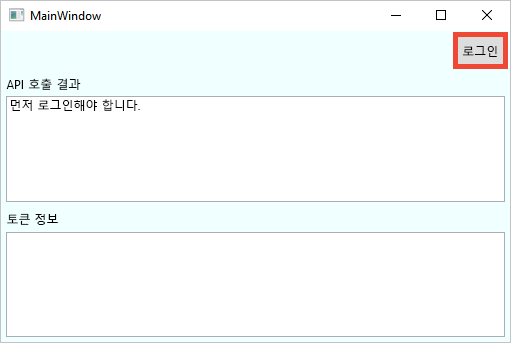
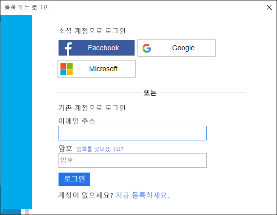
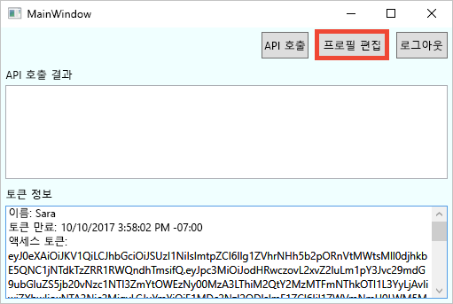
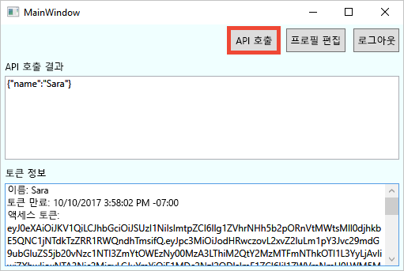

# <a name="quickstart-set-up-sign-in-for-a-desktop-app-using-azure-active-directory-b2c"></a>빠른 시작: Azure Active Directory B2C를 사용하여 데스크톱 앱에 대한 로그인 설정 

Azure AD(Azure Active Directory) B2C는 애플리케이션, 비즈니스 및 고객을 보호하기 위한 클라우드 ID 관리 기능을 제공합니다. Azure AD B2C를 사용하면 응용 프로그램에서 개방형 표준 프로토콜을 사용하여 소셜 계정 및 엔터프라이즈 계정을 인증할 수 있습니다. 이 빠른 시작에서는 WPF(Windows Presentation Foundation) 데스크톱 응용 프로그램에서 소셜 ID 공급자를 사용하여 로그인하고 Azure AD B2C 보호 웹 API를 호출합니다.

[!INCLUDE [quickstarts-free-trial-note](../../includes/quickstarts-free-trial-note.md)]

## <a name="prerequisites"></a>필수 조건

- **ASP.NET 및 웹 개발** 워크로드가 있는 [Visual Studio 2019](https://www.visualstudio.com/downloads/) 
- Facebook, Google, Microsoft 또는 Twitter의 소셜 계정입니다.
- GitHub에서 [Zip 파일을 다운로드](https://github.com/Azure-Samples/active-directory-b2c-dotnet-desktop/archive/master.zip)하거나 샘플 웹앱을 복제합니다.

    ```
    git clone https://github.com/Azure-Samples/active-directory-b2c-dotnet-desktop.git
    ```

## <a name="run-the-application-in-visual-studio"></a>Visual Studio에서 응용 프로그램 실행

1. 샘플 응용 프로그램 프로젝트 폴더에서 Visual Studio를 통해 **active-directory-b2c-wpf.sln** 솔루션을 엽니다.
2. **F5** 키를 눌러 응용 프로그램을 디버그합니다.

## <a name="sign-in-using-your-account"></a>계정을 사용하여 로그인

1. **로그인**을 클릭하여 **등록 또는 로그인** 워크플로를 시작합니다.

    

    샘플은 여러 가지 등록 옵션을 지원합니다. 이러한 옵션에는 소셜 ID 공급자를 사용하거나 이메일 주소를 사용하여 로컬 계정을 만드는 것이 포함됩니다. 이 빠른 시작에서는 Facebook, Google, Microsoft 또는 Twitter의 소셜 ID 공급자 계정을 사용합니다. 


2. Azure AD B2C는 샘플 웹앱용으로 Wingtip Toys라는 가상의 브랜드에 대한 사용자 지정 로그인 페이지를 제공합니다. 소셜 ID 공급자를 사용하여 등록하려면 사용할 ID 공급자의 단추를 클릭합니다. 

    

    소셜 계정 자격 증명을 사용하여 인증(로그인)하고 사용자의 소셜 계정에서 정보를 읽도록 애플리케이션에 권한을 부여합니다. 액세스를 부여하면 애플리케이션은 이름 및 구/군/시와 같은 소셜 계정의 프로필 정보를 검색할 수 있습니다. 

2. ID 공급자에 대한 로그인 프로세스를 완료합니다.

    새 계정 프로필 세부 정보는 소셜 계정의 정보로 미리 채워집니다.

## <a name="edit-your-profile"></a>프로필 편집

Azure AD B2C에는 사용자가 프로필을 업데이트할 수 있는 기능이 있습니다. 웹앱 샘플은 워크플로에 Azure AD B2C 프로필 편집 사용자 흐름을 사용합니다. 

1. 응용 프로그램 메뉴 모음에서 **프로필 편집**을 클릭하여 앞에서 만든 프로필을 편집합니다.

    

2. 만든 계정과 연결된 ID 공급자를 선택합니다. 예를 들어 계정을 만들 때 ID 공급자로 Twitter를 사용한 경우 연결된 프로필 세부 정보를 수정하려면 Twitter를 선택합니다.

3. **표시 이름** 또는 **구/군/시**를 변경한 다음, **계속**을 클릭합니다.

    새 액세스 토큰이 *토큰 정보* 텍스트 상자에 표시됩니다. 프로필의 변경 내용을 확인하려는 경우 액세스 토큰을 복사한 후 토큰 디코더 [https://jwt.ms](https://jwt.ms )에 붙여넣습니다.

## <a name="access-a-protected-api-resource"></a>보호된 API 리소스 액세스

**API 호출**을 클릭하여 보호된 리소스에 대한 요청을 만듭니다. 

    

    The application includes the Azure AD access token in the request to the protected web API resource. The web API sends back the display name contained in the access token.

Azure AD B2C 사용자 계정을 사용하여 Azure AD B2C 보안 웹 API에 대한 권한이 있는 호출을 만들었습니다.

## <a name="clean-up-resources"></a>리소스 정리

다른 Azure AD B2C 빠른 시작 또는 자습서를 사용하려는 경우 Azure AD B2C 테넌트를 사용할 수 있습니다. 더 이상 필요하지 않으면 [Azure AD B2C 테넌트를 삭제](active-directory-b2c-faqs.md#how-do-i-delete-my-azure-ad-b2c-tenant)할 수 있습니다.

## <a name="next-steps"></a>다음 단계

이 빠른 시작에서는 샘플 데스크톱 애플리케이션을 사용하여 다음 작업을 수행합니다. 

* 사용자 지정 로그인 페이지를 사용하여 로그인
* 소셜 ID 공급자를 사용하여 로그인
* Azure AD B2C 계정 만들기
* Azure AD B2C로 보호되는 웹 API 호출

사용자 고유의 Azure AD B2C 테넌트 만들기를 시작하세요. 

> [!div class="nextstepaction"]
> [Azure Portal에서 Azure Active Directory B2C 테넌트 만들기](tutorial-create-tenant.md)
