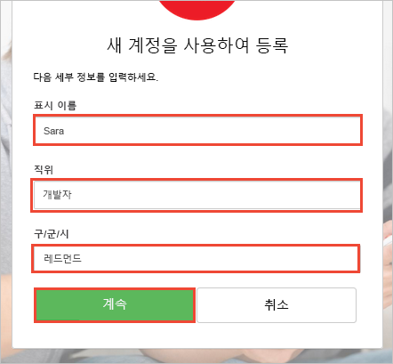

# Azure AD B2C로 구성된 웹 응용 프로그램 시험 사용

Azure Active Directory B2C는 응용 프로그램, 비즈니스 및 고객을 보호하기 위한 클라우드 ID 관리 기능을 제공합니다.  이 빠른 시작은 샘플 할 일 목록 앱을 사용하여 다음을 설명합니다.

* **등록 또는 로그인** 정책을 사용하여 전자 메일 주소로 소셜 ID 공급자 또는 로컬 계정을 만들고 이러한 계정으로 로그인합니다. 
* Azure AD B2C에서 보호하는 API를 호출하여 할 일 항목을 만들고 편집합니다.

## 필수 조건

* 다음 워크로드와 함께 [Visual Studio 2017](https://www.visualstudio.com/downloads/)을 설치합니다.
    - **ASP.NET 및 웹 배포**

* Facebook, Google, Microsoft 또는 Twitter의 소셜 계정입니다. 소셜 계정이 없는 경우 유효한 전자 메일 주소가 필요합니다.

[!INCLUDE [quickstarts-free-trial-note](../../includes/quickstarts-free-trial-note.md)]

## 샘플 다운로드

GitHub에서 [샘플 응용 프로그램을 다운로드 또는 복제](https://github.com/Azure-Samples/active-directory-b2c-dotnet-webapp-and-webapi)합니다.

## Visual Studio에서 앱 실행

샘플 응용 프로그램 프로젝트 폴더에서 Visual Studio를 통해 `B2C-WebAPI-DotNet.sln` 솔루션을 엽니다. 

솔루션은 다음 두 프로젝트로 구성되어 있습니다.

* **TaskWebApp** – ASP.NET MVC 웹 응용 프로그램에서 사용자가 해당 할 일 목록 항목을 관리할 수 있습니다.  
* **TaskService** – 모든 CRUD 작업을 관리하는 ASP.NET Web API 백 엔드는 사용자의 할 일 목록 항목에서 수행되었습니다. 웹앱은 이 API를 호출하고 결과를 표시합니다.

이 빠른 시작에서 동시에 `TaskWebApp` 및 `TaskService` 프로젝트를 둘 다 실행해야 합니다. 

1. 솔루션 탐색기에서 솔루션을 마우스 오른쪽 단추로 클릭하고 **시작 프로젝트 설정**을 선택합니다. 
2. **여러 시작 프로젝트** 라디오 단추를 선택합니다.
3. **시작**할 두 프로젝트에 대한 **작업**을 변경합니다. **확인**을 클릭합니다.

**디버그 > 디버깅 시작**을 선택하여 두 응용 프로그램을 빌드하고 실행합니다. 각 응용 프로그램은 고유한 브라우저 탭에서 열립니다.

* `https://localhost:44316/` - 이 페이지는 ASP.NET 웹 응용 프로그램입니다. 빠른 시작에서 이 응용 프로그램과 직접 상호 작용합니다.
* `https://localhost:44332/` - 이 페이지는 ASP.NET 웹 응용 프로그램에 의해 호출되는 Web API입니다.

## 계정 만들기

ASP.NET 웹 응용 프로그램에서 **등록/로그인** 링크를 클릭하여 **등록 또는 로그인** 워크플로를 시작합니다. 계정을 만들 때 기존 소셜 ID 공급자 계정 또는 전자 메일 계정을 사용할 수 있습니다.

### 소셜 ID 공급자를 사용하여 등록

소셜 ID 공급자를 사용하여 등록하려면 사용할 ID 공급자의 단추를 클릭합니다. 전자 메일 주소를 사용하려는 경우 [전자 메일 주소를 사용하여 등록](#sign-up-using-an-email-address) 섹션으로 이동합니다.

소셜 계정 자격 증명을 사용하여 인증(로그인)하고 응용 프로그램에 사용자의 소셜 계정에서 정보를 읽도록 권한을 부여해야 합니다. 액세스를 부여하면 응용 프로그램은 이름 및 구/군/시와 같은 소셜 계정의 프로필 정보를 검색할 수 있습니다. 

ID 공급자에 대한 로그인 프로세스를 완료합니다. 예를 들어 Twitter의 **로그인** 단추를 클릭합니다.

새 계정 프로필 세부 정보는 소셜 계정의 정보로 미리 채워집니다.

표시 이름, 직책 및 구/군/시 필드를 업데이트하고 **계속**을 클릭합니다.  입력하는 값은 Azure AD B2C 사용자 계정 프로필에 사용됩니다.

ID 공급자를 사용하는 새 Azure AD B2C 사용자 계정을 성공적으로 만들었습니다. 

다음 단계: [사용자 클레임 보기로 이동](#view-your-claims) 섹션

### 전자 메일 주소를 사용하여 등록

소셜 계정을 사용하여 인증을 제공하지 않으려는 경우 유효한 전자 메일 주소를 사용하여 Azure AD B2C 사용자 계정을 만들 수 있습니다. Azure AD B2C 로컬 사용자 계정은 ID 공급자로 Azure Active Directory를 사용합니다. 전자 메일 주소를 사용하려면 **계정이 없으세요? 지금 등록하세요.** 링크를 클릭합니다.

유효한 전자 메일 주소를 입력하고 **확인 코드 보내기**를 클릭합니다. 유효한 전자 메일 주소는 Azure AD B2C에서 확인 코드를 받는 데 필요합니다. 

전자 메일에서 수신한 확인 코드를 입력하고 **코드 확인**을 클릭합니다.

프로필 정보를 추가하고 **만들기**를 클릭합니다.

새 Azure AD B2C 로컬 사용자 계정을 성공적으로 만들었습니다.

## 암호 재설정

전자 메일 주소를 사용하여 계정을 만든 경우 Azure AD B2C에는 사용자가 암호를 재설정할 수 있는 기능이 있습니다. 만든 프로필을 편집하려면 메뉴 모음에서 프로필 이름을 클릭하고 **암호 재설정**을 선택합니다.

전자 메일 주소를 입력하고 **확인 코드 보내기**를 클릭하여 확인합니다. 전자 메일 주소로 확인 코드가 전송됩니다.

전자 메일에서 수신한 확인 코드를 입력하고 **코드 확인**을 클릭합니다.

전자 메일 주소를 확인한 후에 **계속**을 클릭합니다.

새 암호를 입력하고 **계속**을 클릭합니다.

## 사용자 클레임 보기

웹 응용 프로그램 메뉴 모음에서 **클레임**을 클릭하고 최근 작업과 연결된 클레임을 봅니다. 

이 예제에서 최근 작업은 *로그인 또는 등록* 환경에 대한 것이었습니다. **클레임 형식** `http://schemas.microsoft.com/claims/authnclassreference`은 최근 작업이 등록 또는 로그인이었음을 나타내는 `b2c_1_susi`입니다. 최근 작업이 암호 재설정인 경우 **클레임 형식**은 `b2c_1_reset`입니다.

## 프로필 편집

Azure Active Directory B2C에는 사용자가 프로필을 업데이트할 수 있는 기능이 있습니다. 웹 응용 프로그램 메뉴 모음에서 프로필 이름을 클릭하고 **프로필 편집**을 선택하여 만든 프로필을 편집합니다.

**표시 이름** 및 **구/군/시**를 변경합니다.  **계속**을 클릭하여 프로필을 업데이트합니다.

이름을 변경한 후에 페이지의 오른쪽 상단에서 표시 이름을 업데이트합니다. 

**클레임**을 클릭합니다. **표시 이름** 및 **시/군/구**에 대한 변경 내용은 클레임에 반영됩니다.

 **클레임 형식** `http://schemas.microsoft.com/claims/authnclassreference`이 수행된 최근 작업이 프로필 편집이었음을 나타내는 `b2c_1_edit_profile`으로 업데이트되었습니다. 또한 이름 및 시/군/구는 새 값 *Sara S.* 및 *시애틀*으로 변경되었습니다.

## 리소스 액세스

**할 일 목록**을 클릭하여 할 일 목록 항목을 입력하고 수정합니다. ASP.NET 웹 응용 프로그램에는 사용자의 할 일 목록 항목에 대한 작업을 수행하기 위해 Web API 리소스 요청 권한에 대한 요청에서 액세스 토큰을 포함합니다. 

**새 항목** 텍스트 상자에 텍스트를 입력합니다. **추가**를 클릭하여 할 일 목록 항목을 추가하는 Azure AD B2C 보호 Web API를 호출합니다.

## 기타 시나리오

시험 사용에 대한 다른 시나리오는 다음과 같습니다.

* 응용 프로그램에서 로그아웃하고 **할 일 목록**을 클릭합니다. 로그인하라는 메시지가 표시되고 목록 항목이 유지됩니다. 
* 다른 형식의 계정을 사용하여 새 계정을 만듭니다. 예를 들어 이전에 전자 메일 주소를 사용하여 계정을 만든 경우 소셜 ID 공급자를 사용합니다.

## 다음 단계

다음 단계는 자체 Azure AD B2C 테넌트를 만들고 해당 테넌트를 사용하여 실행되도록 샘플을 구성하는 것입니다. 

> [!div class="nextstepaction"]
> [Azure Portal에서 Azure Active Directory B2C 테넌트 만들기](active-directory-b2c-get-started.md)