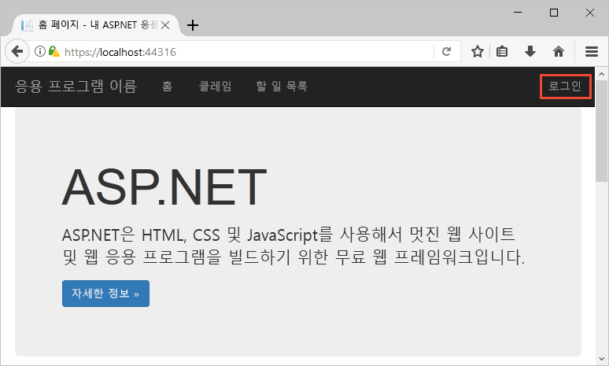
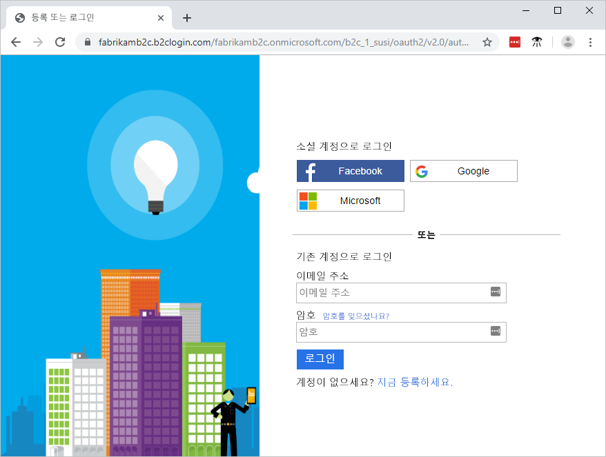
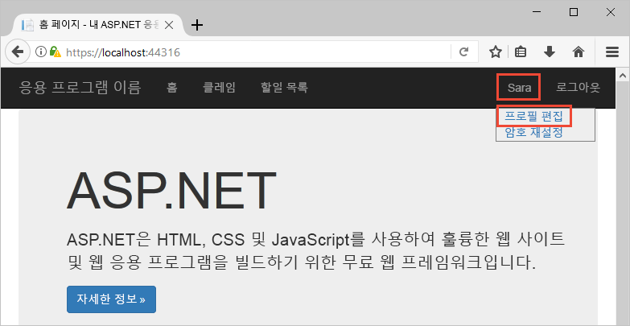

# <a name="quickstart-set-up-sign-in-for-an-aspnet-application-using-azure-active-directory-b2c"></a>빠른 시작: Azure Active Directory B2C를 사용하여 ASP.NET 애플리케이션에 대한 로그인 설정

Azure AD(Azure Active Directory) B2C는 애플리케이션, 비즈니스 및 고객을 보호하기 위한 클라우드 ID 관리 기능을 제공합니다. Azure AD B2C를 사용하면 응용 프로그램에서 개방형 표준 프로토콜을 사용하여 소셜 계정 및 엔터프라이즈 계정을 인증할 수 있습니다. 이 빠른 시작에서는 ASP.NET 응용 프로그램에서 소셜 ID 공급자를 사용하여 로그인하고 Azure AD B2C로 보호되는 웹 API를 호출합니다.

[!INCLUDE [quickstarts-free-trial-note](../../includes/quickstarts-free-trial-note.md)]

## <a name="prerequisites"></a>필수 조건

- **ASP.NET 및 웹 개발** 워크로드가 있는 [Visual Studio 2019](https://www.visualstudio.com/downloads/) 
- Facebook, Google, Microsoft 또는 Twitter의 소셜 계정입니다.
- GitHub에서 [Zip 파일을 다운로드](https://github.com/Azure-Samples/active-directory-b2c-dotnet-webapp-and-webapi/archive/master.zip)하거나 샘플 웹 응용 프로그램을 복제합니다.

    ```
    git clone https://github.com/Azure-Samples/active-directory-b2c-dotnet-webapp-and-webapi.git
    ```

    두 프로젝트는 샘플 솔루션에 있습니다.

    - **TaskWebApp** - 작업 목록을 만들고 편집하는 웹 애플리케이션입니다. 웹 애플리케이션은 **가입 또는 로그인** 사용자 흐름을 사용하여 사용자 가입 또는 로그인을 수행합니다.
    - **TaskService** - 작업 목록 만들기, 읽기, 업데이트 및 삭제 기능을 지원하는 Web API입니다. 웹 API는 Azure AD B2C를 통해 보호되고 웹 애플리케이션에서 호출됩니다.

## <a name="run-the-application-in-visual-studio"></a>Visual Studio에서 애플리케이션 실행

1. 샘플 애플리케이션 프로젝트 폴더에서 Visual Studio를 통해 **B2C-WebAPI-DotNet.sln** 솔루션을 엽니다.
2. 이 빠른 시작에서는 **TaskWebApp** 및 **TaskService** 프로젝트를 동시에 실행합니다. 솔루션 탐색기에서 **B2C-WebAPI-DotNet** 솔루션을 마우스 오른쪽 단추로 클릭하고 **시작 프로젝트 설정**을 선택합니다. 
3. **여러 시작 프로젝트**를 선택하고 두 프로젝트의 **동작**을 **시작**으로 변경합니다. 
4. **확인**을 클릭합니다.
5. **F5** 키를 눌러 두 응용 프로그램을 모두 디버깅합니다. 각 응용 프로그램은 고유한 브라우저 탭에서 열립니다.

    - `https://localhost:44316/` - ASP.NET 웹 응용 프로그램입니다. 빠른 시작에서 이 응용 프로그램과 직접 상호 작용합니다.
    - `https://localhost:44332/` - ASP.NET 웹 응용 프로그램에서 호출되는 웹 API입니다.

## <a name="sign-in-using-your-account"></a>계정을 사용하여 로그인

1. ASP.NET 웹 응용 프로그램에서 **등록/로그인**을 클릭하여 워크플로를 시작합니다.

    

    이 샘플에서는 소셜 ID 공급자를 사용하거나 이메일 주소를 사용하여 로컬 계정을 만드는 등의 여러 가지 등록 옵션을 지원합니다. 이 빠른 시작에서는 Facebook, Google, Microsoft 또는 Twitter의 소셜 ID 공급자 계정을 사용합니다.

2. Azure AD B2C는 샘플 웹 애플리케이션용으로 Wingtip Toys라는 가상의 브랜드에 대한 사용자 지정 로그인 페이지를 제공합니다. 소셜 ID 공급자를 사용하여 등록하려면 사용할 ID 공급자의 단추를 클릭합니다.

    

    소셜 계정 자격 증명을 사용하여 인증(로그인)하고 사용자의 소셜 계정에서 정보를 읽도록 애플리케이션에 권한을 부여합니다. 액세스를 부여하면 애플리케이션은 이름 및 구/군/시와 같은 소셜 계정의 프로필 정보를 검색할 수 있습니다. 

3. ID 공급자에 대한 로그인 프로세스를 완료합니다.

## <a name="edit-your-profile"></a>프로필 편집

Azure Active Directory B2C에는 사용자가 프로필을 업데이트할 수 있는 기능이 있습니다. 웹앱 샘플은 워크플로에 Azure AD B2C 프로필 편집 사용자 흐름을 사용합니다. 

1. 응용 프로그램 메뉴 모음에서 프로필 이름을 클릭하고, **프로필 편집**을 선택하여 앞에서 만든 프로필을 편집합니다.

    

2. **표시 이름** 또는 **구/군/시**를 변경한 다음, **계속**을 클릭하여 프로필을 업데이트합니다. 

    변경된 내용은 웹 애플리케이션 홈 페이지의 오른쪽 위에 표시됩니다.

## <a name="access-a-protected-api-resource"></a>보호된 API 리소스 액세스

1. **할 일 목록**을 클릭하여 할 일 목록 항목을 입력하고 수정합니다. 

2. **새 항목** 텍스트 상자에 텍스트를 입력합니다. **추가**를 클릭하여 할 일 목록 항목을 추가하는 Azure AD B2C 보호 Web API를 호출합니다.

    

    ASP.NET 웹 응용 프로그램에는 사용자의 할 일 목록 항목에 대한 작업을 수행하기 위해 보호된 웹 API 리소스에 대한 요청에 Azure AD 액세스 토큰을 포함합니다.

Azure AD B2C 사용자 계정을 사용하여 Azure AD B2C 보안 웹 API에 대한 권한이 있는 호출을 만들었습니다.

## <a name="clean-up-resources"></a>리소스 정리

다른 Azure AD B2C 빠른 시작 또는 자습서를 사용하려는 경우 Azure AD B2C 테넌트를 사용할 수 있습니다. 더 이상 필요하지 않으면 [Azure AD B2C 테넌트를 삭제](active-directory-b2c-faqs.md#how-do-i-delete-my-azure-ad-b2c-tenant)할 수 있습니다.

## <a name="next-steps"></a>다음 단계

이 빠른 시작에서는 샘플 ASP.NET 애플리케이션을 사용하여 다음 작업을 수행합니다.

* 사용자 지정 로그인 페이지를 사용하여 로그인
* 소셜 ID 공급자를 사용하여 로그인
* Azure AD B2C 계정 만들기
* Azure AD B2C로 보호되는 웹 API 호출

사용자 고유의 Azure AD B2C 테넌트 만들기를 시작하세요.

> [!div class="nextstepaction"]
> [Azure Portal에서 Azure Active Directory B2C 테넌트 만들기](tutorial-create-tenant.md)
