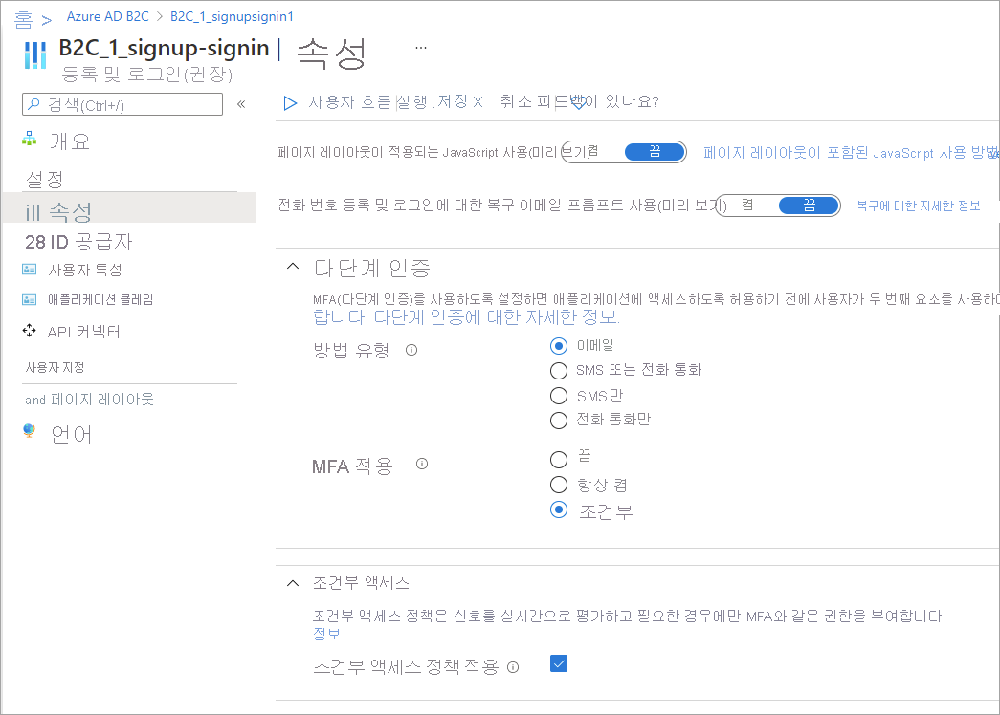

# Azure Active Directory B2C에서 사용자 흐름에 조건부 액세스 추가

[!INCLUDE [b2c-public-preview-feature](../../includes/active-directory-b2c-public-preview.md)]

조건부 액세스를 Azure Active Directory B2C 사용자 흐름에 추가하여 애플리케이션에 대한 위험한 로그인을 관리할 수 있습니다. Azure AD B2C에서 ID 보호와 조건부 액세스를 통합하면 위험한 로그인 동작을 식별하는 정책을 설정하고 사용자 또는 관리자의 추가 작업이 필요한 정책을 적용할 수 있습니다. Azure AD B2C 사용자 흐름에서 조건부 액세스를 사용하도록 설정하는 구성 요소는 다음과 같습니다.

- **사용자 흐름**. 사용자에게 로그인 및 가입 프로세스를 안내하는 사용자 흐름을 만듭니다. 사용자 흐름 설정에서 사용자가 사용자 흐름을 따를 때 조건부 액세스 정책을 활성화할지 여부를 지정합니다.
- **사용자를 사용자 흐름으로 안내하는 애플리케이션**. 앱에서 사용자 흐름 엔드포인트를 지정하여 사용자를 적절한 가입 및 로그인 사용자 흐름으로 안내하도록 앱을 구성합니다.
- **조건부 액세스 정책**. [조건부 액세스 정책을 만들고](conditional-access-identity-protection-setup.md) 이 정책을 적용하려는 앱을 지정합니다. 사용자가 앱에 대한 로그인 또는 가입 사용자 흐름을 따르는 경우 조건부 액세스 정책은 ID 보호 신호를 사용하여 위험한 로그인을 식별하고 필요한 경우 적절한 수정 작업을 제공합니다.

조건부 액세스는 최신 버전의 사용자 흐름에서 지원됩니다. 조건부 액세스 정책을 만들 때 새 사용자 흐름에 추가하거나, 버전에서 조건부 액세스를 지원하는 경우 기존 사용자 흐름에 추가할 수 있습니다. 조건부 액세스를 기존 사용자 흐름에 추가하는 경우 검토해야 하는 다음 두 가지 설정이 있습니다.

- **MFA(다단계 인증)** : 이제 사용자는 SMS 또는 음성을 통해 일회용 코드를 사용하거나, 다단계 인증을 위해 이메일을 통해 일회용 암호를 사용할 수 있습니다. MFA 설정은 조건부 액세스 설정과 독립적입니다. 조건부 액세스 설정에 관계없이 MFA를 항상 요구하도록 MFA를 **항상 설정됨**으로 설정할 수 있습니다. 또는 활성 조건부 액세스 정책에 필요한 경우에만 MFA를 요구하도록 MFA를 **조건부**로 설정할 수 있습니다.

- **조건부 액세스**: 이 설정은 항상 **켜기**여야 합니다. 일반적으로 이 설정은 문제 해결 또는 마이그레이션 중에 또는 레거시 구현에 대해서만 **끄기**로 전환됩니다.

Azure AD B2C에서 [ID 보호 및 조건부 액세스](conditional-access-identity-protection-overview.md)에 대해 자세히 알아보거나 [설정하는 방법](conditional-access-identity-protection-setup.md)을 참조하세요.

## 새 사용자 흐름에 조건부 액세스 추가

1. [Azure Portal](https://portal.azure.com)에 로그인합니다.
1. 포털 도구 모음에서 **디렉터리 + 구독** 아이콘을 선택한 다음, Azure AD B2C 테넌트가 포함된 디렉터리를 선택합니다.
1. Azure Portal에서 **Azure AD B2C**를 검색하고 선택합니다.
1. **정책** 아래에서 **사용자 흐름**을 선택한 다음, **새 사용자 흐름**을 선택합니다.
1. **사용자 흐름 만들기** 페이지에서 사용자 흐름 유형을 선택합니다.
1. **버전 선택** 아래에서 **추천**을 선택한 다음, **만들기**를 선택합니다. (사용자 흐름 버전에 대해 [자세히 알아보세요](user-flow-versions.md).)

    

1. 사용자 흐름에 대한 **이름**을 입력합니다. 예를 들어 *signupsignin1*과 같습니다.
1. **ID 공급자** 섹션에서 이 사용자 흐름에 허용하려는 ID 공급자를 선택합니다.
2. **다단계 인증** 섹션에서 원하는 **MFA 방법**을 선택한 다음, **MFA 적용** 아래에서 **조건부(추천)** 를 선택합니다.
 
   

1. **조건부 액세스** 섹션에서 **조건부 액세스 정책 적용** 확인란을 선택합니다.

   

1. **사용자 특성 및 클레임** 섹션에서 가입 중에 사용자로터 수집하여 보내려는 클레임 및 특성을 선택합니다. 예를 들어 **자세히 보기**를 선택한 다음, **국가/지역** 및**표시 이름**에 대한 특성 및 클레임을 선택합니다. **확인**을 선택합니다.

    

1. **만들기**를 클릭하여 사용자 흐름을 추가합니다. *B2C_1*이라는 접두사가 이름 앞에 자동으로 붙습니다.

## 기존 사용자 흐름에 조건부 액세스 추가

> [!NOTE]
> 기존 사용자 흐름은 조건부 액세스를 지원하는 버전이어야 합니다. 이러한 사용자 흐름 버전에는 **추천**이라는 레이블이 지정됩니다.

1. [Azure Portal](https://portal.azure.com)에 로그인합니다.

1. 포털 도구 모음에서 **디렉터리 + 구독** 아이콘을 선택한 다음, Azure AD B2C 테넌트가 포함된 디렉터리를 선택합니다.

1. Azure Portal에서 **Azure AD B2C**를 검색하고 선택합니다.

1. **정책** 아래에서 **사용자 흐름**을 선택합니다. 그런 다음, 사용자 흐름을 선택합니다.

1. **속성**을 선택하고, **속성**을 선택하고 **조건부 액세스**라는 레이블이 지정된 설정을 찾아서 사용자 흐름에서 조건부 액세스를 지원하는지 확인합니다.
 
   

1. **다단계 인증** 섹션에서 원하는 **MFA 방법**을 선택한 다음, **MFA 적용** 아래에서 **조건부(추천)** 를 선택합니다.
 
1. **조건부 액세스** 섹션에서 **조건부 액세스 정책 적용** 확인란을 선택합니다.

1. **저장**을 선택합니다.

## 사용자 흐름 테스트

사용자 흐름에서 조건부 액세스를 테스트하려면 위에서 설명한 대로 [조건부 액세스 정책을 만들고](conditional-access-identity-protection-setup.md) 사용자 흐름에서 조건부 액세스를 사용하도록 설정합니다. 

### 사전 요구 사항

- 위험한 로그인 정책을 만들려면 Azure AD B2C Premium 2가 필요합니다. Premium P1 테넌트는 위치, 앱 또는 그룹 기반 정책을 만들 수 있습니다.
- 테스트를 위해 [`https://jwt.ms` 테스트 웹 애플리케이션을 등록](tutorial-register-applications.md)할 수 있습니다. 이 애플리케이션은 토큰의 디코딩된 콘텐츠를 표시하는 Microsoft 소유의 웹 애플리케이션입니다(토큰의 콘텐츠는 브라우저에서 벗어나면 안 됨). 
- 위험한 로그인을 시뮬레이션하려면 Tor Browser를 다운로드하고 사용자 흐름 엔드포인트에 로그인을 시도합니다.
- 다음 설정을 사용하여 [조건부 액세스 정책을 만듭니다](conditional-access-identity-protection-setup.md).
   
   - **사용자 및 그룹**에 대해 테스트 사용자를 선택합니다(**모든 사용자**를 선택하지 마세요. 그렇지 않으면 로그인하지 못하도록 차단될 수 있습니다.).
   - **클라우드 앱 또는 작업**에 대해 **앱 선택**을 선택한 다음, 신뢰 당사자 애플리케이션을 선택합니다.
   - [조건]에 대해 **로그인 위험**과 **높음**, **중간** 및 **낮음** 위험 수준을 선택합니다.
   - **권한 부여**에 대해 **액세스 차단**을 선택합니다.

      

### 사용자 흐름 실행

1. 만든 사용자 흐름을 선택하여 해당 개요 페이지를 연 다음, **사용자 흐름 실행**을 선택합니다. **애플리케이션** 아래에서 *webapp1*을 선택합니다. **회신 URL**에는 `https://jwt.ms`가 표시되어야 합니다.

   

1. **사용자 흐름 엔드포인트 실행** 아래에 있는 URL을 복사합니다.

1. 위험한 로그인을 시뮬레이션하려면 [Tor Browser](https://www.torproject.org/download/)를 열고, 미리 보기 단계에서 복사한 URL을 사용하여 등록된 앱에 로그인합니다.

1. 로그인 페이지에서 요청된 정보를 입력한 다음, 로그인을 시도합니다. 토큰이 `https://jwt.ms`로 반환되며 사용자에게 표시됩니다. jwt.ms로 디코딩된 토큰에서 로그인이 차단되었음을 확인할 수 있습니다.

   

## 다음 단계

[Azure AD B2C 사용자 흐름에서 사용자 인터페이스 사용자 지정](customize-ui-overview.md)
