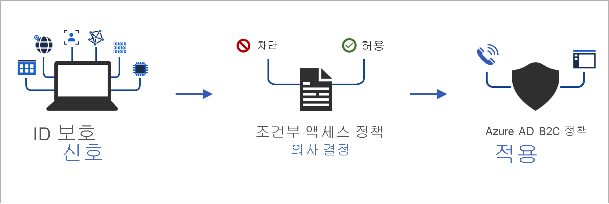
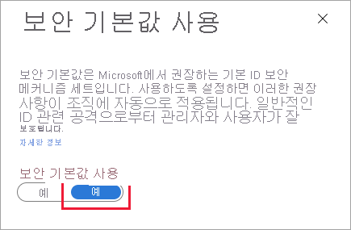

# <a name="add-conditional-access-to-user-flows-in-azure-active-directory-b2c"></a>Azure Active Directory B2C에서 사용자 흐름에 조건부 액세스 추가
[!INCLUDE [active-directory-b2c-choose-user-flow-or-custom-policy](../../includes/active-directory-b2c-choose-user-flow-or-custom-policy.md)]
조건부 액세스를 Azure AD B2C(Azure Active Directory B2C) 사용자 흐름 또는 사용자 지정 정책에 추가하여 애플리케이션에 대한 위험한 로그인을 관리할 수 있습니다. Azure AD(Azure Active Directory) 조건부 액세스는 Azure AD B2C에서 신호를 함께 가져오고, 결정을 내리고, 조직 정책을 적용하기 위해 사용하는 도구입니다.
 정책 조건으로 위험 평가를 자동화하면 위험한 로그인을 즉시 식별한 다음, 수정하거나 차단합니다.
## <a name="service-overview"></a>서비스 개요
Azure AD B2C는 각 로그인 이벤트를 평가하고 사용자 액세스 권한을 부여하기 전에 모든 정책 요구 사항이 충족되는지 확인합니다. 이 **평가** 단계에서 조건부 액세스 서비스는 로그인 이벤트 중에 ID 보호 위험 검색에 의해 수집된 신호를 평가합니다. 이 평가 프로세스의 결과는 로그인을 허용할지 아니면 차단할지를 나타내는 클레임 집합입니다. Azure AD B2C 정책은 이러한 클레임을 사용하여 사용자 흐름 내에서 작동합니다. 예를 들어 MFA(다단계 인증)와 같은 특정 교정을 통해 사용자의 액세스를 차단하거나 어렵게 합니다. "액세스 차단"은 다른 모든 설정을 재정의합니다.
::: zone pivot="b2c-custom-policy"
다음 예에서는 로그인 위협을 평가하는 데 사용되는 조건부 액세스 기술 프로필을 보여 줍니다.
```XML
<TechnicalProfile Id="ConditionalAccessEvaluation">
  <DisplayName>Conditional Access Provider</DisplayName>
  <Protocol Name="Proprietary" Handler="Web.TPEngine.Providers.ConditionalAccessProtocolProvider, Web.TPEngine, Version=1.0.0.0, Culture=neutral, PublicKeyToken=null" />
  <Metadata>
    <Item Key="OperationType">Evaluation</Item>
  </Metadata>
  ...
</TechnicalProfile>
```
ID 보호 신호가 제대로 평가되도록 하기 위해 [로컬 및 소셜 계정](technical-overview.md#consumer-accounts)을 포함하여 모든 사용자에 대한 `ConditionalAccessEvaluation` 기술 프로필을 호출할 수 있습니다. 그렇지 않으면 ID 보호 기능은 사용자와 관련된 잘못된 위험도를 나타냅니다.
::: zone-end
다음 *수정* 단계에서 사용자는 MFA에 대한 질문을 받습니다. 완료되면 Azure AD B2C에서 식별된 로그인 위협이 수정되었는지 여부와 어떤 방법으로 수정되었는지에 대해 ID 보호에 알립니다. 이 예에서 Azure AD B2C는 사용자가 다단계 인증 질문을 성공적으로 완료했음을 알립니다.
수정은 다른 채널을 통해 발생할 수도 있습니다. 예를 들어, 관리자 또는 사용자가 계정의 암호를 재설정하는 경우입니다. [위험한 사용자 보고서](identity-protection-investigate-risk.md#navigating-the-risky-users-report)에서 사용자 *위험 상태* 를 확인할 수 있습니다.
::: zone pivot="b2c-custom-policy"
> [!IMPORTANT]
> 위험을 성공적으로 수정하려면 *평가* 기술 프로필이 실행된 후 *수정* 기술 프로필이 호출되는지 확인합니다. *수정* 없이 *평가* 가 호출되면 위험 상태가 *위험* 이 됩니다.
*평가* 기술 프로필 권장 사항이 `Block`을 반환하면 *평가* 기술 프로필의 호출이 필요하지 않습니다. 위험 상태는 *위험* 으로 설정됩니다.
다음 예에서는 식별된 위협을 수정하는 데 사용되는 조건부 액세스 기술 프로필을 보여 줍니다.
```XML
<TechnicalProfile Id="ConditionalAccessRemediation">
  <DisplayName>Conditional Access Remediation</DisplayName>
  <Protocol Name="Proprietary" Handler="Web.TPEngine.Providers.ConditionalAccessProtocolProvider, Web.TPEngine, Version=1.0.0.0, Culture=neutral, PublicKeyToken=null"/>
  <Metadata>
    <Item Key="OperationType">Remediation</Item>
  </Metadata>
  ...
</TechnicalProfile>
```
::: zone-end
## <a name="components-of-the-solution"></a>솔루션의 구성 요소
Azure AD B2C에서 조건부 액세스를 사용하도록 설정하는 구성 요소는 다음과 같습니다.
- **사용자 흐름** 또는 **사용자 지정 정책** - 사용자에게 로그인 및 등록 프로세스를 안내합니다.
- **조건부 액세스 정책** - 결정을 내리고 조직 정책을 적용하기 위해 신호를 함께 제공합니다. 사용자가 Azure AD B2C 정책을 통해 애플리케이션에 로그인하는 경우 조건부 액세스 정책은 Azure AD ID 보호 신호를 사용하여 위험한 로그인을 식별하고 적절한 수정 작업을 제공합니다.
- **등록된 애플리케이션** - 사용자를 적절한 Azure AD B2C 사용자 흐름 또는 사용자 지정 정책으로 안내합니다.
- [TOR 브라우저](https://www.torproject.org/download/) - 위험한 로그인을 시뮬레이션합니다.
## <a name="service-limitations-and-considerations"></a>서비스 제한 사항 및 고려 사항
Azure AD 조건부 액세스를 사용하는 경우 다음 사항을 고려합니다.
- ID 보호는 Google 또는 Facebook과 같은 로컬 및 소셜 ID에 모두 사용할 수 있습니다. 소셜 ID의 경우 조건부 액세스를 수동으로 활성화해야 합니다. 소셜 계정 자격 증명은 외부 ID 공급자에 의해 관리되므로 검색은 제한됩니다.
- Azure AD B2C 테넌트에서는 [Azure AD 조건부 액세스](../active-directory/conditional-access/overview.md) 정책의 하위 집합만 사용할 수 있습니다.

## <a name="prerequisites"></a>사전 요구 사항

[!INCLUDE [active-directory-b2c-customization-prerequisites-custom-policy](../../includes/active-directory-b2c-customization-prerequisites-custom-policy.md)]
## <a name="pricing-tier"></a>가격 책정 계층
위험한 로그인 정책을 만들려면 Azure AD B2C **Premium P2** 가 필요합니다. **Premium P1** 테넌트는 위치, 애플리케이션, 사용자 기반 또는 그룹 기반 정책을 기반으로 하는 정책을 만들 수 있습니다. 자세한 내용은 [Azure AD B2C 가격 책정 계층 변경](billing.md#change-your-azure-ad-pricing-tier)을 참조하세요.
## <a name="prepare-your-azure-ad-b2c-tenant"></a>Azure AD B2C 테넌트 준비
조건부 액세스 정책을 추가하려면 보안 기본값을 사용하지 않도록 설정합니다.
1. [Azure Portal](https://portal.azure.com/)에 로그인합니다.
2. 포털 도구 모음에서 **디렉터리 + 구독** 아이콘을 선택한 다음, Azure AD B2C 테넌트가 포함된 디렉터리를 선택합니다.
3. **Azure 서비스** 에서 **Azure AD B2C** 를 선택합니다. 또는 검색 상자를 사용하여 **Azure AD B2C** 를 찾고 선택합니다.
4. **속성** 을 선택한 다음, **보안 기본값 관리** 를 선택합니다.
   
5. **보안 기본값 사용** 아래에서 **아니요** 를 선택합니다.
   

## <a name="add-a-conditional-access-policy"></a>조건부 액세스 정책 추가

조건부 액세스 정책은 할당 및 액세스 제어의 if-then 문입니다. 조건부 액세스 정책은 결정을 내리고 조직 정책을 적용하기 위해 신호를 함께 제공합니다. 

> [!TIP]
> 이 단계에서는 조건부 액세스 정책을 구성합니다. [템플릿 1: 로그인 위험 기반 조건부 액세스](#template-1-sign-in-risk-based-conditional-access), [템플릿 2: 사용자 위험 기반 조건부 액세스](#template-2-user-risk-based-conditional-access) 또는 [템플릿 3: 조건부 액세스를 통해 위치 차단](#template-3-block-locations-with-conditional-access) 중 하나를 사용하는 것이 좋습니다. Azure Portal 또는 MS Graph API를 통해 조건부 액세스 정책을 구성할 수 있습니다.

할당 간의 논리 연산자는 *And* 입니다. 각 할당의 연산자는 *Or* 입니다.

 조건부 액세스 정책을 추가하려면 다음을 수행합니다.
1. Azure Portal에서 **Azure AD B2C** 를 검색하고 선택합니다.
1. **보안** 아래에서 **조건부 액세스** 를 선택합니다. **조건부 액세스 정책** 페이지가 열립니다.
1. **+ 새 정책** 을 선택합니다.
1. 정책 이름(예: *위험한 로그인 차단*)을 입력합니다.
1. **할당** 아래에서 **사용자 및 그룹** 을 선택하고 다음 지원되는 구성 중 하나를 선택합니다.

| 포함  |라이선스   |   메모|
|---|---|---|
|**모든 사용자**    | P1, P2  | **모든 사용자** 를 포함하도록 선택하는 경우 이 정책은 모든 사용자에게 영향을 줍니다. 사용자 자신을 잠그지 않도록 하려면 **제외** 를 선택하고 **디렉터리 역할** 을 선택한 다음 목록에서 **전역 관리자** 를 선택하여 관리 계정을 제외합니다. **사용자 및 그룹** 을 선택한 다음 **제외된 사용자 선택** 목록에서 계정을 선택할 수도 있습니다.  |

1. **클라우드 앱 또는 작업** 을 선택하고 **앱을 선택** 합니다. [신뢰 당사자 애플리케이션](tutorial-register-applications.md)을 찾습니다.
1. **조건** 을 선택하고 다음 조건에서 선택합니다. 예를 들어 **로그인 위험** 과 **높음**, **중간** 및 **낮음** 위험 수준을 선택합니다.

|조건|라이선스   |메모   |
|---|---|---|
| **사용자 위험**  | P2  |사용자 위험은 지정된 ID 또는 계정이 손상될 확률을 나타냅니다.   |
| **로그인 위험**   | P2  |로그인 위험은 ID 소유자가 지정된 인증 요청에 권한이 부여되지 않은 확률을 나타냅니다.   |
| **디바이스 플랫폼**  |지원되지 않음   |디바이스에서 실행되는 운영 체제를 특징으로 합니다. 자세한 내용은 [디바이스 플랫폼](../active-directory/conditional-access/concept-conditional-access-conditions.md#device-platforms)을 참조하세요.   |
| **위치**  |P1,P2   |명명된 위치에는 공용 IPv4 네트워크 정보, 국가나 지역 또는 특정 국가나 지역에 매핑되지 않는 알 수 없는 영역이 포함될 수 있습니다. 자세한 내용은 [위치](../active-directory/conditional-access/concept-conditional-access-conditions.md#locations)를 참조하세요.   |

3. **액세스 제어** 에서 **권한 부여** 를 선택합니다. 그런 다음 액세스를 차단할지 또는 허용할지 선택합니다.

|옵션   | 라이선스  | 참고  |
|---|---|---|
| **액세스 차단**  |P1, P2| 이 조건부 액세스 정책에 지정된 조건에 따라 액세스를 차단합니다.  |  
| **다단계 인증 필요** 를 사용하여 **액세스 권한 부여**  | P1, P2| 이 조건부 액세스 정책에 지정된 조건에 따라 사용자는 Azure AD B2C 다단계 인증을 통해 진행해야 합니다. |  

4. **정책 사용** 에서 다음 중 하나를 선택합니다.

| 옵션  | 라이선스  | 참고  |
|---|---|---|
|**보고서 전용**    | P1, P2  | 보고서 전용을 사용하면 관리자가 환경에서 조건부 액세스 정책을 사용하도록 설정하기 전에 해당 정책의 영향을 평가할 수 있습니다. 이 상태를 사용하여 정책을 확인하고, 다단계 인증을 요구하거나 사용자를 차단하지 않고도 최종 사용자에 대한 영향을 확인하는 것이 좋습니다. 자세한 내용은 [감사 보고서의 조건부 액세스 결과 검토](#review-conditional-access-outcomes-in-the-audit-report)를 참조하세요.  |
|**설정**   |  P1, P2 |액세스 정책이 평가되고 적용되지 않습니다.   |
|해제    | P1, P2  | 액세스 정책은 활성화되지 않으며 사용자에게 아무런 영향을 주지 않습니다.  |

5. **만들기** 를 선택하여 테스트 조건부 액세스 정책을 사용하도록 설정합니다.

## <a name="template-1-sign-in-risk-based-conditional-access"></a>템플릿 1: 로그인 위험 기반 조건부 액세스

대부분의 사용자는 추적 가능한 일반 동작을 갖고 있으며, 정상 범위를 벗어나면 사용자가 로그인하도록 허용하는 것이 위험할 수 있습니다. 해당 사용자를 차단하거나 다단계 인증을 수행하여 본인이 맞는지 증명하도록 요청하는 것이 좋습니다. 로그인 위험은 ID 소유자가 지정된 인증 요청에 권한을 부여하지 않았을 가능성을 나타냅니다. P2 라이선스가 있는 Azure AD B2C 테넌트는 Azure AD ID 보호 로그인 위험 검색을 통합하여 조건부 액세스 정책을 만들 수 있습니다.

B2C에 대한 ID 보호 검색 제한 사항에 유의하세요. 위험이 감지되면 사용자는 다단계 인증을 수행하여 위험한 로그인 이벤트를 자동으로 수정하고 닫을 수 있으므로 관리자에게 불필요한 업무 부담이 발생하지 않게 됩니다.

로그인 위험이 중간 또는 높음인 경우 MFA가 필요한 로그인 위험 기반 조건부 액세스 정책을 사용하도록 Azure Portal 또는 Microsoft Graph API를 통해 조건부 액세스를 구성합니다.

   1. **포함** 에서 **모든 사용자** 를 선택합니다.
   2. **제외** 에서 **사용자 및 그룹** 을 선택하고 조직의 응급 액세스 또는 비상 계정을 선택합니다.
   3. **완료** 를 선택합니다.
6. **클라우드 앱 또는 작업** > **포함** 에서 **모든 클라우드 앱** 을 선택합니다.
7. **조건** > **로그인 위험** 에서 **구성** 을 **예** 로 설정합니다. **이 정책을 적용할 로그인 위험 수준 선택** 에서 
   1. **높음** 및 **중간** 을 선택합니다.
   2. **완료** 를 선택합니다.
8. **액세스 제어** > **권한 부여** 에서 **액세스 권한 부여**, **다단계 인증 요구**, **선택** 을 차례로 선택합니다.
9. 설정을 확인하고 **정책 사용** 을 **켜기** 로 설정합니다.
10. **생성** 를 선택하여 정책을 만들어 사용하도록 설정합니다.

### <a name="enable-template-1-with-conditional-access-apis-optional"></a>조건부 액세스 API를 통해 템플릿 1 사용(선택 사항)

MS Graph API를 사용하여 로그인 위험 기반 조건부 액세스 정책을 만듭니다. 자세한 내용은 [조건부 액세스 API](../active-directory/conditional-access/howto-conditional-access-apis.md#graph-api)를 참조하세요.
다음 템플릿을 사용하여 보고 전용 모드에서 표시 이름이 "템플릿 1: 중간 이상의 로그인 위험에 대해 MFA 필요"인 조건부 액세스 정책을 만들 수 있습니다.
```json
{
    "displayName": "Template 1: Require MFA for medium+ sign-in risk",
    "state": "enabledForReportingButNotEnforced",
    "conditions": {
        "signInRiskLevels": [ "high" ,
            "medium"
        ],
        "applications": {
            "includeApplications": [
                "All"
            ]
        },
        "users": {
            "includeUsers": [
                "All"
            ],
            "excludeUsers": [
                "f753047e-de31-4c74-a6fb-c38589047723"
            ]
        }
    },
    "grantControls": {
        "operator": "OR",
        "builtInControls": [
            "mfa"
        ]
    }
}
```

## <a name="template-2-user-risk-based-conditional-access"></a>템플릿 2: 사용자 위험 기반 조건부 액세스

ID 보호는 사용자의 정상적인 행동을 계산하고 해당 결과를 사용해서 위험에 대한 결정을 내릴 수 있습니다. 사용자 위험은 ID가 손상된 확률을 계산한 결과입니다. P2 라이선스가 있는 B2C 테넌트는 사용자 위험을 통합하는 조건부 액세스 정책을 만들 수 있습니다. 사용자가 위험으로 감지되면 해당 암호를 안전하게 변경하여 위험을 해결하고 해당 계정에 액세스하도록 요구할 수 있습니다. 사용자가 자체적으로 수정할 수 있도록 보안 암호 변경을 요구하는 사용자 위험 정책을 설정하는 것이 좋습니다.

[B2C에 대한 ID 보호 검색 제한 사항](identity-protection-investigate-risk.md#service-limitations-and-considerations)을 고려하여 [ID 보호의 사용자 위험](../active-directory/identity-protection/concept-identity-protection-risks.md#user-risk)에 대해 자세히 알아봅니다.

Azure Portal 또는 Microsoft Graph API를 통해 조건부 액세스를 구성하여 사용자 위험이 중간 또는 높은 경우 MFA(다단계 인증) 및 암호 변경을 요구하는 사용자 위험 기반 조건부 액세스 정책을 사용하도록 설정합니다.

사용자 기반 조건부 액세스를 구성하려면 다음을 수행합니다.
1. **Azure Portal** 에 로그인합니다.
2. **Azure AD B2C** > **보안** > **조건부 액세스** 로 이동합니다.
3. **새 정책** 을 선택합니다.
4. 정책에 이름을 지정합니다. 조직에서 정책 이름에 의미 있는 표준을 만드는 것이 좋습니다.
5. **할당** 에서 **사용자 및 그룹** 을 선택합니다.
   1. **포함** 에서 **모든 사용자** 를 선택합니다.
   2. **제외** 에서 **사용자 및 그룹** 을 선택하고 조직의 응급 액세스 또는 비상 계정을 선택합니다. 
   3. **완료** 를 선택합니다.
6. **클라우드 앱 또는 작업** > **포함** 에서 **모든 클라우드 앱** 을 선택합니다.
7. **조건** > **사용자 위험** 에서 **구성** 을 **예** 로 설정합니다. **정책을 적용하는 데 필요한 사용자 위험 수준 구성** 에서 
   1. **높음** 및 **중간** 을 선택합니다.
   2. **완료** 를 선택합니다.
8. **액세스 제어** > **권한 부여** 에서 **액세스 권한 부여**, **암호 변경 필요**, **선택** 을 차례로 선택합니다. **다단계 인증 필요** 도 기본적으로 필요합니다.
9. 설정을 확인하고 **정책 사용** 을 **켜기** 로 설정합니다.
10. **생성** 를 선택하여 정책을 만들어 사용하도록 설정합니다.

### <a name="enable-template-2-with-conditional-access-apis-optional"></a>조건부 액세스 API를 통해 템플릿 2 사용(선택 사항)

조건부 액세스 API를 사용하여 사용자 위험 기반 조건부 액세스 정책을 만들려면 [조건부 액세스 API](../active-directory/conditional-access/howto-conditional-access-apis.md#graph-api)의 설명서를 참조하세요.

다음 템플릿을 사용하여 보고 전용 모드에서 표시 이름이 "템플릿 2: 중간 이상의 사용자 위험에 대해 보안 암호 변경 필요"인 조건부 액세스 정책을 만들 수 있습니다.
```json
{
    "displayName": "Template 2: Require secure password change for medium+ user risk",
    "state": "enabledForReportingButNotEnforced",
    "conditions": {
        "userRiskLevels": [ "high" ,
            "medium"
        ],
        "applications": {
            "includeApplications": [
                "All"
            ]
        },
        "users": {
            "includeUsers": [
                "All"
            ],
            "excludeUsers": [
                "f753047e-de31-4c74-a6fb-c38589047723"
            ]
        }
    },
    "grantControls": {
        "operator": "AND",
        "builtInControls": [
            "mfa",
            "passwordChange"
        ]
    }
}
```

## <a name="template-3-block-locations-with-conditional-access"></a>템플릿 3: 조건부 액세스를 통해 위치 차단

조건부 액세스에서 위치 조건을 사용하여 사용자의 네트워크 위치를 기준으로 클라우드 앱에 대한 액세스를 제어할 수 있습니다. 조건부 액세스의 위치 조건에 대한 자세한 내용은 [조건부 액세스 정책의 위치 조건 사용](../active-directory/conditional-access/location-condition.md) 문서에서 확인할수 있습니다.

특정 위치에 대한 액세스를 차단하는 조건부 액세스 정책을 사용하도록 설정하려면 Azure Portal 또는 Microsoft Graph API를 통해 조건부 액세스를 구성합니다.
조건부 액세스의 위치 조건에 대한 자세한 내용은 [조건부 액세스 정책의 위치 정책 사용](../active-directory/conditional-access/location-condition.md) 문서에서 찾을 수 있습니다.

### <a name="define-locations"></a>위치 정의

1. **Azure Portal** 에 로그인합니다.
2. **Azure AD B2C** > **보안** > **조건부 액세스** > **명명된 위치** 로 이동합니다.
3. **국가 위치** 또는 **IP 범위 위치** 선택
4. 위치에 이름을 지정합니다.
5. IP 범위를 제공하거나 지정하는 위치에 대한 국가/지역을 선택합니다. 국가/지역을 선택하는 경우 알 수 없는 영역을 포함하도록 선택할 수 있습니다.
6. **저장** 을 선택합니다.
조건부 액세스 정책을 통해 활성화하려면 다음을 수행합니다.

1. **Azure Portal** 에 로그인합니다.
2. **Azure AD B2C** > **보안** > **조건부 액세스** 로 이동합니다.
3. **새 정책** 을 선택합니다.
4. 정책에 이름을 지정합니다. 조직에서 정책 이름에 의미 있는 표준을 만드는 것이 좋습니다.
5. **할당** 에서 **사용자 및 그룹** 을 선택합니다.
   1. **포함** 에서 **모든 사용자** 를 선택합니다.
   2. **제외** 에서 **사용자 및 그룹** 을 선택하고 조직의 응급 액세스 또는 비상 계정을 선택합니다. 
   3. **완료** 를 선택합니다.
6. **클라우드 앱 또는 작업** > **포함** 에서 **모든 클라우드 앱** 을 선택합니다.
7. **조건** > **위치** 에서
   1. **구성** 을 **예** 로 설정합니다.
   2. **포함** 에서 **선택한 위치** 를 선택합니다.
   3. 사용자가 만든 명명된 위치를 선택합니다.
   4. **선택** 클릭
8. **액세스 제어** > **액세스 차단** 을 선택하고 **선택** 을 선택합니다.
9. 설정을 확인하고 **정책 사용** 을 **켜기** 로 설정합니다.
10. **생성** 를 선택하여 정책을 만들어 사용하도록 설정합니다.

### <a name="enable-template-3-with-conditional-access-apis-optional"></a>조건부 액세스 API를 통해 템플릿 3 사용(선택 사항)

조건부 액세스 API를 사용하여 위치 기반 조건부 액세스 정책을 만들려면 [조건부 액세스 API](../active-directory/conditional-access/howto-conditional-access-apis.md#graph-api)의 설명서를 참조하세요. 명명된 위치를 설정하려면 [명명된 위치](/graph/api/resources/namedlocation)에 대한 설명서를 참조하세요.

다음 템플릿을 사용하여 보고 전용 모드에서 표시 이름이 "템플릿 3: 허용되지 않은 위치 차단"인 조건부 액세스 정책을 만들 수 있습니다.
```json
{
    "displayName": "Template 3: Block unallowed locations",
    "state": "enabledForReportingButNotEnforced",
    "conditions": {
        "applications": {
            "includeApplications": [
                "All"
            ]
        },
        "users": {
            "includeUsers": [
                "All"
            ],
            "excludeUsers": [
                "f753047e-de31-4c74-a6fb-c38589047723"
            ]
        },
        "locations": {
            "includeLocations": [
                "b5c47916-b835-4c77-bd91-807ec08bf2a3"
          ]
        }
    },
    "grantControls": {
        "operator": "OR",
        "builtInControls": [
            "block"
        ]
    }
}
```
## <a name="add-conditional-access-to-a-user-flow"></a>조건부 액세스를 사용자 흐름에 추가합니다.
Azure AD 조건부 액세스 정책을 추가한 후 사용자 흐름 또는 사용자 지정 정책에서 조건부 액세스를 사용하도록 설정합니다. 조건부 액세스를 사용하도록 설정하는 경우 정책 이름을 지정할 필요가 없습니다.
언제든지 개별 사용자에게 여러 조건부 액세스 정책을 적용할 수 있습니다. 이 경우 가장 엄격한 액세스 제어 정책이 우선적으로 적용됩니다. 예를 들어 한 정책에서 MFA를 요구하는 경우 다른 정책에서 액세스를 차단하면 사용자가 차단됩니다.
## <a name="enable-multi-factor-authentication-optional"></a>다단계 인증 사용(선택 사항)
사용자 흐름에 조건부 액세스를 추가할 때 **MFA(다단계 인증)** 를 사용하는 것이 좋습니다. 사용자는 SMS 또는 음성을 통해 일회용 코드를 사용하거나, 다단계 인증을 위해 이메일을 통해 일회용 암호를 사용할 수 있습니다. MFA 설정은 조건부 액세스 설정과 별도로 구성됩니다. 다음 MFA 옵션 중에서 선택할 수 있습니다.
- **꺼짐** -MFA는 로그인 중에 적용되지 않으며 등록 또는 로그인하는 동안 사용자에게 MFA에 등록하라는 메시지가 표시되지 않습니다.
- **Always On** - 조건부 액세스 설정에 관계없이 MFA가 항상 필요합니다. 등록하는 동안 사용자에게 MFA에 등록하라는 메시지가 표시됩니다. 로그인하는 동안 사용자가 아직 MFA에 등록하지 않은 경우 등록하라는 메시지가 표시됩니다.
- **조건부** - 등록 및 로그인하는 동안 사용자에게 MFA에 등록하라는 메시지가 표시됩니다(새 사용자와 MFA에 등록되지 않은 기존 사용자 모두). 로그인하는 동안 MFA는 활성 조건부 액세스 정책 평가에 필요한 경우에만 적용됩니다.
   - 결과가 위험이 없는 MFA 체인지인 경우 MFA가 적용됩니다. 사용자가 MFA에 아직 등록되지 않은 경우 등록하라는 메시지가 표시됩니다.
   - 위험 *및* MFA에 등록하지 않은 사용자로 인해 결과가 MFA 챌린지이면 로그인이 차단됩니다.
   > [!NOTE]
   > Azure AD B2C에서 조건부 액세스가 일반 공급됨에 따라 이제 사용자에게 등록하는 동안 MFA 메서드에 등록하라는 메시지가 표시됩니다. 일반 공급 이전에 만든 등록 사용자 흐름은 이 새로운 동작을 자동으로 반영하지 않지만 새 사용자 흐름을 만들어 동작을 포함할 수 있습니다.
::: zone pivot="b2c-user-flow"
사용자 흐름에 대한 조건부 액세스를 사용하도록 설정하려면 버전이 조건부 액세스를 지원하는지 확인합니다. 이러한 사용자 흐름 버전에는 **추천** 이라는 레이블이 지정됩니다.
1. [Azure Portal](https://portal.azure.com)에 로그인합니다.
1. 포털 도구 모음에서 **디렉터리 + 구독** 아이콘을 선택한 다음, Azure AD B2C 테넌트가 포함된 디렉터리를 선택합니다.
1. **Azure 서비스** 에서 **Azure AD B2C** 를 선택합니다. 또는 검색 상자를 사용하여 **Azure AD B2C** 를 찾고 선택합니다.
1. **정책** 아래에서 **사용자 흐름** 을 선택합니다. 그런 다음, 사용자 흐름을 선택합니다.
1. **속성** 을 선택하고 **조건부 액세스** 라는 레이블이 지정된 설정을 찾아서 사용자 흐름에서 조건부 액세스를 지원하는지 확인합니다.
   
1. **다단계 인증** 섹션에서 원하는 **방법 유형** 을 선택한 다음, **MFA 적용** 에서 **조건부** 를 선택합니다.
1. **조건부 액세스** 섹션에서 **조건부 액세스 정책 적용** 확인란을 선택합니다.
1. **저장** 을 선택합니다.
::: zone-end
::: zone pivot="b2c-custom-policy"
## <a name="add-conditional-access-to-your-policy"></a>정책에 조건부 액세스 추가
1. [GitHub](https://github.com/azure-ad-b2c/samples/tree/master/policies/conditional-access)에서 조건부 액세스 정책의 예를 확인합니다.
1. 각 파일에서 `yourtenant` 문자열을 Azure AD B2C 테넌트의 이름으로 바꿉니다. 예를 들어 B2C 테넌트의 이름이 *contosob2c* 인 경우 모든 `yourtenant.onmicrosoft.com` 인스턴스는 `contosob2c.onmicrosoft.com`이 됩니다.
1. 정책 파일을 업로드합니다.
### <a name="configure-claim-other-than-phone-number-to-be-used-for-mfa"></a>MFA에 사용할 전화 번호 이외의 클레임 구성
위의 조건부 액세스 정책에서 `DoesClaimExist` 클레임 변환 방법은 클레임에 값이 포함되는지 확인합니다(예: `strongAuthenticationPhoneNumber` 클레임에 전화 번호가 포함되는 경우). 클레임 변환은 `strongAuthenticationPhoneNumber` 클레임으로만 국한되지 않습니다. 시나리오에 따라 다른 클레임을 사용할 수 있습니다. 다음 XML 코드 조각에서는 `strongAuthenticationEmailAddress` 클레임이 대신 확인됩니다. 선택한 클레임에 유효한 값이 있어야 합니다. 그렇지 않으면 `IsMfaRegistered` 클레임이 `False`로 설정됩니다. `False`로 설정된 경우 조건부 액세스 정책 평가가 `Block` 권한 부여 유형을 반환하여 사용자가 사용자 흐름을 완료하지 못하게 됩니다.
```XML
 <ClaimsTransformation Id="IsMfaRegisteredCT" TransformationMethod="DoesClaimExist">
  <InputClaims>
    <InputClaim ClaimTypeReferenceId="strongAuthenticationEmailAddress" TransformationClaimType="inputClaim" />
  </InputClaims>
  <OutputClaims>
    <OutputClaim ClaimTypeReferenceId="IsMfaRegistered" TransformationClaimType="outputClaim" />
  </OutputClaims>
 </ClaimsTransformation>
```
## <a name="test-your-custom-policy"></a>사용자 지정 정책 테스트
1. `B2C_1A_signup_signin_with_ca` 또는 `B2C_1A_signup_signin_with_ca_whatif` 정책을 선택하여 해당 개요 페이지를 엽니다. 그런 다음 **사용자 흐름 실행** 을 선택합니다. **애플리케이션** 아래에서 *webapp1* 을 선택합니다. **회신 URL** 에는 `https://jwt.ms`가 표시되어야 합니다.
1. **사용자 흐름 엔드포인트 실행** 아래에 있는 URL을 복사합니다.
1. 위험한 로그인을 시뮬레이션하려면 [Tor 브러우저](https://www.torproject.org/download/)를 열고, 이전 단계에서 복사한 URL을 사용하여 등록된 앱에 로그인합니다.
1. 로그인 페이지에서 요청된 정보를 입력한 다음, 로그인을 시도합니다. 토큰이 `https://jwt.ms`로 반환되며 사용자에게 표시됩니다. jwt.ms로 디코딩된 토큰에서 로그인이 차단되었음을 확인할 수 있습니다.
::: zone-end
::: zone pivot="b2c-user-flow"
## <a name="test-your-user-flow"></a>사용자 흐름 테스트
1. 만든 사용자 흐름을 선택하여 해당 개요 페이지를 연 다음, **사용자 흐름 실행** 을 선택합니다. **애플리케이션** 아래에서 *webapp1* 을 선택합니다. **회신 URL** 에는 `https://jwt.ms`가 표시되어야 합니다.
1. **사용자 흐름 엔드포인트 실행** 아래에 있는 URL을 복사합니다.
1. 위험한 로그인을 시뮬레이션하려면 [Tor 브러우저](https://www.torproject.org/download/)를 열고, 이전 단계에서 복사한 URL을 사용하여 등록된 앱에 로그인합니다.
1. 로그인 페이지에서 요청된 정보를 입력한 다음, 로그인을 시도합니다. 토큰이 `https://jwt.ms`로 반환되며 사용자에게 표시됩니다. jwt.ms로 디코딩된 토큰에서 로그인이 차단되었음을 확인할 수 있습니다.
::: zone-end
## <a name="review-conditional-access-outcomes-in-the-audit-report"></a>감사 보고서의 조건부 액세스 결과 검토
조건부 액세스 이벤트의 결과를 검토하려면
1. [Azure Portal](https://portal.azure.com/)에 로그인합니다.
2. 포털 도구 모음에서 **디렉터리 + 구독** 아이콘을 선택한 다음, Azure AD B2C 테넌트가 포함된 디렉터리를 선택합니다.
3. **Azure 서비스** 에서 **Azure AD B2C** 를 선택합니다. 또는 검색 상자를 사용하여 **Azure AD B2C** 를 찾고 선택합니다.
4. **활동** 아래에서 **감사 로그** 를 선택합니다.
5. **범주** 를 **B2C** 로 설정하고 **활동 리소스 종류** 를 **IdentityProtection** 으로 설정하여 감사 로그를 필터링합니다. 그런 다음, **적용** 을 선택합니다.
6. 최대 7일 동안의 최근 감사 활동을 검토합니다. 포함되는 활동 유형은 다음과 같습니다.
   - **조건부 액세스 정책 평가**: 이 감사 로그 항목은 인증 중에 조건부 액세스 평가가 수행되었음을 나타냅니다.
   - **사용자 수정**: 이 항목은 최종 사용자가 조건부 액세스 정책의 권한 부여 또는 요구 사항을 충족했으며 사용자를 완화하기(위험 줄이기) 위해 이 활동이 위험 엔진에 보고되었음을 나타냅니다.
7. 목록에서 **조건부 액세스 정책 평가** 로그 항목을 선택하여 **활동 세부 정보: 감사 로그** 페이지를 엽니다. **추가 세부 정보** 섹션에서 감사 로그 식별자를 다음 정보와 함께 보여 줍니다.
   - **ConditionalAccessResult**: 조건부 정책 평가에 필요한 권한 부여입니다.
   - **AppliedPolicies**: 조건이 충족되고 정책이 설정된 모든 조건부 액세스 정책의 목록입니다.
   - **ReportingPolicies**: 보고서 전용 모드로 설정되고 조건이 충족된 조건부 액세스 정책의 목록입니다.
   
## <a name="next-steps"></a>다음 단계

[Azure AD B2C 사용자 흐름에서 사용자 인터페이스 사용자 지정](customize-ui-with-html.md)


