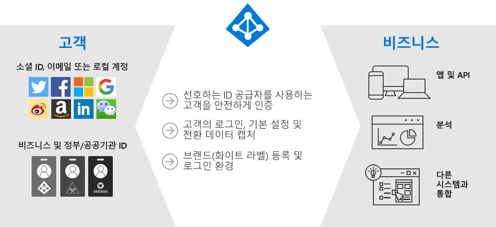
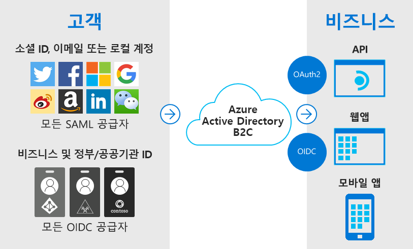
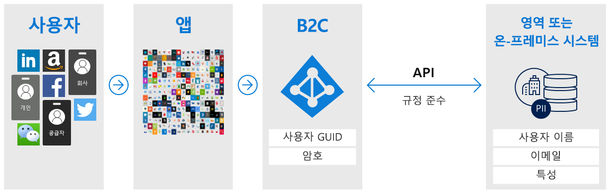
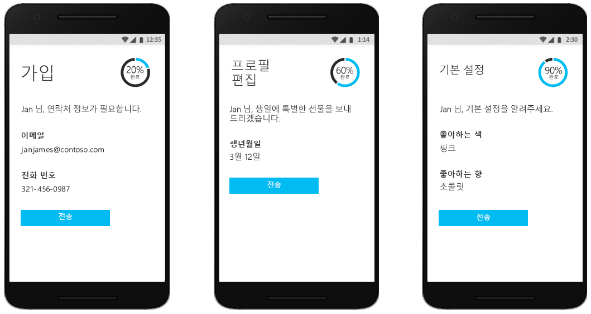
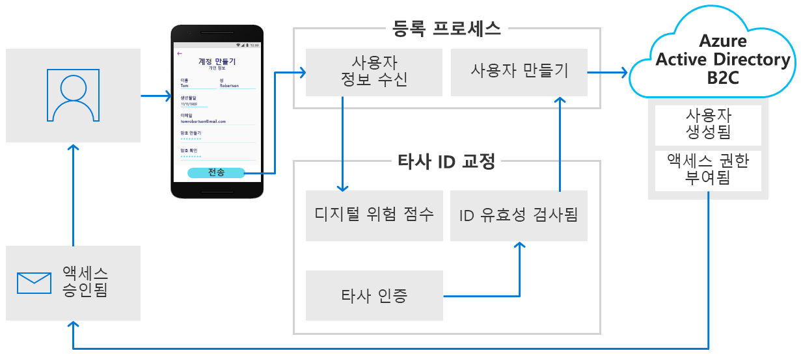
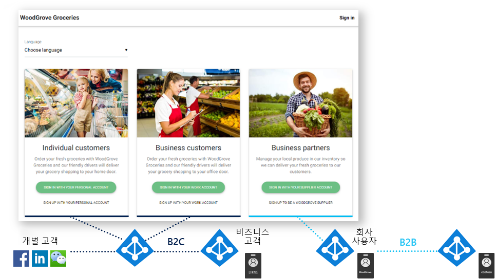
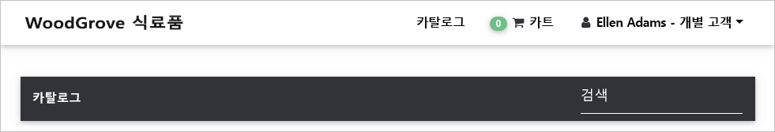

# Azure Active Directory B2C란?

Azure Active Directory B2C는 비즈니스-고객 ID를 서비스로 제공합니다. 고객은 기본 설정 소셜, 엔터프라이즈 또는 로컬 계정 ID를 사용하여 애플리케이션 및 API에 대한 Single Sign-On 액세스 권한을 얻습니다.

Azure AD B2C(Azure Active Directory B2C)는 하루에 수백만 명의 사용자와 수십억 개의 인증을 지원할 수 있는 CIAM(고객 ID 액세스 관리) 솔루션입니다. 인증 플랫폼의 크기 조정 및 안전을 처리하고, 서비스 거부, 암호 스프레이 또는 무차별 암호 대입 공격과 같은 위협을 모니터링하여 자동으로 처리합니다.

## 사용자 지정 브랜드 ID 솔루션

Azure AD B2C는 화이트 레이블 인증 솔루션입니다. 웹 및 모바일 애플리케이션과 원활하게 혼합되도록 브랜드를 사용하여 전체 사용자 환경을 사용자 지정할 수 있습니다.

사용자가 가입, 로그인 및 프로필 정보를 수정할 때 Azure AD B2C에 표시되는 모든 페이지를 사용자 지정합니다. Azure AD B2C 환경이 애플리케이션의 기본 부분인 것처럼 보이고 느껴지도록 사용자 경험에서 HTML, CSS 및 JavaScript를 사용자 지정합니다.

## 사용자 제공 ID를 사용한 Single Sign-On 액세스

Azure AD B2C는 OpenID Connect, OAuth 2.0 및 SAML을 포함한 표준 기반 인증 프로토콜을 사용합니다. 최신 애플리케이션 및 상업용 제품/서비스 소프트웨어와 통합됩니다.

Azure AD B2C는 웹 애플리케이션, 모바일 앱 및 API에 대한 중앙 인증 기관 역할을 수행하여 모든 사용자를 위한 SSO(Single Sign-On) 솔루션을 구축할 수 있습니다. 사용자 프로필 및 기본 설정 정보의 수집을 중앙 집중화하고 로그인 동작 및 가입 변환에 대한 자세한 분석을 캡처합니다.

## 외부 사용자 저장소와 통합

Azure AD B2C는 사용자당 100개의 사용자 지정 특성을 보유할 수 있는 디렉터리를 제공합니다. 그러나 외부 시스템과도 통합할 수 있습니다. 예를 들어 인증에 Azure AD B2C를 사용하지만 외부 CRM(고객 관계 관리) 또는 고객 충성도 데이터베이스에 고객 데이터의 정보 원본으로 위임합니다.

또 다른 외부 사용자 저장소 시나리오는 Azure AD B2C에서 애플리케이션에 대한 인증을 처리하지만 사용자 프로필 또는 개인 데이터를 저장하는 외부 시스템과 통합하는 것입니다. 예를 들어 지역 또는 온-프레미스 데이터 스토리지 정책과 같은 데이터 상주 요구 사항을 충족시키는 것입니다.

Azure AD B2C는 등록 또는 프로필 편집 중에 사용자로부터 정보를 쉽게 수집한 다음, 해당 데이터를 외부 시스템에 전달할 수 있습니다. 그런 다음, 나중에 인증하는 동안 Azure AD B2C는 외부 시스템에서 데이터를 검색하고, 필요한 경우 이를 애플리케이션에 보내는 인증 토큰 응답의 일부로 포함시킬 수 있습니다.

## 프로그레시브 프로파일링

다른 사용자 경험 옵션에는 프로그레시브 프로파일링이 포함됩니다. 프로그레시브 프로파일링을 통해 고객은 최소한의 정보를 수집하여 첫 번째 트랜잭션을 빠르게 완료할 수 있습니다. 그런 다음, 나중에 로그인할 때 고객으로부터 더 많은 프로필 데이터를 점차적으로 수집합니다.

## 타사 ID 확인 및 교정

사용자 계정 만들기에 대한 유효성 검사, 신뢰 점수 채점 및 승인을 수행하기 위해 Azure AD B2C에서 사용자 데이터를 수집한 다음, 이를 타사 시스템에 전달하여 ID 확인 및 교정을 용이하게 합니다.

이러한 작업은 Azure AD B2C를 통해 비즈니스-고객 ID 플랫폼으로 수행할 수 있는 몇 가지 작업에 불과합니다. 이 개요의 다음 섹션에서는 Azure AD B2C를 사용하는 데모 애플리케이션을 안내합니다. 또한 더 심층적인 [Azure AD B2C의 기술 개요](technical-overview.md)로 직접 이동할 수도 있습니다.

## 예제: WoodGrove Groceries

[WoodGrove Groceries][woodgrove]는 여러 Azure AD B2C 기능을 보여 주기 위해 Microsoft에서 만든 라이브 웹 애플리케이션입니다. 다음 몇 가지 섹션에서는 Azure AD B2C에서 WoodGrove 웹 사이트에 제공하는 인증 옵션 중 일부를 검토합니다.

### 비즈니스 개요

WoodGrove는 개별 소비자와 비즈니스 고객 모두에게 식료품을 판매하는 온라인 식료품점입니다. 비즈니스 고객은 회사 또는 자신들이 관리하는 비즈니스를 대신하여 식료품을 구입합니다.

### 로그인 옵션

WoodGrove Groceries는 고객이 매장과의 관계에 따라 다음과 같은 몇 가지 로그인 옵션을 제공합니다.

* **개별** 고객은 소셜 ID 공급자 또는 이메일 주소 및 암호와 같은 개별 계정으로 가입하거나 로그인할 수 있습니다.
* **비즈니스** 고객은 엔터프라이즈 자격 증명으로 가입하거나 로그인할 수 있습니다.
* **파트너** 및 공급자는 식료품점에 판매할 제품을 공급하는 개인입니다. 파트너 ID는 [Azure Active Directory B2B](../active-directory/b2b/what-is-b2b.md)에서 제공합니다.

### 개별 고객 인증

고객이 **개인 계정으로 로그인**을 선택하면 Azure AD B2C에서 호스팅하는 사용자 지정 로그인 페이지로 리디렉션됩니다. 다음 이미지에서는 WoodGrove Groceries 웹 사이트처럼 보이고 느껴지도록 UI(사용자 인터페이스)를 사용자 지정했음을 알 수 있습니다. WoodGrove의 고객은 Azure AD B2C에서 인증 환경을 호스팅하고 보호한다는 것을 인식하지 못합니다.

고객은 WoodGrove를 통해 Google, Facebook 또는 Microsoft 계정을 ID 공급자로 사용하여 가입하고 로그인할 수 있습니다. 또는 이메일 주소와 암호를 사용하여 *로컬 계정*이라는 항목을 만들어 가입할 수 있습니다.

고객이 **개인 계정으로 가입**, **지금 가입**을 차례로 선택하면 사용자 지정 가입 페이지가 표시됩니다.

이메일 주소를 입력하고 **확인 코드 보내기**를 선택하면 Azure AD B2C에서 고객에게 코드를 보냅니다. 코드를 입력하고, **코드 확인**을 선택한 다음, 양식에 다른 정보를 입력하면 서비스 약관에도 동의해야 합니다.

**만들기** 단추를 클릭하면 Azure AD B2C에서 사용자를 WoodGrove Groceries 웹 사이트로 다시 리디렉션합니다. 리디렉션되면 Azure AD B2C에서 OpenID Connect 인증 토큰을 WoodGrove 웹 애플리케이션에 전달합니다. 이제 사용자가 로그인되어 사용할 준비가 되었습니다. 표시 이름이 오른쪽 위 모서리에 표시되어 로그인되었음을 나타냅니다.

### 비즈니스 고객 인증

고객이 **비즈니스 고객** 아래의 옵션 중 하나를 선택하면 WoodGrove Groceries 웹 사이트에서 개별 고객에 대해 호출하는 것과 다른 Azure AD B2C 정책을 호출합니다.

이 정책은 사용자에게 가입 및 로그인에 회사 자격 증명을 사용할 수 있는 옵션을 제공합니다. WoodGrove 예에서는 사용자에게 Office 365 또는 Azure AD 계정으로 로그인하라는 메시지가 표시됩니다. 이 정책은 [다중 테넌트 Azure AD 애플리케이션](../active-directory/develop/howto-convert-app-to-be-multi-tenant.md) 및 `/common` Azure AD 엔드포인트를 사용하여 전 세계의 모든 Office 365 고객과 Azure AD B2C를 페더레이션합니다.

### 파트너 인증

**공급자 계정으로 로그인** 링크는 Azure Active Directory B2B의 협업 기능을 사용합니다. Azure AD B2B는 파트너 ID를 관리하기 위한 Azure Active Directory의 기능 제품군입니다. 이러한 ID는 Azure AD B2C로 보호되는 애플리케이션에 액세스하기 위해 Azure Active Directory에서 페더레이션할 수 있습니다.

[Azure Active Directory B2B의 게스트 사용자 액세스란?](../active-directory/b2b/what-is-b2b.md)에서 Azure AD B2B에 대해 자세히 알아보세요.

<!-- UNCOMMENT WHEN REPO IS UPDATED WITH LATEST DEMO CODE
### Sample code

If you'd like to jump right into the code to see how the WoodGrove Groceries application is built, you can find the repository on GitHub:

[Azure-Samples/active-directory-external-identities-woodgrove-demo][woodgrove-repo] (GitHub)
-->

## 다음 단계

이제 Azure AD B2C의 기본 사항 및 도움이 될 수 있는 몇 가지 시나리오를 이해했으므로 해당 기능과 기술적 측면에 대해 자세히 살펴보겠습니다.

> [!div class="nextstepaction"]
> [Azure AD B2C 기술 개요 >](technical-overview.md)

<!-- LINKS - External -->
[woodgrove]: https://aka.ms/ciamdemo
[woodgrove-repo]: https://github.com/Azure-Samples/active-directory-external-identities-woodgrove-demo
