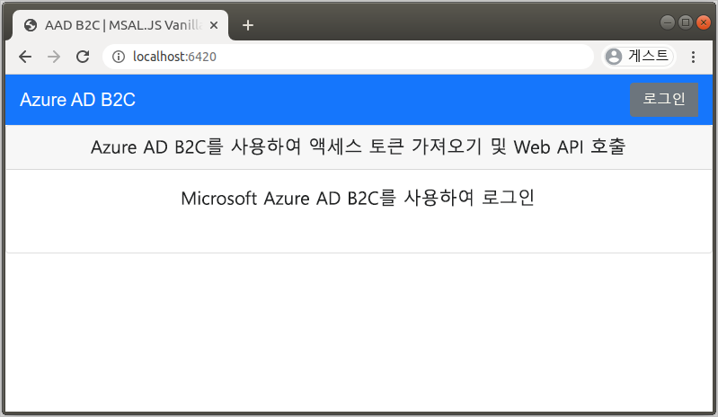
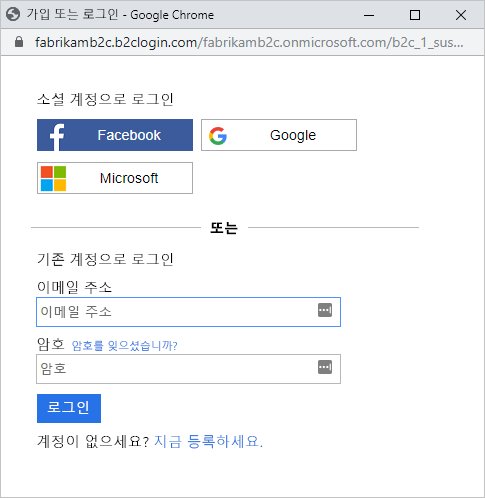
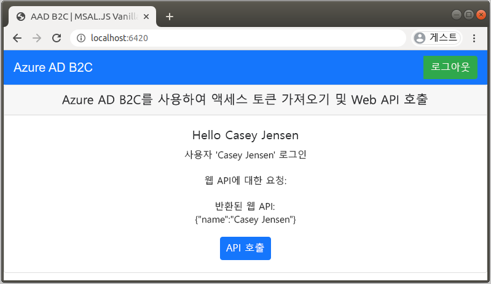

# <a name="quickstart-set-up-sign-in-for-a-single-page-app-using-azure-active-directory-b2c"></a>빠른 시작: Azure Active Directory B2C를 사용하여 단일 페이지 앱에 대한 로그인 설정

Azure AD B2C(Azure Active Directory B2C)는 애플리케이션, 비즈니스 및 고객을 보호하기 위한 클라우드 ID 관리 기능을 제공합니다. Azure AD B2C를 사용하면 애플리케이션에서 개방형 표준 프로토콜을 사용하여 소셜 계정 및 엔터프라이즈 계정을 인증할 수 있습니다. 이 빠른 시작에서는 단일 페이지 애플리케이션에서 소셜 ID 공급자를 사용하여 로그인하고 Azure AD B2C로 보호되는 웹 API를 호출합니다.

[!INCLUDE [quickstarts-free-trial-note](../../includes/quickstarts-free-trial-note.md)]

## <a name="prerequisites"></a>사전 요구 사항

- [Visual Studio Code](https://code.visualstudio.com/)
- [Node.JS](https://nodejs.org/en/download/)
- Facebook, Google 또는 Microsoft의 소셜 계정
- GitHub의 코드 샘플: [active-directory-b2c-javascript-msal-singlepageapp](https://github.com/Azure-Samples/active-directory-b2c-javascript-msal-singlepageapp)

    [zip 보관을 다운로드](https://github.com/Azure-Samples/active-directory-b2c-javascript-msal-singlepageapp/archive/master.zip)하거나 리포지토리를 복제할 수 있습니다.

    ```console
    git clone https://github.com/Azure-Samples/active-directory-b2c-javascript-msal-singlepageapp.git
    ```

## <a name="run-the-application"></a>애플리케이션 실행

1. Node.js 명령 프롬프트에서 다음 명령을 실행하여 서버를 시작합니다.

    ```console
    cd active-directory-b2c-javascript-msal-singlepageapp
    npm install && npm update
    npm start
    ```

    *server.js*에서 시작된 서버는 수신 대기 중인 포트를 표시합니다.

    ```console
    Listening on port 6420...
    ```

1. 애플리케이션의 URL로 이동합니다. `http://localhost:6420`)을 입력합니다.

    

## <a name="sign-in-using-your-account"></a>계정을 사용하여 로그인

1. **로그인**을 선택하여 사용자 경험을 시작합니다.
1. Azure AD B2C는 샘플 웹 애플리케이션용으로 Fabrikam이라는 가상 회사의 로그인 페이지를 제공합니다. 소셜 ID 공급자를 사용하여 등록하려면 사용할 ID 공급자의 단추를 선택합니다.

    

    소셜 계정 자격 증명을 사용하여 인증(로그인)하고 사용자의 소셜 계정에서 정보를 읽도록 애플리케이션에 권한을 부여합니다. 액세스를 부여하면 애플리케이션은 이름 및 구/군/시와 같은 소셜 계정의 프로필 정보를 검색할 수 있습니다.

1. ID 공급자에 대한 로그인 프로세스를 완료합니다.

## <a name="access-a-protected-api-resource"></a>보호된 API 리소스 액세스

**API 호출**을 선택하여 웹 API에서 반환된 표시 이름을 JSON 개체로 지정합니다.



샘플 단일 페이지 애플리케이션은 보호되는 웹 API 리소스에 대한 요청에 액세스 토큰을 포함합니다.

## <a name="next-steps"></a>다음 단계

이 빠른 시작에서는 샘플 단일 페이지 애플리케이션을 사용하여 다음 작업을 수행합니다.

- 소셜 ID 공급자를 사용하여 로그인
- Azure AD B2C 사용자 계정 만들기(로그인 시 자동으로 만들어짐)
- Azure AD B2C로 보호되는 웹 API 호출

사용자 고유의 Azure AD B2C 테넌트 만들기를 시작하세요.

> [!div class="nextstepaction"]
> [Azure Portal에서 Azure Active Directory B2C 테넌트 만들기](tutorial-create-tenant.md)
