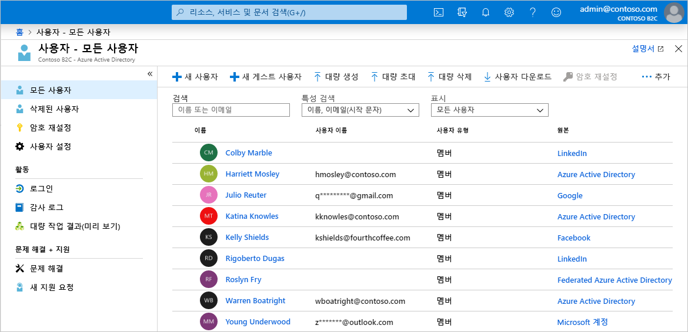
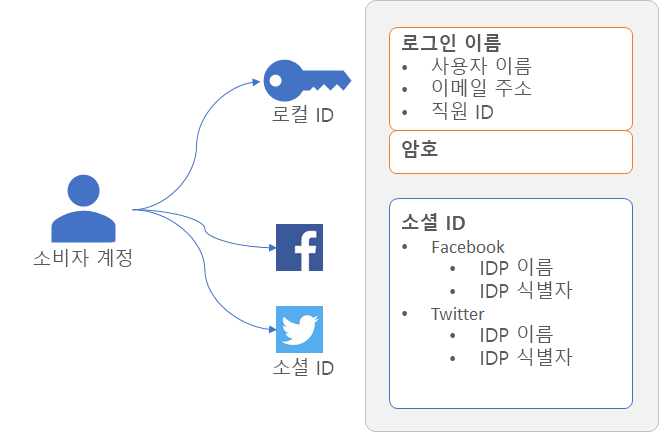
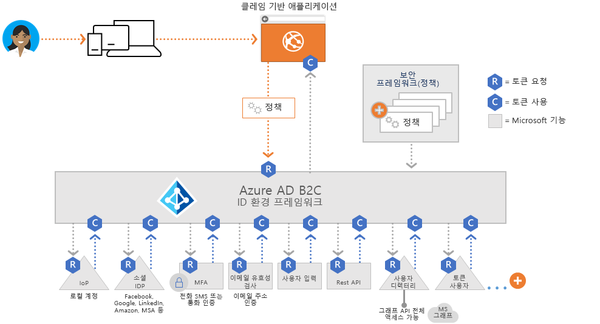
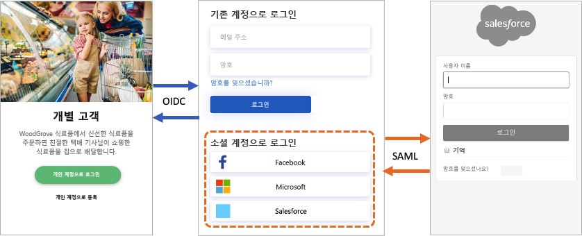
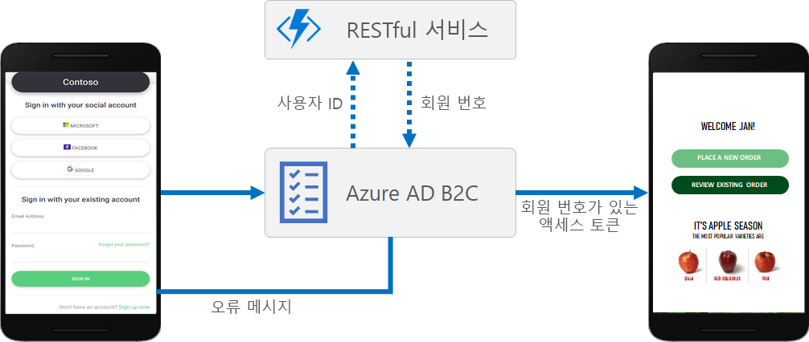
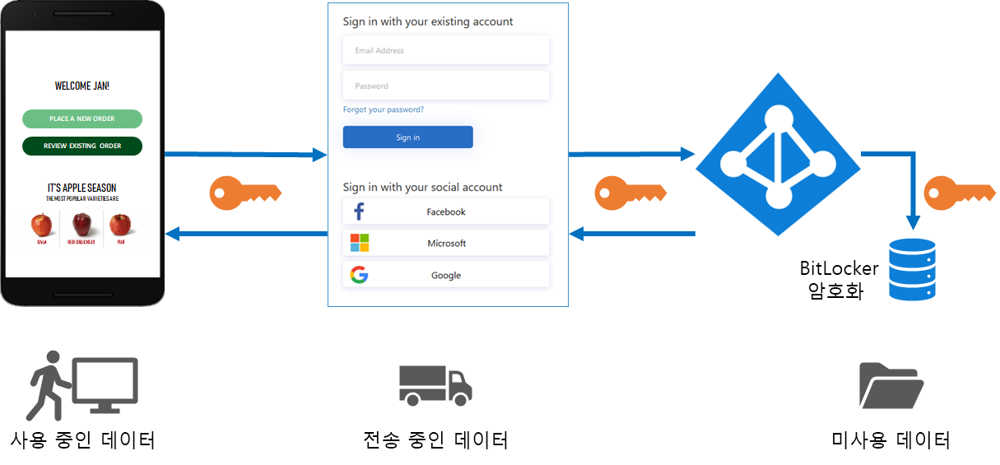
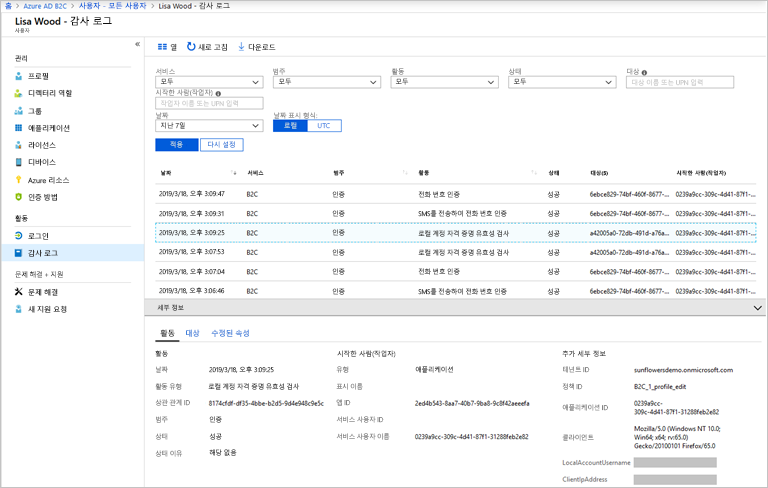

# Azure Active Directory B2C의 기술 및 기능 개요

[Azure Active Directory B2C 정보](overview.md)와 함께 제공되는 이 문서에서는 서비스에 대해 자세히 소개합니다. 여기서는 서비스에서 사용하는 기본 리소스, 해당 기능 및 이를 통해 애플리케이션에서 고객에게 완전한 사용자 지정 ID 환경을 제공할 수 있는 방법에 대해 설명합니다.

## Azure AD B2C 테넌트

Azure AD B2C(Azure Active Directory B2C)에서 *테넌트*는 조직을 나타내며 사용자의 디렉터리입니다. 각 Azure AD B2C 테넌트는 서로 전혀 다르고 다른 Azure AD B2C 테넌트와 별개입니다. Azure AD B2C 테넌트는 이미 있을 수 있는 Azure Active Directory 테넌트와 다릅니다.

Azure AD B2C 테넌트에서 사용하는 기본 리소스는 다음과 같습니다.

* **디렉터리** - *디렉터리*는 Azure AD B2C에서 사용자의 자격 증명 및 프로필 데이터와 애플리케이션 등록을 저장하는 위치입니다.
* **애플리케이션 등록** - ID 관리를 사용하도록 설정하기 위해 웹, 모바일 및 네이티브 애플리케이션을 Azure AD B2C에 등록합니다. 또한 Azure AD B2C를 사용하여 보호하려는 API도 있습니다.
* **사용자 흐름** 및 **사용자 지정 정책** - 애플리케이션에 대한 기본 제공(사용자 흐름) 및 완전히 사용자 지정 가능한(사용자 지정 정책) ID 환경입니다.
  * 가입, 로그인 및 프로필 편집과 같은 일반적인 ID 작업을 빠르게 구성하고 사용하도록 설정하려면 *사용자 흐름*을 사용합니다.
  * 일반적인 ID 작업뿐만 아니라 조직, 고객, 직원, 파트너 및 시민 고유의 복잡한 ID 워크플로에 대한 지원 작성을 위한 사용자 환경을 사용하도록 설정하려면 *사용자 지정 정책*을 사용합니다.
* **ID 공급자** - 다음 항목에 대한 페더레이션 설정입니다.
  * 애플리케이션에서 지원하려는 *소셜* ID 공급자(예: Facebook, LinkedIn 또는 Twitter)
  * 표준 ID 프로토콜을 지원하는 *외부* ID 공급자(예: OAuth 2.0, OpenID Connect 등)
  * 사용자 이름(이메일 주소 또는 다른 ID)과 암호를 사용하여 가입하고 로그인할 수 있게 하는 *로컬* 계정
* **키** - 토큰 서명 및 유효성 검사를 위한 암호화 키를 추가하고 관리합니다.

Azure AD B2C 테넌트는 Azure AD B2C를 시작하기 위해 만들어야 하는 첫 번째 리소스입니다. 방법에 대해서는 [자습서: Azure Active Directory B2C 테넌트 만들기](tutorial-create-tenant.md)의 단계를 사용하여 만들 수 있습니다.

## Azure AD B2C의 계정

Azure AD B2C는 여러 유형의 사용자 계정을 정의합니다. Azure Active Directory, Azure Active Directory B2B 및 Azure Active Directory B2C는 이러한 계정 유형을 공유합니다.

* **회사 계정** - 회사 계정이 있는 사용자는 테넌트의 리소스를 관리할 수 있으며 관리자 역할을 사용하여 테넌트를 관리할 수도 있습니다. 회사 계정이 있는 사용자는 새 소비자 계정을 만들고, 암호를 다시 설정하고, 계정을 차단/차단 해제하고, 권한을 설정하거나 계정을 보안 그룹에 할당할 수 있습니다.
* **게스트 계정** - 테넌트에 게스트로 초대하는 외부 사용자입니다. Azure AD B2C 테넌트에 게스트 사용자를 초대하기 위한 일반적인 시나리오는 관리 책임을 공유하는 것입니다.
* **소비자 계정** - 소비자 계정은 사용자가 테넌트에 등록한 애플리케이션에서 가입 사용자 경험을 완료하면 Azure AD B2C 디렉터리에 만들어지는 계정입니다.

 *그림: Azure Portal의 Azure AD B2C 테넌트 내에 있는 사용자 디렉터리*

### 소비자 계정

*소비자* 계정을 사용하면 사용자가 Azure AD B2C로 보안된 애플리케이션에 로그인할 수 있습니다. 그러나 소비자 계정이 있는 사용자는 Azure Portal과 같은 Azure 리소스에 액세스할 수 없습니다.

소비자 계정에서 연결할 수 있는 ID 형식은 다음과 같습니다.

* **로컬** ID - Azure AD B2C 디렉터리에 로컬로 저장된 사용자 이름과 암호를 사용합니다. 이러한 ID는 "로컬 계정"으로 참조하는 경우가 많습니다.
* **소셜** 또는 **엔터프라이즈** ID - 사용자의 ID는 Facebook, Microsoft, ADFS 또는 Salesforce와 같은 페더레이션 ID 공급자를 통해 관리됩니다.

소비자 계정이 있는 사용자는 여러 ID(예: 사용자 이름, 이메일, 직원 ID, 정부 ID 등)를 사용하여 로그인할 수 있습니다. 단일 계정에는 로컬 및 소셜 모두의 여러 ID가 있을 수 있습니다.

 *그림: 여러 ID가 있는 Azure AD B2C의 단일 소비자 계정*

Azure AD B2C를 사용하면 표시 이름, 성, 이름, 도시 등과 같은 소비자 계정 프로필의 일반적인 특성을 관리할 수 있습니다. 또한 Azure AD 스키마를 확장하여 사용자에 대한 추가 정보를 저장할 수도 있습니다. 예를 들어 국가 또는 거주지, 기본 언어 및 기본 설정(예: 뉴스레터를 구독할지 또는 다단계 인증을 사용할지의 여부)이 있습니다.

Azure AD B2C의 사용자 계정 유형에 대해서는 [Azure Active Directory B2C의 사용자 계정 개요](user-overview.md)에서 자세히 알아보세요.

## 외부 ID 공급자

사용자가 외부 소셜 또는 엔터프라이즈 IdP(ID 공급자)의 자격 증명을 사용하여 애플리케이션에 로그인할 수 있도록 Azure AD B2C를 구성할 수 있습니다. Azure AD B2C는 Facebook, Microsoft 계정, Google, Twitter와 같은 외부 자격 증명 공급자 및 OAuth 1.0, OAuth 2.0, OpenID Connect, SAML 또는 WS-Federation 프로토콜을 지원하는 모든 ID 공급자를 지원합니다.

외부 ID 공급자 페더레이션을 사용하면 애플리케이션 전용의 새 계정을 만들 필요 없이 기존 소셜 또는 엔터프라이즈 계정으로 로그인할 수 있는 기능을 소비자에게 제공할 수 있습니다.

Azure AD B2C는 가입 또는 로그인 페이지에서 사용자가 로그인을 위해 선택할 수 있는 외부 ID 공급자의 목록을 제공합니다. 외부 ID 공급자 중 하나를 선택하면 로그인 프로세스를 수행할 수 있도록 선택한 공급자의 웹 사이트로 이동(리디렉션)됩니다. 사용자가 성공적으로 로그인하면 애플리케이션의 계정 인증을 위해 Azure AD B2C로 되돌아갑니다.

Azure AD B2C에서 ID 공급자를 추가하는 방법을 알아보려면 [자습서: Azure Active Directory B2C의 애플리케이션에 ID 공급자 추가](tutorial-add-identity-providers.md)를 참조하세요.

## ID 환경: 사용자 흐름 또는 사용자 지정 정책

Azure AD B2C의 확장 가능한 정책 프레임워크는 핵심 강점입니다. 정책은 가입, 로그인 및 프로필 편집과 같은 사용자의 ID 환경을 설명합니다.

Azure AD B2C에는 이러한 ID 환경을 제공하기 위해 수행할 수 있는 사용자 흐름과 사용자 지정 정책의 두 가지 기본 경로가 있습니다.

* **사용자 흐름**은 Microsoft에서 제공하는 미리 정의되고 기본 제공되는 구성 가능한 정책이므로 가입, 로그인 및 정책 편집 환경을 몇 분 내에 만들 수 있습니다.

* **사용자 지정 정책**을 사용하면 복잡한 ID 환경 시나리오에 적합한 고유의 사용자 경험을 만들 수 있습니다.

사용자 흐름과 사용자 지정 정책은 모두 Azure AD B2C의 정책 오케스트레이션 엔진인 *Identity Experience Framework*를 통해 구동됩니다.

### 사용자 흐름

가장 일반적인 ID 작업을 빠르게 설정하는 데 도움을 주기 위해 Azure Portal에는 *사용자 흐름*이라는 미리 정의되고 구성 가능한 몇 가지 정책이 있습니다.

애플리케이션의 ID 환경 동작을 제어하기 위해 다음과 같은 사용자 흐름 설정을 구성할 수 있습니다.

* 로그인에 사용되는 계정 유형(예: Facebook과 같은 소셜 계정 또는 로그인에 이메일 주소와 암호를 사용하는 로컬 계정)
* 소비자로부터 수집할 특성(예: 이름, 우편 번호 또는 거주 국가)
* Azure MFA(Multi-Factor Authentication)
* 사용자 인터페이스의 사용자 지정
* 사용자가 사용자 흐름을 완료한 후에 애플리케이션에서 받는 토큰의 클레임 세트
* 세션 관리
* 등등

대부분의 모바일, 웹 및 단일 페이지 애플리케이션에 대한 가장 일반적인 ID 시나리오는 사용자 흐름을 사용하여 효과적으로 정의하고 구현할 수 있습니다. 사용자 지정 정책에 대한 완전한 유연성이 필요한 복잡한 사용자 경험 시나리오가 없는 경우 기본 제공 사용자 흐름을 사용하는 것이 좋습니다.

사용자 흐름에 대해서는 [Azure Active Directory B2C의 사용자 흐름](user-flow-overview.md)에서 자세히 알아보세요.

### 사용자 지정 정책

사용자 지정 정책은 IEF(Identity Experience Framework) 오케스트레이션 엔진의 모든 기능에 대한 액세스를 잠금 해제합니다. 사용자 지정 정책을 사용하면 IEF를 활용하여 상상할 수 있는 거의 모든 인증, 사용자 등록 또는 프로필 편집 환경을 구축할 수 있습니다.

Identity Experience Framework는 모든 단계 조합을 사용하여 사용자 경험을 구성할 수 있는 기능을 제공합니다. 다음은 그 예입니다.

* 다른 ID 공급자와 페더레이션
* 자사 및 타사 MFA(다단계 인증) 챌린지
* 모든 사용자 입력 수집
* REST API 통신을 사용하여 외부 시스템과 통합

이러한 각 사용자 경험은 정책으로 정의되며, 조직에 가장 적합한 사용자 환경을 사용하도록 설정하는 데 필요한 만큼의 정책을 작성할 수 있습니다.

사용자 지정 정책은 계층 구조 체인에서 서로를 참조하는 여러 XML 파일로 정의됩니다. XML 요소는 클레임 스키마, 클레임 변환, 콘텐츠 정의, 클레임 공급자, 기술 프로필 및 사용자 경험 오케스트레이션 단계 및 ID 환경의 다른 측면을 정의합니다.

사용자 지정 정책의 강력한 유연성은 복잡한 ID 시나리오를 구축해야 하는 경우에 가장 적합합니다. 사용자 지정 정책을 구성하는 개발자는 신뢰할 수 있는 관계를 세부적으로 신중하게 정의하여 메타데이터 엔드포인트, 정확한 클레임 정의 교환을 포함하고 ID 공급자 각각의 필요에 따라 암호, 키 및 인증서를 구성해야 합니다.

사용자 지정 정책에 대해서는 [Azure Active Directory B2C의 사용자 지정 정책](custom-policy-overview.md)에서 자세히 알아보세요.

## 프로토콜 및 토큰

Azure AD B2C는 사용자 경험에 대해 [OpenID Connect 및 OAuth 2.0 프로토콜](protocols-overview.md)을 지원합니다. OpenID Connect의 Azure AD B2C 구현에서 애플리케이션은 Azure AD B2C로 인증 요청을 발급하여 이러한 사용자 이동을 시작합니다.

Azure AD B2C에 대한 요청의 결과는 [ID 토큰 또는 액세스 토큰](tokens-overview.md)과 같은 보안 토큰입니다. 이 보안 토큰은 사용자의 ID를 정의합니다. 토큰은 `/token` 또는 `/authorize` 엔드포인트와 같은 Azure AD B2C 엔드포인트로부터 받습니다. 이러한 토큰을 사용하면 ID의 유효성을 검사하고 보안 리소스에 대한 액세스를 허용하는 데 사용할 수 있는 클레임에 액세스할 수 있습니다.

외부 ID의 경우 Azure AD B2C는 모든 OAuth 1.0, OAuth 2.0, OpenID Connect, SAML 및 WS-Fed ID 공급자와의 페더레이션을 지원합니다.

위의 다이어그램에서는 Azure AD B2C가 동일한 인증 흐름 내에서 다양한 프로토콜을 사용하여 통신할 수 있는 방법을 보여 줍니다.

1. 신뢰 당사자 애플리케이션은 OpenID Connect를 사용하여 Azure AD B2C에 대한 권한 부여 요청을 시작합니다.
1. 애플리케이션 사용자가 SAML 프로토콜을 사용하는 외부 ID 공급자를 사용하여 로그인하도록 선택하면 Azure AD B2C에서 SAML 프로토콜을 호출하여 해당 ID 공급자와 통신합니다.
1. 사용자가 외부 ID 공급자를 사용하여 로그인 작업을 완료하면 Azure AD B2C에서 OpenID Connect를 사용하여 토큰을 신뢰 당사자 애플리케이션에 반환합니다.

## 애플리케이션 통합

웹, 모바일, 데스크톱 또는 SPA(단일 페이지 애플리케이션)인지 여부에 관계없이 사용자가 애플리케이션에 로그인하려는 경우 애플리케이션에서 사용자 흐름 또는 사용자 지정 정책 제공 엔드포인트에 대한 권한 부여 요청을 시작합니다. 사용자 흐름 또는 사용자 지정 정책은 사용자의 환경을 정의하고 제어합니다. *가입 또는 로그인* 흐름과 같은 사용자 흐름을 완료하면 Azure AD B2C에서 토큰을 생성한 다음, 사용자를 애플리케이션으로 다시 리디렉션합니다.

여러 애플리케이션에서 동일한 사용자 흐름 또는 사용자 지정 정책을 사용할 수 있습니다. 단일 애플리케이션은 여러 사용자 흐름 또는 사용자 지정 정책을 사용할 수 있습니다.

예를 들어 애플리케이션에 로그인하기 위해 애플리케이션은 *가입 또는 로그인* 사용자 흐름을 사용합니다. 사용자가 로그인하면 프로필을 편집하려고 할 수 있으므로 이번에는 *프로필 편집* 사용자 흐름을 사용하여 애플리케이션이 다른 권한 부여 요청을 시작합니다.

## 매끄러운 사용자 환경

Azure AD B2C에서는 표시되는 페이지가 브랜드의 모양 및 느낌과 원활하게 조화되도록 사용자의 ID 환경을 만들 수 있습니다. 사용자가 애플리케이션의 ID 경험을 진행할 때 사용자에게 제공되는 HTML 및 CSS 콘텐츠를 거의 완벽하게 제어할 수 있습니다. 이러한 유연성을 통해 애플리케이션과 Azure AD B2C 간에 브랜드 및 시각적 개체의 일관성을 유지할 수 있습니다.

UI 사용자 지정에 대한 자세한 내용은 [Azure Active Directory B2C의 사용자 인터페이스 사용자 지정 정보](customize-ui-overview.md)를 참조하세요.

## 지역화

Azure AD B2C의 사용자 언어 지정을 사용하면 고객의 요구 사항에 맞게 다양한 언어를 수용할 수 있습니다. Microsoft에서 36개 언어로 번역을 제공하지만, 사용자가 특정 언어로 고유한 번역을 제공할 수도 있습니다. 단일 언어로만 환경이 제공되더라도 페이지에 있는 텍스트를 사용자 지정할 수 있습니다.

지역화가 작동하는 방법은 [Azure Active Directory B2C의 사용자 언어 지정](user-flow-language-customization.md)을 참조하세요.

## 고유한 비즈니스 논리 추가

사용자 지정 정책을 사용하도록 선택한 경우 사용자 경험에서 RESTful API와 통합하여 사용자 고유의 비즈니스 논리를 경험에 추가할 수 있습니다. 예를 들어 Azure AD B2C는 RESTful 서비스와 데이터를 교환하여 다음을 수행할 수 있습니다.

* 사용자에게 친숙한 사용자 지정 오류 메시지를 표시합니다.
* 사용자 입력의 유효성을 검사하여 잘못된 형식의 데이터가 사용자 디렉터리에 유지되지 않도록 합니다. 예를 들어 사용자가 입력한 데이터를 수정할 수 있습니다(예: 모든 소문자로 입력한 경우 이름을 대문자화).
* 회사 LOB(기간 업무) 애플리케이션과 추가로 통합하여 사용자 데이터를 보강합니다.
* RESTful 호출을 사용하면 푸시 알림을 보내고, 회사 데이터베이스를 업데이트하고, 사용자 마이그레이션 프로세스를 실행하고, 권한을 관리하고, 데이터베이스를 감사하는 등의 작업을 수행할 수 있습니다.

충성도 프로그램은 Azure AD B2C의 REST API 호출 지원으로 활성화되는 또 다른 시나리오입니다. 예를 들어 RESTful 서비스는 사용자의 이메일 주소를 받고, 고객 데이터베이스를 쿼리한 다음, 사용자의 충성도 점수를 Azure AD B2C에 반환할 수 있습니다. 반환 데이터는 Azure AD B2C의 사용자 디렉터리 계정에 저장한 다음, 정책의 후속 단계에서 추가로 평가하거나 액세스 토큰에 포함시킬 수 있습니다.

사용자 지정 정책으로 정의된 사용자 경험의 모든 단계에서 REST API 호출을 추가할 수 있습니다. 예를 들어 REST API를 다음과 같이 호출할 수 있습니다.

* 로그인하는 동안 Azure AD B2C에서 자격 증명의 유효성을 검사하기 직전에
* 로그인 직후에
* Azure AD B2C에서 새 계정을 디렉터리에 만들기 전에
* Azure AD B2C에서 새 계정을 디렉터리에 만든 후에
* Azure AD B2C에서 액세스 토큰을 발급하기 전에

Azure AD B2C에서 RESTful API 통합에 대한 사용자 지정 정책을 사용하는 방법을 알아보려면 [Azure AD B2C 사용자 지정 정책에서 REST API 클레임 교환 통합](custom-policy-rest-api-intro.md)을 참조하세요.

## 고객 ID 보호

Azure AD B2C는 [Microsoft Azure 보안 센터](https://www.microsoft.com/trustcenter/cloudservices/azure)에서 설명하는 보안, 개인 정보 및 기타 약정을 준수합니다.

세션은 Azure AD B2C 보안 토큰 서비스에만 알려진 암호 해독 키를 사용하여 암호화된 데이터로 모델링됩니다. 강력한 암호화 알고리즘인 AES-192가 사용됩니다. 모든 통신 경로는 기밀성 및 무결성을 위해 TLS로 보호됩니다. 보안 토큰 서비스는 EV(확장 유효성 검사) 인증서를 TLS에 사용합니다. 일반적으로 보안 토큰 서비스는 신뢰할 수 없는 입력을 렌더링하지 않음으로써 XSS(교차 사이트 스크립팅) 공격을 완화합니다.

### 사용자 데이터에 액세스

Azure AD B2C 테넌트는 직원 및 파트너에 사용되는 엔터프라이즈 Azure Active Directory 테넌트와 많은 특성을 공유합니다. 공유 측면에는 관리 역할을 보고, 역할을 할당하며, 활동을 감사하는 메커니즘이 포함됩니다.

Azure AD B2C에서는 다음을 포함하여 특정 관리 작업을 수행할 수 있는 사용자를 제어하는 역할을 할당할 수 있습니다.

* 사용자 흐름의 모든 측면 만들기 및 관리
* 모든 사용자 흐름에서 사용할 수 있는 특성 스키마 만들기 및 관리
* 직접 페더레이션에서 사용할 ID 공급자 구성
* Identity Experience Framework에서 신뢰 프레임워크 정책 만들기 및 관리(사용자 지정 정책)
* Identity Experience Framework에서 페더레이션 및 암호화용 비밀 관리(사용자 지정 정책)

Azure AD B2C 관리 역할 지원을 포함하여 Azure AD 역할에 대한 자세한 내용은 [Azure Active Directory의 관리자 역할 권한](../active-directory/users-groups-roles/directory-assign-admin-roles.md)을 참조하세요.

### MFA(Multi-Factor authentication)

Azure AD B2C MFA(다단계 인증)를 사용하면 사용자의 편의를 유지하면서 데이터와 애플리케이션에 대한 액세스를 보호할 수 있습니다. 두 번째 형식의 인증을 요구하여 추가 보안을 제공하고, 사용하기 쉬운 다양한 인증 방법을 제공하여 강력한 인증을 제공합니다. 관리자로서 결정할 수 있는 구성에 따라 사용자에게 MFA에 대한 문제가 발생할 수도 있고 그렇지 않을 수도 있습니다.

사용자 흐름에서 MFA를 사용하도록 설정하는 방법을 알아보려면 [Azure Active Directory B2C에서 다단계 인증 사용](custom-policy-multi-factor-authentication.md)을 참조하세요.

### 스마트 계정 잠금

무차별 암호 대입 시도를 방지하기 위해 Azure AD B2C는 정교한 전략을 사용하여 요청의 IP, 입력한 암호 및 몇 가지 다른 요인에 따라 계정을 잠급니다. 잠금 기간은 위험 및 시도 횟수에 따라 자동으로 증가합니다.

암호 보호 설정을 관리하는 방법에 대한 자세한 내용은 [Azure Active Directory B2C에서 리소스 및 데이터에 대한 위협 관리](threat-management.md)를 참조하세요.

### 암호 복잡성

가입 또는 암호 재설정 중에 사용자는 복잡성 규칙을 충족하는 암호를 제공해야 합니다. 기본적으로 Azure AD B2C는 강력한 암호 정책을 적용합니다. 또한 Azure AD B2C는 고객이 사용하는 암호의 복잡성 요구 사항을 지정하는 구성 옵션도 제공합니다.

암호 복잡성 요구 사항은 [사용자 흐름](user-flow-password-complexity.md) 및 [사용자 지정 정책](custom-policy-password-complexity.md) 모두에서 구성할 수 있습니다.

## 감사 및 로그

Azure AD B2C는 해당 리소스, 발급된 토큰 및 관리자 액세스에 대한 활동 정보가 포함된 감사 로그를 내보냅니다. 이러한 감사 로그를 사용하여 플랫폼 활동을 파악하고 문제를 진단할 수 있습니다. 감사 로그 항목은 이벤트를 생성한 활동이 발생한 직후에 사용할 수 있습니다.

Azure AD B2C 테넌트 또는 특정 사용자가 사용할 수 있는 감사 로그에서 다음을 포함한 정보를 확인할 수 있습니다.

* B2C 리소스에 액세스하는 사용자(예: B2C 정책 목록에 액세스하는 관리자)에 대한 권한 부여와 관련된 활동
* 관리자가 Azure Portal을 사용하여 로그인할 때 검색되는 디렉터리 특성과 관련된 활동
* B2C 애플리케이션의 CRUD(만들기, 읽기, 업데이트 및 삭제) 작업
* B2C 키 컨테이너에 저장된 키에 대한 CRUD 작업
* B2C 리소스에 대한 CRUD 작업(예: 정책 및 ID 공급자)
* 사용자 자격 증명 및 토큰 발행에 대한 유효성 검사

감사 로그에 대한 자세한 내용은 [Azure AD B2C 감사 로그 액세스](view-audit-logs.md)를 참조하세요.

### 사용 현황 인사이트

Azure AD B2C를 사용하면 사용자가 웹앱에 가입하거나 로그인하는 시기, 사용자가 있는 위치 및 사용하는 브라우저와 운영 체제를 검색할 수 있습니다. 사용자 지정 정책을 사용하여 Azure Application Insights를 Azure AD B2C에 통합하면 사용자가 가입, 로그인, 암호 재설정 또는 프로필 편집을 수행하는 방법에 대한 인사이트를 얻을 수 있습니다. 이러한 지식을 사용하면 향후 개발 주기에 대해 데이터 기반의 결정을 내릴 수 있습니다.

사용 현황 분석에 대해서는 [Application Insights를 사용하여 Azure Active Directory B2C에서 사용자 동작 추적](analytics-with-application-insights.md)에서 자세히 알아보세요.

## 다음 단계

이제 Azure Active Directory B2C의 기능 및 기술적 측면을 자세히 살펴보았으므로 B2C 테넌트를 만들어 서비스를 시작합니다.

> [!div class="nextstepaction"]
> [자습서: Azure Active Directory B2C 테넌트 만들기 >](tutorial-create-tenant.md)