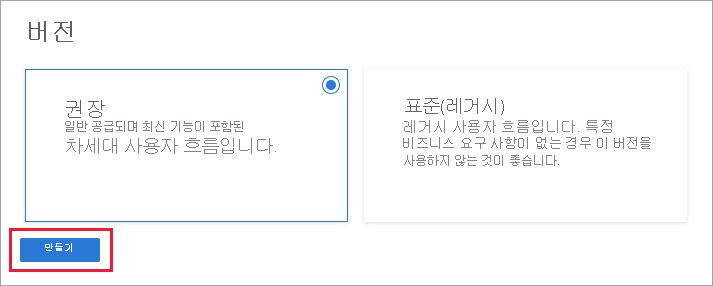

# 자습서: Azure Active Directory B2C에서 사용자 흐름 만들기

애플리케이션에는 사용자가 가입하거나, 로그인하거나, 자신의 프로필을 관리하도록 설정하는 [사용자 흐름](user-flow-overview.md)이 있을 수 있습니다. Azure AD B2C(Azure Active Directory B2C) 테넌트에서 서로 다른 유형의 여러 사용자 흐름을 만들고, 필요에 따라 애플리케이션에서 이를 사용할 수 있습니다. 애플리케이션에 사용자 흐름을 다시 사용할 수 있습니다.

이 문서에서는 다음 방법을 설명합니다.

> [!div class="checklist"]
> * 가입 및 로그인 사용자 흐름 만들기
> * 프로필 편집 사용자 흐름 만들기
> * 암호 재설정 사용자 흐름 만들기

이 자습서에서는 Azure Portal을 사용하여 권장되는 일부 사용자 흐름을 만드는 방법을 보여줍니다. 애플리케이션에서 ROPC(리소스 소유자 암호 자격 증명) 흐름을 설정하는 방법에 대한 정보를 찾고 있는 경우 [Azure AD B2C에서 리소스 소유자 암호 자격 증명 흐름 구성](configure-ropc.md)을 참조하세요.

Azure 구독이 아직 없는 경우 시작하기 전에 [체험 계정](https://azure.microsoft.com/free/?WT.mc_id=A261C142F)을 만듭니다.

> [!IMPORTANT]
> 사용자 흐름 버전을 참조하는 방법이 변경되었습니다. 이전에는 V1(프로덕션 준비) 버전과 V1.1 및 V2(미리 보기) 버전을 제공했습니다. 이제 사용자 흐름은 **추천**(차세대 미리 보기) 및 **표준**(일반 공급) 버전으로 통합되었습니다. 모든 V1.1 및 V2 레거시 미리 보기 사용자 흐름은 **2021년 8월 1일**에 사용 중단될 예정입니다. 자세한 내용은 [Azure AD B2C의 사용자 흐름 버전](user-flow-versions.md)을 참조하세요.

## 필수 구성 요소

만들려는 사용자 흐름에 속하는 [애플리케이션을 등록](tutorial-register-applications.md)합니다.

## 가입 및 로그인 사용자 흐름 만들기

등록 및 로그인 사용자 흐름은 단일 구성으로 가입 및 로그인 환경을 둘 다 처리합니다. 애플리케이션 사용자는 컨텍스트에 따라 올바른 경로로 안내됩니다.

1. [Azure Portal](https://portal.azure.com)에 로그인합니다.
1. 포털 도구 모음에서 **디렉터리 + 구독** 아이콘을 선택한 다음, Azure AD B2C 테넌트가 포함된 디렉터리를 선택합니다.

    

1. Azure Portal에서 **Azure AD B2C**를 검색하고 선택합니다.
1. **정책** 아래에서 **사용자 흐름**을 선택한 다음, **새 사용자 흐름**을 선택합니다.

    

1. **사용자 흐름 만들기** 탭에서 **가입 및 로그인** 사용자 흐름을 선택합니다.

    

1. **버전 선택** 아래에서 **추천**을 선택한 다음, **만들기**를 선택합니다. (사용자 흐름 버전에 대해 [자세히 알아보세요](user-flow-versions.md).)

    

1. 사용자 흐름에 대한 **이름**을 입력합니다. 예를 들어 *signupsignin1*과 같습니다.
1. **ID 공급자**에서 **메일 등록**을 선택합니다.
1. **사용자 특성 및 클레임**에 대해 수집한 후 등록 동안 사용자로부터 전송하려는 클레임 및 특성을 선택합니다. 예를 들어 **자세히 보기**를 선택하고 **국가/지역**, **표시 이름** 및 **우편 번호**의 특성 및 클레임을 선택합니다. **확인**을 클릭합니다.

    

1. **만들기**를 클릭하여 사용자 흐름을 추가합니다. *B2C_1*이라는 접두사가 이름 앞에 자동으로 붙습니다.

### 사용자 흐름 테스트

1. 만든 사용자 흐름을 선택하여 해당 개요 페이지를 연 다음, **사용자 흐름 실행**을 선택합니다.
1. **애플리케이션**으로 이전에 등록한 *webapp1*이라는 웹 애플리케이션을 선택합니다. **회신 URL**에는 `https://jwt.ms`가 표시되어야 합니다.
1. **사용자 흐름 실행**을 클릭하고 **지금 등록**을 선택합니다.

    

1. 유효한 이메일 주소를 입력하고, **확인 코드 보내기**를 클릭하고, 받은 확인 코드를 입력한 다음, **코드 확인**을 선택합니다.
1. 새 암호를 입력하고 암호를 확인합니다.
1. 국가 및 지역을 선택하고, 표시하려는 이름을 입력하고, 우편 번호를 입력한 다음, **만들기**를 클릭합니다. 토큰이 `https://jwt.ms`로 반환되며 사용자에게 표시됩니다.
1. 이제 사용자 흐름을 다시 실행할 수 있으며 만든 계정으로 로그인할 수 있습니다. 반환된 토큰에는 선택한 이름, 국가/지역, 이름 및 우편 번호에 대한 클레임이 포함되어 있습니다.

## 프로필 편집 사용자 흐름 만들기

애플리케이션에서 프로필을 편집할 수 있도록 하려면 프로필 편집 사용자 흐름을 사용합니다.

1. Azure AD B2C 테넌트 개요 페이지의 메뉴에서 **사용자 흐름**을 선택한 다음, **새 사용자 흐름**을 선택합니다.
1. **사용자 흐름 만들기** 탭에서 **프로필 편집** 사용자 흐름을 선택합니다. 
1. **버전 선택** 아래에서 **추천**을 선택한 다음, **만들기**를 선택합니다.
1. 사용자 흐름에 대한 **이름**을 입력합니다. 예를 들어 *profileediting1*과 같습니다.
1. **ID 공급자**로 **로컬 계정 로그인**을 선택합니다.
2. **사용자 특성**으로 고객이 프로필에서 편집할 수 있도록 하려는 특성을 선택합니다. 예를 들어 **자세히 보기**를 선택한 다음, **표시 이름** 및 **작업 제목**에 대한 특성과 클레임을 모두 선택합니다. **확인**을 클릭합니다.
3. **만들기**를 클릭하여 사용자 흐름을 추가합니다. 접두사 *B2C_1*이 이름을 자동으로 추가됩니다.

### 사용자 흐름 테스트

1. 만든 사용자 흐름을 선택하여 해당 개요 페이지를 연 다음, **사용자 흐름 실행**을 선택합니다.
1. **애플리케이션**으로 이전에 등록한 *webapp1*이라는 웹 애플리케이션을 선택합니다. **회신 URL**에는 `https://jwt.ms`가 표시되어야 합니다.
1. **사용자 흐름 실행**을 클릭하고 이전에 만든 계정으로 로그인합니다.
1. 이제 사용자의 표시 이름 및 직함을 변경할 수 있습니다. **계속**을 클릭합니다. 토큰이 `https://jwt.ms`로 반환되며 사용자에게 표시됩니다.

## 암호 재설정 사용자 흐름 만들기

애플리케이션 사용자가 자신의 암호를 다시 설정할 수 있도록 하려면 암호 재설정 사용자 흐름을 사용합니다.

1. Azure AD B2C 테넌트 개요 메뉴에서 **사용자 흐름**을 선택한 다음, **새 사용자 흐름**을 선택합니다.
1. **사용자 흐름 만들기** 탭에서 **암호 다시 설정** 사용자 흐름을 선택합니다. 
1. **버전 선택** 아래에서 **추천**을 선택한 다음, **만들기**를 선택합니다.
1. 사용자 흐름에 대한 **이름**을 입력합니다. 예를 들어 *passwordreset1*과 같습니다.
1. **ID 공급자**에서 **메일 주소를 사용하여 암호 재설정**을 사용하도록 설정합니다.
2. 애플리케이션 클레임에서 **자세히 표시**를 클릭하고, 애플리케이션으로 다시 전송되는 인증 토큰에 반환하려는 클레임을 선택합니다. 예를 들어 **사용자의 개체 ID**를 선택합니다.
3. **확인**을 클릭합니다.
4. **만들기**를 클릭하여 사용자 흐름을 추가합니다. 접두사 *B2C_1*이 이름을 자동으로 추가됩니다.

### 사용자 흐름 테스트

1. 만든 사용자 흐름을 선택하여 해당 개요 페이지를 연 다음, **사용자 흐름 실행**을 선택합니다.
1. **애플리케이션**으로 이전에 등록한 *webapp1*이라는 웹 애플리케이션을 선택합니다. **회신 URL**에는 `https://jwt.ms`가 표시되어야 합니다.
1. **사용자 흐름 실행**을 클릭하고, 이전에 만든 계정의 이메일 주소를 확인한 다음, **계속**을 선택합니다.
1. 이제 사용자의 암호를 변경할 수 있습니다. 암호를 변경하고, **계속**을 선택합니다. 토큰이 `https://jwt.ms`로 반환되며 사용자에게 표시됩니다.

## 다음 단계

이 문서에서는 다음 방법에 대해 알아보았습니다.

> [!div class="checklist"]
> * 가입 및 로그인 사용자 흐름 만들기
> * 프로필 편집 사용자 흐름 만들기
> * 암호 재설정 사용자 흐름 만들기

다음으로, 사용자가 Azure AD, Amazon, Facebook, GitHub, LinkedIn, Microsoft 또는 Twitter와 같은 공급자에 로그인할 수 있도록 ID 공급자를 애플리케이션에 추가하는 방법에 대해 알아봅니다.

> [!div class="nextstepaction"]
> [애플리케이션에 ID 공급자 추가 >](tutorial-add-identity-providers.md)
