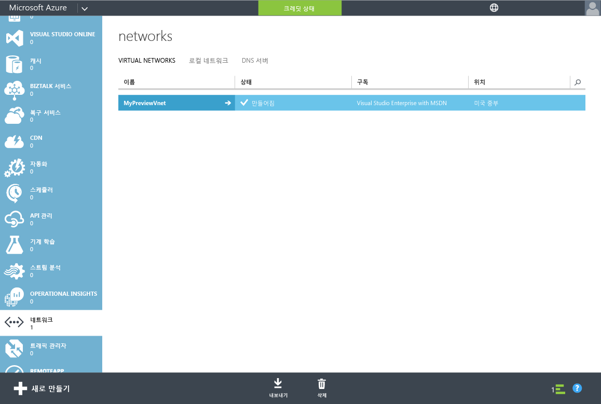
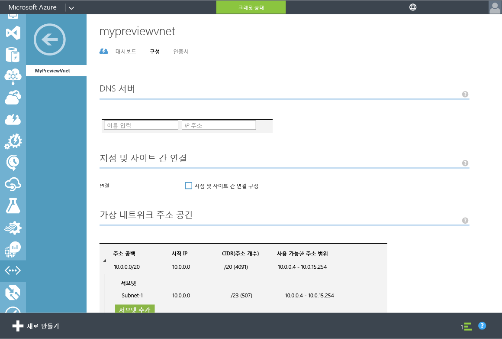
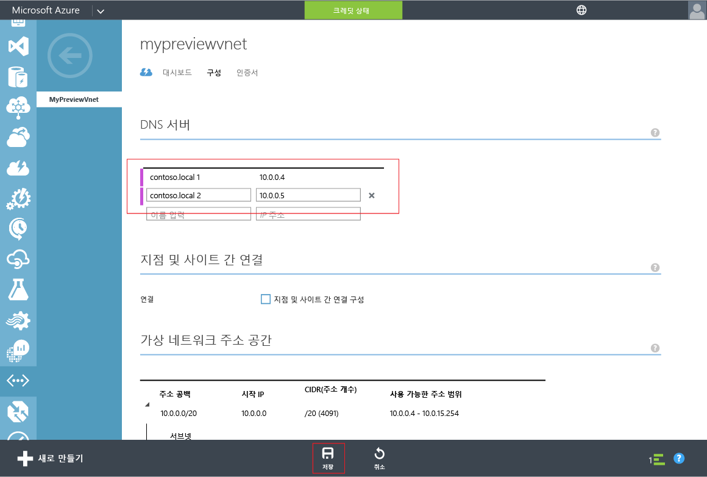

<properties
	pageTitle="Azure AD 도메인 서비스: Azure 가상 네트워크를 위한 DNS 설정 업데이트 | Microsoft Azure"
	description="Azure Active Directory 도메인 서비스 시작"
	services="active-directory-ds"
	documentationCenter=""
	authors="mahesh-unnikrishnan"
	manager="stevenpo"
	editor="curtand"/>

<tags
	ms.service="active-directory-ds"
	ms.workload="identity"
	ms.tgt_pltfrm="na"
	ms.devlang="na"
	ms.topic="get-started-article"
	ms.date="09/21/2016"
	ms.author="maheshu"/>

# Azure AD Domain Services - Azure 가상 네트워크에 대한 DNS 설정 업데이트

## 작업 4: Azure 가상 네트워크에 대한 DNS 설정 업데이트
이전 구성 태스크에서 디렉터리에 대한 Azure AD Domain Services를 성공적으로 설정했습니다. 다음 태스크는 가상 네트워크 내의 컴퓨터가 이러한 서비스에 연결되고 해당 서비스를 사용할 수 있도록 합니다. 가상 네트워크에서 Azure AD Domain Services를 사용할 수 있는 두 개의 IP 주소를 가리키도록 가상 네트워크에 대한 DNS 서버 설정을 업데이트합니다.

> [AZURE.NOTE] 디렉터리에 Azure AD 도메인 서비스를 사용하도록 설정한 후 디렉터리의 **구성** 탭에 표시되는 Azure AD 도메인 서비스의 IP 주소를 기록해 둡니다.

Azure AD Domain Services를 사용하도록 설정한 가상 네트워크에 대한 DNS 서버 설정을 업데이트하려면 다음 구성 단계를 수행합니다.

1. **Azure 클래식 포털**([https://manage.windowsazure.com](https://manage.windowsazure.com))로 이동합니다.

2. 왼쪽 창에서 **네트워크** 노드를 선택합니다.

    

3. **가상 네트워크** 탭에서 Azure AD 도메인 서비스를 사용하도록 설정한 가상 네트워크를 선택하여 속성을 확인합니다.

4. **구성** 탭을 클릭합니다.

    

5. **DNS 서버** 섹션에서 Azure AD 도메인 서비스의 IP 주소를 입력합니다.

6. 디렉터리의 **구성** 탭에 있는 **도메인 서비스** 섹션에 표시된 IP 주소를 둘 다 입력해야 합니다.

7. 이 가상 네트워크에 대한 DNS 서버 설정을 저장하려면 페이지 아래쪽의 태스크 창에서 **저장**을 클릭합니다.

   

> [AZURE.NOTE] 가상 네트워크에 대한 DNS 서버 설정을 업데이트한 후 네트워크의 가상 컴퓨터가 업데이트된 DNS 구성을 가져오는 데 시간이 걸릴 수 있습니다. 가상 컴퓨터가 도메인에 연결할 수 없는 경우 가상 컴퓨터에서 DNS 캐시를 플러시할 수 있습니다(예: ipconfig /flushdns). 이 명령은 가상 컴퓨터의 DNS 설정을 강제로 새로 고칩니다.

## 작업 5 - Azure AD 도메인 서비스에 대한 암호 동기화 활성화
다음 구성 태스크는 [Azure AD Domain Services에 대한 암호 동기화를 활성화](active-directory-ds-getting-started-password-sync.md)하는 것입니다.

<!---HONumber=AcomDC_0928_2016-->