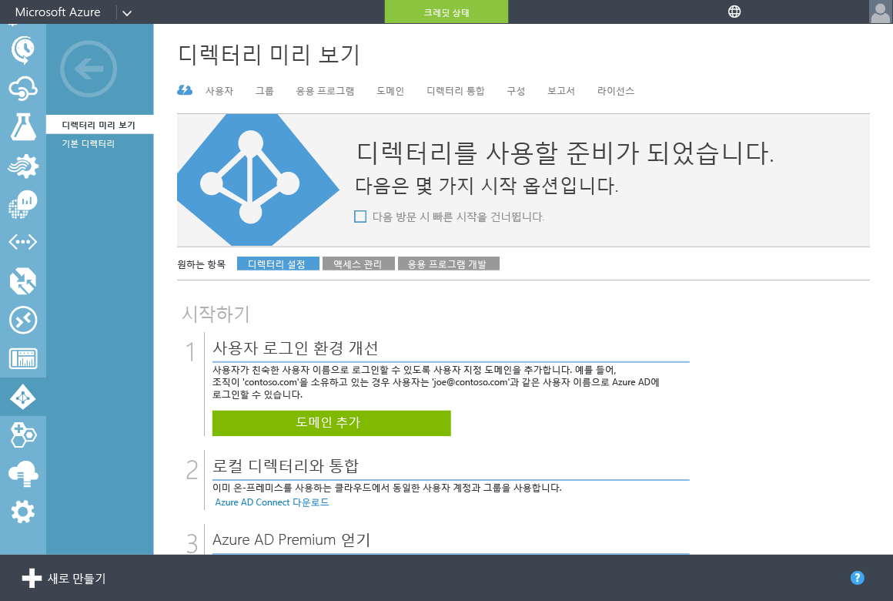
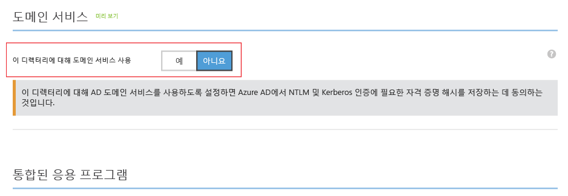
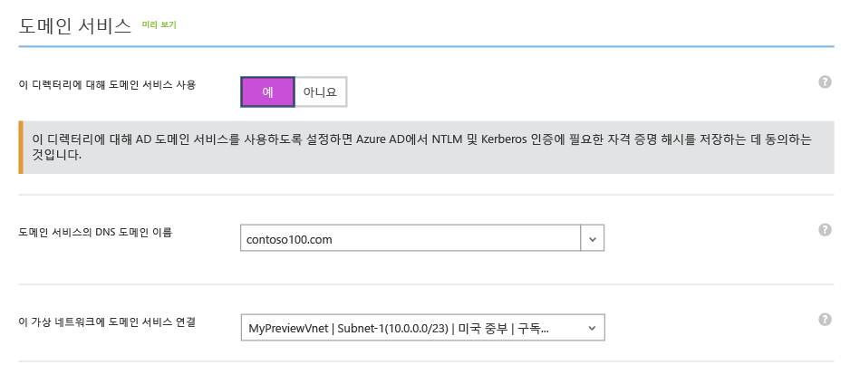
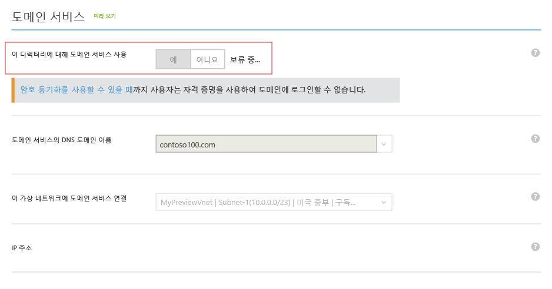
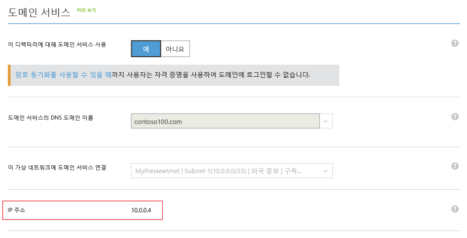
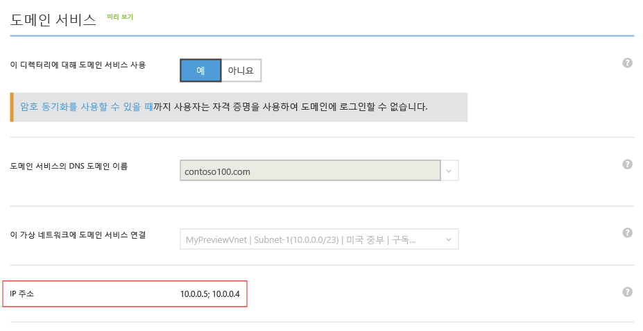

<properties
	pageTitle="Azure AD 도메인 서비스: Azure AD 도메인 서비스 활성화 | Microsoft Azure"
	description="Azure Active Directory 도메인 서비스 시작"
	services="active-directory-ds"
	documentationCenter=""
	authors="mahesh-unnikrishnan"
	manager="stevenpo"
	editor="curtand"/>

<tags
	ms.service="active-directory-ds"
	ms.workload="identity"
	ms.tgt_pltfrm="na"
	ms.devlang="na"
	ms.topic="get-started-article"
	ms.date="09/21/2016"
	ms.author="maheshu"/>

# Azure AD Domain Services 활성화

## 작업 3: Azure AD 도메인 서비스 활성화
이번 태스크에서는 디렉터리에 Azure AD Domain Services를 사용하도록 설정합니다. 디렉터리에 Azure AD Domain Services를 사용하도록 설정하려면 다음 구성 단계를 수행합니다.

1. **Azure 클래식 포털**([https://manage.windowsazure.com](https://manage.windowsazure.com))로 이동합니다.

2. 왼쪽 창에서 **Active Directory** 노드를 선택합니다.

3. Azure AD 도메인 서비스를 사용하도록 설정할 Azure AD 테넌트(디렉터리)를 선택합니다.

    

4. **구성** 탭을 클릭합니다.

    

5. **도메인 서비스** 섹션까지 아래로 스크롤합니다.

    

6. **해당 디렉터리에 도메인 서비스 사용** 옵션을 **예**로 설정/해제합니다. Azure AD Domain Services에 대한 몇 가지 구성 옵션이 페이지에 표시됩니다.

    

    > [AZURE.NOTE] 테넌트에 대해 Azure AD Domain Services를 사용하도록 설정하면 Azure AD는 사용자를 인증에 필요한 Kerberos 및 NTLM 자격 증명 해시를 만들고 저장합니다.

7. **도메인 서비스의 DNS 도메인 이름**을 지정합니다.

   - 디렉터리의 기본 도메인 이름(즉, **. onmicrosoft.com** 도메인 접미사로 끝남)이 기본적으로 선택됩니다.

   - 목록은 Azure AD 디렉터리에 대해 '도메인' 탭에서 구성한 확인된 도메인 뿐만 아니라 확인되지 않은 도메인을 포함하여 구성된 도메인을 모두 포함합니다.

   - 또한 사용자 지정 도메인 이름을 이 목록에 직접 입력하여 추가할 수 있습니다. 이 예제에서는 사용자 지정 도메인 이름에 'contoso100.com'을 입력했습니다.

     > [AZURE.WARNING] 지정한 도메인 이름의 도메인 접두사(예: 'contoso100.com' 도메인 이름에서 'contoso100')는 15자 이내로 합니다. 15자 보다 긴 도메인 접두사로 Azure AD 도메인 서비스 도메인을 만들 수 없습니다.

8. 다음 단계에서는 Azure AD 도메인 서비스를 사용할 수 있는 가상 네트워크를 선택합니다. **해당 가상 네트워크에 도메인 서비스 연결**이라는 드롭다운에서 방금 만든 가상 네트워크를 선택합니다.

   - 사용자가 지정한 가상 네트워크가 Azure AD 도메인 서비스에서 지원하는 Azure 지역에 속하도록 합니다.

   - Azure AD Domain Services를 사용할 수 있는 Azure 지역을 알아보려면 [지역별 Azure 서비스](https://azure.microsoft.com/regions/#services/) 페이지를 참조하세요.

   - Azure AD Domain Services를 지원하지 않는 영역에 속한 가상 네트워크는 드롭다운 목록에 표시되지 않습니다.

   - 마찬가지로, Azure Resource Manager를 사용하여 만든 가상 네트워크는 드롭다운 목록에 표시되지 않습니다. Resource Manager 기반 가상 네트워크가 현재 Azure AD Domain Services에서 지원되지 않기 때문입니다.

9. 관리되는 도메인에서 선택한 DNS 도메인 이름은 가상 네트워크에 존재하지 않도록 합니다. 특히 다음과 같은 경우인지를 확인합니다.

   - 가상 네트워크에 이미 동일한 DNS 도메인 이름을 가진 도메인이 있는 경우.

   - 선택한 가상 네트워크에 온-프레미스 네트워크가 있는 VPN 연결이 있으며 온-프레미스 네트워크에 동일한 DNS 도메인 이름을 가진 도메인이 있는 경우.

   - 가상 네트워크에 해당 이름을 가진 기존 클라우드 서비스가 있는 경우.

10. Azure AD Domain Services를 사용하려면 페이지의 맨 아래에 있는 태스크 창에서 **저장**을 클릭합니다.

11. Azure AD Domain Services를 디렉터리에 사용하는 동안 페이지는 '보류 중...' 상태를 표시합니다.

    

    > [AZURE.NOTE] Azure AD 도메인 서비스는 관리된 도메인에 고가용성을 제공합니다. Azure AD Domain Services를 활성화하면 가상 네트워크에 사용할 수 있는 Domain Services가 있는 IP 주소가 하나씩 나타납니다. 서비스가 도메인에 고가용성을 지원하면 즉시 두 번째 IP 주소가 표시됩니다. 높은 가용성이 구성되고 도메인에 활성화되면 **구성** 탭의 **도메인 서비스** 섹션에서 두 개의 IP 주소를 확인해야 합니다.

12. 20-30분 후에 **구성** 페이지의 **IP 주소** 필드에서 가상 네트워크에 사용할 수 있는 도메인 서비스가 있는 첫 번째 IP 주소가 표시됩니다.

    

13. 도메인에 대해 고가용성이 작동할 때 페이지에 표시되는 두 개의 IP 주소를 확인합니다. Azure AD Domain Services를 선택된 가상 네트워크에서 사용할 수 있는 IP 주소가 있습니다. 해당 IP 주소를 적어두어 가상 네트워크에 대한 DNS 설정을 업데이트할 수 있습니다. 이 단계는 도메인 가입과 같은 작업을 위해 도메인에 연결할 가상 네트워크에 가상 컴퓨터를 사용할 수 있습니다.

    

> [AZURE.NOTE] Azure AD 테넌트의 크기에 따라(사용자, 그룹 등의 숫자) 디렉터리의 콘텐츠를 Azure AD Domain Services에서 사용할 수 있기까지 시간이 걸립니다. 이 동기화 프로세스는 백그라운드에서 발생합니다. 수만 개의 개체가 있는 대형 테넌트의 경우 모든 사용자, 그룹 멤버 자격 및 자격 증명이 Azure AD 도메인 서비스에서 사용할 수 있는 데 하루 또는 이틀이 걸릴 수도 있습니다.

 

## 작업 4 - Azure 가상 네트워크에 대한 DNS 설정 업데이트
다음 구성 태스크는 [Azure 가상 네트워크에 대한 DNS 설정을 업데이트](active-directory-ds-getting-started-dns.md)하는 것입니다.

<!---HONumber=AcomDC_0928_2016-->