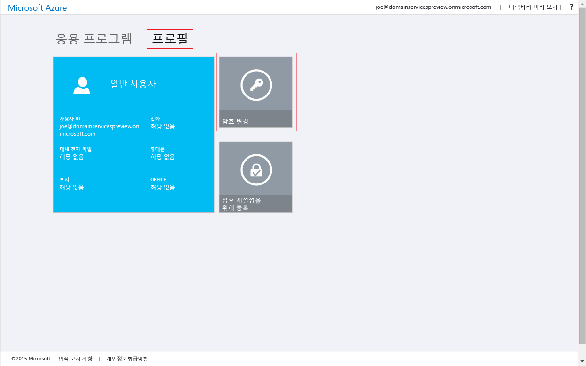
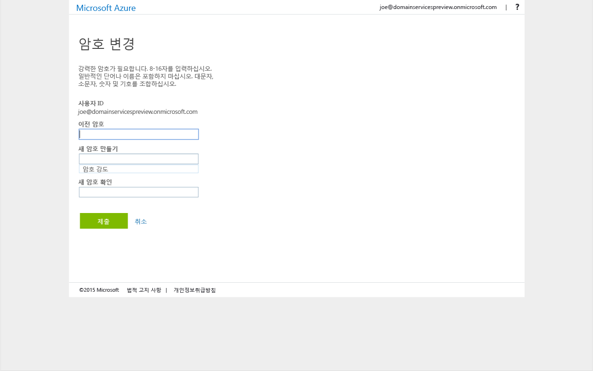

# Azure Active Directory Domain Services에 암호 해시 동기화 사용
이전 작업에서 Azure AD(Azure Active Directory) 테넌트에 대해 Azure Active Directory Domain Services를 사용하도록 설정했습니다. 다음 작업은 NTLM(NT LAN Manager) 및 Kerberos 인증에 필요한 암호 해시를 Azure AD Domain Services로 동기화하도록 설정하는 것입니다. 암호 해시 동기화를 설정하면 사용자는 회사 자격 증명을 사용하여 관리되는 도메인에 로그인할 수 있습니다.

관련된 단계는 Azure AD Connect를 사용하여 온-프레미스 디렉터리에서 동기화된 사용자 계정과 클라우드 전용 사용자 계정에 대해 서로 다릅니다. 

 

| **사용자 계정의 유형** | **수행할 단계** |
| --- |---|
| **Azure AD에서 만든 클라우드 사용자 계정** |**&#x2713;** [이 문서의 지침에 따르세요.](active-directory-ds-getting-started-password-sync.md#task-5-enable-password-hash-synchronization-to-your-managed-domain-for-cloud-only-user-accounts) |
| **사용자 계정은 온-프레미스 디렉터리에서 동기화됩니다.** |**&#x2713;** [온-프레미스 AD에서 관리되는 도메인으로 동기화된 사용자 계정의 암호 해시 동기화](active-directory-ds-getting-started-password-sync-synced-tenant.md) | 

 

> [!TIP]
> **두 단계를 모두 완료해야 할 수도 있습니다.**
> Azure AD 테넌트에 클라우드 전용의 사용자와 온-프레미스 AD의 사용자가 있는 경우 두 단계를 모두 수행해야 합니다.
>

## 작업 5: 클라우드 전용 사용자 계정에 대한 관리되는 도메인으로 암호 해시 동기화 사용
관리되는 도메인에서 사용자를 인증하려면 Azure Active Directory Domain Services에 NTLM 및 Kerberos 인증에 적합한 형식의 암호 해시가 필요합니다. 사용자가 테넌트에 대해 Azure Active Directory Domain Services를 사용하도록 설정할 때까지 Azure AD에서는 NTLM 또는 Kerberos 인증에 필요한 형식의 암호 해시를 생성하거나 저장하지 않습니다. 확실한 보안상의 이유로 Azure AD는 암호 자격 증명을 일반 텍스트 형식으로 저장하지 않습니다. 따라서 Azure AD에는 사용자의 기존 자격 증명에 따라 이러한 NTLM 또는 Kerberos 암호 해시를 자동으로 생성하는 방법이 없습니다.

> [!NOTE]
> **조직에 클라우드 전용 사용자 계정이 있는 경우 Azure Active Directory Domain Services를 사용해야 하는 사용자는 모두 암호를 변경해야 합니다.** 클라우드 전용 사용자 계정은 Azure Portal 또는 Azure AD PowerShell cmdlet을 사용하여 Azure AD 디렉터리에 만든 계정입니다. 이러한 사용자 계정은 온-프레미스 디렉터리에서 동기화되지 않습니다.
>
>

이 암호 변경 프로세스를 수행하면 Azure AD에서 Kerberos 및 NTLM 인증을 위해 Azure Active Directory Domain Services에 필요한 암호 해시가 생성됩니다. Azure Active Directory Domain Services를 사용해야 하는 테넌트의 모든 사용자에 대한 암호를 만료시키거나, 암호를 변경하도록 해당 사용자에게 지시할 수 있습니다.

### 클라우드 전용 사용자 계정에 대해 NTLM 및 Kerberos 암호 해시 생성 사용
암호를 변경할 수 있도록 사용자에게 제공되는 지침은 다음과 같습니다.

1. 사용자의 조직에 대한 [Azure AD 액세스 패널](https://myapps.microsoft.com) 페이지로 이동합니다.

    

2. 오른쪽 위 모서리에서 이름을 클릭하고 메뉴에서 **프로필**을 선택합니다.

    

3. **프로필** 페이지에서 **암호 변경**을 클릭합니다.

    

   > [!TIP]
   > **암호 변경** 옵션이 [액세스 패널] 창에 표시되지 않으면 조직이 [Azure AD에서 암호 관리](../active-directory/authentication/quickstart-sspr.md)를 구성했는지 확인합니다.
   >
   >
4. **암호 변경** 페이지에서 기존(이전) 암호를 입력하고 새 암호를 입력한 다음 확인합니다.

    

5. **제출**을 클릭합니다.

암호를 변경하고 나서 몇 분 후에 Azure Active Directory Domain Services에서 새 암호를 사용할 수 있습니다. 약 20분 후에 새로 변경한 암호를 사용하여 관리되는 도메인에 가입된 컴퓨터에 로그인할 수 있습니다.

## 관련 내용
* [고유한 암호를 업데이트하는 방법](../active-directory/user-help/active-directory-passwords-update-your-own-password.md)
* [Azure AD에서 암호 관리 시작](../active-directory/authentication/quickstart-sspr.md)
* [동기화된 Azure AD 테넌트의 Azure Active Directory Domain Services에 암호 해시 동기화 사용](active-directory-ds-getting-started-password-sync-synced-tenant.md)
* [Azure AD Domain Services 도메인을 관리 합니다.](manage-domain.md)
* [Windows 가상 머신을 Azure Active Directory Domain Services 관리되는 도메인에 가입](active-directory-ds-admin-guide-join-windows-vm.md)
* [Red Hat Enterprise Linux 가상 머신을 Azure Active Directory Domain Services 관리되는 도메인에 가입](active-directory-ds-admin-guide-join-rhel-linux-vm.md)
