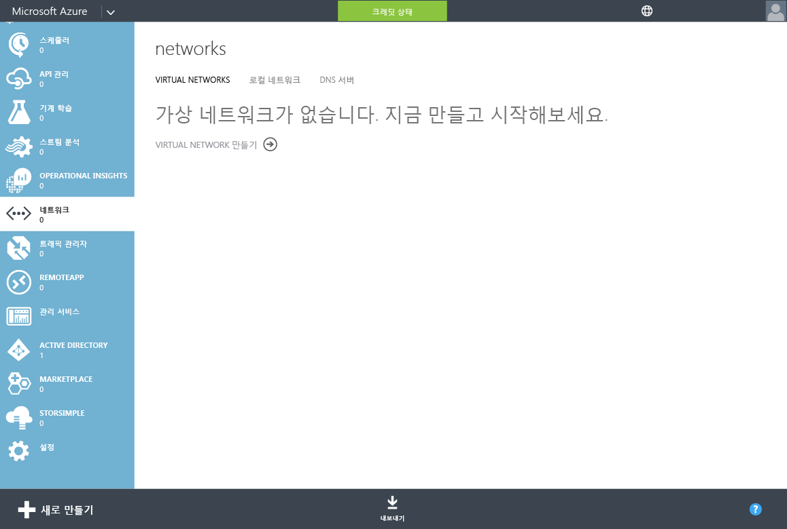
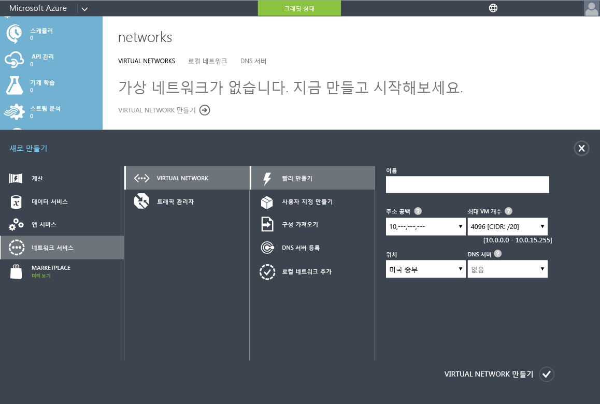
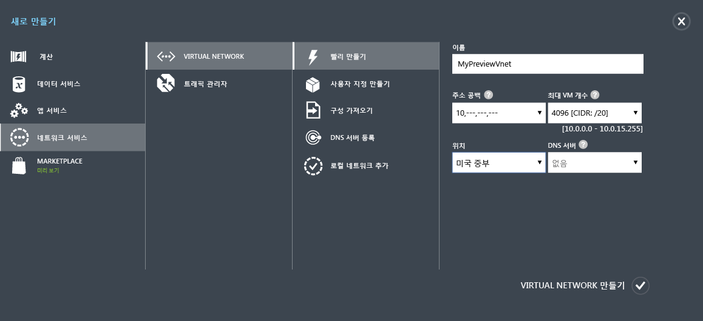

<properties
	pageTitle="Azure AD 도메인 서비스: 가상 네트워크 만들기 또는 선택 | Microsoft Azure"
	description="Azure Active Directory 도메인 서비스 시작"
	services="active-directory-ds"
	documentationCenter=""
	authors="mahesh-unnikrishnan"
	manager="stevenpo"
	editor="curtand"/>

<tags
	ms.service="active-directory-ds"
	ms.workload="identity"
	ms.tgt_pltfrm="na"
	ms.devlang="na"
	ms.topic="get-started-article"
	ms.date="09/20/2016"
	ms.author="maheshu"/>

# Azure AD 도메인 서비스의 가상 네트워크 만들기 또는 선택

## Azure 가상 네트워크 선택 지침
> [AZURE.NOTE] **시작하기 전에**: [Azure AD 도메인 서비스의 네트워킹 고려 사항](active-directory-ds-networking.md)을 참조하세요.

## 작업 2: Azure 가상 네트워크 만들기
다음 구성 작업은 Azure AD 도메인 서비스를 사용하도록 설정할 Azure 가상 네트워크를 만드는 것입니다. 사용하고 싶은 기존 가상 네트워크가 이미 있는 경우 이 단계를 건너뛸 수 있습니다.

> [AZURE.NOTE] 만들거나 Azure AD 도메인 서비스와 함께 사용하도록 선택하는 Azure 가상 네트워크가 Azure AD 도메인 서비스에서 지원하는 Azure 지역에 속하는지 확인합니다. Azure AD 도메인 서비스를 사용할 수 있는 Azure 지역을 알아보려면 [지역별 Azure 서비스](https://azure.microsoft.com/regions/#services/) 페이지를 참조하세요.

후속 구성 단계에서 Azure AD 도메인 서비스를 사용하도록 설정할 때 올바른 가상 네트워크를 선택할 수 있도록 가상 네트워크의 이름을 기록해 둡니다.

Azure AD 도메인 서비스를 사용하도록 설정할 Azure 가상 네트워크를 만들려면 다음 구성 단계를 수행합니다.

1. **Azure 클래식 포털**([https://manage.windowsazure.com](https://manage.windowsazure.com))로 이동합니다.

2. 왼쪽 창에서 **네트워크** 노드를 선택합니다.

3. 페이지 아래쪽의 작업창에서 **새로 만들기**를 클릭합니다.

    

4. **네트워크 서비스** 노드에서 **가상 네트워크**를 선택합니다.

5. 가상 네트워크를 만들기 위해 **빠른 생성**을 클릭합니다.

    

6. 가상 네트워크의 **이름**을 지정합니다. 이 네트워크의 **주소 공간** 또는 **최대 VM 수**를 구성하도록 선택할 수도 있습니다. 지금은 DNS 서버 설정을 ‘None’으로 설정된 상태로 둘 수 있습니다. 이 설정은 Azure AD 도메인 서비스를 사용하도록 설정한 후 업데이트됩니다.

7. **위치** 드롭다운에서 지원되는 Azure 지역을 선택해야 합니다. Azure AD 도메인 서비스를 사용할 수 있는 Azure 지역을 알아보려면 [지역별 Azure 서비스](https://azure.microsoft.com/regions/#services/) 페이지를 참조하세요.

8. **Virtual Network 만들기** 단추를 클릭하여 가상 네트워크를 만듭니다.

    

 

## 작업 3 - Azure AD 도메인 서비스 활성화
다음 구성 태스크는 [Azure AD 도메인 서비스를 활성화](active-directory-ds-getting-started-enableaadds.md)하는 것입니다.

<!-----HONumber=AcomDC_0921_2016-->