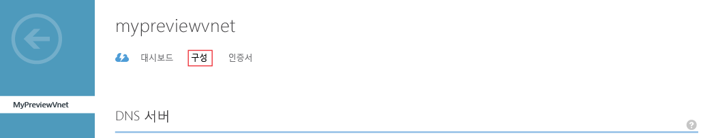
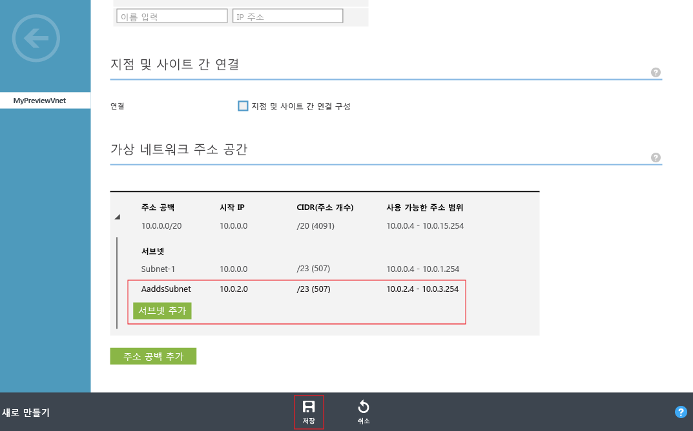

# Azure Active Directory Domain Services의 가상 네트워크 만들기 또는 선택

## 시작하기 전에

[Azure Active Directory Domain Services의 네트워킹 고려 사항](active-directory-ds-networking.md)을 참조하세요.

## 작업 2: Azure 가상 네트워크 만들기

다음 구성 작업은 Azure Virtual Network를 만들고 그 안에 서브넷을 만드는 것입니다. 가상 네트워크 내의 이 서브넷에서 Azure Active Directory Domain Services를 사용하도록 설정합니다. 기존 가상 네트워크를 사용하려는 경우 이 단계를 건너뛸 수 있습니다.

> [!NOTE]
> Azure Active Directory Domain Services와 함께 사용하도록 만들거나 선택하는 Azure 가상 네트워크가 Azure Active Directory Domain Services에서 지원하는 Azure 지역에 속하는지 확인합니다. Azure Active Directory Domain Services를 사용할 수 있는 Azure 지역을 확인하려면 [지역별 Azure 서비스](https://azure.microsoft.com/regions/#services/) 페이지를 참조하세요.
>
>후속 구성 단계에서 Azure Active Directory Domain Services를 사용하도록 설정할 때 올바른 가상 네트워크를 선택할 수 있도록 가상 네트워크의 이름을 기록해 둡니다.

Azure Active Directory Domain Services를 사용하려는 Azure 가상 네트워크를 만들려면 다음 구성 지침을 따릅니다.

1. [Azure 클래식 포털](https://manage.windowsazure.com)로 이동합니다.
2. 왼쪽 창에서 **Networks**를 선택합니다.

      
    **Virtual Networks** 창이 열립니다.
3. 페이지 아래쪽의 작업 창에서 **새로 만들기** 를 클릭합니다.

    
4. **Network Services**를 클릭한 다음 **Virtual Network**를 선택합니다.

    
5. 가상 네트워크를 만들려면 **빨리 만들기**를 클릭합니다.

6. 가상 네트워크에 대해 **이름**을 지정하고 다음을 수행합니다.
    * 이 네트워크에 대해 **주소 공간** 또는 **최대 VM 수**를 구성하도록 선택할 수 있습니다.
    * 지금은 **DNS 서버** 설정을 **없음**으로 둘 수 있습니다. DNS 서버 설정은 Azure Active Directory Domain Services를 사용하도록 설정한 후에 업데이트할 수 있습니다.
7. **위치** 드롭다운에서 지원되는 Azure 지역을 선택합니다.  
    Azure Active Directory Domain Services를 사용할 수 있는 Azure 지역을 확인하려면 [지역별 Azure 서비스](https://azure.microsoft.com/regions/#services/) 페이지를 참조하세요.
8. 가상 네트워크를 만들려면 **Virtual Network 만들기** 단추를 클릭합니다.

    
9. 가상 네트워크를 만든 후 가상 네트워크의 이름을 선택한 다음 **구성** 탭을 클릭합니다.

    
10. **가상 네트워크 주소 공간**에서 **서브넷 추가**를 클릭한 다음 **AaddsSubnet**이라는 이름으로 서브넷을 지정합니다.

    

11. 서브넷을 만들려면 **저장**을 클릭합니다.

## 다음 단계

[작업 3: Azure Active Directory Domain Services 활성화](active-directory-ds-getting-started-enableaadds.md)

