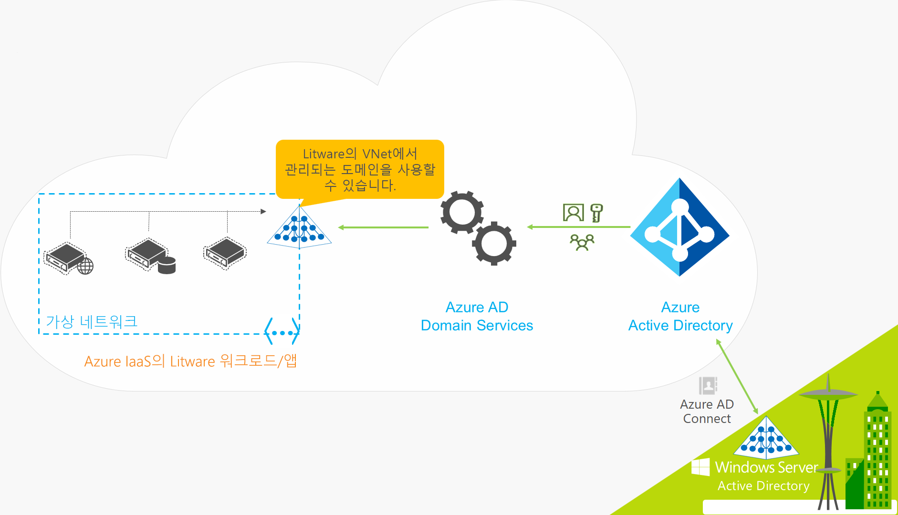
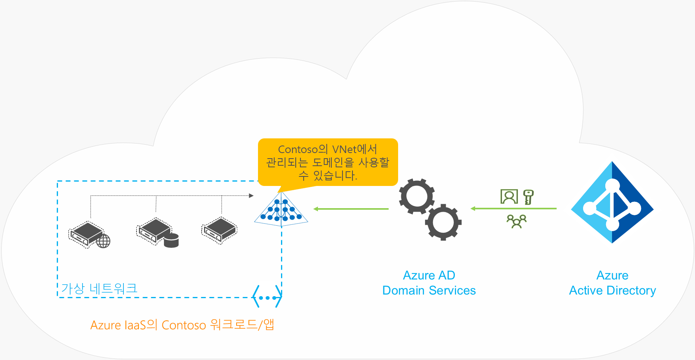

# Azure Active Directory Domain Services란?

Azure AD DS(Azure Active Directory Domain Services)는 Windows Server Active Directory와 완전히 호환되는 도메인 조인, 그룹 정책, LDAP(Lightweight Directory Access Protocol) 및 Kerberos/NTLM 인증과 같은 관리되는 도메인 서비스를 제공합니다. 클라우드에서 도메인 컨트롤러를 배포, 관리 및 패치하지 않고도 이러한 도메인 서비스를 사용합니다. Azure AD DS는 기존 Azure AD 테넌트와 통합되므로 사용자가 기존 자격 증명을 사용하여 로그인할 수 있습니다. 또한 기존 그룹과 사용자 계정을 사용하여 리소스에 대한 액세스를 보호할 수 있으므로 더 원활한 리프트 앤 시프트 방식으로 온-프레미스 리소스를 Azure에 제공합니다.

Azure AD DS는 Azure AD에서 ID 정보를 복제하므로 클라우드 전용이거나 온-프레미스 AD DS(Active Directory Domain Services) 환경과 동기화된 Azure AD 테넌트에서 작동합니다. 두 환경에는 모두 동일한 Azure AD DS 기능 세트가 있습니다.

* 기존 온-프레미스 AD DS 환경이 있으면 사용자 계정 정보를 동기화하여 사용자에게 일관된 ID를 제공할 수 있습니다.
* 클라우드 전용 환경의 경우 기존의 온-프레미스 AD DS 환경은 Azure AD DS의 중앙 집중식 ID 서비스를 사용하는 데 필요하지 않습니다.

다음 비디오에서는 Azure AD DS가 애플리케이션 및 워크로드와 통합되어 클라우드에서 ID 서비스를 제공하는 방법에 대해 간략히 설명합니다.

 

>[!VIDEO https://www.youtube.com/embed/T1Nd9APNceQ]

## 클라우드에서 ID 솔루션을 제공하는 일반적인 방법

기존 워크로드를 클라우드로 마이그레이션하는 경우 디렉터리 인식 애플리케이션에서 온-프레미스 AD DS 디렉터리에 대한 읽기 또는 쓰기 액세스에 LDAP을 사용할 수 있습니다. Windows Server에서 실행되는 애플리케이션은 일반적으로 도메인에 가입된 VM(가상 머신)에 배포되므로 그룹 정책을 사용하여 안전하게 관리할 수 있습니다. 최종 사용자를 인증하기 위해 애플리케이션에서 Kerberos 또는 NTLM 인증과 같은 Windows 통합 인증을 사용할 수도 있습니다.

IT 관리자는 다음 솔루션 중 하나를 사용하여 ID 서비스를 Azure에서 실행되는 애플리케이션에 제공하는 경우가 많습니다.

* Azure에서 실행되는 워크로드와 온-프레미스 AD DS 환경 간에 사이트 간 VPN 연결을 구성합니다.
* AD DS 도메인/포리스트를 확장하기 위해 Azure VM(가상 머신)을 사용하여 복제본 도메인 컨트롤러를 만듭니다.
* Azure VM에서 실행되는 도메인 컨트롤러를 사용하여 Azure에서 독립 실행형 AD DS 환경을 배포합니다.

이러한 방법을 사용하면 온-프레미스 디렉터리에 대한 VPN 연결로 인해 애플리케이션이 일시적인 네트워크 결함 또는 중단에 취약해질 수 있습니다. Azure에서 VM을 사용하여 도메인 컨트롤러를 배포하는 경우 IT 팀의 VM에서 이러한 컨트롤러를 관리, 보안, 패치, 모니터링, 백업 및 문제 해결을 수행해야 합니다.

Azure AD DS는 ID 서비스를 제공하기 위해 온-프레미스 AD DS 환경에 대한 VPN 연결을 다시 만들거나 Azure에서 VM을 실행하고 관리해야 하는 대안을 제공합니다. 관리형 서비스인 Azure AD DS는 하이브리드 환경과 클라우드 전용 환경 모두에 대한 통합 ID 솔루션을 만들 때의 복잡성을 줄입니다.

## Azure AD DS 기능 및 이점

ID 서비스를 클라우드의 애플리케이션 및 VM에 제공하기 위해 Azure AD DS는 도메인 조인, LDAPS(보안 LDAP), 그룹 정책/DNS 관리, LDAP 바인딩 및 읽기 지원과 같은 작업에서 기존 AD DS 환경과 완벽하게 호환됩니다. LDAP 쓰기 지원은 Azure AD DS 관리형 도메인에서 만든 개체에 사용할 수 있지만 Azure AD에서 동기화된 리소스에는 사용할 수 없습니다. 배포 및 관리 작업을 간소화하는 Azure AD DS의 기능은 다음과 같습니다.

* **간소화된 배포 환경:** Azure AD DS는 Azure Portal에서 단일 마법사를 사용하여 Azure AD 테넌트에서 사용하도록 설정됩니다.
* **Azure AD와 통합:** 사용자 계정, 그룹 멤버 자격 및 자격 증명은 Azure AD 테넌트에서 자동으로 사용할 수 있습니다. Azure AD 테넌트 또는 온-프레미스 AD DS 환경에서 새 사용자, 그룹 또는 특성 변경 내용은 Azure AD DS에 자동으로 동기화됩니다.
    * Azure AD에 연결된 외부 디렉터리의 계정은 Azure AD DS에서 사용할 수 없습니다. 이러한 외부 디렉터리에 대해 자격 증명을 사용할 수 없으므로 Azure AD DS 관리형 도메인으로 동기화할 수 없습니다.
* **회사 자격 증명/암호 사용:** Azure AD 테넌트의 사용자 암호는 Azure AD DS에서 동일합니다. 사용자는 회사 자격 증명을 도메인 조인 머신에 사용하고, 대화형으로 또는 원격 데스크톱을 통해 로그인하고, Azure AD DS 관리형 도메인에 대해 인증할 수 있습니다.
* **NTLM 및 Kerberos 인증:** NTLM 및 Kerberos 인증 지원을 사용하면 Windows 통합 인증을 사용하는 애플리케이션을 배포할 수 있습니다.
* **고가용성:** Azure AD DS에는 고가용성을 관리형 도메인에 제공하는 여러 도메인 컨트롤러가 포함되어 있습니다. 이 고가용성은 서비스 가동 시간과 장애 복구를 보장합니다.
    * [Azure 가용성 영역][availability-zones]을 지원하는 지역에서는 이러한 도메인 컨트롤러도 추가 복원력을 위해 영역 간에 분산됩니다. 

Azure AD DS 관리형 도메인의 몇 가지 주요 측면은 다음을 포함합니다.

* Azure AD DS 관리형 도메인은 독립 실행형 도메인이며, 온-프레미스 도메인의 확장이 아닙니다.
* IT 팀은 이 Azure AD DS 관리형 도메인에 대한 도메인 컨트롤러를 관리, 패치 또는 모니터링할 필요가 없습니다.

AD DS를 온-프레미스에서 실행하는 하이브리드 환경의 경우 Azure AD DS 관리형 도메인에 대한 AD 복제를 관리할 필요가 없습니다. 온-프레미스 디렉터리의 사용자 계정, 그룹 멤버 자격 및 자격 증명은 [Azure AD Connect][azure-ad-connect]를 통해 Azure AD에 동기화됩니다. 이러한 사용자 계정, 그룹 멤버 자격 및 자격 증명은 Azure AD DS 관리형 도메인 내에서 자동으로 사용할 수 있습니다.

## Azure AD DS의 작동 방식

ID 서비스를 제공하기 위해 Azure는 선택한 가상 네트워크에서 AD DS 인스턴스를 만듭니다. 관리, 보안 또는 업데이트할 필요 없이 백그라운드에서 Windows Server 도메인 컨트롤러 쌍을 통해 중복성이 제공됩니다.

Azure AD DS 관리형 도메인은 Azure AD에서 단방향 동기화를 수행하여 한 곳의 사용자, 그룹 및 자격 증명 세트에 대한 액세스를 제공하도록 구성되어 있습니다. Azure AD DS 관리형 도메인에서 리소스를 직접 만들 수 있지만 Azure AD에 다시 동기화되지는 않습니다. 그러면 이 가상 네트워크에 연결하는 Azure의 애플리케이션, 서비스 및 VM에서 도메인 조인, 그룹 정책, LDAP 및 Kerberos/NTLM 인증과 같은 일반적인 AD DS 기능을 사용할 수 있습니다.

온-프레미스 AD DS 환경이 포함된 하이브리드 환경에서 [Azure AD Connect][azure-ad-connect]는 ID 정보를 Azure AD와 동기화합니다.

Azure AD DS의 작동 방식을 확인하기 위해 다음 두 가지 예를 살펴보겠습니다.

* [하이브리드 조직을 위한 Azure AD DS](#azure-ad-ds-for-hybrid-organizations)
* [클라우드 전용 조직을 위한 Azure AD DS](#azure-ad-ds-for-cloud-only-organizations)

### 하이브리드 조직을 위한 Azure AD DS

많은 조직에서는 클라우드 및 온-프레미스 애플리케이션 워크로드가 모두 포함된 하이브리드 인프라를 실행합니다. 리프트 및 시프트 전략의 일환으로 Azure로 마이그레이션된 레거시 애플리케이션은 기존 LDAP 연결을 사용하여 ID 정보를 제공할 수 있습니다. 이 하이브리드 인프라를 지원하기 위해 온-프레미스 AD DS 환경의 ID 정보는 Azure AD 테넌트에 동기화될 수 있습니다. 그러면 Azure AD DS에서 온-프레미스 디렉터리 서비스에 대한 애플리케이션 연결을 다시 구성하고 관리할 필요 없이 Azure에서 ID 원본을 이러한 레거시 애플리케이션에 제공합니다.

온-프레미스 리소스와 Azure 리소스를 모두 실행하는 하이브리드 조직인 Litware Corporation의 예를 살펴보겠습니다.

* 도메인 서비스가 필요한 애플리케이션 및 서버 워크로드가 Azure의 가상 네트워크에 배포됩니다.
    * 여기에는 리프트 및 시프트 전략의 일환으로 Azure로 마이그레이션된 레거시 애플리케이션이 포함될 수 있습니다.
* ID 정보를 온-프레미스 디렉터리에서 Azure AD 테넌트로 동기화하기 위해 Litware Corporation에서 [Azure AD Connect][azure-ad-connect]를 배포합니다.
    * 동기화되는 ID 정보에는 사용자 계정 및 그룹 멤버 자격이 포함됩니다.
* Litware의 IT 팀에서 이 가상 네트워크 또는 피어링된 가상 네트워크에서 해당 Azure AD 테넌트에 Azure AD DS를 사용하도록 설정합니다.
* 그러면 Azure 가상 네트워크에 배포된 애플리케이션과 VM에서 도메인 조인, LDAP 읽기, LDAP 바인딩, NTLM/Kerberos 인증 및 그룹 정책과 같은 Azure AD DS 기능을 사용할 수 있습니다.

### 클라우드 전용 조직을 위한 Azure AD DS

클라우드 전용 Azure AD 테넌트에는 온-프레미스 ID 원본이 없습니다. 예를 들어 사용자 계정 및 그룹 멤버 자격은 Azure AD에서 직접 만들고 관리합니다.

이제 ID에만 Azure AD를 사용하는 클라우드 전용 조직인 Contoso의 예를 살펴보겠습니다. 모든 사용자 ID, 해당 자격 증명 및 그룹 멤버 자격은 Azure AD에서 만들고 관리합니다. 온-프레미스에서 ID 정보를 동기화하기 위한 Azure AD Connect의 추가 구성이 없습니다.

* 도메인 서비스가 필요한 애플리케이션 및 서버 워크로드가 Azure의 가상 네트워크에 배포됩니다.
* Contoso의 IT 팀에서 이 가상 네트워크 또는 피어링된 가상 네트워크에서 해당 Azure AD 테넌트에 Azure AD DS를 사용하도록 설정합니다.
* 그러면 Azure 가상 네트워크에 배포된 애플리케이션과 VM에서 도메인 조인, LDAP 읽기, LDAP 바인딩, NTLM/Kerberos 인증 및 그룹 정책과 같은 Azure AD DS 기능을 사용할 수 있습니다.

## 다음 단계

Azure AD DS를 다른 ID 솔루션과 비교하고 동기화가 작동하는 방법에 대해 자세히 알아보려면 다음 문서를 참조하세요.

* [Azure AD DS와 Azure AD, Azure VM의 Active Directory Domain Services 및 온-프레미스 Active Directory Domain Services의 비교][compare]
* [Azure AD Domain Services에서 Azure AD 디렉터리와 동기화하는 방법][synchronization] 알아보기

시작하려면 [Azure Portal을 사용하여 Azure AD DS 관리형 도메인을 만듭니다][tutorial-create].

<!-- INTERNAL LINKS -->
[compare]: compare-identity-solutions.md
[synchronization]: synchronization.md
[tutorial-create]: tutorial-create-instance.md
[azure-ad-connect]: ../active-directory/hybrid/whatis-azure-ad-connect.md
[password-hash-sync]: ../active-directory/hybrid/how-to-connect-password-hash-synchronization.md
[availability-zones]: ../availability-zones/az-overview.md
