<properties
   pageTitle="Microsoft Azure AD Connect - Microsoft Azure AD 동기화 도구(DirSync)에서 업그레이드 | Microsoft Azure"
   description="DirSync에서 Azure AD Connect로 업그레이드하는 방법을 알아봅니다. 이 문서에서는 현재 Microsoft Azure AD 동기화 도구(DirSync)에서 Azure AD Connect로 업그레이드하는 단계를 설명합니다."
   services="active-directory"
   documentationCenter=""
   authors="andkjell"
   manager="stevenpo"
   editor=""/>

<tags
   ms.service="active-directory"
   ms.workload="identity"
   ms.tgt_pltfrm="na"
   ms.devlang="na"
   ms.topic="article"
   ms.date="10/26/2015"
   ms.author="shoatman;billmath"/>

# Microsoft Azure Active Directory 동기화(DirSync)를 Azure Active Directory Connect(Azure AD Connect)로 업그레이드

다음 설명서를 참조하여 기존 DirSync 설치를 Azure AD Connect로 업그레이드할 수 있습니다.

## 관련 설명서
[Azure Active Directory와 온-프레미스 ID 통합](active-directory-aadconnect.md)에 대한 설명서를 읽지 않은 경우 다음 테이블에서 관련 항목에 대한 링크를 제공합니다. DirSync에서 업그레이드를 시작하려면 굵게 표시된 처음 두 항목이 필요합니다.

| 항목 | |
| --------- | --------- |
| **Azure AD Connect 다운로드** | [Azure AD Connect 다운로드](http://go.microsoft.com/fwlink/?LinkId=615771) |
| **하드웨어 및 필수 조건** | [Azure AD Connect: 하드웨어 및 필수 조건](active-directory-aadconnect-prerequisites.md) |
| **설치에 사용되는 계정** | [Azure AD Connect 계정 및 사용 권한에 대한 추가 정보](active-directory-aadconnect-accounts-permissions.md) |

## DirSync에서 업그레이드
현재 DirSync 배포에 따라 업그레이드에 대한 여러 옵션이 있습니다. 예상되는 업그레이드 시간이 3시간 미만인 경우 전체 업그레이드를 수행하는 것이 좋습니다. 예상되는 업그레이드 시간이 3시간 이상인 경우 다른 서버에서 병렬 배포를 수행하는 것이 좋습니다. 50,000개 이상의 개체가 있는 경우 업그레이드를 수행하는 데 3시간 이상이 걸릴 수 있습니다.

| 시나리오 | |
| ---- | ---- |
| [전체 업그레이드](#in-place-upgrade) | 업그레이드가 3시간 미만이 걸릴 것으로 예상되는 경우 기본 설정된 옵션입니다. |
| [병렬 배포](#parallel-deployment) | 업그레이드가 3시간 이상이 걸릴 것으로 예상되는 경우 기본 설정된 옵션입니다. |

>[AZURE.NOTE]DirSync에서 Azure AD Connect로 업그레이드하려는 경우 업그레이드하기 전에 DirSync를 직접 제거하지 마세요. Azure AD Connect는 DirSync에서 구성을 읽고 마이그레이션하며 서버를 검사한 후에 제거합니다.

**전체 업그레이드**

업그레이드를 완료하는 데 예상되는 시간은 마법사에서 표시됩니다. 이 예상치는 50,000개의 개체(사용자, 연락처 및 그룹)를 가진 데이터베이스에 대한 업그레이드를 완료하려면 3시간이 소요된다는 가정에 기반합니다. Azure AD Connect는 현재 DirSync 설정을 분석하고 데이터베이스의 개체 수가 50,000 보다 작은 경우 전체 업그레이드를 권장합니다. 계속하기로 결정한 경우 업그레이드하는 동안 현재 설정을 자동으로 적용하고 서버는 자동으로 활성 동기화를 다시 시작합니다.

구성 마이그레이션을 수행하고 병렬 배포를 수행하려는 경우 전체 업그레이드 권장 사항을 재정의할 수 있습니다. 예를 들어 하드웨어 및 운영 체제를 새로 고칠 수 있는 기회를 얻을 수 있습니다. 자세한 내용은 [병렬 배포](#parallel-deployment) 섹션을 참조하세요.

**병렬 배포**

50,000개 이상의 개체가 있는 경우 병렬 배포를 사용하는 것이 좋습니다. 사용자에게 운영 지연이 발생하지 않도록 합니다. Azure AD Connect 설치는 업그레이드에 대한 가동 중지 시간을 예측하려고 합니다. 하지만 과거에 DirSync를 업그레이드한 적이 있다면 자신만의 경험이 최선의 가이드일 수 있습니다.

### 업그레이드될 지원되는 DirSync 구성
다음 구성 변경은 DirSync로 지원되고 업그레이드됩니다.

- 도메인 및 OU 필터링
- 대체 ID(UPN)
- 암호 동기화 및 Exchange 하이브리드 설정
- 포리스트/도메인 및 Azure AD 설정

다음의 변경 내용은 업그레이드될 수 없습니다. 이러한 변경을 수행한 경우 업그레이드가 차단됩니다. 이러한 경우 새 Azure AD Connect 서버를 [준비 모드](active-directory-aadconnectsync-operations.md#staging-mode)에 설치하는 것이 좋으며 이전 DirSync 및 새 Azure AD Connect 구성을 확인합니다.

- 지원되지 않는 DirSync 변경 내용, 예: 제거된 특성 및 사용자 지정 확장 DLL 사용
- 사용자 특성에 기반하여 필터링

서비스 계정에 DirSync에서 사용한 암호는 검색할 수 없고 마이그레이션되지 않습니다. 이러한 암호는 업그레이드하는 동안 다시 설정됩니다.

### DirSync에서 Azure AD Connect로 업그레이드하기 위한 대략적인 단계

1. Azure AD Connect 시작
2. 현재 DirSync 구성 분석
3. Azure AD 전역 관리자 암호 수집
4. 엔터프라이즈 관리자 계정에 대한 자격 증명 수집(Azure AD Connect 설치 도중에만 사용됨)
5. Azure AD Connect 설치
    * DirSync 제거
	* Azure AD Connect 설치
	* (선택 사항) 동기화 시작

다음과 같은 경우에 추가 단계가 필요합니다.

* 현재 로컬 또는 원격으로 전체 SQL Server를 사용 중임
* 동기화 범위에 50,000개가 넘는 개체가 있음

## 전체 업그레이드

1. Azure AD Connect 설치 관리자(MSI) 시작
2. 사용 조건 및 개인 정보 알림을 검토하고 동의합니다. 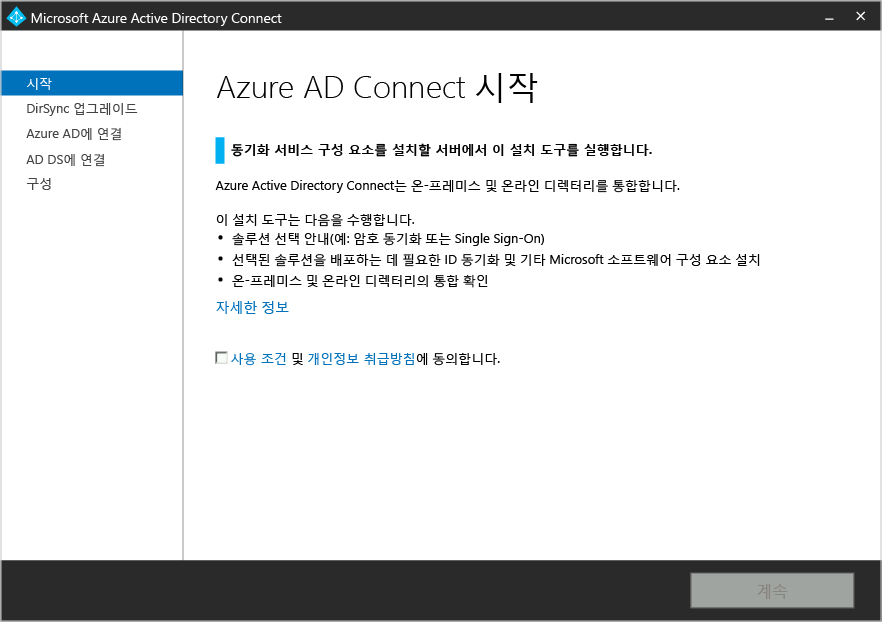
3. 다음을 클릭하여 기존 DirSync 설치를 분석을 시작합니다. 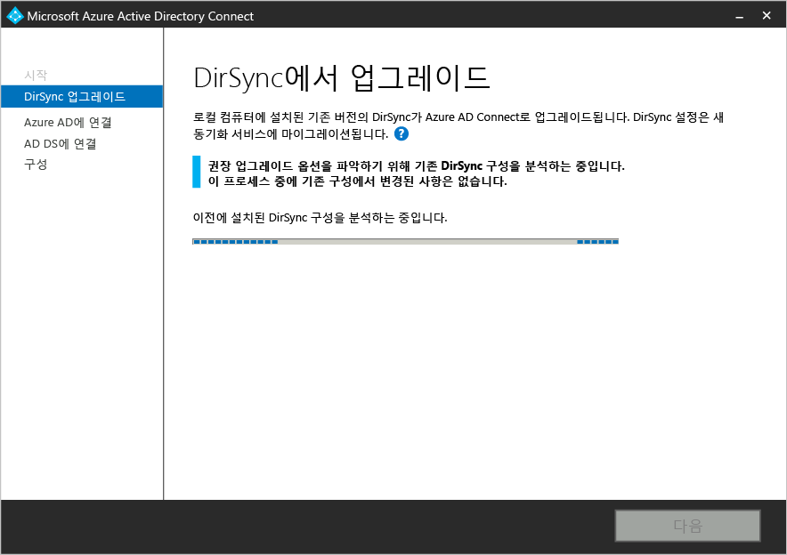
4. 분석이 완료되면 진행 방법에 대해 권장 사항을 안내합니다.  
    - SQL Server Express를 사용하고 50,000개 미만의 개체가 있는 경우 다음과 같은 화면이 표시됩니다. 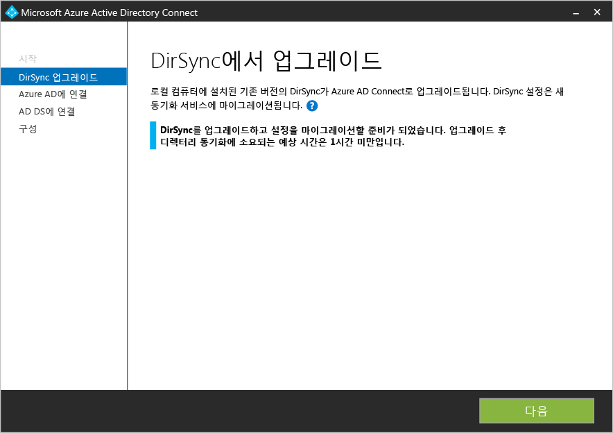
    - DirSync에 SQL Server를 사용하는 경우 대신 이 페이지를 참조합니다. 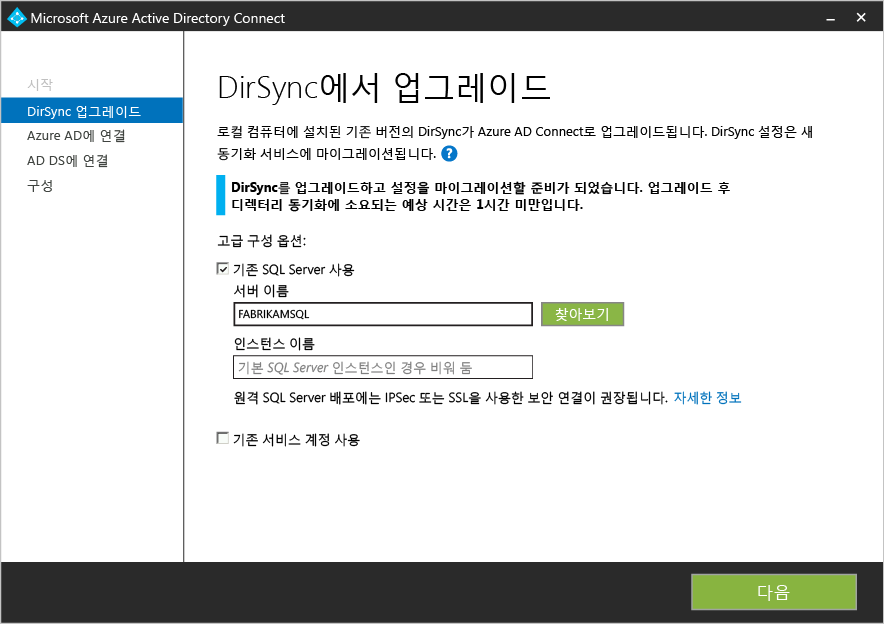  DirSync에 의해 사용 중인 기존 SQL Server 데이터베이스 서버에 대한 정보가 표시됩니다. 필요한 경우 적절하게 조정합니다. **다음**을 클릭하여 계속 설치합니다.
    - 50,000개 이상의 개체가 있는 경우 다음 화면이 대신 표시됩니다. 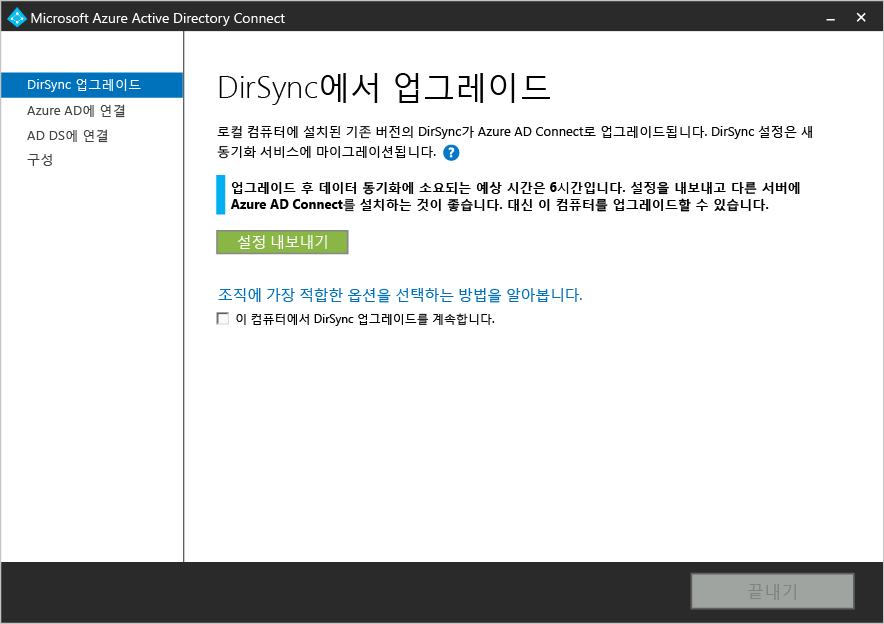  현재 위치 업그레이드를 진행하려면 **이 컴퓨터에서 계속 DirSync 업그레이드** 메시지 옆에 있는 확인란을 클릭합니다. 대신 [병렬 배포](#parallel-deployment)를 수행하려면 DirSync 구성 설정을 내보내고 해당 사항을 새 서버로 이동합니다.
5. Azure AD에 연결하는 데 현재 사용하는 계정의 암호를 제공합니다. DirSync에서 현재 사용한 계정이어야 합니다. 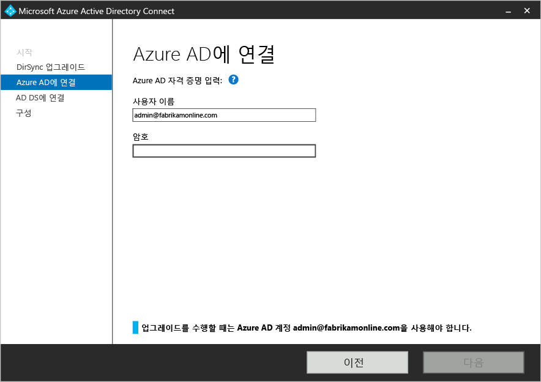
6. Active Directory에 대한 엔터프라이즈 관리자 계정을 제공합니다. 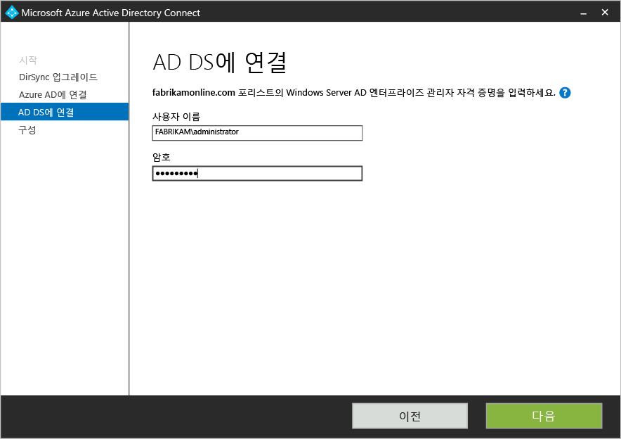
7. 이제 구성할 준비가 되었습니다. **업그레이드**를 클릭하면 DirSync가 제거되고 Azure AD Connect가 구성되어 동기화를 시작합니다. 

## 병렬 배포

### DirSync 구성 내보내기
**50,000개 이상의 개체를 가진 병렬 배포**

개체가 50,000개를 넘는 경우 Azure AD Connect 설치 시 병렬 배포가 권장됩니다.

다음과 비슷한 화면이 표시됩니다.

병렬 배포를 진행하려는 경우 다음 단계를 수행해야 합니다.

- **설정 내보내기** 단추를 클릭합니다. 별도 서버에 Azure AD Connect를 설치하면 이 설정을 가져와 현재 DirSync에서 새 Azure AD Connect 설치로 설정이 마이그레이션됩니다.

설정을 성공적으로 내보내고 나면 DirSync 서버에서 Azure AD Connect 마법사를 종료할 수 있습니다. 다음 단계를 계속하여 [별도 서버에 Azure AD Connect 설치](#installation-of-azure-ad-connect-on-separate-server)

**50,000개 미만의 개체를 가진 병렬 배포**

50,000개 미만의 개체가 있지만 병렬 배포를 하려는 경우 다음을 수행합니다.

1. Azure AD Connect 설치 관리자(MSI)를 실행합니다.
2. **Azure AD Connect 시작** 화면이 표시되면 창 오른쪽 위 모서리에서 "X"를 클릭하여 설치 마법사를 종료합니다.
3. 명령 프롬프트를 엽니다.
4. Azure AD Connect 위치에서(기본값: C:\\Program Files\\Microsoft Azure Active Directory Connect) 다음 명령을 실행합니다. `AzureADConnect.exe /ForceExport`
5. **설정 내보내기** 단추를 클릭합니다. 별도 서버에 Azure AD Connect를 설치하면 이 설정을 가져와 현재 DirSync에서 새 Azure AD Connect 설치로 설정이 마이그레이션됩니다.

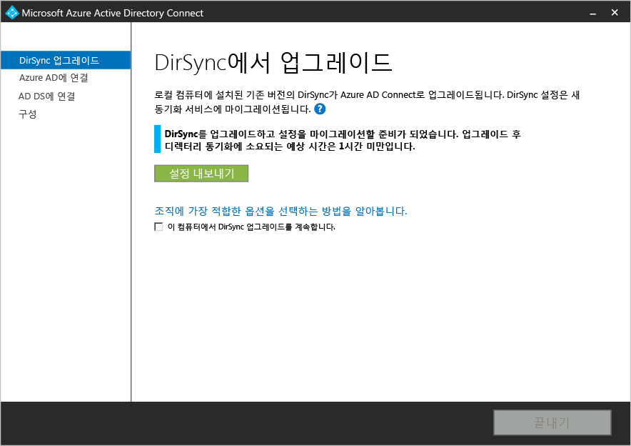

설정을 성공적으로 내보내고 나면 DirSync 서버에서 Azure AD Connect 마법사를 종료할 수 있습니다. 다음 단계를 계속하여 [별도 서버에 Azure AD Connect 설치](#installation-of-azure-ad-connect-on-separate-server)

### 별도 서버에 Azure AD Connect 설치

새 서버에 Azure AD Connect를 설치할 때 Azure AD Connect 새로 설치를 수행한다고 가정합니다. DirSync 구성을 사용하려면 수행해야 할 몇 가지 추가 단계가 있습니다.

1. Azure AD Connect 설치 관리자(MSI)를 실행합니다.
2. **Azure AD Connect 시작** 화면이 표시되면 창 오른쪽 위 모서리에서 "X"를 클릭하여 설치 마법사를 종료합니다.
3. 명령 프롬프트를 엽니다.
4. Azure AD Connect 위치에서(기본값: C:\\Program Files\\Microsoft Azure Active Directory Connect) 다음 명령을 실행합니다. `AzureADConnect.exe /migrate` Azure AD Connect 설치 마법사가 시작되면 다음 화면을 표시합니다. 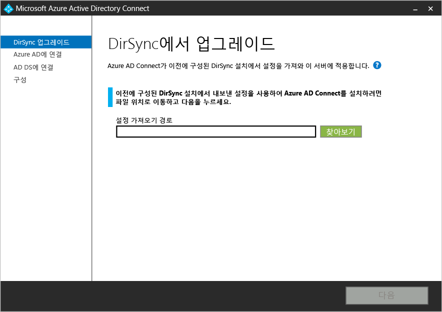
5. DirSync 설치에서 내보낸 설정 파일을 선택합니다.
6. 다음을 포함한 고급 옵션을 구성합니다.
    - Azure AD Connect에 대한 사용자 지정 설치 위치
	- 기존 SQL Server 인스턴스(기본값: Azure AD Connect는 SQL Server 2012 Express를 설치함) DirSync 서버와 동일한 데이터베이스 인스턴스를 사용하지 마세요.
	- SQL Server에 연결하는 데 사용되는 서비스 계정(SQL Server 데이터베이스가 원격인 경우에는 이 계정이 도메인 서비스 계정이어야 함) 이러한 옵션은 이 화면에서 볼 수 있습니다. 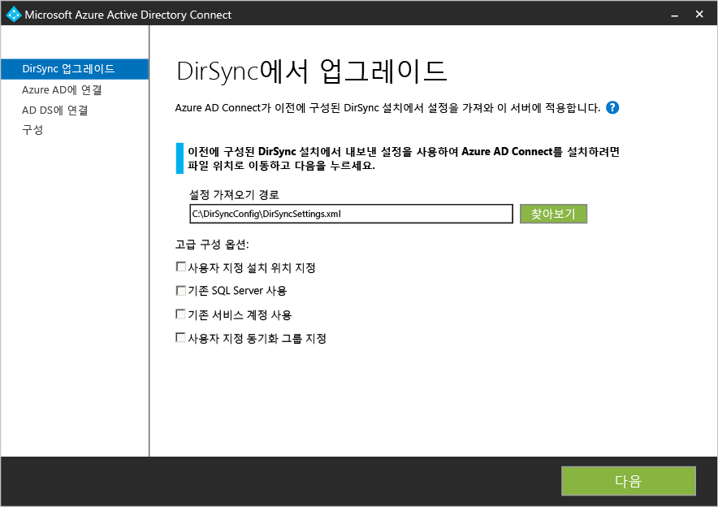
7. **다음**을 클릭합니다.
8. **구성 준비 완료** 페이지에서 **구성이 완료되자마자 동기화 프로세스를 시작합니다**를 선택한 상태로 둡니다. 서버가 [준비 모드](active-directory-aadconnectsync-operations.md#staging-mode)이므로 이번에는 변경 내용을 Azure AD로 내보내지 않습니다.
9. **Install**을 클릭합니다.

>[AZURE.NOTE]Windows Server Active Directory와 Azure Active Directory 간의 동기화가 시작되지만 Azure AD로 내보내는 변경 내용은 없습니다. 하나의 동기화 도구만이 변경 내용을 한 번에 내보낼 수 있습니다. [준비 모드](active-directory-aadconnectsync-operations.md#staging-mode)라고 합니다.

### Azure AD Connect가 동기화를 시작할 준비가 되었는지 확인

Azure AD Connect가 DirSync로부터 인수할 준비가 되었는지 확인하기 위해 시작 메뉴에서 **Azure AD Connect** 그룹의 **Synchronization Service Manager**를 열어야 합니다.

응용 프로그램 내에서 **작업** 탭을 확인해야 합니다. 이 탭에서 원하는 다음 작업이 완료되었는지 확인합니다.

- AD 커넥터에 가져오기
- Azure AD 커넥터에 가져오기
- AD 커넥터에 전체 동기화
- Azure AD 커넥터에 전체 동기화

이러한 작업에서 결과를 검토하고 오류가 없는지 확인합니다.

어떤 변경 내용이 Azure AD로 내보내지는지 확인하고 검사하려는 경우 [준비 모드](active-directory-aadconnectsync-operations.md#staging-mode)에서 구성을 확인하는 방법을 읽습니다. 예상하지 못한 것이 나타나지 않을 때까지 필요한 구성을 변경합니다.

이러한 4개의 작업이 완료되면 오류가 발생하지 않으며 내보낼 변경 내용에 만족하고 DirSync를 제거하며 Azure AD Connect 동기화를 사용할 준비가 됩니다. 다음 두 단계를 완료하여 마이그레이션을 완료합니다.

### DirSync 제거(이전 서버)

- **프로그램 및 기능**에서 **Microsoft Azure Active Directory 동기화 도구** 찾기
- **Microsoft Azure Active Directory 동기화 도구** 제거
- 제거를 완료하는 데 최대 15분이 걸릴 수 있습니다.

DirSync를 제거하면 Azure AD로 내보내는 활성 서버는 없습니다. Azure AD로 동기화할 온-프레미스 Active Directory의 변경 내용을 계속하기 전에 다음 단계를 완료해야 합니다.

### Azure AD Connect 사용(새 서버)
설치 후 Azure AD Connect를 다시 열면 추가적으로 구성을 변경할 수 있습니다. 시작 메뉴 또는 바탕 화면의 바로 가기에서 **Azure AD Connect**를 시작합니다. 다시 설치 MSI를 실행하지 않도록 합니다.

다음이 표시되어야 합니다.

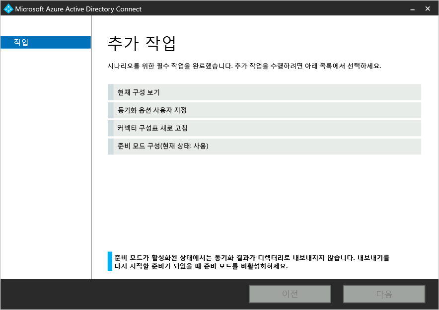

- **준비 모드 구성**을 선택합니다.
- **준비 모드 사용** 확인란의 선택을 취소하여 준비를 해제합니다.

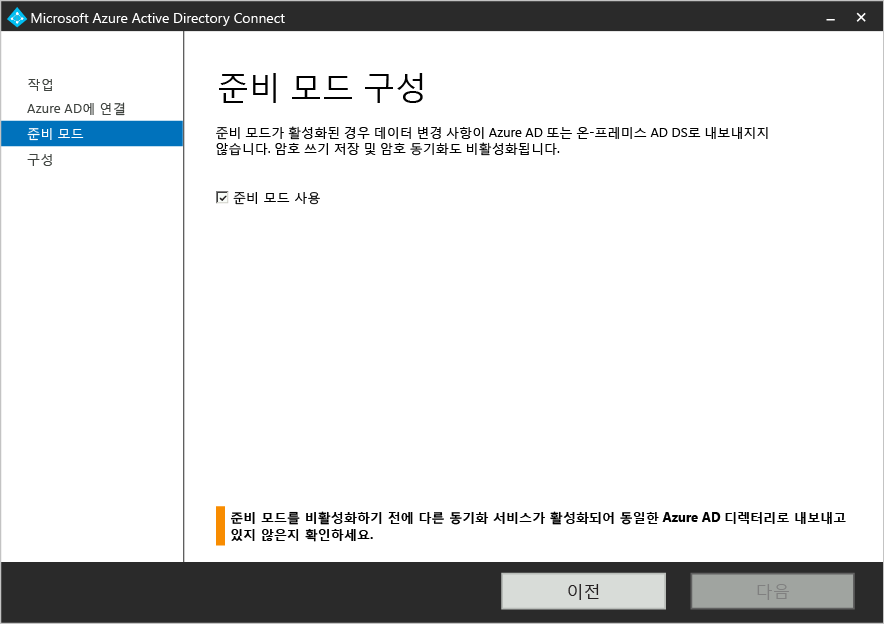

- **다음** 단추를 클릭합니다.
- 확인 페이지에서 **설치** 단추를 클릭합니다.

Azure AD Connect는 활성 서버에 있습니다.

## 다음 단계
Azure AD Connect를 설치했으므로 [설치를 확인하고 라이선스를 할당](active-directory-aadconnect-whats-next.md)할 수 있습니다.

[Azure Active Directory와 온-프레미스 ID 통합](active-directory-aadconnect.md)에 대해 자세히 알아봅니다.

<!---HONumber=Nov15_HO1-->