<properties
	pageTitle="Azure AD Connect: 사용자 지정 설치 | Microsoft Azure"
	description="이 문서는 Azure AD Connect에 대한 사용자 지정 설치 옵션에 대해 자세히 설명합니다. Azure AD Connect를 통해 Active Directory를 설치하려면 다음 지침을 사용합니다."
	services="active-directory"
    keywords="Azure AD Connect의 정의, Active Directory 설치, Azure AD에 대한 필수 구성 요소"
	documentationCenter=""
	authors="billmath"
	manager="stevenpo"
	editor="curtand"/>

<tags
	ms.service="active-directory"  
	ms.workload="identity"
	ms.tgt_pltfrm="na"
	ms.devlang="na"
	ms.topic="get-started-article"
	ms.date="02/18/2016"
	ms.author="billmath;andkjell"/>

# Azure AD Connect의 사용자 지정 설치
다음 설명서는 Azure AD Connect에 대한 사용자 지정 설치 옵션을 사용하여 정보를 제공합니다. 추가 구성 옵션이 있거나 빠른 설치에서 해결되지 않은 선택적 기능이 필요한 경우 이 옵션을 사용할 수 있습니다.

## 관련 설명서
[Azure Active Directory와 온-프레미스 ID 통합](active-directory-aadconnect.md)에 대한 설명서를 읽지 않은 경우 다음 테이블에서 관련 항목에 대한 링크를 제공합니다. 설치를 시작하려면 굵게 표시된 처음 세 항목이 필요합니다.

| 항목 | |
| --------- | --------- |
| **Azure AD Connect 다운로드** | [Azure AD Connect 다운로드](http://go.microsoft.com/fwlink/?LinkId=615771) |
| **하드웨어 및 필수 조건** | [Azure AD Connect: 하드웨어 및 필수 조건](active-directory-aadconnect-prerequisites.md) |
| **설치에 사용되는 계정** | [Azure AD Connect 계정 및 사용 권한](active-directory-aadconnect-accounts-permissions.md) |
| Express 설정을 사용하여 설치 | [Azure AD Connect의 빠른 설치](active-directory-aadconnect-get-started-express.md) |
| DirSync에서 업그레이드 | [Azure AD Sync 도구(DirSync)에서 업그레이드](active-directory-aadconnect-dirsync-upgrade-get-started.md) |
| 설치 후 | [설치 확인 및 라이선스 할당](active-directory-aadconnect-whats-next.md) |

## 필요한 구성 요소 설치
동기화 서비스를 설치할 때는 선택적 구성 섹션을 선택 취소된 채로 두면 됩니다. 그러면 Azure AD Connect에서 모든 사항이 자동 설정됩니다. SQL Server 2012 Express LocalDB 인스턴스 설정, 적절한 그룹 만들기, 그룹에 권한 할당 등이 포함됩니다. 기본값을 변경하려는 경우 다음 테이블을 참조하여 사용할 수 있는 선택적 구성 옵션을 이해할 수 있습니다.

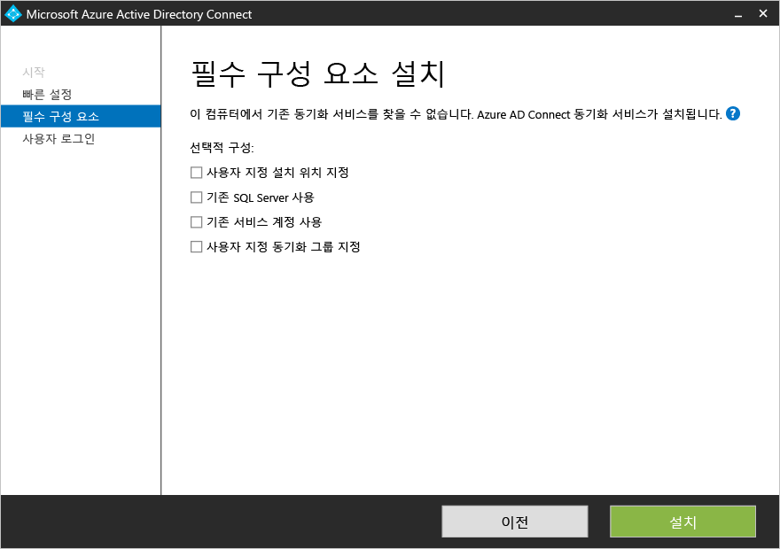

| 선택적 구성 | 설명 |
| ------------- | ------------- |
| 기존 SQL Server 사용 | SQL Server 이름 및 인스턴스 이름을 지정할 수 있습니다. 사용하려는 데이터베이스 서버가 이미 있는 경우 이 옵션을 선택합니다. SQL Server에 검색이 사용하도록 설정되어 있지 않고 포트 번호를 지정해야 하는 경우 **인스턴스 이름** 상자에 인스턴스 이름을 입력하고 그 뒤에 쉼표와 포트 번호를 입력합니다. |
| 기존 서비스 계정 사용 | 기본적으로 Azure AD Connect는 사용할 동기화 서비스에 대한 로컬 서비스 계정을 만듭니다. 암호가 자동으로 생성되어 Azure AD Connect를 설치하는 사람이 암호를 알 수 없습니다. 원격 SQL server를 사용하는 경우 도메인에서 서비스 계정이 필요하고 암호를 알아야 합니다. 이러한 경우에 사용할 서비스 계정을 입력합니다. 설치를 실행하는 사용자가 SQL에서 SA이므로 서비스 계정에 대한 로그인을 만들 수 있도록 합니다. [Azure AD Connect 계정 및 사용 권한](active-directory-aadconnect-accounts-permissions.md#custom-settings-installation)을 참조하세요. |
| 사용자 지정 동기화 그룹 지정 | 동기화 서비스가 설치되면 기본적으로 Azure AD Connect에서는 서버에 대해 4개의 그룹 로컬을 만듭니다. 이 그룹은 Administrators 그룹, Operators 그룹, Browse 그룹, Password Reset 그룹입니다. 고유한 그룹을 지정하려면 여기서 지정하면 됩니다. 그룹은 서버에서 로컬이어야 하며 도메인에서 찾을 수 없습니다. |

## 사용자 로그인
필수 구성 요소를 설치한 후 사용자가 SSO 메서드를 사용하는 방법을 지정해야 합니다. 다음 테이블에서 사용 가능한 옵션에 대한 간략한 설명을 제공합니다. 로그인 메서드에 대한 전체 설명은 [사용자 로그인](active-directory-aadconnect-user-signin.md)을 참조하세요.

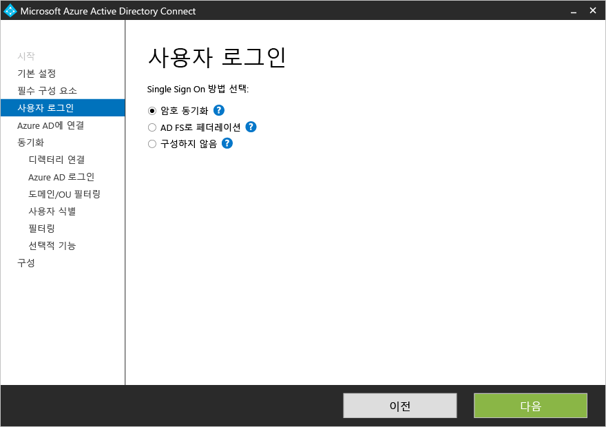

SSO(Single Sign-On) 옵션 | 설명
------------- | ------------- |
암호 동기화 |사용자는 온-프레미스 네트워크에 로그인하는 데 사용하는 것과 동일한 암호를 사용하여 Office 365, Dynamics CRM 및 Windows InTune과 같은 Microsoft 클라우드 서비스에 로그인할 수 있습니다. 사용자의 암호는 암호 해시를 통해 Azure에 동기화되며 인증이 클라우드에서 발생합니다. 자세한 내용은 [암호 동기화](active-directory-aadconnectsync-implement-password-synchronization.md)를 참조하세요.
AD FS로 페더레이션|사용자는 온-프레미스 네트워크에 로그인하는 데 사용하는 것과 동일한 암호를 사용하여 Office 365, Dynamics CRM 및 Windows InTune과 같은 Microsoft 클라우드 서비스에 로그인할 수 있습니다. 사용자는 로그인하기 위해 해당 온-프레미스 AD FS 인스턴스로 리디렉션되며 인증은 온-프레미스에서 수행됩니다.
구성하지 않음| 설치되어 구성된 기능이 없습니다. 이미 타사 페더레이션 서버 또는 다른 기존 솔루션이 있는 경우 이 옵션을 선택합니다.

## Azure에 연결
Azure AD에 연결 화면에서, 전역 관리자 계정 및 암호를 입력합니다. 이전 페이지에서 **AD FS로 페더레이션**을 선택한 경우 페더레이션에 사용하도록 설정하려는 도메인의 계정을 사용하여 로그인하지 않도록 합니다. Azure AD 디렉터리와 함께 제공되는 기본 **onmicrosoft.com** 도메인에서 계정을 사용하는 것이 좋습니다.

이 계정은 Azure AD에서 서비스 계정을 만드는 데에만 사용되며 마법사를 완료한 후에는 사용되지 않습니다. 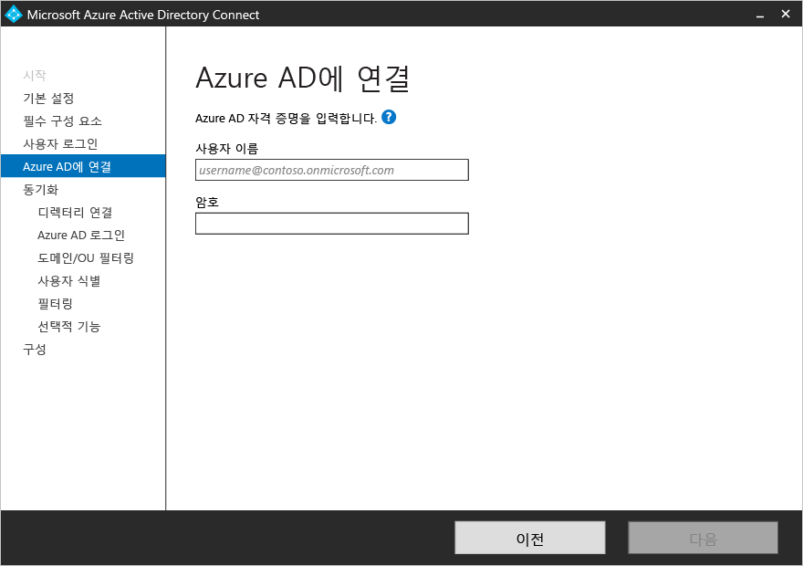

전역 관리자 계정이 MFA를 사용하도록 설정하면 로그인 팝업에서 다시 암호를 제공하고 확인 코드를 제공하는 등 MFA 챌린지를 완료해야 합니다. 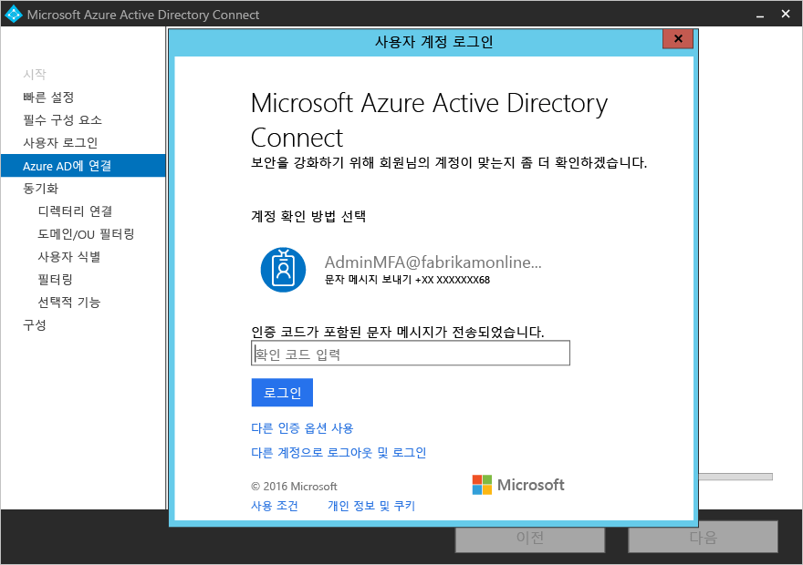

또한 전역 관리자 계정은 [Privileged Identity Management](active-directory-privileged-identity-management-getting-started.md)를 사용하도록 설정할 수 있습니다.

오류가 발생하고 연결에 문제가 있는 경우 [연결 문제 해결](active-directory-aadconnect-troubleshoot-connectivity.md)을 참조하세요.

## 섹션 동기화의 페이지

### 디렉터리에 연결
Active Directory 도메인 서비스에 연결하려면, Azure AD Connect는 충분한 권한이 있는 계정의 자격 증명이 필요합니다. 기본 읽기 권한만 필요하기 때문에 이 계정은 일반 사용자 계정일 수 있습니다. 그러나 시나리오에 따라 추가 권한이 필요할 수 있습니다. 자세한 내용은 [Azure AD Connect 계정 및 사용 권한](active-directory-aadconnect-accounts-permissions.md#create-the-ad-ds-account)을 참조하세요.

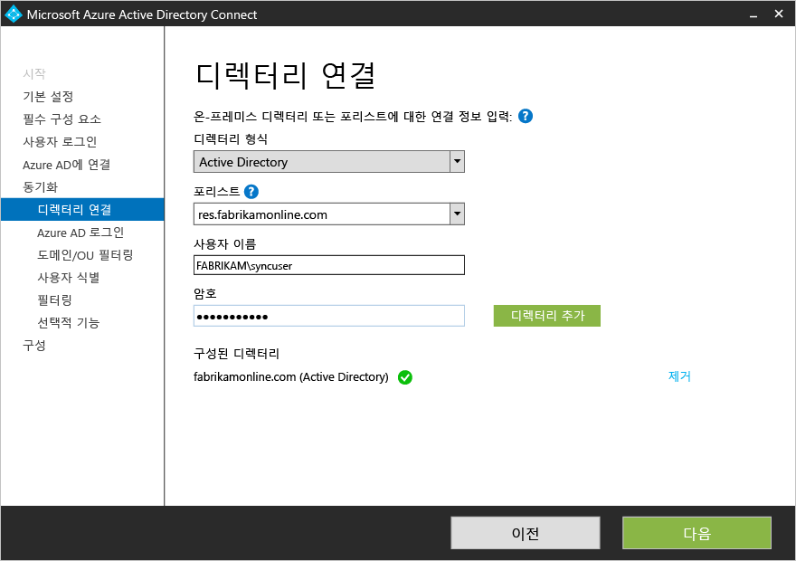

### 도메인 및 OU 필터링
기본적으로 모든 도메인 및 OU가 동기화됩니다. Azure AD로 동기화하지 않으려는 일부 도메인 또는 OU가 있는 경우 이러한 도메인 및 OU의 선택을 취소할 수 있습니다. 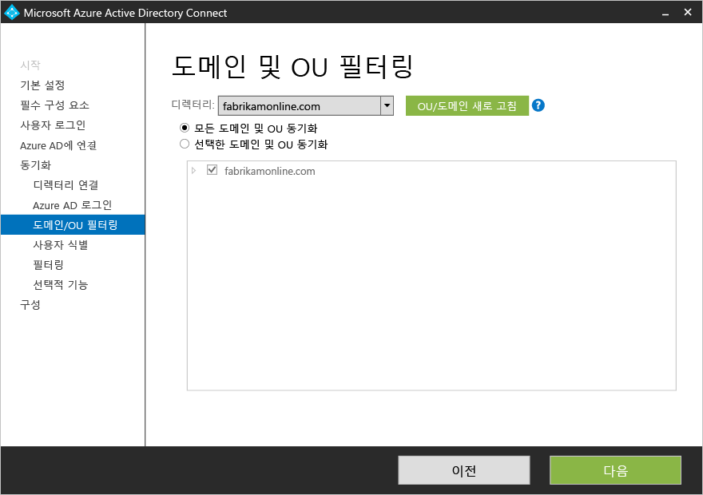 또한 [도메인 기반 필터링](active-directory-aadconnectsync-configure-filtering.md#domain-based-filtering)에서 문서화된 것 처럼 마법사의 이 페이지에서 도메인 기반 필터링을 구성합니다.

일부 도메인은 방화벽 제한으로 인해 연결할 수 없을 수도 있습니다. 이러한 도메인은 기본적으로 선택이 취소되고 경고를 발생시킵니다. 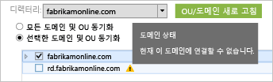 이를 확인하는 경우 이러한 도메인이 실제로 연결할 수 없고 정상적인 동작인지 확인합니다.

### 사용자를 고유하게 식별
포리스트 기능 간에 일치를 사용하여 AD DS 포리스트의 사용자가 Azure AD에서 표현되는 방법을 정의할 수 있습니다. 사용자는 포리스트 전반에 걸쳐 한번만 표시할 수 있거나 활성화된 계정과 비활성화된 계정의 조합으로 이루어집니다.

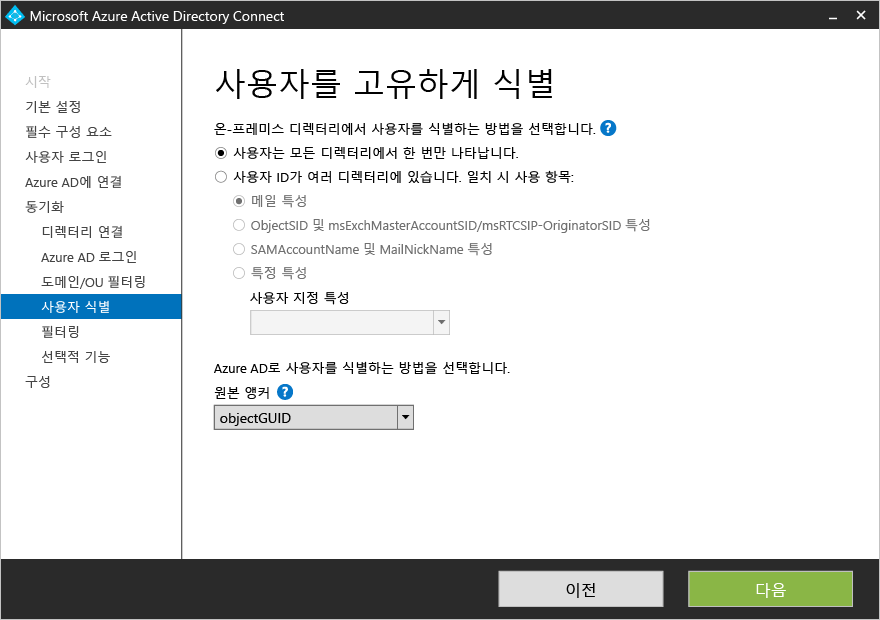

설정 | 설명
------------- | ------------- |
[사용자는 모든 포리스트에 걸쳐 한번만 표시됩니다](active-directory-aadconnect-topologies.md#multiple-forests-separate-topologies) | 모든 사용자는 Azure AD에 개별 개체로 만들어집니다.  개체는 메타 버스에 연결되지 않습니다.
[Mail 특성](active-directory-aadconnect-topologies.md#multiple-forests-full-mesh-with-optional-galsync) | 메일 특성에 다른 포리스트의 동일한 값이 있는 경우 이 옵션은 사용자 및 연락처를 연결합니다. 연락처가 GALSync를 사용하여 만들어진 경우 이 옵션을 사용하는 것이 좋습니다.
[ObjectSID 및 msExchangeMasterAccountSID/ msRTCSIP-OriginatorSid](active-directory-aadconnect-topologies.md#multiple-forests-account-resource-forest)|이 옵션은 계정 포리스트에서 활성화된 사용자와 Exchange 리소스 포리스트의 비활성화된 사용자를 연결합니다. Exchange에서 연결된 사서함이라고도 합니다. 이 옵션은 Lync만 사용하며 Exchange는 리소스 포리스트에 없는 경우에도 사용할 수 있습니다.
sAMAccountName 및 MailNickName|이 옵션은 사용자에 대한 로그인 ID를 찾을 수 있을 것으로 예상되는 특성에 조인합니다.
특정 특성|이 옵션을 사용하면 고유한 특성을 선택할 수 있습니다. **제한:** 메타버스에 이미 존재하는 특성을 선택할 수 있는지 확인합니다. (메타버스가 아닌 곳에서)사용자 지정 특성을 선택하면 마법사를 완료할 수 없습니다.

- **소스 앵커** -특성 sourceAnchor는 사용자 개체의 수명 동안 변경할 수 없는 특성입니다. Azure AD에서 사용자와 온-프레미스 사용자를 연결하는 기본 키입니다. 특성을 변경할 수 없으므로, 좋은 특성을 사용해야 합니다. 좋은 후보는 objectGUID입니다. 사용자 계정이 포리스트/도메인 간에 이동하지 않는 한 이 특성은 변경되지 않습니다. 포리스트 간에 계정을 이동하는 다중 포리스트 환경에서 employeeID가 있는 특성과 같은 다른 특성이 사용되어야 합니다. 피해야 할 특성은 결혼하거나 약속을 변경한 경우 변경되는 특성입니다. @ 기호와 함께 특성을 사용할 수 없으므로 메일 및 userPrincipalName을 사용할 수 없습니다. 특성은 대/소문자를 구분하므로 포리스트 간에 개체를 이동하는 경우 대/소문자를 유지해야 합니다. 이진 특성의 경우 값은 base64로 인코딩되지만 다른 특성 유형의 경우 인코딩되지 않은 상태로 유지됩니다. 페더레이션 시나리오 및 일부 Azure AD 인터페이스에서 이 특성은 immutableID라고도 합니다. 원본 앵커에 대한 자세한 정보는 [디자인 개념](active-directory-aadconnect-design-concepts.md#sourceAnchor)에서 찾을 수 있습니다.

- **UserPrincipalName** - 특성 userPrincipalName은 Azure AD 및 Office 365에 로그인할 때 사용자가 사용하는 특성입니다. UPN-접미사로 알려진 사용된 도메인은 사용자가 동기화되기 전에 Azure AD에서 확인해야 합니다. 기본 특성 userPrincipalName을 유지하는 것이 좋습니다. 이 특성은 라우팅할 수 없고 확인할 수 없으며 전자 메일의 경우 로그인 ID를 보유하는 특성으로 다른 특성을 선택할 수 없습니다. **대체 ID**로도 알려져 있습니다. 대체 ID 특성 값은 RFC822 표준을 따라야 합니다. 대체 ID는 로그인 솔루션으로 암호 Single Sign-On(SSO) 및 페더레이션 SSO 모두를 함께 사용할 수 있습니다.

>[AZURE.WARNING] 대체 ID를 사용하면 모든 Office 365 워크로드 부하와 호환되지 않습니다. 자세한 내용은 [대체 로그인 ID 구성](https://technet.microsoft.com/library/dn659436.aspx)을 참조하세요.

### 그룹에 따라 동기화 필터링
그룹 기능에 대한 필터링을 사용하면 Azure AD 및 Office 365에 개체의 작은 하위 집합만 만들어야 하는 작은 파일럿을 실행할 수 있습니다. 이 기능을 사용하려면, 온-프레미스 Active Directory에서 그룹을 만들고 직접 구성원으로 Azure AD와 동기화되어야 하는 사용자 및 그룹을 추가합니다. 나중에 사용자를 이 그룹에 추가하고 제거하여 Azure AD에 있어야 하는 개체의 목록을 유지할 수 있습니다. 동기화하려는 모든 개체는 그룹의 직접 구성원이어야 합니다. 여기에는 사용자, 그룹, 연락처 및 컴퓨터/장치가 포함됩니다. 중첩된 그룹의 구성원을 확인할 수 없습니다. 그룹 구성원은 그룹 자체만 포함하고 해당 구성원은 포함하지 않습니다.

이 기능을 사용하려면 사용자 지정된 경로에 다음 페이지가 표시됩니다. 

>[AZURE.WARNING] 이 기능은 파일럿 배포를 지원하기 위한 것이며 전체 프로덕션 배포에 사용할 수 없습니다.

전체 프로덕션 배포에서 동기화할 모든 개체를 단일 그룹으로 유지하기는 어렵습니다. 대신 [구성 필터링](active-directory-aadconnectsync-configure-filtering.md)의 방법 중 하나를 사용합니다.

### 선택적 기능
이 화면을 사용하면 특정 시나리오에 대 한 선택적 기능을 선택할 수 있습니다. 다음은 각각의 개별 기능에 대해 간략히 설명합니다.

> [AZURE.WARNING] 현재 디렉터리 동기화 또는 Azure AD Sync가 활성화되어 있는 경우 Azure AD Connect에서 쓰기 저장 기능을 활성화하지 마세요.

선택적 기능 | 설명
-------------------    | ------------- |
Exchange 하이브리드 배포 |Exchange 하이브리드 배포 기능을 사용하면 Azure AD에서 특정 [특성](active-directory-aadconnectsync-attributes-synchronized.md#exchange-hybrid-writeback) 집합을 온-프레미스 디렉터리에 다시 동기화하여 Exchange 사서함이 온-프레미스와 Office 365에서 공존할 수 있습니다.
Azure AD 앱 및 특성 필터링|Azure AD 앱 및 특성 필터링을 사용하도록 설정하면 동기화된 특성 집합을 마법사의 후속 페이지에 나오는 특정 집합에 맞게 지정할 수 있습니다. 마법사에서 두 개의 추가 구성 페이지가 열립니다. 자세한 내용은 [Azure AD 앱 및 특성 필터링](#azure-ad-app-and-attribute-filtering)을 참조하세요.
암호 동기화 | 페더레이션을 로그인 솔루션으로 선택한 경우 이 옵션을 사용할 수 있습니다. 암호 동기화는 백업 옵션으로 사용할 수 있습니다. 자세한 내용은 [암호 동기화](active-directory-aadconnectsync-implement-password-synchronization.md)를 참조하세요.
암호 쓰기 저장|암호 쓰기 저장을 사용하도록 설정하면 Azure AD에서 이루어지는 암호 변경 사항이 온-프레미스 디렉터리에 다시 기록됩니다. 추가 정보는 [암호 관리 시작](active-directory-passwords-getting-started.md)을 참조하세요.
그룹 쓰기 저장 |**Office 365 그룹** 기능을 사용하는 경우 온-프레미스 Active Directory에서 이러한 그룹을 분포 그룹으로 사용할 수 있습니다. 이 옵션은 Exchange가 온-프레미스 Active Directory에 있는 경우 사용할 수 있습니다. 추가 정보는 [그룹 쓰기 저장](active-directory-aadconnect-feature-preview.md#group-writeback)을 참조하세요.
장치 쓰기 저장 | Azure AD의 장치 개체를 조건부 액세스 시나리오에 대한 온-프레미스 Active Directory에 쓰기 저장할 수 있습니다. 자세한 내용은 [Azure AD Connect에서 장치 쓰기 저장 사용](active-directory-aadconnect-feature-device-writeback.md)을 참조하세요.
디렉터리 확장 특성 동기화|디렉터리 확장 특성 동기화를 사용하도록 설정하면 지정된 추가 특성이 Azure AD에 동기화됩니다. 추가 정보는 [디렉터리 확장](active-directory-aadconnectsync-feature-directory-extensions.md)을 참조하세요.

### Azure AD 앱 및 특성 필터링
Azure AD로 동기화를 시작할 특성을 제한하려면 사용 중인 서비스를 선택하여 시작합니다. 해당 페이지를 구성하려면 다시 설치 마법사를 실행하여 명시적으로 새 서비스를 선택해야 합니다.

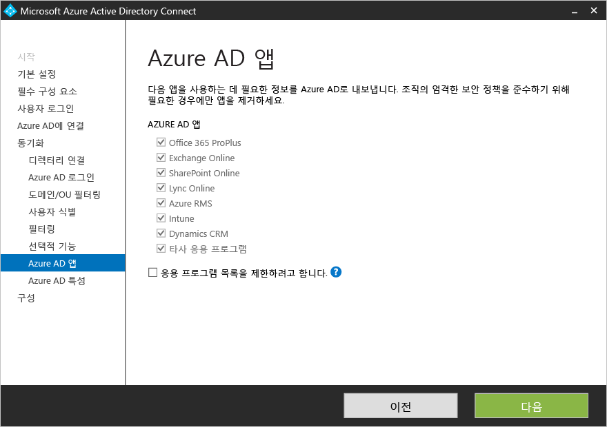

이전 단계에서 선택한 서비스에 따르면 이 페이지는 동기화되는 모든 특성을 보여줍니다. 이 목록은 동기화된 모든 개체 형식의 조합입니다. 동기화하지 않아도 되는 특정한 일부 특성이 있다면 이러한 선택을 취소할 수 있습니다.

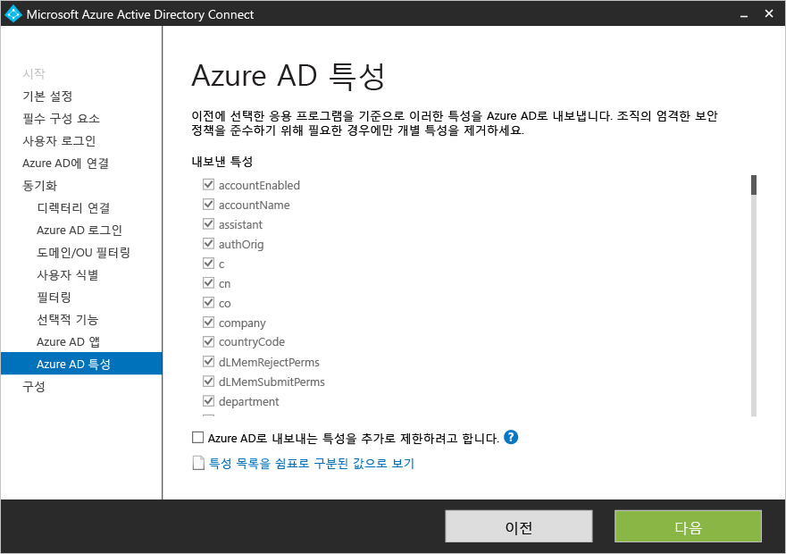

### 디렉터리 확장 특성 동기화
디렉터리 확장을 사용하여, Active Directory의 다른 특성 또는 조직에서 추가하는 사용자 지정 특성으로 Azure AD에서 스키마를 확장할 수 있습니다. 이 기능을 사용하려면, **선택적 기능** 페이지에서 **디렉터리 확장 특성 동기화**를 선택합니다. 이렇게 하면 이 페이지에서 추가 특성을 선택할 수 있습니다.

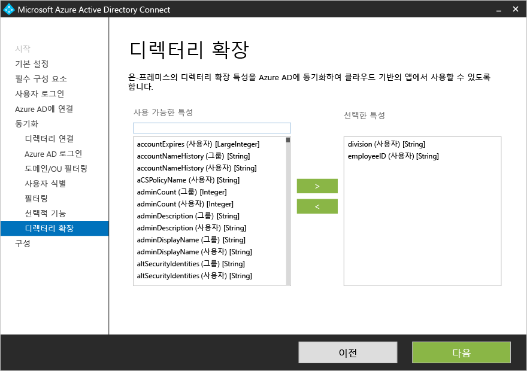

추가 정보는 [디렉터리 확장](active-directory-aadconnectsync-feature-directory-extensions.md)을 참조하세요.

## AD FS로 페더레이션 구성
Azure AD Connect를 사용하여 AD FS를 구성하는 것은 단 몇 번의 클릭으로 간단합니다. 다음은 설치하기 전에 필요합니다.

- 원격 관리가 사용 가능한 페더레이션 서버용 Windows Server 2012 R2 서버
- 원격 관리가 사용 가능한 웹 응용 프로그램 프록시 서버용 Windows Server 2012 R2 서버
- 사용할 페더레이션 서비스 이름에 대한 SSL 인증서(예: sts.contoso.com)

### 새 AD FS 팜을 만들거나 기존 AD FS 팜 사용
기존 AD FS 팜을 사용하거나 새 AD FS 팜을 만들도록 선택할 수 있습니다. 새로 만들기를 선택하면 SSL 인증서를 제공해야 합니다. SSL 인증서가 암호로 보호되는 경우, 암호를 제공하라는 메시지가 표시됩니다.

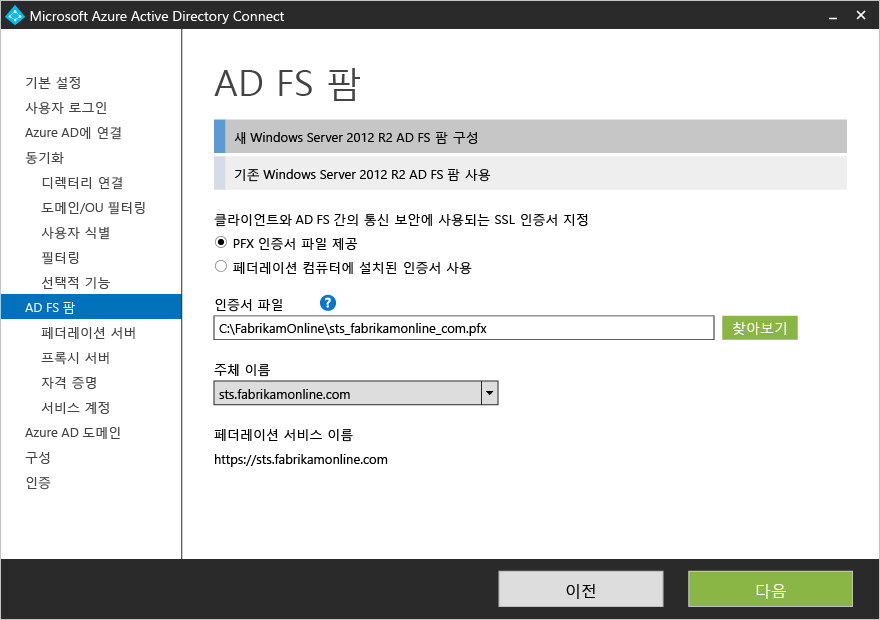

**참고:** 기존 AD FS 팜에 사용하려는 경우, 몇 페이지를 건너뛰고 직접 AD FS와 Azure AD 간의 트러스트 관계 구성으로 이동합니다.

### AD FS 서버 지정
여기에서 AD FS를 설치하려는 특정 서버를 입력합니다. 용량 계획 요구 사항에 따라 하나 이상의 서버를 추가할 수 있습니다. 이 서버는 모두 이 구성 작업을 수행하기 전에 Active Directory 도메인에 가입되어야 합니다. 테스트 및 파일럿 배포를 위한 단일 AD FS 서버를 설치하고 초기 설치 후에 Azure AD Connect를 열어 추가 서버를 배포하며 추가 서버에 AD FS를 배포하여 크기 조정 요구 사항을 충족하는 것이 좋습니다.

> [AZURE.NOTE] 이 구성 작업을 수행하기 전에 모든 서버가 AD 도메인에 가입되었는지 확인합니다.

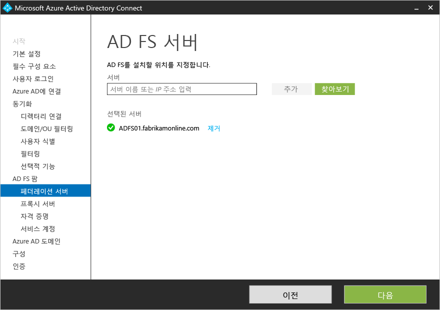

### 웹 응용 프로그램 프록시 서버 지정
여기에서 웹 응용 프로그램 프록시 서버로 원하는 특정 서버를 입력합니다. 웹 응용 프로그램 프록시 서버는 DMZ(엑스트라넷 연결)에 배포되며 엑스트라넷에서 인증 요청을 지원합니다. 용량 계획 요구 사항에 따라 하나 이상의 서버를 추가할 수 있습니다. 테스트 및 파일럿 배포를 위한 단일 웹 응용 프로그램 프록시 서버를 설치하고 초기 설치 후에 Azure AD Connect를 열어 추가 서버를 배포하고 웹 응용 프로그램 프록시를 추가 서버에 배포하는 것이 좋습니다. 일반적으로 인트라넷에서 인증을 충족하기 위해 동일한 수의 프록시 서버가 있는 것이 좋습니다.

> [AZURE.NOTE]
<li> Azure AD Connect를 설치하는 데 사용하는 계정이 AD FS 서버에서 로컬 관리자가 아닌 경우 충분한 권한이 있는 계정의 자격 증명에 대한 메시지가 표시됩니다.</li> <li> 이 단계를 구성하기 전에 Azure AD Connect 서버와 웹 응용 프로그램 프록시 서버 간의 HTTP/HTTPS 연결이 되었는지 확인합니다.</li> <li> 또한 웹 응용 프로그램 서버와 AD FS 서버 간의 HTTP/HTTPS 연결을 통해 인증 요청이 허용되는지 확인합니다.</li>

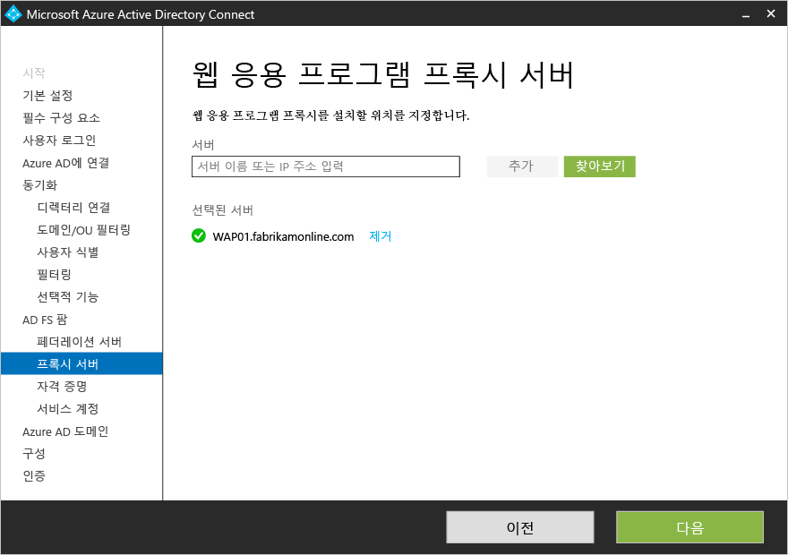

웹 응용 프로그램 서버가 AD FS 서버에 보안 연결을 설정할 수 있도록 자격 증명을 입력하라는 메시지가 표시됩니다. 이러한 자격 증명에서 로컬 관리자는 AD FS 서버에 있어야 합니다.

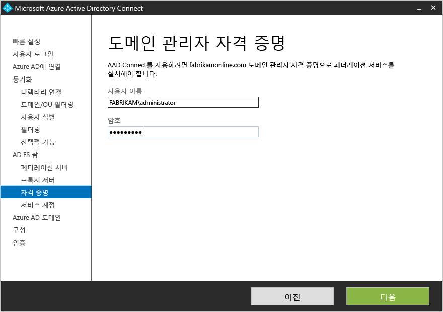

### AD FS 서비스에 대한 서비스 계정 지정
AD FS 서비스가 Active Directory에서 사용자를 인증하고 사용자 정보를 검색하는데 도메인 서비스 계정이 필요합니다. 두 종류의 서비스 계정을 지원할 수 있습니다.

- **그룹 관리 서비스 계정** - Windows Server 2012가 포함된 Active Directory 도메인 서비스에 도입된 서비스 계정의 형식입니다. 이러한 유형의 계정은 정기적으로 계정 암호를 업데이트할 필요 없이 단일 계정을 사용하려면 AD FS와 같은 서비스를 제공합니다. AD FS 서버에 속하는 도메인에서 Windows Server 2012 도메인 컨트롤러가 이미 있는 경우 이 옵션을 사용합니다.
- **도메인 사용자 계정** -이 유형의 계정은 암호를 입력하고 암호를 변경하는 경우 암호를 정기적으로 업데이트를 해야 합니다. AD FS 서버에 속하는 도메인에 Windows Server 2012 도메인 컨트롤러가 없는 경우에만 사용합니다.

또한 그룹 관리 서비스 계정을 선택하고 Active Directory에서 이 기능을 사용하지 않은 경우 엔터프라이즈 관리자 자격 증명에 대한 메시지가 표시됩니다. 키 저장소를 시작하고 Active Directory에서 기능을 사용하기 위해 사용됩니다.

도메인 관리자로 로그인한 경우 Azure AD Connect는 그룹 관리 서비스 계정을 자동으로 만듭니다.

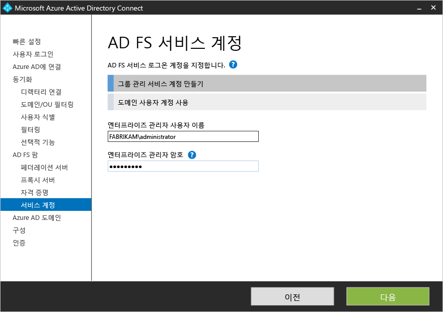

### 페더레이션하려는 Azure AD 도메인을 선택합니다.
이 구성은 AD FS와 Azure AD 간의 페더레이션 관계를 설정하는데 사용됩니다. Azure AD에 보안 토큰을 발급하도록 AD FS를 구성하고 이 특정 AD FS 인스턴스에서 토큰을 신뢰하도록 Azure AD를 구성합니다. 이 페이지를 사용하면 초기 설치에 단일 도메인을 구성할 수 있습니다. Azure AD Connect를 다시 열고 이 작업을 수행하여 언제든지 추가 도메인을 구성할 수 있습니다.

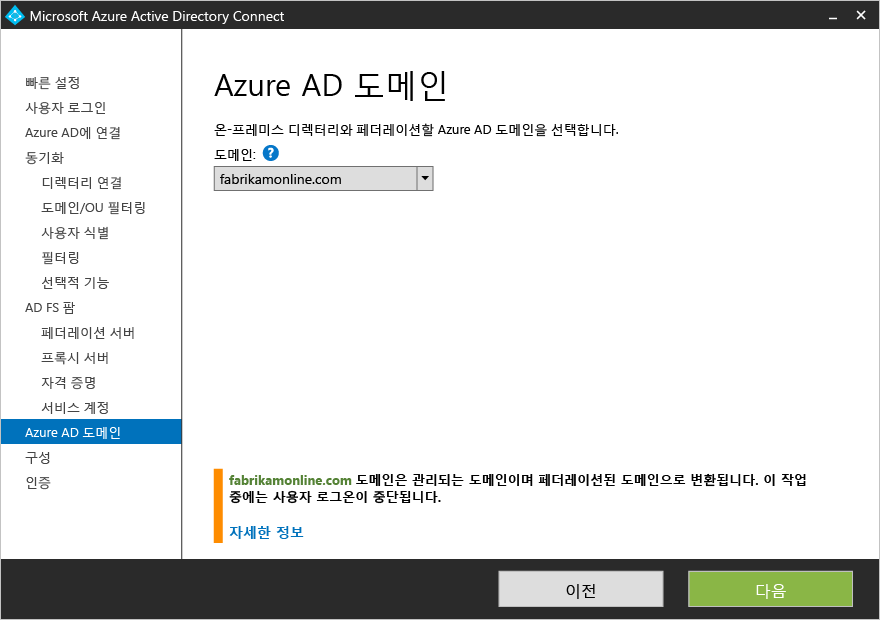

## 페이지 구성 및 확인
이 페이지에서 구성은 실제로 일어납니다.

> [AZURE.NOTE]
설치를 계속하기 전에 페더레이션을 구성한 경우 [페더레이션 서버에 대한 이름 확인](active-directory-aadconnect-prerequisites.md#name-resolution-for-federation-servers)을 구성했는지 확인합니다.

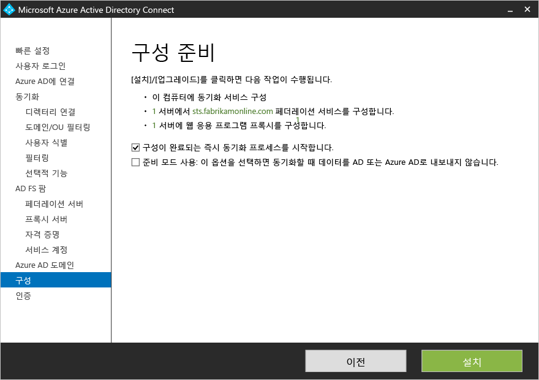

### 스테이징 모드
스테이징 모드를 사용하여 기존 서버와 함께 병렬로 새 동기화 서버를 설정하는 프로세스가 가능합니다. 클라우드에서 하나의 디렉터리에 내보낸 하나의 동기화 서버에만 지원됩니다. 하지만 DirSync를 실행하는 서버와 같은 다른 서버에서 이동하려는 경우 스테이징 모드에서 Azure AD Connect를 사용할 수 있습니다. 활성화된 동기화 엔진이 데이터를 정상적으로 가져오고 동기화하지만, Azure AD로 아무것도 내보내지 않고 암호 동기화 및 비밀번호 쓰기 저장을 해제합니다.

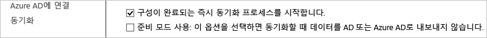

스테이징 모드에 있는 동안, 동기화 엔진에 필요한 변경 내용을 작성하고 내보낼 내용을 검토합니다. 구성마음에 드는 경우, 설치 마법사를 다시 실행하고 스테이징 모드를 사용하지 않도록 설정합니다. 이렇게 하면 데이터를 Azure AD로 내보낼 수 있습니다. 한 서버만이 내보낼 수 있으므로 동시에 다른 서버를 사용하지 않도록 설정했는지 확인합니다.

추가 정보는 [스테이징 모드](active-directory-aadconnectsync-operations.md#staging-mode)를 참조하세요.

### 페더레이션 구성 확인
확인 단추를 클릭할 때 Azure AD Connect에서 DNS 설정을 확인합니다.

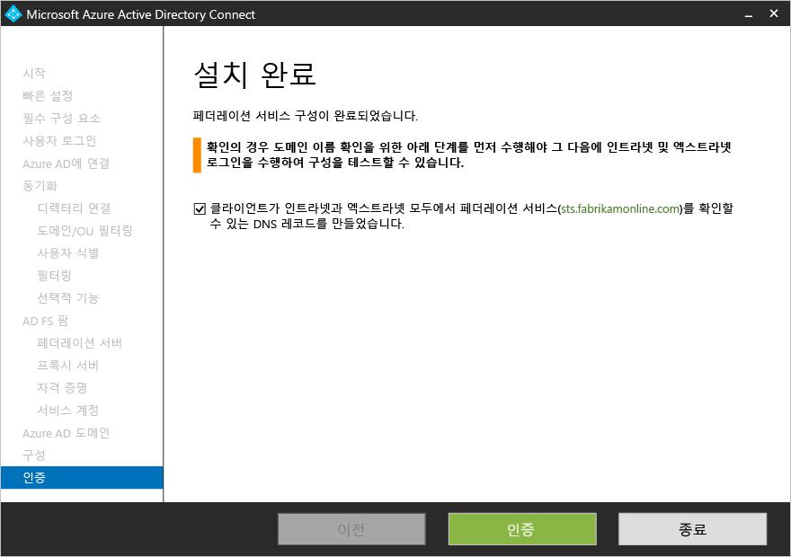

또한 다음 확인 단계를 수행합니다.

- 인트라넷에서 Internet Explorer에서 도메인 가입된 컴퓨터에서 브라우저 로그인의 유효성 검사: https://myapps.microsoft.com에 연결하고 로그인한 계정으로 로그인을 확인합니다. **참고:** 기본 제공 AD DS 관리자 계정은 동기화되지 않고 확인을 위해 사용될 수 없습니다.
- 엑스트라넷의 모든 장치에서 브라우저 로그인의 유효성 검사: 홈 컴퓨터 또는 모바일 장치에서 https://myapps.microsoft.com에 연결하고 로그인 ID 및 암호 자격 증명을 제공합니다.
- 리치 클라이언트 로그인의 유효성 검사: https://testconnectivity.microsoft.com에 연결하고 **Office 365** 탭을 선택하고 **Office 365 Single Sign-On 테스트**를 선택합니다.

## 다음 단계
설치가 완료된 후 로그아웃하고 동기화 서비스 관리자 또는 동기화 규칙 편집기를 사용하기 전에 Windows에 다시 로그인합니다.

Azure AD Connect를 설치했으므로 [설치를 확인하고 라이선스를 할당](active-directory-aadconnect-whats-next.md)할 수 있습니다.

[Azure Active Directory와 온-프레미스 ID 통합](active-directory-aadconnect.md)에 대해 자세히 알아봅니다.

<!---HONumber=AcomDC_0218_2016-->