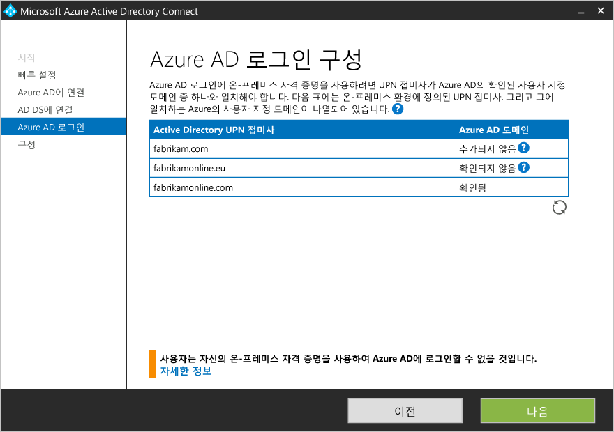

<properties
	pageTitle="Azure AD Connect: 기본 설정을 사용하여 시작 | Microsoft Azure"
	description="Azure AD Connect용 설치 마법사를 다운로드, 설치 및 실행하는 방법을 알아봅니다."
	services="active-directory"
	documentationCenter=""
	authors="billmath"
	manager="stevenpo"
	editor="curtand"/>

<tags
	ms.service="active-directory"
	ms.workload="identity"
	ms.tgt_pltfrm="na"
	ms.devlang="na"
	ms.topic="get-started-article"
	ms.date="05/10/2016"
	ms.author="billmath;andkjell"/>

# 기본 설정을 사용하여 Azure AD Connect 시작
이 항목은 Azure Active Directory Connect를 시작하도록 도와줍니다. 이 설명서는 Azure AD Connect에 대한 빠른 설치를 설명합니다. 빠른 설정은 암호동기화와 함께 단일 포리스트 토폴로지에 사용됩니다. 몇 번의 클릭만으로 온-프레미스 디렉터리를 클라우드로 확장할 수 있습니다.

## 관련 설명서
[Azure Active Directory와 온-프레미스 ID 통합](active-directory-aadconnect.md)에 대한 설명서를 읽지 않은 경우 다음 표에서 관련 항목에 대한 링크를 제공합니다. 설치를 시작하려면 굵게 표시된 처음 두 항목이 필요합니다.

| 항목 | |
| --------- | --------- |
| **Azure AD Connect 다운로드** | [Azure AD Connect 다운로드](http://go.microsoft.com/fwlink/?LinkId=615771) |
| **하드웨어 및 필수 조건** | [Azure AD Connect: 하드웨어 및 필수 조건](active-directory-aadconnect-prerequisites.md) |
| 사용자 지정된 설정을 사용하여 설치 | [Azure AD Connect의 사용자 지정 설치](active-directory-aadconnect-get-started-custom.md) |
| DirSync에서 업그레이드 | [Azure AD Sync 도구(DirSync)에서 업그레이드](active-directory-aadconnect-dirsync-upgrade-get-started.md) |
| 설치 후 | [설치 확인 및 라이선스 할당](active-directory-aadconnect-whats-next.md) |
| 설치에 사용되는 계정 | [Azure AD Connect 계정 및 사용 권한에 대한 추가 정보](active-directory-aadconnect-accounts-permissions.md) |

## Azure AD Connect의 빠른 설치
**Express 설정**은 기본 옵션이며 가장 일반적인 배포 시나리오에 사용됩니다. 빠른 설정을 사용하면, Azure AD Connect에서 단일 포리스트 토폴로지에 대해 동기화를 배포합니다. [암호 동기화](active-directory-aadconnectsync-implement-password-synchronization.md)가 활성화되며 사용자의 온-프레미스 암호를 사용하여 클라우드에 로그인할 수 있도록 합니다. [자동 업그레이드](active-directory-aadconnect-feature-automatic-upgrade.md)가 활성화되어 유지 관리가 손쉬워집니다. 빠른 설정을 사용하는 경우, 설치가 완료되면 동기화가 자동으로 시작됩니다.(이 단계를 수행하지 않도록 선택할 수 있습니다.)

### 빠른 설치를 사용하여 Azure AD Connect를 설치하려면

1. Azure AD Connect를 설치하려는 서버에 로컬 관리자로 로그인합니다. 동기화 서버로 설정할 서버에서 수행해야 합니다.
2. **AzureADConnect.msi**를 찾아서 두 번 클릭합니다.
3. 시작 화면에서 사용권 계약에 동의하는 상자를 선택하고 **계속**을 클릭합니다. 
4. 기본 설정 화면에서 **Use express settings**(기본 설정 사용)를 클릭합니다. 
5. Azure AD에 연결 화면에서 Azure AD에 대한 전역 관리자의 사용자 이름 및 암호를 입력합니다. **다음**을 클릭합니다.  오류가 발생하고 연결에 문제가 있는 경우 [연결 문제 해결](active-directory-aadconnect-troubleshoot-connectivity.md)을 참조하세요.
6. AD DS에 연결 화면에서 엔터프라이즈 관리자 계정의 사용자 이름 및 암호를 입력합니다. NetBios 또는 FQDN 형식으로 도메인 부분을 입력할 수 있습니다(예: FABRIKAM\\administrator 또는 fabrikam.com\\administrator). **다음**을 클릭합니다. 
7. UPN 도메인이 제공되거나 확인되지 않은 온-프레미스 Active Directory에 등록된 경우 다음 페이지가 표시됩니다. 온-프레미스 AD DS의 모든 UPN 도메인을 확인한 경우 다음 페이지가 표시되지 않습니다.  이 페이지를 표시하는 경우 **추가되지 않음** 및 **확인되지 않음**으로 표시된 모든 도메인을 검토합니다. 사용한 항목을 Azure AD에서 확인하도록 합니다. 도메인을 확인한 경우 새로 고침 기호를 클릭합니다. 자세한 내용은 [도메인 추가 및 확인](active-directory-add-domain.md)을 참조하세요.
8. 구성 준비 화면에서 **설치**를 클릭합니다.
	- 선택적으로 구성 준비 페이지에서 **구성이 완료되자마자 동기화 프로세스를 시작합니다.** 확인란의 선택 취소할 수 있습니다. [필터링](active-directory-aadconnectsync-configure-filtering.md) 같은 추가적인 구성을 수행하려면 이 확인란을 선택하지 말아야 합니다. 이 옵션에 대한 선택을 취소하면, 마법사가 동기화를 구성하지만 스케줄러는 비활성 상태로 유지합니다. 설치 마법사를 다시 실행하여 사용자가 수동으로 활성화할 때가지 실행되지 않습니다.
	- 또한 필요에 따라 해당 확인란을 선택하여 **Exchange 하이브리드 배포**에 대한 동기화 서비스를 구성하도록 선택할 수 있습니다. Exchange 사서함을 클라우드와 온-프레미스에 동시에 두려면 이 옵션을 활성화합니다. 
9. 설치가 완료되면 **끝내기**를 클릭합니다.
10. 설치가 완료된 후 로그아웃하고 동기화 서비스 관리자 또는 동기화 규칙 편집기를 사용하기 전에 다시 로그인합니다.

빠른 설치 사용에 대한 비디오는 다음을 참조하세요.

>[AZURE.VIDEO azure-active-directory-connect-express-settings]

## 다음 단계
Azure AD Connect를 설치했으므로 [설치를 확인하고 라이선스를 할당](active-directory-aadconnect-whats-next.md)할 수 있습니다.

[Azure Active Directory와 온-프레미스 ID 통합](active-directory-aadconnect.md)에 대해 자세히 알아봅니다.

<!---HONumber=AcomDC_0518_2016-->