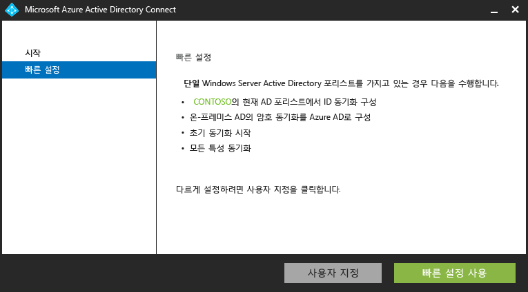
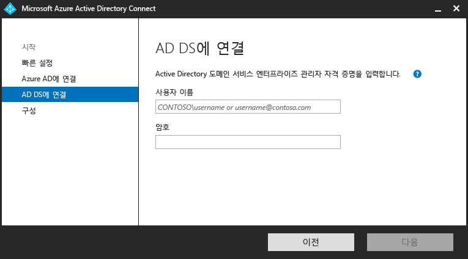
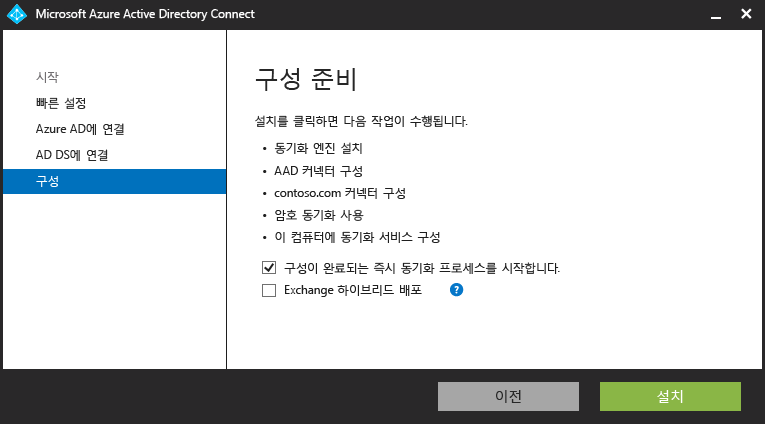
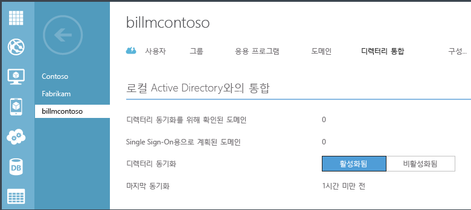

<properties 
	pageTitle="Azure AD Connect 시작" 
	description="Azure AD Connect용 설치 마법사를 다운로드, 설치 및 실행하는 방법을 알아봅니다." 
	services="active-directory" 
	documentationCenter="" 
	authors="billmath" 
	manager="swadhwa" 
	editor="curtand"/>

<tags 
	ms.service="active-directory" 
	ms.workload="identity" 
	ms.tgt_pltfrm="na" 
	ms.devlang="na" 
	ms.topic="article" 
	ms.date="05/28/2015" 
	ms.author="billmath"/>

# Azure AD Connect 시작

<a href="../active-directory-aadconnect/" title="정의">정의</a> <a href="../active-directory-aadconnect-how-it-works/" title="작동 방식">작동 방식</a> <a href="../active-directory-aadconnect-get-started/" title="시작" class="current">시작</a> <a href="../active-directory-aadconnect-whats-next/" title="다음 단계">다음 단계</a> <a href="../active-directory-aadconnect-learn-more/" title="자세한 정보">자세한 정보</a>

다음 설명서는 Azure Active Directory Connect를 시작하는 데 유용합니다. 이 문서에서는 Azure AD 연결을 위해 빠른 설치를 사용하여 처리합니다. 사용자 지정 설치에 대한 내용은 [Azure AD 연결을 위한 사용자 지정 설치](active-directory-aadconnect-get-started-custom.md)를 참조하세요. 디렉토리 동기화에서 Azure AD 연결로 업그레이드에 대한 내용은 [디렉토리 동기화를 Azure Active Directory 연결로 업그레이드](active-directory-aadconnect-dirsync-upgrade-get-started.md)를 참조하세요.

## Azure AD Connect 다운로드

Azure AD Connect를 사용하여 시작하려면 [Azure AD Connect 다운로드](http://go.microsoft.com/fwlink/?LinkID=615771)를 사용하여 최신 버전을 다운로드하면 됩니다.

## Azure AD Connect를 설치하기 전에
빠른 설정을 사용하여 Azure AD Connect를 설치하기 전에 필요한 몇 가지 사항이 있습니다.

 
- Azure 구독 또는 [Azure 평가판 구독](http://azure.microsoft.com/pricing/free-trial/) -Azure AD Connect를 사용하지 않고 Azure 포털에 액세스하기 위해서만 필요합니다. PowerShell 또는 Office 365를 사용하는 경우, Azure AD Connect를 사용하여 Azure 구독을 설치할 필요가 없습니다.
- 통합하려는 Azure AD 테넌트에 대한 Azure AD 전역 관리자 계정
- Windows Server 2008 이상에서 사용되는 AD 도메인 컨트롤러 또는 구성원 서버
- 로컬 Active Directory에 대한 엔터프라이즈 관리자 계정
- 선택 사항: 동기화를 확인할 테스트 사용자 계정 

### Azure AD Connect의 하드웨어 요구 사항
아래 표는 Azure AD Connect 컴퓨터의 최소 요구 사항을 보여 줍니다.

| Active Directory의 개체 수 | CPU | 메모리 | 하드 드라이브 크기 |
| ------------------------------------- | --- | ------ | --------------- |
| 10,000개 미만 | 1\.6GHz | 4GB | 70GB |
| 10,000–50,000개 | 1\.6GHz | 4GB | 70GB |
| 50,000–100,000개 | 1\.6GHz | 16GB | 100GB |
| 처음 사용자용 SQL Server가 필요한 100,000개 이상의 개체| | | |
| 100,000–300,000개 | 1\.6GHz | 32GB | 300GB |
| 300,000–600,000개 | 1\.6GHz | 32GB | 450GB |
| 600,000개 초과 | 1\.6GHz | 32GB | 500GB |

여러 포리스트 또는 페더레이션된 로그인과 같은 사용자 지정 옵션은 [여기](active-directory-aadconnect-get-started-custom.md)에서 추가 요구 사항에 관해 알아보세요.

## Azure AD Connect의 빠른 설치
빠른 설정을 선택하는 것이 기본 옵션이며 가장 일반적인 시나리오 중 하나입니다. 이 설정을 선택하면 Azure AD Connect는 암호 해시 동기화 옵션을 사용하여 동기화를 배포합니다. 단일 포리스트 전용으로, 이 옵션을 사용하면 사용자들이 온-프레미스 암호를 사용하여 클라우드에 로그인할 수 있습니다. 빠른 설치를 사용하면 설치 완료 시 동기화가 자동으로 시작됩니다(선택하지 않은 경우에도). 이 옵션에서는 몇 번의 간략한 클릭만으로 온-프레미스 디렉토리를 클라우드로 확장할 수 있습니다.

### 빠른 설치를 사용하여 Azure AD Connect를 설치하려면
--------------------------------------------------------------------------------------------

1. Azure AD Connect를 설치하려는 서버에 엔터프라이즈 관리자로 로그인합니다. 동기화 서버로 설정할 서버여야 합니다.
2. AzureADConnect.msi를 찾아 두 번 클릭합니다.
3. 시작 화면에서 사용권 계약에 동의하는 상자를 선택하고 **계속**을 클릭합니다.
4. 빠른 설치 화면에서 **빠른 설치 사용**을 클릭합니다.

6. Azure AD 화면에 연결에서 Azure AD에 대한 Azure 전역 관리자의 사용자 이름 및 암호를 입력합니다. **다음**을 클릭합니다.
8. AD DS 화면에 연결에서 엔터프라이즈 관리자 계정에 대한 사용자 이름 및 암호를 입력합니다. **다음**을 클릭합니다.

9. 구성 준비 화면에서 **설치**를 클릭합니다.
	- 선택적으로 구성 준비 페이지에서 "**구성이 완료되자마자 동기화 프로세스를 시작합니다.**"의 선택을 취소할 수 있습니다. 이 작업을 수행하는 경우 마법사는 동기화를 구성하지만 작업을 비활성화 상태로 두어 작업 스케줄러에서 수동으로 사용할 때까지 실행되지 않습니다. 작업을 사용하도록 설정하면 3시간마다 동기화가 실행됩니다.
	- 또한 필요에 따라 해당 확인란을 선택하여 **Exchange 하이브리드 배포**에 대한 동기화 서비스를 구성하도록 선택할 수 있습니다. 클라우드 및 온-프레미스 모두에 Exchange 사서함이 없게 하려는 경우, 필요하지 않습니다.

8. 설치가 완료되면 **끝내기**를 클릭합니다.

   

빠른 설치 사용에 관한 비디오의 경우 다음을 확인합니다.

[AZURE.VIDEO azure-active-directory-connect-express-settings]

## 설치 확인

Azure AD Connect를 성공적으로 설치한 후 Azure 포털에 로그인하여 마지막 동기화 시간을 확인하여 동기화가 수행되는 것을 확인할 수 있습니다.

1.  Azure 포털에 로그인합니다.
2.  왼쪽 창에서 Active Directory를 선택합니다.
3.  Azure AD Connect를 설정하는데 사용되는 디렉토리를 두 번 클릭합니다.
4.  위쪽에서 디렉토리 통합을 선택합니다. 마지막 동기화 시간을 참고합니다.

## 다음 작업
이제 Azure AD Connect가 설치되었으며 [여기](active-directory-aadconnect-whats-next.md) 링크를 사용하여 Azure AD Premium 또는 엔터프라이즈 이동성 라이선스를 할당 또는 추가 옵션 구성과 같은 사후 설치 작업을 진행할 수 있습니다.

**추가 리소스**

[디렉터리 통합 도구 비교](active-directory-aadconnect-get-started-tools-comparison.md)

 

<!---HONumber=August15_HO6-->