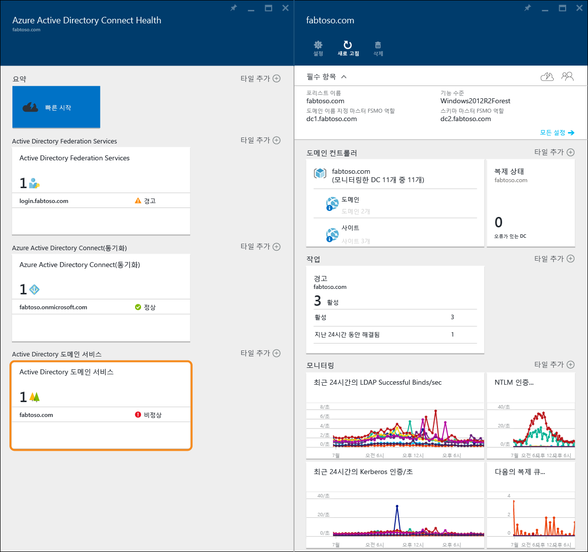
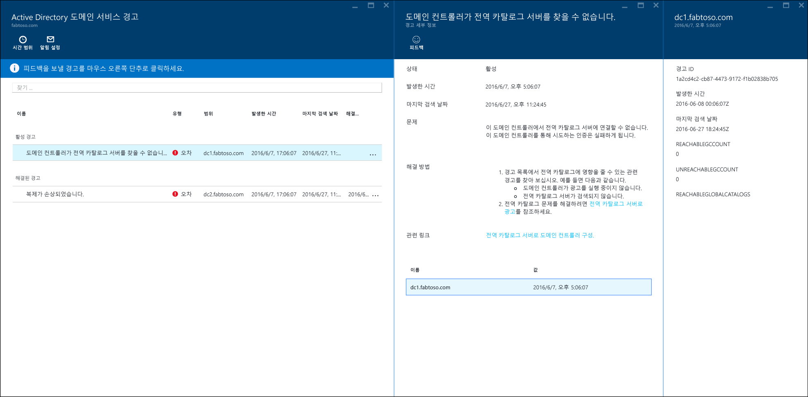
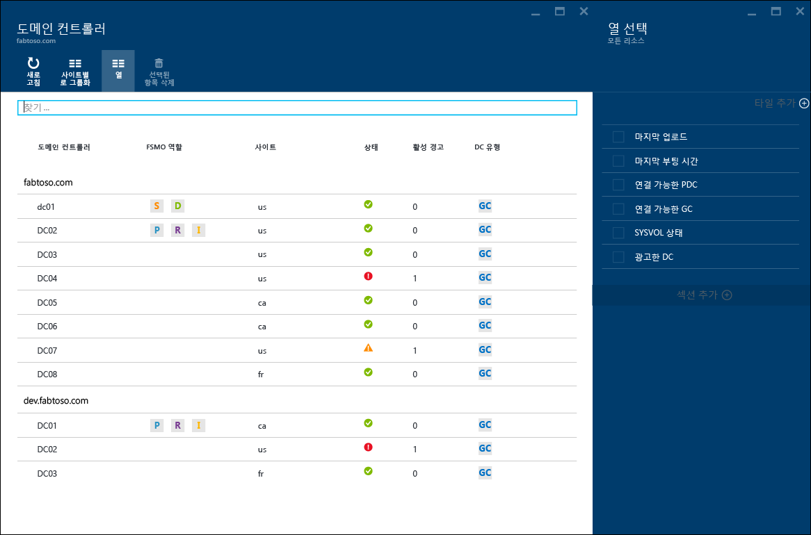
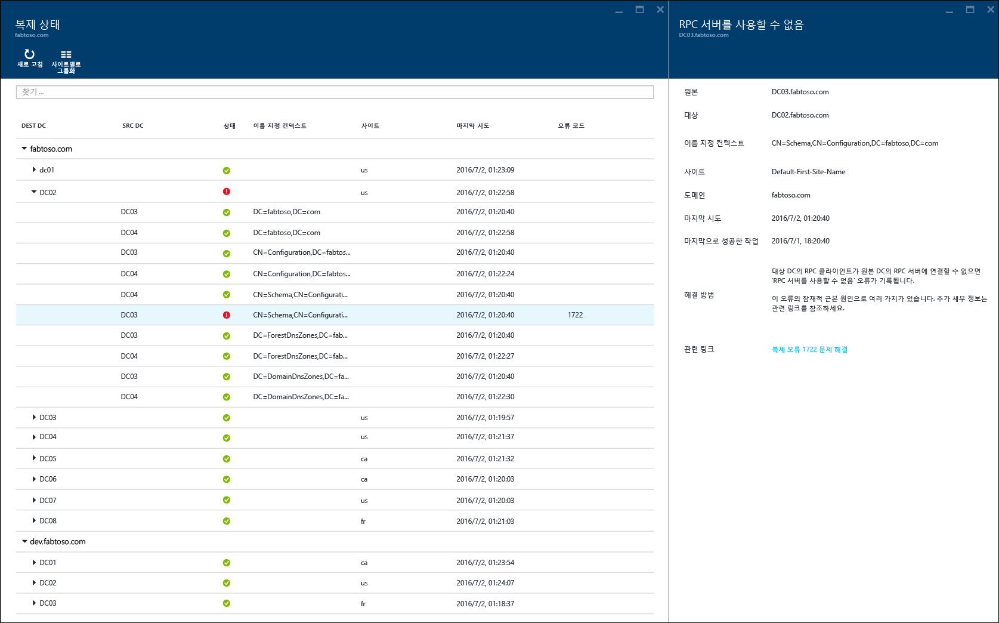
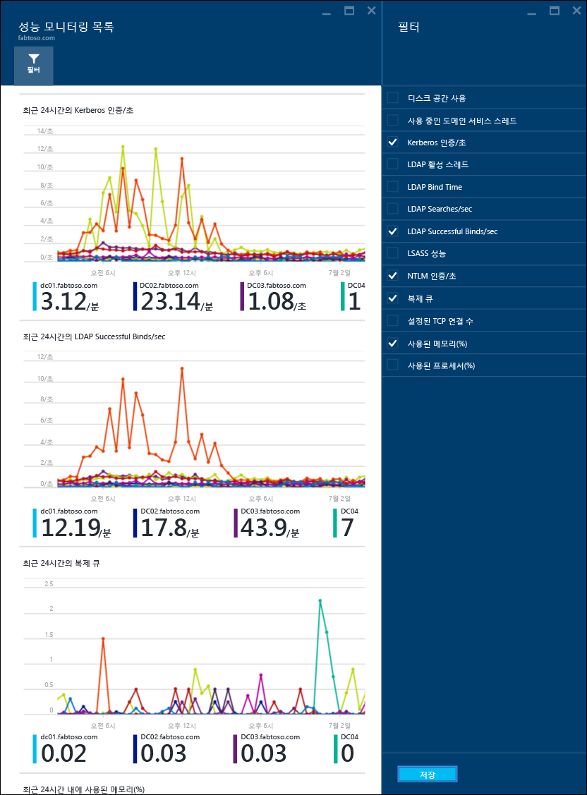

<properties
	pageTitle="AD DS와 함께 Azure AD Connect Health 사용 | Microsoft Azure"
	description="AD DS를 모니터링하는 방법을 설명하는 Azure AD Connect Health 페이지입니다."
	services="active-directory"
	documentationCenter=""
	authors="arluca"
	manager="samueld"
	editor="curtand"/>

<tags
	ms.service="active-directory"
	ms.workload="identity"
	ms.tgt_pltfrm="na"
	ms.devlang="na"
	ms.topic="get-started-article"
	ms.date="07/14/2016"
	ms.author="arluca"/>

# AD DS와 함께 Azure AD Connect Health 사용
다음 문서는 Azure AD Connect Health와 함께 Active Directory 도메인 서비스를 모니터링하는 방법에 중점을 둡니다. Windows Server 2008 R2, Windows Server 2012 및 Windows Server 2012 R2에 설치된 AD DS를 포함합니다.

Azure AD Connect Health와 함께 AD FS 모니터링에 대한 내용은 [AD FS와 함께 Azure AD Connect Health 사용](active-directory-aadconnect-health-adfs.md)을 참조하세요. 또한 Azure AD Connect Health와 함께 Azure AD Connect (동기화)를 모니터링하는 방법에 대한 정보는 [동기화를 위해 Azure AD Connect Health 사용](active-directory-aadconnect-health-sync.md)을 참조하세요.

## AD DS용 Azure AD Connect Health에 대한 경고
AD DS용 Azure AD Connect Health 내의 경고 섹션은 도메인 컨트롤러와 관련된 진행 중인 경고 및 해결된 경고의 목록을 제공합니다. 진행 중인 경고 또는 해결된 경고를 선택하면 해결 단계와 함께 추가 정보를 포함한 새 블레이드가 열리고 지원 문서로 연결됩니다. 각 경고 유형에는 하나 이상의 인스턴스가 있고 이 인스턴스는 해당 특정 경고의 영향을 받는 도메인 컨트롤러 각각에 해당합니다. 경고 블레이드 아래쪽 근처에서 영향을 받는 도메인 컨트롤러를 선택할 수 있고 해당 특정 경고 인스턴스에 대한 추가 세부 정보가 포함된 새 블레이드가 열립니다.

보기에서 시간 범위를 변경하는 작업 뿐만 아니라 경고에 대한 전자 메일 알림을 사용하는 작업을 이 블레이드 내에서 사용할 수 있습니다. 시간 범위를 확장하면 이전에 해결된 경고를 볼 수 있습니다.

## 도메인 컨트롤러
이 대시보드에서는 모니터링 도메인 컨트롤러 각각의 주요 작업 메트릭 및 상태와 함께 사용자 환경의 토폴로지 보기를 제공합니다. 표시된 메트릭은 추가 조사가 필요할 수 있는 모든 도메인 컨트롤러를 신속하게 식별하는 데 도움이 됩니다. 기본적으로 열의 하위 집합만 표시됩니다. 그러나 열 명령을 클릭하여 사용할 수 있는 열의 전체 집합을 찾을 수 있습니다. 가장 중요한 열을 선택하면 이 대시보드를 AD DS 환경의 상태를 쉽게 볼 수 있는 위치로 변환합니다.

해당하는 도메인 또는 사이트에서 도메인 컨트롤러를 그룹화할 수 있으며 환경 토폴로지를 이해하는 데 도움이 됩니다. 마지막으로 블레이드 헤더를 두 번 클릭하면 화면을 활용하도록 대시보드가 최대화됩니다. 여러 열을 표시하는 경우 특히 유용할 수 있습니다.

## 복제 상태
이 대시보드에서는 모니터링된 도메인 컨트롤러의 복제 상태 및 복제 토폴로지 보기를 제공합니다. 발견된 모든 오류에 대한 유용한 설명서와 함께 가장 최근 복제를 시도한 상태가 나열됩니다. 오류가 발생한 도메인 컨트롤러를 선택하면 해결 단계와 함께 추가 정보를 포함한 새 블레이드가 열리고 문제 해결 문서로 연결됩니다.

## 모니터링
이 기능은 다양한 성능 카운터의 추세를 그래프로 제공하며 이 정보는 계속해서 모니터링된 도메인 컨트롤러에서 수집됩니다. 도메인 컨트롤러의 성능은 포리스트에 있는 다른 모든 모니터된 도메인 컨트롤러 간에 쉽게 비교될 수 있습니다. 또한 다양한 성능 카운터를 나란히 볼 수 있으며 환경에서 문제를 해결할 때 유용합니다.

기본적으로 미리 선택한 네 개의 성능 카운터가 있습니다. 그러나 필터 명령을 클릭하고 원하는 성능 카운터를 선택하거나 선택을 취소하여 다른 성능 카운터를 포함할 수 있습니다. 또한 특정 성능 카운터 그래프를 클릭하면 새 블레이드가 열리며 여기에는 모니터링된 도메인 컨트롤러 각각에 대한 해당 데이터 요소가 포함됩니다.

## 관련 링크

* [Azure AD Connect Health](active-directory-aadconnect-health.md)
* [Azure AD Connect Health Agent 설치](active-directory-aadconnect-health-agent-install.md)
* [Azure AD Connect Health 작업](active-directory-aadconnect-health-operations.md)
* [AD FS와 함께 Azure AD Connect Health 사용](active-directory-aadconnect-health-adfs.md)
* [동기화에 대한 Azure AD Connect Health 사용](active-directory-aadconnect-health-sync.md)
* [Azure AD Connect Health FAQ](active-directory-aadconnect-health-faq.md)
* [Azure AD Connect Health 버전 내역](active-directory-aadconnect-health-version-history.md)

<!-----HONumber=AcomDC_0720_2016-->