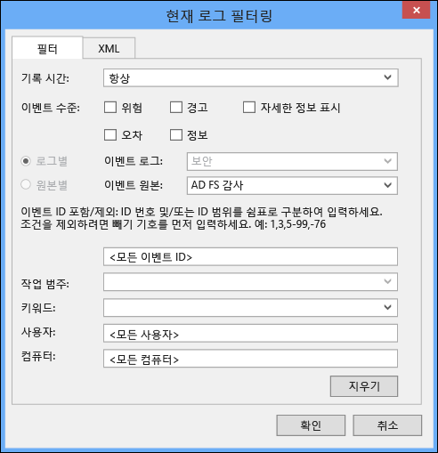
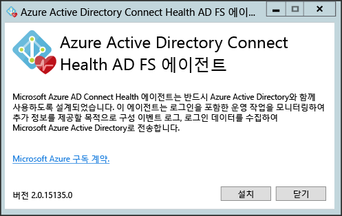
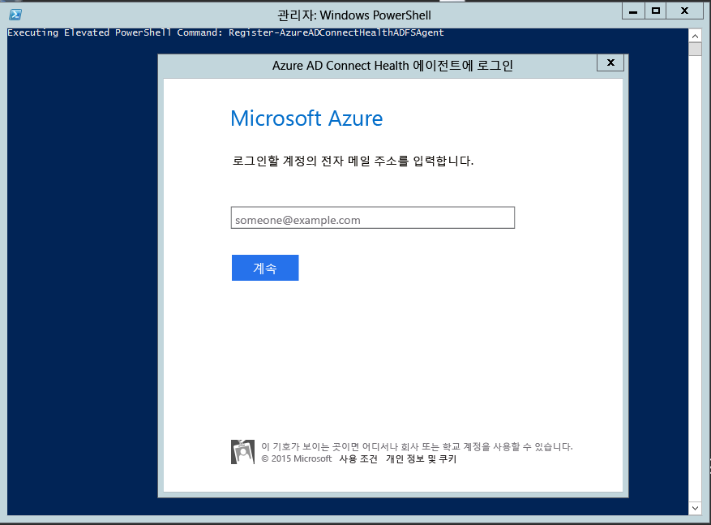
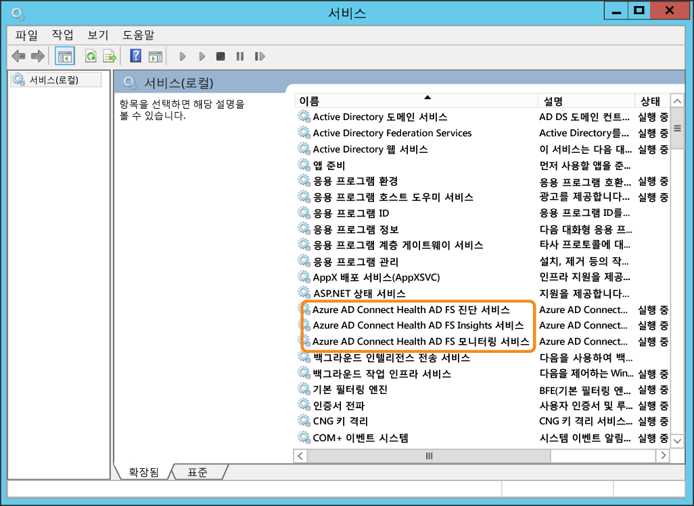

<properties 
	pageTitle="Azure AD Connect Health 요구 사항." 
	description="요구 사항 및 에이전트 설치에 대해 설명하는 Azure AD Connect Health 페이지입니다." 
	services="active-directory" 
	documentationCenter="" 
	authors="billmath" 
	manager="swadhwa" 
	editor="curtand"/>

<tags 
	ms.service="active-directory" 
	ms.workload="identity" 
	ms.tgt_pltfrm="na" 
	ms.devlang="na" 
	ms.topic="article" 
	ms.date="07/12/2015" 
	ms.author="billmath"/>

# Azure Active Directory Connect Health 요구 사항
다음 설명서는 Azure AD Connect Health를 시작하려면 충족해야 하는 요구 사항 목록입니다.

## Azure AD Premium 라이선스

Azure AD Connect Health는 Azure AD Premium 기능이며 Azure AD Premium 라이선스가 필요합니다. 라이선스를 얻으려면 Azure AD Premium 시작을 참조하세요.
 

## Azure AD 테넌트의 전역 관리자여야 함

기본적으로 전역 관리자는 Azure AD Connect Health에서 제공하는 정보에 액세스할 수 있습니다. 온-프레미스 Active Directory와 페더레이션된 Azure AD 테넌트의 전역 관리자가 아닌 경우 Azure AD Connect Health의 서비스 인스턴스를 만들 수 없습니다. 전역 관리자인지 확인하세요. 자세한 내용은 [Azure AD 디렉터리 관리](https://msdn.microsoft.com/library/azure/hh967611.aspx)를 참조하세요.
 

## 각 대상 서버에 설치된 Azure AD Connect Health Agent

Azure AD Connect Health는 대상 서버에 에이전트가 설치되어 있어야 Azure AD Connect Health 포털에 표시되는 데이터를 제공할 수 있습니다. 즉, AD FS 온-프레미스 인프라에 데이터를 가져오려면 AD FS 서버에 에이전트가 설치되어 있어야 합니다. 여기에는 AD FS 프록시 서버와 웹 응용 프로그램 프록시 서버가 포함됩니다. Azure AD Connect Health Agent 설치에 대한 정보는 Azure AD Connect Health Agent 설치 단계를 참조하세요.

## Azure AD Connect Health Agent 요구 사항

다음 섹션에서는 Azure AD Connect Health Agent 특정 요구 사항에 대해 설명합니다.
 

### Azure AD Connect Health 에이전트 다운로드

Azure AD Connect Health를 사용하여 시작하려면 [Azure AD Connect Health 에이전트 다운로드](http://go.microsoft.com/fwlink/?LinkID=518973)를 사용하여 최신 버전을 다운로드할 수 있습니다. 에이전트를 설치하기 전에 Marketplace에서 추가 확인합니다.

 
### Azure 서비스 끝점에 대한 아웃바운드 연결
에이전트는 설치 및 런타임 중에 아래 나열된 Azure AD Connect Health 서비스 끝점에 연결되어야 합니다. 아웃바운드 연결을 차단하는 경우 다음 항목이 허용 목록에 추가되어 있는지 확인합니다.

- **.servicebus.windows.net - Port: 5671
- https://*.adhybridhealth.azure.com/
- https://*.table.core.windows.net/
- https://policykeyservice.dc.ad.msft.net/
- https://login.windows.net
- https://login.microsoftonline.com
- https://secure.aadcdn.microsoftonline-p.com 

## IE 보안 강화를 사용하는 경우 다음 웹 사이트 허용
에이전트가 설치될 서버에서 IE 보안 강화를 사용하도록 설정되어 있는 경우 다음 웹 사이트를 허용해야 합니다.

- https://login.microsoftonline.com 
- https://secure.aadcdn.microsoftonline-p.com
- https://login.windows.net
- Azure Active Directory에서 신뢰하는 조직의 페더레이션 서버(예: https://sts.contoso.com) 

### AD FS의 경우 AD FS 감사에서 사용 현황 분석을 사용하도록 설정되어 있어야 함

사용 현황 분석 기능을 통해 데이터를 수집하고 분석하려면 Azure AD Connect Health Agent에 AD FS 감사 로그의 정보가 필요합니다. 이러한 로그는 기본적으로 사용하도록 설정되어 있지 않습니다. 이 사항은 AD FS 페더레이션 서버에만 적용됩니다. AD FS 프록시 서버 또는 웹 응용 프로그램 프록시 서버에서 감사를 사용하도록 설정할 필요는 없습니다. AD FS 감사를 사용하도록 설정하고 AD FS 감사 로그를 찾으려면 다음 절차에 따르세요.

#### AD FS 2.0에 대해 감사를 사용하도록 설정하려면

1. **시작**을 클릭하고 **프로그램**, **관리 도구** 순으로 가리킨 다음 **로컬 보안 정책**을 클릭합니다.
1. **보안 설정\\로컬 정책\\사용자 권한 관리** 폴더로 이동하여 보안 감사 생성을 두 번 클릭합니다.
1. **로컬 보안 설정** 탭에서 AD FS 2.0 서비스 계정이 나열되어 있는지 확인합니다. 없는 경우 **사용자 또는 그룹 추가**를 클릭하여 목록에 추가하고 **확인**을 클릭합니다.
1. 상승된 권한을 사용하여 명령 프롬프트를 열고 다음 명령을 실행하여 감사를 사용하도록 설정합니다. `auditpol.exe /set /subcategory:"Application Generated" /failure:enable /success:enable`
1. 로컬 보안 정책을 닫고 관리 스냅인을 엽니다. 관리 스냅인을 열려면 **시작**을 클릭하고 **프로그램**, **관리 도구** 순으로 가리킨 다음 AD FS 2.0 관리를 클릭합니다.
1. 작업 창에서 페더레이션 서비스 속성 편집을 클릭합니다.
1. **페더레이션 서비스 속성** 대화 상자에서 **이벤트** 탭을 클릭합니다.
1. **성공 감사** 및 **실패 감사** 확인란을 선택합니다.
1. **확인**을 클릭합니다.

#### Windows Server 2012 R2에서 AD FS에 대해 감사를 사용하도록 설정하려면

1. 시작 화면에서 **서버 관리자**를 열거나 바탕 화면 작업 표시줄에서 서버 관리자를 열어 **로컬 보안 정책**을 연 다음 **도구/로컬 보안 정책**을 클릭합니다.
1. **보안 설정\\로컬 정책\\사용자 권한 할당** 폴더로 이동하여 **보안 감사 생성**을 두 번 클릭합니다.
1. **로컬 보안 설정** 탭에서 AD FS 서비스 계정이 나열되어 있는지 확인합니다. 없는 경우 **사용자 또는 그룹 추가**를 클릭하여 목록에 추가하고 **확인**을 클릭합니다.
1. 상승된 권한을 사용하여 명령 프롬프트를 열고 다음 명령을 실행하여 감사를 사용하도록 설정합니다. `auditpol.exe /set /subcategory:"Application Generated" /failure:enable /success:enable.`
1. **로컬 보안 정책**를 닫고 **AD FS 관리** 스냅인을 엽니다(서버 관리자에서 도구를 클릭한 다음 AD FS 관리 선택).
1. 작업 창에서 **페더레이션 서비스 속성 편집**을 클릭합니다.
1. 페더레이션 서비스 속성 대화 상자에서 **이벤트** 탭을 클릭합니다.
1. **성공 감사 및 실패 감사** 확인란을 선택하고 **확인**을 클릭합니다.

#### AD FS 감사 로그를 찾으려면

1. **이벤트 뷰어**를 엽니다.</li>
1. Windows 로그로 이동하여 **보안**을 선택합니다.
1. 오른쪽에서 **현재 로그 필터링**을 클릭합니다.
1. 이벤트 소스에서 **AD FS 감사**를 선택합니다.

> [AZURE.WARNING]AD FS 감사를 사용하지 않도록 설정하는 그룹 정책이 있는 경우 Azure AD Connect Health Agent가 정보를 수집할 수 없습니다. 감사를 사용하지 않도록 설정할 수 있는 그룹 정책이 없는지 확인합니다.

### Windows Server 2008 R2 서버에서 에이전트 설치

Windows Server 2008 R2 서버에 대해 다음을 수행합니다.

1. 서버가 서비스 팩 1 이상에서 실행되고 있는지 확인합니다.
1. 에이전트 설치에 대해 IE ESC를 끕니다.
1. AD Health Agent를 설치하기 전에 각 서버에서 Windows PowerShell 4.0을 설치합니다. Windows PowerShell 4.0을 설치하려면
 - 오프라인 설치 관리자를 다운로드하려면 다음 링크를 사용하여 [Microsoft .NET Framework 4.5](https://www.microsoft.com/download/details.aspx?id=40779)를 설치합니다.
 - Windows 기능에서 PowerShell ISE를 설치합니다.
 - [Windows Management Framework 4.0](https://www.microsoft.com/download/details.aspx?id=40855)을 설치합니다.
 - 서버에서 Internet Explorer 버전 10 이상을 설치합니다. Health Service에서 Azure 관리자 자격 증명을 사용하여 인증하는 데 필요합니다.
1. Windows Server 2008 R2에서 Windows PowerShell 4.0을 설치하는 방법에 대한 자세한 내용은 [여기](http://social.technet.microsoft.com/wiki/contents/articles/20623.step-by-step-upgrading-the-powershell-version-4-on-2008-r2.aspx)에서 wiki 문서를 참조하세요.

## Azure AD Connect Health Agent 배포
이 섹션에서는 서버에 Azure AD Connect Health Agent를 설치하고 구성하는 방법에 대해 설명합니다. Azure AD Connect Health 인스턴스에 데이터를 표시하려면 대상 서버에 Azure AD Connect Health Agent를 설치해야 합니다. 에이전트를 설치하기 전에 위의 요구 사항을 완료해야 합니다. 위의 링크를 사용하여 에이전트를 다운로드한 다음 아래 단계를 수행합니다.

다운로드한 .exe 파일을 두 번 클릭합니다. 첫 번째 화면에서 설치를 클릭합니다.

설치가 완료되면 지금 구성을 클릭합니다.

명령 프롬프트가 시작된 다음 PowerShell에서 Register-AzureADConnectHealthADFSAgent를 실행합니다. Azure에 로그인하라는 메시지가 표시됩니다. 로그인을 진행합니다.

로그인한 후 PowerShell이 계속됩니다. PowerShell이 완료되면 닫을 수 있으며 구성이 완료됩니다.

이제 서비스가 자동으로 시작되고 에이전트는 데이터를 모니터링하고 수집합니다. 이전 섹션에 설명된 필수 조건이 모두 충족되지 않으면 PowerShell 창에 경고가 표시됩니다. 다음 스크린샷은 경고의 예입니다.

에이전트가 설치되었는지 확인하려면 서비스를 열고 다음 사항을 확인합니다. 구성을 완료한 경우 다음 서비스가 실행되고 있어야 합니다. 그렇지 않은 경우 구성이 완료될 때까지 서비스가 시작되지 않습니다.

- Azure AD Connect Health AD FS Diagnostics Service
- Azure AD Connect Health AD FS Insights Service
- Azure AD Connect Health AD FS Monitoring Service
 

<!---HONumber=August15_HO6-->