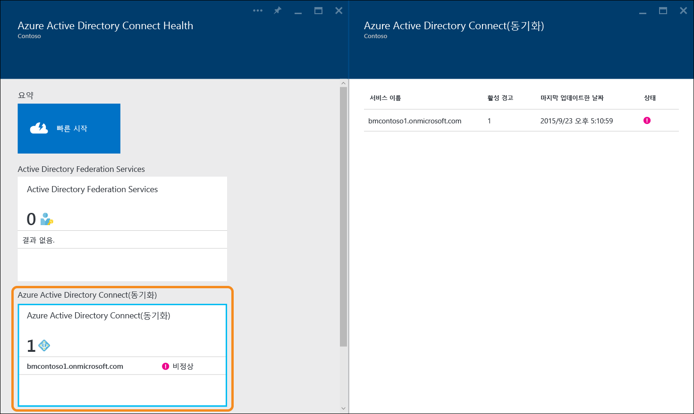
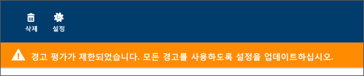
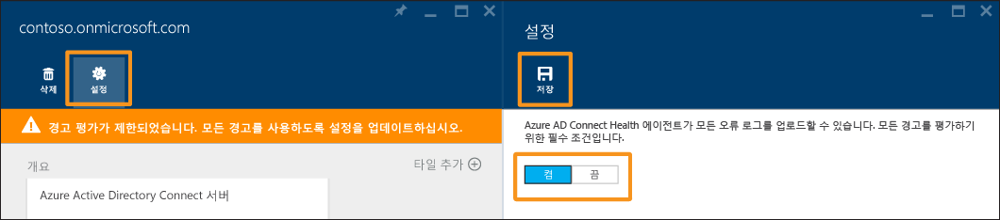

<properties
	pageTitle="동기화와 함께 Azure AD Connect Health 사용 | Microsoft Azure"
	description="Azure AD Connect 동기화를 모니터링하는 방법을 설명하는 Azure AD Connect Health 페이지입니다."
	services="active-directory"
	documentationCenter=""
	authors="billmath"
	manager="femila"
	editor="curtand"/>

<tags
	ms.service="active-directory"
	ms.workload="identity"
	ms.tgt_pltfrm="na"
	ms.devlang="na"
	ms.topic="get-started-article"
	ms.date="08/08/2016"
	ms.author="billmath"/>

# 동기화에 대한 Azure AD Connect Health 사용
다음 문서는 Azure AD Connect Health와 함께 Azure AD Connect (동기화) 모니터링에 중점을 둡니다. Azure AD Connect Health와 함께 AD FS 모니터링에 대한 내용은 [AD FS와 함께 Azure AD Connect Health 사용](active-directory-aadconnect-health-adfs.md)을 참조하세요. 또한 Azure AD Connect Health와 함께 Active Directory 도메인 서비스를 모니터링하는 방법에 대한 정보는 [AD DS와 함께 Azure AD Connect Health 사용](active-directory-aadconnect-health-adds.md)을 참조하세요.

## 동기화에 대한 Azure AD Connect Health에 대한 경고
동기화에 대한 Azure AD Connect Health 경고 섹션은 활성 경고 목록을 제공합니다. 각 경고에는 관련 정보, 해결 단계 및 관련된 설명서 링크가 포함됩니다. 활성 또는 해결된 경고를 선택하면 추가 정보는 물론, 경고를 해결하기 위해 수행할 수 있는 단계와 추가 설명서 링크가 포함된 새 블레이드가 표시됩니다. 과거에 해결된 경고에 대한 기록 데이터도 볼 수 있습니다.

경고를 선택하면 추가 정보는 물론 경고를 해결하기 위해 수행할 수 있는 단계와 추가 설명서 링크가 제공됩니다.

### 제한된 경고 평가
Azure AD Connect가 기본 구성을 사용하지 않으면(예: 특성 필터링이 기본 구성에서 사용자 지정 구성으로 변경된 경우) Azure AD Connect Health 에이전트가 Azure AD Connect와 관련된 오류 이벤트를 업로드하지 않습니다.

이로 인해 서비스의 경고 평가가 제한됩니다. Azure 포털에서 해당 서비스 아래에 이 조건을 나타내는 배너가 표시될 것입니다.

"설정"을 클릭하고 Azure AD Connect Health 에이전트가 모든 오류 로그를 업로드할 수 있도록 허용하여 구성을 변경할 수 있습니다.

## 동기화 정보
동기화에 대한 Azure AD Connect Health의 최신 릴리스에는 다음과 같은 새로운 기능이 추가되었습니다.

- 동기화 작업의 대기 시간
- 개체 변경 추세

### 동기화 대기 시간
이 기능은 커넥터에 대한 동기화 작업(가져오기, 내보내기, 등)의 대기 시간을 그래픽 추세로 표시니다. 작업의 대기 시간(변경 사항이 대규모인 경우 적합)뿐만 아니라 대기 시간에 좀 더 조사가 필요한 이상을 감지하는 방법을 빠르고 쉽게 이해하는 방법을 제공합니다.

기본적으로 Azure AD 커넥터에 대한 '내보내기' 작업의 대기 시간만 표시됩니다. 커넥터에 대한 더 많은 작업 또는 다른 커넥터에서 작업을 보려면 차트를 마우스 오른쪽 단추로 클릭하여 특정 작업 및 커넥터를 선택합니다.

### 동기화 개체 변경 사항
이 기능은 평가되어 Azure AD로 내보내진 변경 횟수를 그래픽 추세로 표시합니다. 오늘날, 동기화 로그에서 이러한 정보를 수집하는 것은 어려운 일입니다. 차트를 통해 사용자의 환경에서 발생하는 변경 횟수를 보다 간단하게 모니터링하는 방법뿐만 아니라 발생하는 오류를 시각적으로 볼 수 있습니다.

## 관련 링크

* [Azure AD Connect Health](active-directory-aadconnect-health.md)
* [Azure AD Connect Health Agent 설치](active-directory-aadconnect-health-agent-install.md)
* [Azure AD Connect Health 작업](active-directory-aadconnect-health-operations.md)
* [AD FS와 함께 Azure AD Connect Health 사용](active-directory-aadconnect-health-adfs.md)
* [AD DS와 함께 Azure AD Connect Health 사용](active-directory-aadconnect-health-adds.md)
* [Azure AD Connect Health FAQ](active-directory-aadconnect-health-faq.md)
* [Azure AD Connect Health 버전 내역](active-directory-aadconnect-health-version-history.md)

<!---HONumber=AcomDC_0928_2016-->