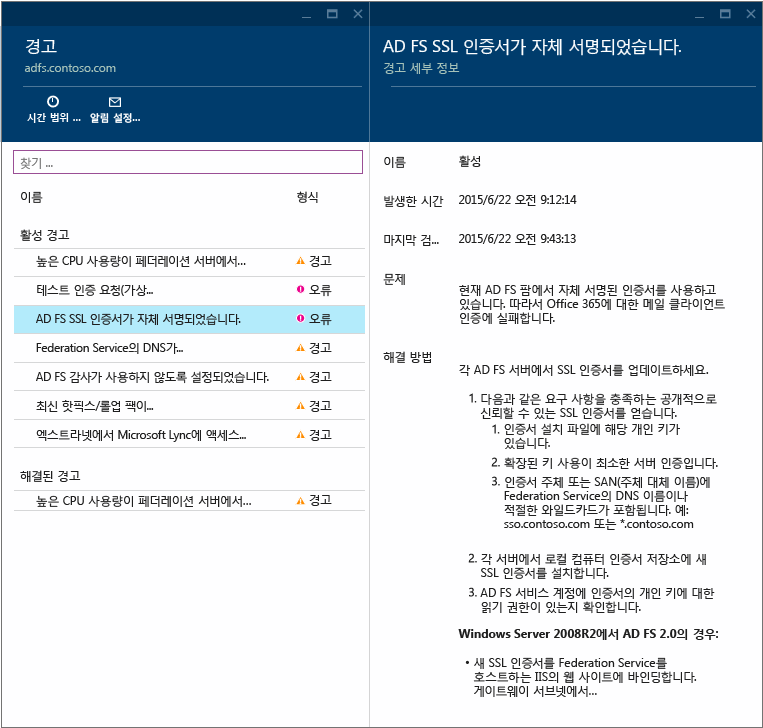
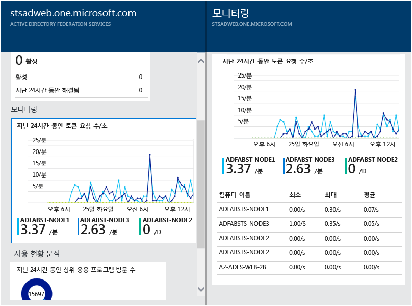
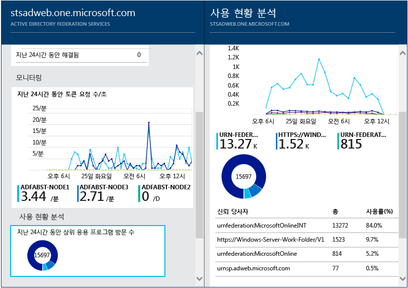

<properties 
	pageTitle="클라우드에서 온-프레미스 ID 인프라 모니터링" 
	description="사용되는 항목 및 이유를 설명하는 Azure AD Connect 상태 페이지입니다." 
	services="active-directory" 
	documentationCenter="" 
	authors="billmath" 
	manager="swadhwa" 
	editor="curtand"/>

<tags 
	ms.service="active-directory" 
	ms.workload="identity" 
	ms.tgt_pltfrm="na" 
	ms.devlang="na" 
	ms.topic="get-started-article" 
	ms.date="07/12/2015" 
	ms.author="billmath"/>

# 클라우드에서 온-프레미스 ID 인프라 모니터링

Azure AD Connect Health를 사용하면 온-프레미스 ID 인프라를 모니터링하고 통찰력을 얻을 수 있습니다. 경고, 성능, 사용 패턴, 구성 설정을 볼 수 있는 기능을 제공하며, Office 365에 대한 신뢰할 수 있는 연결을 유지할 수 있습니다. 이 대상 서버에 설치된 에이전트를 사용하여 수행됩니다. Azure AD Connect Health 요구 사항 및 설치에 대한 정보는[Azure AD Connect Health 요구 사항](active-directory-aadconnect-health-requirements.md)을 참조하세요.

이 정보는 Azure AD Connect Health 포털에 모두 표시됩니다. Azure AD Connect Health 포털을 사용하여 경고, 성능 모니터링 및 사용 현황 분석을 볼 수 있습니다. 이 정보는 필요한 정보를 찾느냐 시간을 낭비할 필요가 없도록 사용하기 쉽게 한 곳에 표시됩니다.

Azure AD Connect Health에 대한 이후 업데이트는 추가 모니터링 및 다른 ID 구성 요소 및 Azure AD Connect Sync services와 같은 서비스에 대한 통찰력을 포함합니다. ID의 렌즈를 통한 단일 대시보드를 제공하고 사용자가 작업을 완료하는 기능을 향상시킬 수 있도록 하는 훨씬 더 강력하고 정상적이며 통합된 환경을 활용합니다.

## Azure AD Connect Health를 사용하는 이유

Azure AD와 온-프레미스 디렉터리를 통합하면 온-프레미스 및 클라우드 리소스 모두에 액세스하기 위한 일반적인 ID를 제공하므로 사용자가 더 생산성을 높일 수 있습니다. 그러나 이 통합을 통해 사용자가 모든 장치에서 온-프레미스와 클라우드 모두의 리소스에 안정적으로 액세스할 수 있도록 이 환경이 정상적인지 확인해야 하는 문제가 있습니다. Azure AD Connect Health는 온-프레미스 ID 인프라에 대해 쉽게 모니터링하고 통찰력을 얻을 수 있는 클라우드 기반 접근 방식을 제공하여 Office 365 또는 다른 Azure AD 응용 프로그램에 액세스 하는데 사용됩니다. 각 온-프레미스 ID 서버에 에이전트를 설치하는 것만큼 간단합니다.

AD FS에 대한 Azure AD Connect Health는 Windows Server 2008/2008 R2에서 AD FS 2.0, Windows Server 2012/2012R2에서 AD FS를 지원합니다. 엑스트라넷 액세스에 대한 인증 지원을 제공하는 AD FS 프록시 또는 웹 응용 프로그램 프록시 서버도 포함됩니다. AD FS에 대한 Azure AD Connect Health는 다음과 같은 주요 기능 집합을 제공합니다.

- Azure AD를 포함하여 AD FS 보호된 응용 프로그램에 대한 안정적인 액세스에 대 한 경고를 보고 작업 수행
- 중요한 경고에 대한 전자 메일 알림
- 용량 계획을 확인하려면 성능 데이터 보기
- 잘못된 부분을 확인하거나 용량 계획에 대한 기준을 설정하여 AD FS 로그인 패턴의 상세 보기

다음 비디오는 Azure AD Connect Health에 대한 개요를 제공합니다.

[AZURE.VIDEO azure-ad-connect-health--monitor-you-identity-bridge]

## Azure 포털에서 Azure Active Directory Connect Health 처음 사용
Azure Active Directory Connect Health를 시작하려면 다음 단계를 수행합니다. Azure AD Connect Health 인스턴스에 데이터를 표시하려면 대상 서버에 Azure AD Connect Health Agent를 설치해야 합니다. Azure AD Connect Health Agent를 다운로드하려면 첫 번째 블레이드에서 빠른 시작 및 도구 가져오기를 선택합니다. 아래 링크를 사용하여 직접 에이전트를 다운로드할 수도 있습니다. Azure Active Directory Connect Health를 사용하려면 다음을 수행합니다.

1. [Microsoft Azure 포털](https://portal.azure.com/)에 로그인합니다.
2. Azure Active Directory Connect Health는 Marketplace로 이동하여 검색하거나 Marketplace를 선택하고 보안 + ID를 선택하여 액세스할 수 있습니다.
3. 소개 블레이드에서(블레이드는 전체 뷰의 한 부분입니다. 블레이드를 창 또는 플라이아웃으로 생각할 수 있습니다.) 만들기를 클릭합니다. 이렇게 하면 디렉터리 정보가 있는 다른 블레이드가 열립니다.
4. 디렉터리 블레이드에서 만들기를 클릭합니다. Azure AD Connect Health를 사용하려면 Azure Active Directory Premium 라이선스가 있어야 합니다. Azure AD Premium에 대한 정보는 Azure AD Premium 시작을 참조하세요.

## Azure Active Directory Connect Health 포털
Azure AD Connect Health 포털을 사용하여 경고, 성능 모니터링 및 사용 현황 분석을 볼 수 있습니다. Azure AD Connect Health에 처음 액세스하면 첫 번째 블레이드가 표시됩니다. 블레이드는 전체 뷰의 한 부분입니다. 블레이드를 창으로 생각할 수 있습니다. 표시되는 첫 번째 블레이드에는 빠른 시작, 서비스 및 구성이 나와 있습니다. 스크린샷 아래에는 이들 각각에 대해 간략한 설명이 있습니다.

- **빠른 시작** – 이 항목을 선택하면 빠른 시작 블레이드가 열립니다. 여기에서 도구 가져오기를 선택하여 Azure AD Connect Health Agent를 다운로드하고, 설명서에 액세스하고, 피드백을 제공할 수 있습니다.
- **Active Directory Federation Services** – Azure AD Connect Health에서 현재 모니터링하는 모든 AD FS 서비스를 나타냅니다. 이 섹션에 표시되는 옵션은 아래 섹션에서 설명합니다. Azure Active Directory Connect Health Services를 참조하세요.
- 구성 – 여기에서는 다음 옵션을 켜거나 끌 수 있습니다.
<ol>
1. 자동으로 Azure AD Connect Health Agent를 최신 버전으로 업데이트하는 자동 업데이트 - Azure AD Connect Health Agent의 최신 버전을 사용할 수 있게 되면 자동으로 업데이트됩니다. 이 옵션은 기본적으로 사용하도록 설정되어 있습니다.
2. Microsoft가 문제 해결을 위해서만 Azure AD 디렉터리 상태 데이터에 액세스할 수 있음 - 이 옵션을 사용하도록 설정하면 사용자에게 표시되는 것과 동일한 데이터를 Microsoft가 볼 수 있습니다. 이 옵션은 문제 해결 및 지원에 도움이 될 수 있습니다. 이 옵션은 기본적으로 사용하지 않도록 설정되어 있습니다.

## Azure Active Directory Connect Health Services
이 섹션에는 Azure AD Connect Health에서 모니터링하는 활성 서비스와 이러한 서비스의 인스턴스가 나타납니다. 줄임표를 클릭하면 인스턴스가 모두 표시될 블레이드가 열립니다.

인스턴스 중 하나를 선택하면 Azure AD Connect Health가 해당 서비스 인스턴스에 대한 정보가 있는 블레이드를 엽니다. 여기에는 인스턴스에 대한 다양한 정보가 있습니다. 개요, 속성, 경고, 모니터링 및 사용 현황 분석이 이러한 정보에 포함됩니다. 이에 대한 정보는 이 페이지 맨 위의 후속 섹션 링크를 참조 하세요.

----------------------------------------------------------------------------------------------------------
## Azure AD Connect Health 에이전트 다운로드

Azure AD Connect Health를 사용하여 시작하려면 [Azure AD Connect Health 에이전트 다운로드](http://go.microsoft.com/fwlink/?LinkID=518973)를 사용하여 최신 버전을 다운로드할 수 있습니다. 에이전트를 설치하기 전에 Marketplace에서 추가 확인합니다.

----------------------------------------------------------------------------------------------------------

## Azure Active Directory Connect Health 경고
Azure AD Connect Health 경고 섹션은 활성 경고 목록을 제공합니다. 각 경고에는 관련 정보, 해결 단계 및 관련된 설명서 링크가 포함됩니다. 활성 또는 해결된 경고를 선택하면 추가 정보는 물론, 경고를 해결하기 위해 수행할 수 있는 단계와 추가 설명서 링크가 포함된 새 블레이드가 표시됩니다. 과거에 해결된 경고에 대한 기록 데이터도 볼 수 있습니다.

경고를 선택하면 추가 정보는 물론 경고를 해결하기 위해 수행할 수 있는 단계와 추가 설명서 링크가 제공됩니다.

## Azure Active Directory Connect Health 성능 모니터링
Azure AD Connect Health 성능 모니터링은 메트릭에 대한 모니터링 정보를 제공합니다. 모니터링 상자를 선택하면 메트릭에 대한 자세한 정보를 제공하는 블레이드가 열립니다.

블레이드 맨 위의 옵션을 선택하여 서버별로 필터링하면 개별 서버의 메트릭을 확인할 수 있습니다. 메트릭을 변경하려면 간단히 모니터링 블레이드 아래 모니터링 차트를 마우스 오른쪽 단추로 클릭하고 차트 편집을 선택합니다. 그런 다음 열리는 새 블레이드의 드롭다운에서 추가 메트릭을 선택하여 성능 데이터를 볼 시간 범위를 지정할 수 있습니다.

## Azure Active Directory Connect Health 사용 현황 분석 및 보고서
Azure AD Connect Health 사용 현황 분석에서는 페더레이션 서버의 인증 트래픽을 분석합니다. 사용 현황 분석 상자를 선택하면 메트릭 및 그룹화가 표시된 사용 현황 분석 블레이드가 열립니다.

>[AZURE.NOTE]AD FS가 포함된 사용 현황 분석을 사용하려면 AD FS 감사가 사용하도록 설정되어 있어야 합니다. 자세한 내용은 Azure AD Connect Health 요구 사항을 참조하세요.

추가 메트릭을 선택하거나, 시간 범위를 지정하거나, 그룹화를 변경하려면 간단히 사용 현황 분석 차트를 마우스 오른쪽 단추로 클릭하고 차트 편집을 선택합니다. 그러면 시간 범위를 지정하고, 메트릭을 변경하거나 선택하고, 그룹화를 변경할 수 있습니다. 서로 다른 "메트릭"을 기준으로 인증 트래픽 분포를 보고 아래 설명된 관련 "그룹화 기준" 매개 변수를 사용하여 각 메트릭을 그룹화할 수 있습니다.

| 메트릭 | 그룹화 기준 | 그룹화의 의미 및 그룹화가 유용한 이유 |
| ------ | -------- | -------------------------------------------- |
| 전체 요청: 페더레이션 서비스에서 처리하는 전체 요청 수 | 모두 | 요청을 그룹화하지 않고 전체 요청 수를 표시합니다. |
| | 응용 프로그램 | 이 옵션은 대상 신뢰 당사자를 기준으로 전체 요청을 그룹화합니다. 이 그룹화는 전체 트래픽 중 응용 프로그램이 수신하는 트래픽의 비율을 이해하는 데 유용합니다. |
| | 서버 | 이 옵션은 요청을 처리한 서버를 기준으로 전체 요청을 그룹화합니다. 이 그룹화는 전체 트래픽의 부하 분포를 이해하는 데 유용합니다. |
| | 작업 공간 연결 | 이 옵션은 전체 요청을 작업 공간이 연결된(알려진) 장치의 요청인지 아닌지를 기준으로 그룹화합니다. 이 그룹화는 ID 인프라에 알려지지 않은 장치를 사용하여 리소스에 액세스하는 경우를 이해하는 데 유용합니다. |
| | 인증 방법 | 이 옵션은 인증에 사용된 인증 방법을 기준으로 전체 요청을 그룹화합니다. 이 그룹화는 인증에 사용되는 일반적인 인증 방법을 이해하는 데 유용합니다. 가능한 인증 방법은 다음과 같습니다. <ol> <li>Windows 통합 인증(Windows)</li> <li>양식 기반 인증(양식)</li> <li>SSO(Single Sign On)</li> <li>X509 인증서 인증(인증서)</li>  페더레이션 서버가 SSO 쿠키와 함께 요청을 수신하면 해당 요청은 SSO(Single Sign On)로 간주됩니다. 이 경우 쿠키가 유효하면 사용자는 자격 증명을 입력할 필요 없이 효율적으로 응용 프로그램에 액세스할 수 있습니다. 페더레이션 서버에서 여러 신뢰 당사자를 보호하는 경우 일반적으로 사용됩니다. |
| | 네트워크 위치 | 이 옵션은 사용자의 네트워크 위치를 기준으로 전체 요청을 그룹화합니다. 네트워크 위치는 인트라넷 또는 엑스트라넷이 될 수 있습니다. 이 그룹화는 인트라넷 트래픽과 엑스트라넷 트래픽의 비율을 파악하는 데 유용합니다. |
| 전체 실패한 요청: 페더레이션 서비스에서 처리하는 전체 실패한 요청 수  이 메트릭은 Windows Server 2012 R2 용 AD FS에서만 사용할 수 있습니다.| 오류 유형 | 미리 정의된 오류 유형을 기준으로 오류 수를 표시합니다. 이 그룹화는 오류의 일반적인 유형을 이해하는 데 유용합니다. <ul><li>잘못된 사용자 이름 또는 암호: 잘못된 사용자 이름 또는 암호로 인해 발생하는 오류입니다.</li> <li>"엑스트라넷 잠김": 엑스트라넷에서 잠겨 있는 사용자로부터 요청을 수신하여 발생하는 오류입니다. </li><li> "만료된 암호": 사용자가 만료된 암호로 로그인을 시도하여 발생하는 오류입니다.</li><li>"사용하지 않는 계정": 사용자가 사용하지 않는 계정으로 로그인을 시도하여 발생하는 오류입니다.</li><li>"장치 인증": 사용자가 장치 인증으로 인증을 받지 못하여 발생하는 오류입니다.</li><li>"사용자 인증서 인증": 사용자가 잘못된 인증서로 인해 인증에 실패하여 발생하는 오류입니다.</li><li>"MFA": 사용자가 Multi Factor Authentication으로 인증을 받지 못하여 발생하는 오류입니다.</li><li>"기타 자격 증명": "발급 권한 부여": 권한 부여 실패로 인해 발생하는 오류입니다.</li><li>"발급 위임": 발급 위임 오류로 인해 발생하는 오류입니다.</li><li>"토큰 수용": ADFS가 타사 ID 공급자의 토큰을 거부해서 발생하는 오류입니다.</li><li>""프로토콜": 프로토콜 오류로 인해 발생하는 오류입니다.</li><li>"알 수 없음": 포괄적인 오류입니다. 정의된 카테고리에 맞지 않는 다른 모든 오류입니다.</li> |
| | 서버 | 서버를 기준으로 오류를 그룹화합니다. 서버 전체의 오류 분포를 파악하는 데 유용합니다. 분포가 균일하지 않으면 특정 서버에 문제가 있음을 나타낼 수 있습니다. |
| | 네트워크 위치 | 요청의 네트워크 위치(인트라넷 및 엑스트라넷)를 기준으로 오류를 그룹화합니다. 실패하는 요청의 유형을 이해하는 데 유용합니다. |
| | 응용 프로그램 | 대상 응용 프로그램(신뢰 당사자)을 기준으로 오류를 그룹화합니다. 오류가 가장 많이 발생하는 대상 응용 프로그램을 파악하는 데 유용합니다. |
| 사용자 수: 시스템에서 활성 상태인 고유 사용자 수 평균 | 모두 | 선택한 시간 조각에서 페더레이션 서비스를 사용하는 사용자 수 평균을 제공합니다. 사용자가 그룹화되지 않습니다.  평균은 선택한 시간 조각에 따라 달라집니다. |
| | 응용 프로그램 | 대상 응용 프로그램(신뢰 당사자)을 기준으로 평균 사용자 수를 그룹화합니다. 얼마나 많은 사용자가 어떤 응용 프로그램을 사용하는지 파악하는 데 유용합니다. |

## 다음 단계
Azure AD Connect Health를 시작하려면 [Azure AD Connect Health 요구 사항](active-directory-aadconnect-health-requirements.md)을 참조하세요. 에이전트가 설치되어 데이터를 수집하면 [Azure AD Connect Health 작업](active-directory-aadconnect-health-operations.md)에서 Azure AD Connect Health 구성에 대한 자세한 내용을 확인하거나 [FAQ](active-directory-aadconnect-health-faq.md)를 확인합니다.

**추가 리소스**

* [MSDN의 Azure AD Connect Health](https://msdn.microsoft.com/library/azure/dn906722.aspx)

 

<!---HONumber=August15_HO6-->