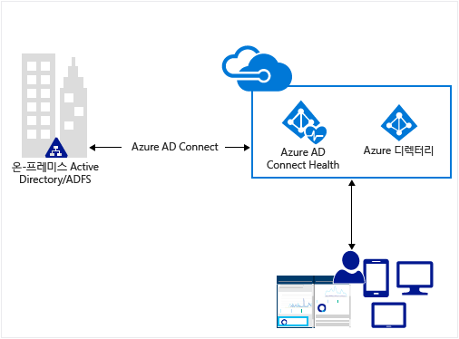
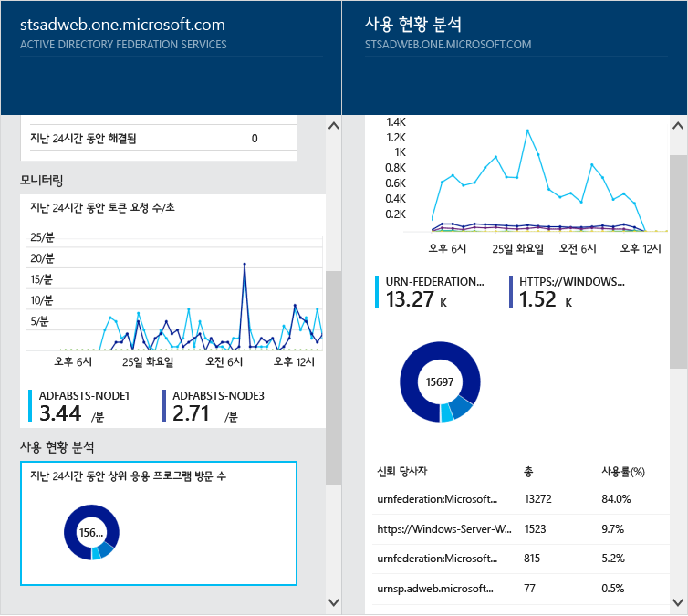
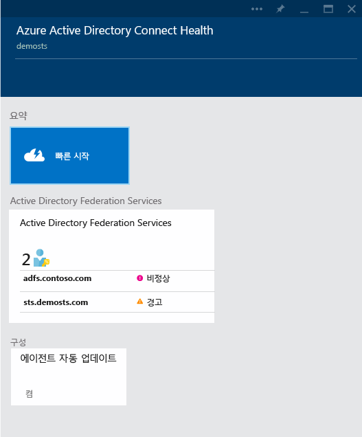

<properties
	pageTitle="클라우드에서 온-프레미스 ID 인프라 모니터링"
	description="사용되는 항목 및 이유를 설명하는 Azure AD Connect 상태 페이지입니다."
	services="active-directory"
	documentationCenter=""
	authors="billmath"
	manager="stevenpo"
	editor="curtand"/>

<tags
	ms.service="active-directory"
	ms.workload="identity"
	ms.tgt_pltfrm="na"
	ms.devlang="na"
	ms.topic="get-started-article"
	ms.date="01/21/2016"
	ms.author="billmath"/>

# 온-프레미스 ID 인프라 및 클라우드 동기화 서비스를 모니터링합니다.

Azure AD Connect Health를 사용하면 온-프레미스 ID 인프라를 모니터링하고 파악할 수 있으며 Azure AD Connect를 통해 동기화 서비스를 사용할 수 있습니다. 경고, 성능, 사용 패턴, 구성 설정을 볼 수 있는 기능을 제공하며, Office 365에 대한 신뢰할 수 있는 연결을 유지할 수 있습니다. 이 대상 서버에 설치된 에이전트를 사용하여 수행됩니다.

이 정보는 Azure AD Connect Health 포털에 모두 표시됩니다. Azure AD Connect Health 포털을 사용하여 경고, 성능 모니터링 및 사용 현황 분석을 볼 수 있습니다. 이 정보는 필요한 정보를 찾느냐 시간을 낭비할 필요가 없도록 사용하기 쉽게 한 곳에 표시됩니다.

Azure AD Connect Health에 대한 이후 업데이트는 추가 모니터링 및 다른 ID 구성 요소에 대한 통찰력을 포함합니다. ID의 렌즈를 통한 단일 대시보드를 제공하고 사용자가 작업을 완료하는 기능을 향상시킬 수 있도록 하는 훨씬 더 강력하고 정상적이며 통합된 환경을 활용합니다.

## Azure AD Connect Health를 사용하는 이유

Azure AD와 온-프레미스 디렉터리를 통합하면 온-프레미스 및 클라우드 리소스 모두에 액세스하기 위한 일반적인 ID를 제공하므로 사용자가 더 생산성을 높일 수 있습니다. 그러나 이 통합을 통해 사용자가 모든 장치에서 온-프레미스와 클라우드 모두의 리소스에 안정적으로 액세스할 수 있도록 이 환경이 정상적인지 확인해야 하는 문제가 있습니다. Azure AD Connect Health는 온-프레미스 ID 인프라에 대해 쉽게 모니터링하고 통찰력을 얻을 수 있는 클라우드 기반 접근 방식을 제공하여 Office 365 또는 다른 Azure AD 응용 프로그램에 액세스 하는데 사용됩니다. 각 온-프레미스 ID 서버에 에이전트를 설치하는 것만큼 간단합니다.

AD FS에 대한 Azure AD Connect Health는 Windows Server 2008/2008 R2에서 AD FS 2.0, Windows Server 2012/2012R2에서 AD FS를 지원합니다. 엑스트라넷 액세스에 대한 인증 지원을 제공하는 AD FS 프록시 또는 웹 응용 프로그램 프록시 서버도 포함됩니다. AD FS에 대한 Azure AD Connect Health는 다음과 같은 주요 기능 집합을 제공합니다.

- Azure AD를 포함하여 AD FS 보호된 응용 프로그램에 대한 안정적인 액세스에 대 한 경고를 보고 작업 수행
- 중요한 경고에 대한 전자 메일 알림
- 용량 계획을 확인하려면 성능 데이터 보기
- 잘못된 부분을 확인하거나 용량 계획에 대한 기준을 설정하여 AD FS 로그인 패턴의 상세 보기

동기화에 대한 Azure AD Connect Health는 온-프레미스 Active Directory와 Azure Active Directory 간에 발생하는 동기화에 대한 정보를 모니터링하고 제공합니다. 동기화에 대한 Azure AD Connect Health는 다음과 같은 주요 기능 집합을 제공합니다.

- 온-프레미스 인프라 및 Azure Active Directory 간의 신뢰할 수 있는 동기화를 보장하기 위해 경고에 대해 보고 조치를 취합니다.
- 중요한 경고에 대한 전자 메일 알림
- 성능 데이터 보기

다음 비디오는 Azure AD Connect Health에 대한 개요를 제공합니다.

[AZURE.VIDEO azure-ad-connect-health--monitor-you-identity-bridge]

## Azure 포털에서 시작합니다.
Azure Active Directory Connect Health를 시작하려면 다음 단계를 수행합니다.

1. [Microsoft Azure 포털](https://portal.azure.com/)에 로그인합니다.
2. Azure Active Directory Connect Health는 Marketplace로 이동하여 검색하거나 Marketplace를 선택하고 보안 + ID를 선택하여 액세스할 수 있습니다.
3. 소개 블레이드에서(블레이드는 전체 뷰의 한 부분입니다. 블레이드를 창 또는 플라이아웃으로 생각할 수 있습니다.) **만들기**를 클릭합니다. 이렇게 하면 디렉터리 정보가 있는 다른 블레이드가 열립니다.
4. 디렉터리 블레이드에서 **만들기**를 클릭합니다. Azure AD Connect Health를 사용하려면 Azure Active Directory Premium 라이선스가 있어야 합니다. Azure AD Premium에 대한 정보는 Azure AD Premium 시작을 참조하세요.

>[AZURE.NOTE]Azure AD Connect Health 인스턴스에 데이터를 표시하려면 대상 서버에 Azure AD Connect Health Agent를 설치해야 합니다. Azure AD Connect Health Agent를 다운로드하려면 첫 번째 블레이드에서 빠른 시작 및 도구 가져오기를 선택합니다. 아래 [링크](#download-the-agent)를 사용하여 직접 에이전트를 다운로드할 수도 있습니다. Azure Active Directory Connect Health를 사용하려면 다음을 수행합니다.

### Azure AD Connect Health 포털 및 서비스
Azure AD Connect Health 포털을 사용하여 경고, 성능 모니터링 및 사용 현황 분석을 볼 수 있습니다. Azure AD Connect Health에 처음 액세스하면 첫 번째 블레이드가 표시됩니다. 블레이드를 창으로 생각할 수 있습니다. 표시되는 첫 번째 블레이드에는 빠른 시작, 서비스 및 구성이 나와 있습니다. 스크린샷 아래에는 이들 각각에 대해 간략한 설명이 있습니다. 서비스 섹션에서는 활성화 된 서비스 및 Azure AD Connect Health가 모니터링하는 서비스의 인스턴스를 보여줍니다.

- **빠른 시작** – 이 항목을 선택하면 빠른 시작 블레이드가 열립니다. 여기에서 도구 가져오기를 선택하여 Azure AD Connect Health Agent를 다운로드하고, 설명서에 액세스하고, 피드백을 제공할 수 있습니다.
- **Active Directory Federation Services** – Azure AD Connect Health에서 현재 모니터링하는 모든 AD FS 서비스를 나타냅니다. 인스턴스 중 하나를 선택하면, 서비스 인스턴스에 대한 정보가 포함된 블레이드가 열립니다. 개요, 속성, 경고, 모니터링 및 사용 현황 분석이 이러한 정보에 포함됩니다. 
- 구성 – 여기에서는 다음 옵션을 켜거나 끌 수 있습니다.
<ol>
1. 자동으로 Azure AD Connect Health Agent를 최신 버전으로 업데이트하는 자동 업데이트 - Azure AD Connect Health Agent의 최신 버전을 사용할 수 있게 되면 자동으로 업데이트됩니다. 이 옵션은 기본적으로 사용하도록 설정되어 있습니다.
2. Microsoft가 문제 해결을 위해서만 Azure AD 디렉터리 상태 데이터에 액세스할 수 있음 - 이 옵션을 사용하도록 설정하면 사용자에게 표시되는 것과 동일한 데이터를 Microsoft가 볼 수 있습니다. 이 옵션은 문제 해결 및 지원에 도움이 될 수 있습니다. 이 옵션은 기본적으로 사용하지 않도록 설정되어 있습니다.

## 요구 사항
다음 표는 Azure AD Connect Health를 진행하기 전에 충족시켜야 하는 요구 사항 목록입니다.

| 요구 사항 | 설명|
| ----------- | ---------- |
|Azure AD Premium| Azure AD Connect Health는 Azure AD Premium 기능이기 때문에 Azure AD Premium이 필요합니다.   자세한 내용은 [Azure AD Premium 시작하기](active-directory-get-started-premium.md)를 참조하십시오.  30일 무료 평가판을 시작하려면 [평가판 시작](https://azure.microsoft.com/trial/get-started-active-directory/)을 참조하세요.|.
|사용자는 Azure AD Connect Health를 사용할(만들) 수 있는 Azure AD의 전역 관리자일 것입니다.|기본적으로 전역 관리자만이 Azure AD Connect Health 내에서 모든 정보를 사용하고(만들고) 액세스하며 모든 작업을 수행할 수 있습니다. 자세한 내용은 [Azure AD 디렉터리 관리](active-directory-administer.md)를 참조하세요.    역할 기반 액세스 제어를 사용하여 조직에서 다른 사용자에게 Azure AD Connect Health에 액세스할 수 있습니다. 자세한 내용은 [Azure AD Connect Health용 역할 기반 액세스 제어](active-directory-aadconnect-health-operations.md#manage-access-with-role-based-access-control)를 참조하세요.   **중요:** 에이전트를 설치할 때 사용하는 계정은 필히 작업 또는 조직 계정 <!--school account-->이어야 하며 Microsoft 계정은 사용할 수 없습니다. 자세한 내용은 [조직으로 Azure 등록](sign-up-organization.md)을 참조하세요.|
|AD FS의 경우 AD FS 감사에서 사용 현황 분석을 사용하도록 설정되어 있어야 함| AD FS로 사용 현황 분석을 사용하려는 경우, AD FS 감사를 사용해야 합니다.   [AD FS용 Azure AD Connect Health Agent 설치](active-directory-aadconnect-health-agent-install.md#installing-the-azure-ad-connect-health-agent-for-ad-fs)를 참조하세요.
|Azure AD Connect Health Agent 요구사항을 충족합니다.|에이전트의 특정 요구 사항은 아래 표를 참조하십시오.

다음 표는 Azure AD Connect Health를 진행하기 전에 충족시켜야 하는 에이전트 요구 사항 목록입니다.

| 요구 사항 | 설명|
| ----------- | ---------- |
|각 대상 서버에 설치된 Azure AD Connect Health Agent| Azure AD Connect Health는 포털에 표시되는 데이터를 제공하기 위해 대상 서버에 에이전트를 설치할 것을 요구합니다.   예를 들어, AD FS 온-프레미스 인프라에서 데이터를 얻기 위해 에이전트는 AD FS 서버에 설치되어야 합니다. 여기에는 AD FS 프록시 서버와 웹 응용 프로그램 프록시 서버가 포함됩니다.   에이전트 설치에 대한 자세한 내용은 [Azure AD Connect Health 에이전트 설치](active-directory-aadconnect-health-agent-install.md)를 참조하세요.  **중요:** 에이전트를 설치할 때 사용하는 계정은 필히 작업 또는 조직 계정이어야 하며 Microsoft 계정은 사용할 수 없습니다. 자세한 내용은 [조직으로 Azure 등록](sign-up-organization.md)을 참조하세요.|
|동기화에 대한 Azure AD Connect Health Agent| 이 에이전트는 Azure AD Connect의 최신 버전으로 자동으로 설치됩니다.   바로 시작하는 경우 다른 작업을 수행할 필요가 없습니다. 에이전트는 Azure AD Connect를 설치할 때 설치됩니다.   Azure AD Connect를 이미 설치한 경우 [여기](http://www.microsoft.com/download/details.aspx?id=47594)에서 다운로드할 수 있는 최신 버전으로 업그레이드해야 합니다.
|Azure 서비스 끝점에 대한 아웃바운드 연결|에이전트는 설치 및 런타임 중에 아래 나열된 Azure AD Connect Health 서비스 끝점에 연결되어야 합니다. 아웃바운드 연결을 차단하는 경우 다음 항목이 허용 목록에 추가되어 있는지 확인합니다.  <li>**new**: https://management.azure.com </li><li>**new**: &#42;.blob.core.windows.net </li><li>**new**: &#42;.queue.core.windows.net</li><li>&#42;.servicebus.windows.net - Port: 5671</li><li>https://&#42;.adhybridhealth.azure.com/</li><li>https://&#42;.table.core.windows.net/</li><li>https://policykeyservice.dc.ad.msft.net/</li><li>https://login.windows.net</li><li>https://login.microsoftonline.com</li><li>https://secure.aadcdn.microsoftonline-p.com</li> |
|에이전트를 실행하는 서버의 방화벽 포트| 에이전트가 Azure AD Health 서비스 끝점과 통신하기 위해 다음 방화벽 포트를 열어놓아야 합니다.  <li>TCP/UDP port 80</li><li>TCP/UDP port 443</li><li>TCP/UDP port 5671</li>
|IE 보안 강화를 사용하는 경우 다음 웹 사이트 허용|에이전트가 설치될 서버에서 IE 보안 강화를 사용하도록 설정되어 있는 경우 다음 웹 사이트를 허용해야 합니다.  <li>https://login.microsoftonline.com</li><li>https://secure.aadcdn.microsoftonline-p.com</li><li>https://login.windows.net</li><li>Azure Active Directory에 의해 신뢰할 수 있는 조직의 페더레이션 서버의 예:https://sts.contoso.com</li>

## 에이전트 다운로드

시작하려면 다음 중 하나를 수행합니다.

- AD FS에 대한 Azure AD Connect Health를 사용하여 시작하려면 [AD FS에 대한 Azure AD Connect Health 에이전트 다운로드](http://go.microsoft.com/fwlink/?LinkID=518973)를 사용하여 최신 버전을 다운로드할 수 있습니다. 에이전트를 설치하기 전에 Marketplace에서 추가 확인합니다.
- 동기화에 대한 Azure AD Connect Health를 사용하여 시작하려면Azure AD Connect의 최신 버전을 다운로드하고 설치합니다. 상태 에이전트는 Azure AD Connect 설치의 일부로 설치됩니다. Azure AD Connect는 이전 버전에서 전체 업그레이드를 지원합니다.

## 관련 링크

* [Azure AD Connect Health Agent 설치](active-directory-aadconnect-health-agent-install.md)
* [Azure AD Connect Health 작업](active-directory-aadconnect-health-operations.md)
* [AD FS와 함께 Azure AD Connect Health 사용](active-directory-aadconnect-health-adfs.md)
* [동기화에 대한 Azure AD Connect Health 사용](active-directory-aadconnect-health-sync.md)
* [Azure AD Connect Health FAQ](active-directory-aadconnect-health-faq.md)

<!---HONumber=AcomDC_0128_2016-->