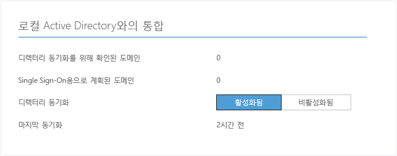
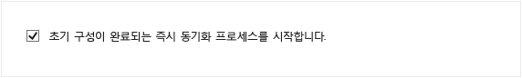

<properties
	pageTitle="Azure AD Connect 관리 | Microsoft Azure"
	description="Azure AD Connect에 대한 기본 구성 및 운영 작업을 확장하는 방법을 알아봅니다."
	services="active-directory"
	documentationCenter=""
	authors="billmath"
	manager="stevenpo"
	editor="curtand"/>

<tags
	ms.service="active-directory"
	ms.workload="identity"
	ms.tgt_pltfrm="na"
	ms.devlang="na"
	ms.topic="article"
	ms.date="10/01/2015"
	ms.author="billmath"/>

# Azure AD Connect 관리
다음은 조직 요구 사항 및 요건에 부합하도록 Azure Active Directory Connect를 사용자 지정할 수 있는 고급 운영에 대해 설명합니다.

## Azure AD Premium 및 엔터프라이즈 이동성 사용자에게 라이선스 할당

이제 사용자가 클라우드로 동기화되었으므로, Office 365와 같은 클라우드 앱으로 작업할 수 있도록 라이선스를 할당해야 합니다.

### Azure AD Premium 또는 엔터프라이즈 이동성 제품군 라이선스를 할당하려면
--------------------------------------------------------------------------------
1. 관리자 권한으로 Azure 포털에 로그인합니다.
2. 왼쪽 창에서 **Active Directory**를 선택합니다.
3. Active Directory 페이지에서 사용하도록 설정하려는 사용자가 있는 디렉토리를 두 번 클릭합니다.
4. 디렉토리 페이지의 맨 위에서 **라이센스**를 선택합니다.
5. 라이선스 페이지에서 Active Directory Premium 또는 엔터프라이즈 이동성 제품군을 선택한 후 **할당**을 클릭합니다.
6. 대화 상자에서 라이선스를 할당하려는 사용자를 선택 하고 확인 표시 아이콘을 클릭하여 변경 내용을 저장합니다.

## 예약된 동기화 작업 확인
동기화의 상태를 확인하려는 경우 Azure 포털에서 선택하여 수행할 수 있습니다.

### 예약된 동기화 작업을 확인하려면
--------------------------------------------------------------------------------
1. 관리자 권한으로 Azure 포털에 로그인합니다.
2. 왼쪽 창에서 **Active Directory**를 선택합니다.
3. Active Directory 페이지에서 사용하도록 설정하려는 사용자가 있는 디렉토리를 두 번 클릭합니다.
4. 디렉토리 페이지의 맨 위에서 **디렉토리 통합**을 선택합니다.
5. 로컬 활성 디렉토리로 통합하여 마지막 동기화 시간을 참고합니다.

## 예약된 동기화 작업 시작
동기화 작업을 실행해야하는 경우, Azure AD Connect 마법사를 다시 실행하여 이를 수행할 수 있습니다. Azure AD 자격 증명을 제공해야 합니다. 마법사에서 **동기화 옵션 사용자 지정** 작업을 선택하고 마법사를 통해 다음을 클릭합니다. 끝에서 **구성이 완료되자마자 동기화 프로세스를 시작합니다.**가 선택한 상태인지 확인합니다.

## Azure AD Connect에서 사용할 수 있는 추가 작업
Azure AD Connect의 초기 설치 후, Azure AD Connect 시작 페이지 또는 바탕 화면 바로 가기에서 항상 마법사를 다시 시작할 수 있습니다. 마법사를 다시 실행하면 몇가지 새로운 옵션이 추가 작업의 형태로 제공됩니다.

다음 테이블에서는 각각에 대해 간략한 설명과 이 작업에 대한 요약을 제공합니다.

추가 작업 | 설명
------------- | ------------- |
선택한 시나리오 보기 |현재 Azure AD Connect 솔루션을 볼 수 있습니다. 일반 설정, 동기화된 디렉토리, 동기화 설정 등을 포함합니다.
동기화 옵션 사용자 지정 | 추가 Active Directory 포리스트를 구성에 추가 또는 사용자, 그룹, 장치나 암호 쓰기 저장과 같은 동기화 옵션 사용을 포함한 현재 구성을 변경할 수 있습니다.
스테이징 모드 사용 | 이 모드를 사용하면 나중에 동기화되는 스정보를 스테이징할 수 있지만 Azure AD 또는 Active Directory로 내보내지지 않습니다. 이렇게 하면 발생하기 전에 동기화를 미리볼 수 있습니다.

## 다음 단계
[Azure Active Directory와 온-프레미스 ID 통합](active-directory-aadconnect.md)에 대해 자세히 알아봅니다.

<!---HONumber=Oct15_HO3-->