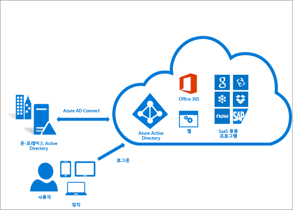
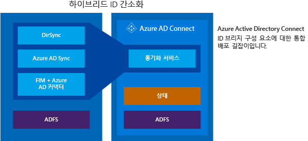

<properties
	pageTitle="Azure AD Connect: Azure Active Directory와 온-프레미스 ID 통합 | Microsoft Azure"
	description="Azure AD Connect는 온-프레미스 디렉터리와 Azure Active Directory를 통합니다. 이렇게 하면 Azure AD와 통합된 Office 365, Azure 및 SaaS 응용 프로그램에 대한 공통 ID를 제공할 수 있습니다."
    keywords="Azure AD Connect 소개, Azure AD Connect 개요, Azure AD Connect 정의, active directory 설치"
	services="active-directory"
	documentationCenter=""
	authors="andkjell"
	manager="femila"
	editor=""/>

<tags
	ms.service="active-directory"
	ms.workload="identity"
	ms.tgt_pltfrm="na"
	ms.devlang="na"
	ms.topic="get-started-article"
	ms.date="07/14/2016"
	ms.author="andkjell;billmath"/>

# Azure Active Directory와 온-프레미스 ID 통합
Azure AD Connect는 온-프레미스 디렉터리와 Azure Active Directory를 통합니다. 이렇게 하면 Azure AD와 통합된 Office 365, Azure 및 SaaS 응용 프로그램 사용자를 위한 공통 ID를 제공할 수 있습니다. 이 항목은 계획, 배포 및 운영 단계를 안내합니다. 이 영역과 관련된 항목으로 연결되는 링크 컬렉션입니다.

<!-- The hardcoded link is a workaround for campaign ids not working in acom links-->

> [AZURE.IMPORTANT] [Azure AD Connect는 온-프레미스 디렉터리를 Azure AD와 Office 365에 연결하는 가장 좋은 방법입니다. 이제 이러한 도구가 사용되지 않으며 2017년 4월 13일에 지원이 종료될 예정이므로 Microsoft Azure Active Directory 동기화(DirSync) 또는 Azure AD Sync에서 Azure AD Connect로 지금 업그레이드하는 것이 좋습니다.](https://azure.microsoft.com/documentation/articles/active-directory-aadconnect-dirsync-deprecated/?WT.mc_id=DirSyncDepACOM)

## Azure AD Connect를 사용하는 이유
Azure AD와 온-프레미스 디렉터리를 통합하면 온-프레미스 및 클라우드 리소스 모두에 액세스하기 위한 일반적인 ID를 제공하므로 사용자가 더 생산성을 높일 수 있습니다. 사용자와 조직은 다음과 같은 이점을 얻을 수 있습니다.

- 사용자는 단일 ID를 사용하여 온-프레미스 응용 프로그램 및 Office 365와 같은 클라우드 서비스에 액세스할 수 있습니다.

- 동기화 및 로그인에 대해 간편한 배포 환경을 제공하는 단일 도구입니다.

- 시나리오에 대한 최신 기능을 제공합니다. Azure AD Connect는 DirSync 및 Azure AD Sync와 같은 이전 버전의 ID 통합 도구를 대체합니다. 자세한 내용은 [하이브리드 ID 디렉터리 통합 도구 비교](active-directory-hybrid-identity-design-considerations-tools-comparison.md)를 참조하세요.

### Azure AD Connect 작동 방법
Azure Active Directory Connect는 동기화 서비스, 선택적인 Active Directory Federation Services 구성 요소, [Azure AD Connect Health](active-directory-aadconnect-health.md)라는 이름의 모니터링 구성 요소, 이렇게 세 가지 주요 구성 요소로 구성됩니다.

 

- 동기화 - 이 구성 요소는 사용자, 그룹 및 기타 개체 생성을 담당합니다. 온-프레미스 사용자 및 그룹의 ID 정보가 클라우드와 일치하도록 만드는 것도 담당합니다.
- AD FS - 페더레이션은 Azure AD Connect의 선택적 부분이며 온-프레미스 AD FS 인프라를 사용하여 하이브리드 환경을 구성하는 데 사용할 수 있습니다. 이것은 조직에서 도메인 가입 SSO, AD 로그인 정책 강화, 스마트 카드나 타사 MFA 등과 같은 복잡한 배포를 처리하는 데 사용될 수 있습니다.
- 상태 모니터링 - Azure AD Connect Health는 강력한 모니터링을 제공하고 Azure 포털에서 중앙 위치를 제공하여 이 활동을 볼 수 있습니다. 자세한 내용은 [Azure Active Directory Connect Health](active-directory-aadconnect-health.md)를 참조하세요.

## Azure AD Connect 설치

[Microsoft 다운로드 센터](http://go.microsoft.com/fwlink/?LinkId=615771)에서 Azure AD Connect를 다운로드할 수 있습니다 .

해결 방법 | 시나리오
----- | ----- |
시작하기 전에 - [하드웨어 및 필수 구성 요소](active-directory-aadconnect-prerequisites.md) | <li>Azure AD Connect 설치를 시작하기 전에 완료할 단계입니다.</li>
[Express 설정](active-directory-aadconnect-get-started-express.md) | <li>단일 포리스트 AD가 있는 경우 사용이 권장되는 기본 옵션입니다.</li> <li>사용자가 암호 동기화를 사용하여 동일한 암호로 로그인합니다.</li>
[사용자 지정된 설정](active-directory-aadconnect-get-started-custom.md) | <li>여러 포리스트가 있는 경우 사용됩니다. 다양한 온-프레미스 [토폴로지](active-directory-aadconnect-topologies.md)를 지원합니다.</li> <li>페더레이션에 ADFS와 같은 로그인 옵션을 사용자 지정하거나 타사 ID 공급자를 사용합니다.</li> <li>필터링 및 쓰기 저장 등의 동기화 기능을 사용자 지정합니다.</li>
[DirSync에서 업그레이드](active-directory-aadconnect-dirsync-upgrade-get-started.md) | <li>기존 DirSync 서버를 이미 실행 중인 경우 사용됩니다.</li>
[Azure AD Sync 또는 Azure AD Connect에서 업그레이드](active-directory-aadconnect-upgrade-previous-version.md)| <li>기본 설정에 따라 여러 가지 방법이 있습니다.</li>

[설치 후](active-directory-aadconnect-whats-next.md) 예상 대로 작동되는지 확인하고 사용자에게 라이선스를 할당해야 합니다.

### Azure AD Connect를 설치하기 위한 다음 단계

항목 |  
--------- | ---------
Azure AD Connect 다운로드 | [Azure AD Connect 다운로드](http://go.microsoft.com/fwlink/?LinkId=615771)
Express 설정을 사용하여 설치 | [Azure AD Connect의 빠른 설치](active-directory-aadconnect-get-started-express.md)
사용자 지정 설정을 사용하여 설치 | [Azure AD Connect의 사용자 지정 설치](active-directory-aadconnect-get-started-custom.md)
DirSync에서 업그레이드 | [Azure AD Sync 도구(DirSync)에서 업그레이드](active-directory-aadconnect-dirsync-upgrade-get-started.md)
설치 후 | [설치 확인 및 라이선스 할당](active-directory-aadconnect-whats-next.md)

### Azure AD Connect 설치에 대해 자세히 알아봅니다.

또한 [운영](active-directory-aadconnectsync-operations.md) 문제를 준비하려 합니다. [재해](active-directory-aadconnectsync-operations.md#disaster-recovery)가 발생하는 경우 쉽게 장애 조치(failover)가 가능하도록 대기 서버가 있는 것이 좋습니다. 자주 구성을 변경하는 경우 [준비 모드](active-directory-aadconnectsync-operations.md#staging-mode) 서버에 대해 준비해야 합니다.

항목 |  
--------- | ---------
지원되는 토폴로지 | [Azure AD Connect에 대한 토폴로지](active-directory-aadconnect-topologies.md)
설계 개념 | [Azure AD Connect 설계 개념](active-directory-aadconnect-design-concepts.md)
설치에 사용되는 계정 | [Azure AD Connect 자격 증명 및 권한에 대한 자세한 정보](active-directory-aadconnect-accounts-permissions.md)
운영 계획 | [Azure AD Connect Sync: 운영 작업 및 고려 사항](active-directory-aadconnectsync-operations.md)
사용자 로그인 옵션 | [Azure AD Connect 사용자 로그인 옵션](active-directory-aadconnect-user-signin.md)

## 동기화 기능 구성
Azure AD Connect는 필요에 따라 기본적으로 키거나 사용할 수 있는 몇 가지 기능이 함께 제공됩니다. 일부 기능은 특정한 시나리오 및 토폴로지에 추가적인 구성이 필요한 경우도 있습니다.

[필터링](active-directory-aadconnectsync-configure-filtering.md)은 어떤 개체가 Azure AD에 동기화되는지 제한하려는 경우 사용됩니다. 기본적으로 모든 사용자, 연락처, 그룹 및 Windows 10 컴퓨터는 동기화됩니다. 도메인, OU 또는 특성을 기반으로 필터링을 변경할 수 있습니다.

[암호 동기화](active-directory-aadconnectsync-implement-password-synchronization.md)는 Active Directory의 암호 해시를 Azure AD에 동기화합니다. 사용자는 동일한 암호를 온-프레미스와 클라우드에서 사용할 수 있지만 관리는 한 곳에서만 합니다. 온-프레미스 Active Directory를 기관으로 사용하기 때문에 사용자의 암호 정책을 사용할 수도 있습니다.

[비밀번호 쓰기 저장](active-directory-passwords-getting-started.md)을 사용하면 사용자가 클라우드에서 암호를 변경하고 다시 설정할 수 있으며 온-프레미스 암호 정책을 적용합니다.

[장치 쓰기 저장](active-directory-aadconnect-feature-device-writeback.md)을 사용하면 Azure AD에 등록된 장치가 온-프레미스 Active Directory에 다시 기록되므로 조건부 액세스를 위해 사용할 수 있습니다.

[실수로 인한 삭제 방지](active-directory-aadconnectsync-feature-prevent-accidental-deletes.md) 기능은 기본적으로 켜지고 동시에 클라우드 디렉터리가 수없이 많이 삭제되지 않도록 보호합니다. 기본적으로 실행 당 삭제 500회를 허용합니다. 조직의 규모에 따라서 이 설정을 변경할 수 있습니다.

[자동 업그레이드](active-directory-aadconnect-feature-automatic-upgrade.md)는 빠른 설정 설치에 기본적으로 사용되고 Azure AD Connect가 항상 최신 릴리스로 업데이트되도록 합니다.

### 동기화 기능을 구성하는 다음 단계

항목 |  
--------- | --------- |
필터링 구성 | [Azure AD Connect 동기화 구성 필터링](active-directory-aadconnectsync-configure-filtering.md)
암호 동기화 | [Azure AD Connect 동기화: 암호 동기화 구현](active-directory-aadconnectsync-implement-password-synchronization.md)
비밀번호 쓰기 저장 | [암호 관리 시작](active-directory-passwords-getting-started.md)
장치 쓰기 저장 | [Azure AD Connect에서 장치 쓰기 저장 사용](active-directory-aadconnect-feature-device-writeback.md)
실수로 인한 삭제 방지 | [Azure AD Connect 동기화: 실수로 인한 삭제 방지](active-directory-aadconnectsync-feature-prevent-accidental-deletes.md)
자동 업그레이드 | [Azure AD Connect: 자동 업그레이드](active-directory-aadconnect-feature-automatic-upgrade.md)

## Azure AD Connect 동기화 사용자 지정
Azure AD Connect 동기화는 대부분의 고객 및 토폴로지에 대해 작동하기 위한 기본 구성으로 제공됩니다. 하지만 기본 구성이 작동하지 않고 조정되어야 하는 경우가 항상 있습니다. 이 섹션 및 연결된 항목에서 문서화된 대로 변경하도록 지원됩니다.

[기술 개념](active-directory-aadconnectsync-technical-concepts.md)에서 설명한 대로 사용된 기본 사항 및 용어를 이해하기 시작하기 전에 동기화 토폴로지로 작업해보지 못한 경우입니다. Azure AD Connect는 MIIS2003, ILM2007 및 FIM2010에서 진화했습니다. 일부가 동일하지만 많은 부분이 변경되었습니다.

[기본 구성](active-directory-aadconnectsync-understanding-default-configuration.md)은 구성에 두 개 이상의 포리스트가 있을 수 있다고 가정합니다. 이러한 토폴로지에서 사용자 개체는 다른 포리스트에 연락처로 표시될 수 있습니다. 또한 사용자에는 다른 리소스 포리스트에 연결된 사서함이 있을 수 있습니다. 기본 구성의 동작은 [사용자 및 연락처](active-directory-aadconnectsync-understanding-users-and-contacts.md)에 설명됩니다.

동기화의 구성 모델은 [선언적 프로비전](active-directory-aadconnectsync-understanding-declarative-provisioning-expressions.md)이라고 합니다. 고급 특성 흐름은 [함수](active-directory-aadconnectsync-functions-reference.md)를 사용하여 특성 변환을 표현합니다. Azure AD Connect와 함께 제공되는 도구를 사용하여 전체 구성을 보고 검사할 수 있습니다. 구성에 변경이 필요한 경우 새 릴리스를 손쉽게 채택할 수 있도록 [모범 사례](active-directory-aadconnectsync-best-practices-changing-default-configuration.md)에 따라야 합니다.

### Azure AD Connect Sync를 사용자 지정하는 다음 단계

항목 |  
--------- | ---------
모든 Azure AD Connect Sync 문서 | [Azure AD Connect 동기화](active-directory-aadconnectsync-whatis.md)
기술 개념 | [Azure AD Connect Sync: 기술 개념](active-directory-aadconnectsync-technical-concepts.md)
기본 구성 이해 | [Azure AD Connect 동기화: 기본 구성 이해](active-directory-aadconnectsync-understanding-default-configuration.md)
사용자 및 연락처 이해 | [Azure AD Connect Sync: 사용자 및 연락처 이해](active-directory-aadconnectsync-understanding-users-and-contacts.md)
선언적 프로비전 | [Azure AD Connect Sync: 선언적 프로비전 식 이해](active-directory-aadconnectsync-understanding-declarative-provisioning-expressions.md)
기본 구성 변경 | [기본 구성 변경에 대한 모범 사례](active-directory-aadconnectsync-best-practices-changing-default-configuration.md)

## 페더레이션 기능 구성
ADFS는 [복수 도메인](active-directory-aadconnect-multiple-domains.md)을 지원하도록 구성될 수 있습니다. 예를 들어 페더레이션 사용에 필요한 복수의 최상위 도메인을 가질 수 있습니다.

ADFS 서버가 Azure AD 인증서를 자동으로 업데이트하도록 구성되지 않았거나 비 ADFS 솔루션을 사용하는 경우에는 [인증서를 업데이트](active-directory-aadconnect-o365-certs.md)해야 하는 경우 알림이 표시됩니다.

### 페더레이션 기능을 구성하는 다음 단계

항목 |  
--------- | ---------
모든 AD FS 문서 | [Azure AD Connect 및 페더레이션](active-directory-aadconnectfed-whatis.md)
ADFS에 하위 도메인 구성 | [Azure AD로 페더레이션에 대한 여러 도메인 지원](active-directory-aadconnect-multiple-domains.md)
AD FS 팜 관리 | [Azure AD Connect를 사용한 AD FS 관리 및 사용자 지정](active-directory-aadconnect-federation-management.md)
페더레이션 인증서를 수동으로 업데이트 | [Office 365 및 Azure AD에 대한 페더레이션 인증서 갱신](active-directory-aadconnect-o365-certs.md)

## 자세한 내용 및 참조

항목 |  
--------- | --------- |
버전 기록 | [버전 기록](active-directory-aadconnect-version-history.md)
DirSync, Azure ADSync 및 Azure AD Connect 비교 | [디렉터리 통합 도구 비교](active-directory-hybrid-identity-design-considerations-tools-comparison.md)
Azure AD의 비 ADFS 호환성 목록 | [Azure AD 페더레이션 호환성 목록](active-directory-aadconnect-federation-compatibility.md)
동기화된 특성 | [동기화된 특성](active-directory-aadconnectsync-attributes-synchronized.md)
Azure AD Connect Health를 사용하여 모니터링 | [Azure AD Connect Health](active-directory-aadconnect-health.md)
질문과 대답 | [Azure AD Connect FAQ](active-directory-aadconnect-faq.md)

**추가 리소스**

클라우드로 온-프레미스 디렉토리 확장에 2015 프레젠테이션을 ignite합니다.

>[AZURE.VIDEO microsoft-ignite-2015-extending-on-premises-directories-to-the-cloud-made-easy-with-azure-active-directory-connect]

<!---HONumber=AcomDC_0928_2016-->