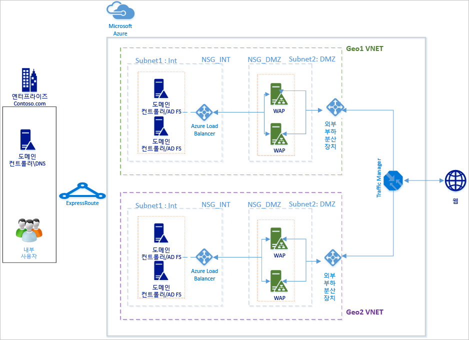
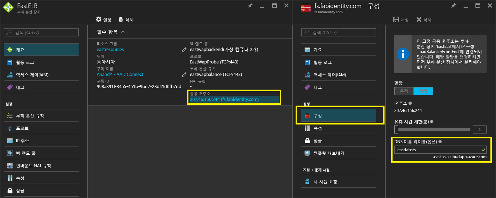
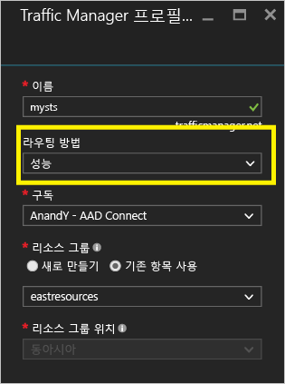
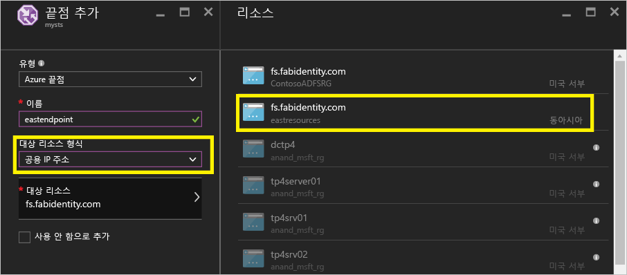
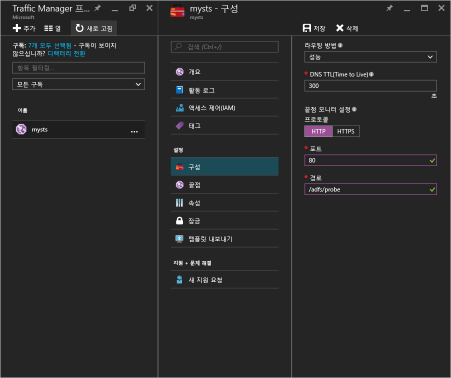
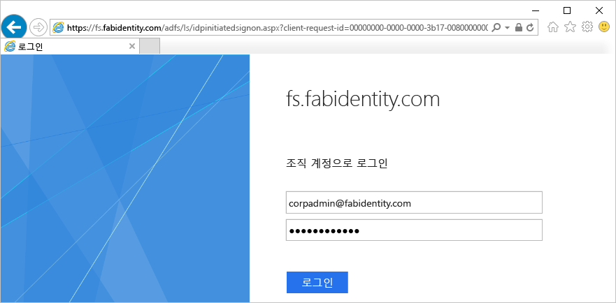
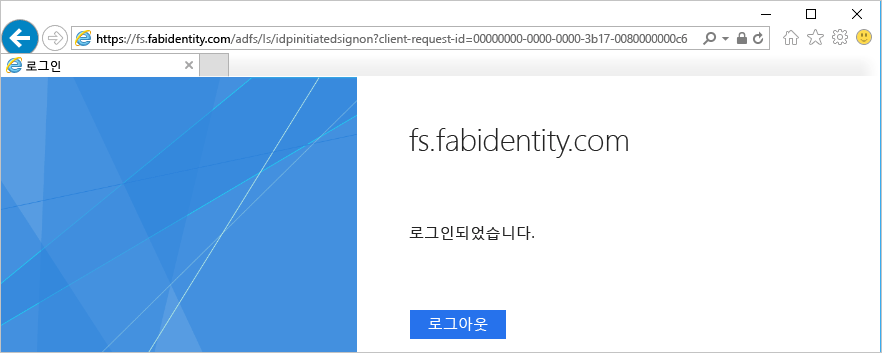

# Azure Traffic Manager를 사용하여 Azure에서 고가용성 교차 지리적 AD FS 배포
[Azure에서 AD FS 배포](active-directory-aadconnect-azure-adfs.md) 는 Azure의 조직에 대한 간단한 AD FS 인프라를 배포할 수 있는 방법으로 단계별 지침을 제공합니다. 이 문서에서는 [Azure Traffic Manager](../traffic-manager/traffic-manager-overview.md)를 사용하여 Azure AD FS에서 교차 지리적 배포를 만드는 다음 단계를 제공합니다. Azure Traffic Manager는 인프라에서 서로 다른 요구 사항에 맞게 사용할 수 있는 라우팅 방법의 범위를 사용하여 조직에 대해 지리적으로 분배된 고가용성 및 고성능 AD FS 인프라를 만들 수 있도록 합니다.

항상 사용 가능한 교차 지리적 AD FS 인프라에서는 다음을 수행할 수 있습니다.

* **단일 실패 지점 제거:** Azure Traffic Manager의 장애 조치 기능을 사용하여 전 세계에 있는 데이터 센터 중 하나가 중단되더라도 AD FS 인프라를 항상 사용 가능하도록 만들 수 있습니다.
* **향상된 성능:** 이 문서에 제안된 배포를 사용하여 더 빠르게 사용자를 인증할 수 있는 고성능 AD FS 인프라를 제공할 수 있습니다. 

## 디자인 원칙

기본 디자인 원칙은 Azure의 AD FS 배포 문서에 있는 디자인 원칙에 나열된 것과 동일합니다. 위의 다이어그램에서는 다른 지역에 대한 기본 배포의 단순한 확장을 보여 줍니다. 새 지역으로 배포를 확장하는 경우 고려할 사항은 다음과 같습니다.

* **가상 네트워크:** 추가 AD FS 인프라를 배포하려는 지역에서 새 가상 네트워크를 만들어야 합니다. 위의 다이어그램에서 각 지역에 두 개의 가상 네트워크인 Geo1 VNET과 Geo2 VNET이 표시됩니다.
* **새 지역 VNET에서 도메인 컨트롤러 및 AD FS 서버:** 새 지역에 있는 AD FS 서버가 멀리 있는 다른 네트워크의 도메인 컨트롤러에 연결하지 않아도 인증을 완료하여 성능이 향상되도록 새 지역에서 도메인 컨트롤러를 배포하는 것이 좋습니다.
* **Storage 계정:** Storage 계정은 지역과 연결됩니다. 새 지역에 컴퓨터를 배포했기 때문에 지역에서 사용할 새 저장소 계정을 만들어야 합니다.  
* **네트워크 보안 그룹:** 지역에서 만든 네트워크 보안 그룹을 다른 지역에서 저장소 계정으로 사용할 수 없습니다. 따라서 새 지역에서 INT 및 DMZ 서브넷에 대한 첫 번째 지역의 네트워크 보안 그룹과 비슷한 새 네트워크 보안 그룹을 만들어야 합니다.
* **공용 IP 주소에 대한 DNS 레이블:** Azure Traffic Manager는 DNS 레이블을 통해서만 끝점을 참조할 수 있습니다. 따라서 외부 부하 분산 장치의 공용 IP 주소에 대한 DNS 레이블을 만들어야 합니다.
* **Azure Traffic Manager:** Microsoft Azure Traffic Manager를 사용하면 전 세계 여러 데이터 센터에서 실행 중인 서비스 끝점에 대한 사용자 트래픽의 배포를 제어할 수 있습니다. Azure Traffic Manager는 DNS 수준에서 작동합니다. 이 관리자는 DNS 응답을 사용하여 전역으로 분산된 끝점으로 최종 사용자 트래픽을 보냅니다. 그러면 클라이언트는 해당 끝점에 직접 연결됩니다. 성능, 가중치 적용 및 우선 순위 등의 라우팅 옵션을 사용하여 조직의 요구 사항에 가장 적합한 라우팅 옵션을 쉽게 선택할 수 있습니다. 
* **두 지역에 있는 VNet 간 연결:** 가상 네트워크 자체 간을 연결할 필요가 없습니다. 각 가상 네트워크가 도메인 컨트롤러에 액세스하고 자체에 AD FS 및 WAP 서버를 가지고 있기 때문에 다른 지역에 있는 가상 네트워크 간의 연결 없이 작업할 수 있습니다. 

## Azure Traffic Manager를 통합하는 단계
### 새 지역에서 AD FS 배포
[Azure에서 AD FS 배포](active-directory-aadconnect-azure-adfs.md) 의 단계와 지침에 따라 새 지역에 동일한 토폴로지를 배포합니다.

### 인터넷 연결 (공용) 부하 분산 장치의 공용 IP 주소에 대한 DNS 레이블
위에서 언급한 대로 Azure Traffic Manager는 DNS 레이블을 끝점으로 참조할 수 있으며 따라서 외부 부하 분산 장치의 공용 IP 주소에 대한 DNS 레이블을 만드는 것이 중요합니다. 아래 스크린샷에서는 공용 IP 주소에 대한 DNS 레이블을 구성하는 방법을 보여 줍니다. 

### Azure Traffic Manager 배포
아래 단계를 따라 Traffic Manager 프로필을 만듭니다. 자세한 내용은 [Azure Traffic Manager 프로필 관리](../traffic-manager/traffic-manager-manage-profiles.md)를 참조할 수도 있습니다.

1. **Traffic Manager 프로필 만들기:** Traffic Manager 프로필에 고유한 이름을 지정합니다. 이 프로필의 이름은 DNS 이름의 일부이며 Traffic Manager 도메인 이름 레이블에 대한 접두사의 역할을 담당합니다. 이름/접두사를 .trafficmanager.net에 추가하여 Traffic Manager에 대한 DNS 레이블을 만듭니다. 아래 스크린샷에서는 mysts로 설정되고 그 결과 DNS 레이블이 mysts.trafficmanager.net인 Traffic Manager DNS 접두사를 보여 줍니다. 
   
    
2. **트래픽 라우팅 방법:** Traffic Manager에서 사용할 수 있는 세 가지 트래픽 라우팅이 있습니다.
   
   * 우선 순위 
   * 성능
   * 가중치 적용
     
     **성능** 은 응답성이 높은 AD FS 인프라를 달성하기 위해 권장된 옵션입니다. 그러나 배포 요구 사항에 가장 적합한 라우팅 방법을 선택할 수 있습니다. AD FS 기능은 선택된 라우팅 옵션의 영향을 받지 않습니다. 자세한 내용은 [Traffic Manager 트래픽 라우팅 방법](../traffic-manager/traffic-manager-routing-methods.md) 을 참조하세요. 위의 샘플 스크린샷에서 선택한 **성능** 메서드를 확인할 수 있습니다.
3. **끝점 구성:** Traffic Manager 페이지에서 끝점을 클릭하고 추가를 선택합니다. 아래 스크린샷과 유사한 추가 끝점 페이지가 열립니다.
   
   
   
   다른 입력의 경우 아래 지침을 따르세요.
   
   **형식:** Azure 공용 IP 주소를 가리키는 것처럼 Azure 끝점을 선택합니다.
   
   **이름:** 끝점과 연결하려는 이름을 만듭니다. DNS 이름이 아니며 DNS 레코드는 관련이 없습니다.
   
   **대상 리소스 유형:** 공용 IP 주소를 이 속성에 대한 값으로 선택합니다. 
   
   **대상 리소스:** 이렇게 하면 구독에서 사용할 수 있는 다른 DNS 레이블에서 선택할 수 있는 옵션이 제공됩니다. 구성하는 끝점에 해당되는 DNS 레이블을 선택합니다.
   
   Azure Traffic Manager에서 트래픽을 라우팅하려는 지역에 대한 끝점을 추가합니다.
   Traffic Manager에서 끝점을 추가/구성하는 방법에 대한 자세한 내용 및 단계는 [끝점 추가, 사용 안 함, 사용 또는 삭제](../traffic-manager/traffic-manager-endpoints.md)
4. **프로브 구성:** Traffic Manager 페이지에서 구성을 클릭합니다. 구성 페이지에서 HTTP 포트 80 및 상대 경로인 /adfs/probe의 프로브에 대한 모니터링 설정을 변경해야 합니다.
   
     
   
   > [!NOTE]
   > **구성이 완료되면 끝점의 상태가 온라인인지 확인합니다**. 모든 끝점이 '성능이 저하된' 상태인 경우 Azure Traffic Manager는 진단이 올바르지 않고 모든 끝점에 도달 가능하다고 가정하는 트래픽을 라우트하려고 최대한 노력합니다.
   > 
   > 
5. **Azure Traffic Manager에 대한 DNS 레코드 수정:** 페더레이션 서비스는 Azure Traffic Manager DNS 이름에 대한 CNAME이어야 합니다. 페더레이션 서비스에 도달하려고 하는 모든 사용자가 실제로 Azure Traffic Manager에 도달하도록 공용 DNS 레코드에서 CNAME을 만듭니다.
   
    예를 들어 Traffic Manager에 대한 페더레이션 서비스 fs.fabidentity.com을 가리키려면 DNS 리소스 레코드를 다음과 같이 업데이트해야 합니다.
   
    <code>fs.fabidentity.com IN CNAME mysts.trafficmanager.net</code>

## 라우팅 및 AD FS 로그인 테스트
### 테스트 라우팅
라우팅에 대한 기본 테스트는 각 지역에 있는 컴퓨터에서 페더레이션 서비스 DNS 이름을 ping하는 것입니다. 선택한 라우팅 방법에 따라 실제로 ping한 끝점은 ping 디스플레이에 반영됩니다. 예를 들어 성능 라우팅을 선택한 경우 클라이언트 영역에 가장 가까운 끝점에 도달하게 됩니다. 아래는 두 개의 다른 지역 클라이언트 컴퓨터에서 동아시아 지역 및 미국 서부에 각각 하나씩 있는 두 ping의 스냅숏입니다. 

### AD FS 로그인 테스트
AD FS를 테스트하는 가장 쉬운 방법은 IdpInitiatedSignon.aspx 페이지를 사용하는 것입니다. 이렇게 하려면 AD FS 속성에 IdpInitiatedSignOn을 사용해야 합니다. AD FS 설치를 확인하려면 다음 단계를 수행합니다.

1. 아래 AD FS 서버의 cmdlet을 실행하고 PowerShell을 사용하여 사용하도록 설정합니다. 
   Set-AdfsProperties -EnableIdPInitiatedSignonPage $true
2. 외부 컴퓨터에서 https://<yourfederationservicedns>/adfs/ls/IdpInitiatedSignon.aspx에 액세스합니다.
3. 아래와 같은 AD FS 페이지를 참조해야 합니다.
   
    
   
    그리고 성공적으로 로그인하면 아래와 같은 성공 메시지가 표시됩니다.
   
    

## 관련 링크
* [Azure에서 기본 AD FS 배포](active-directory-aadconnect-azure-adfs.md)
* [Microsoft Azure Traffic Manager](../traffic-manager/traffic-manager-overview.md)
* [Traffic Manager 트래픽 라우팅 방법](../traffic-manager/traffic-manager-routing-methods.md)

## 다음 단계
* [Azure Traffic Manager 프로필 관리](../traffic-manager/traffic-manager-manage-profiles.md)
* [끝점 추가, 사용 안 함, 사용 또는 삭제](../traffic-manager/traffic-manager-endpoints.md) 

