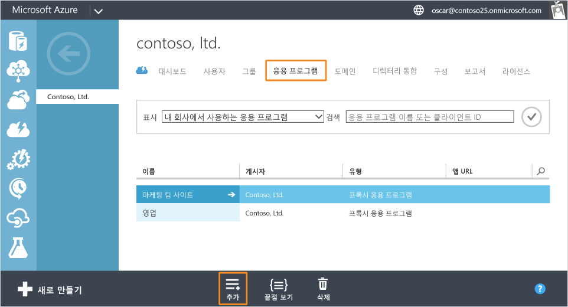
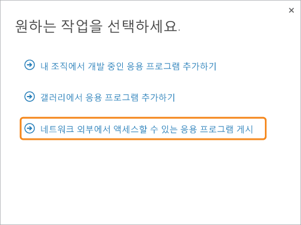
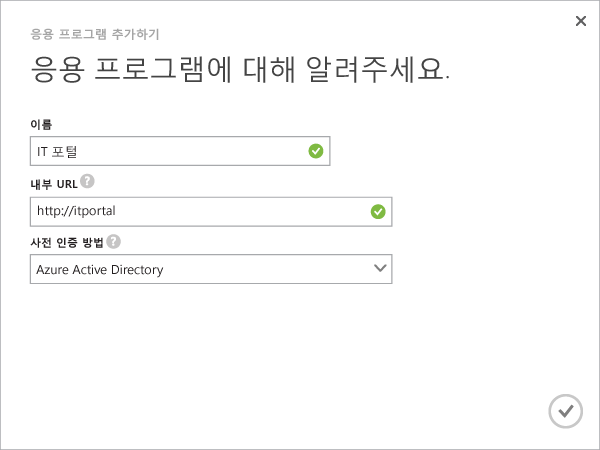
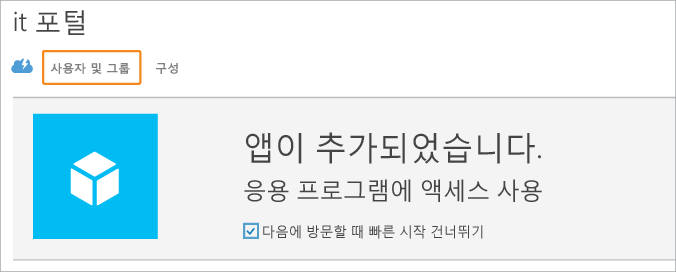
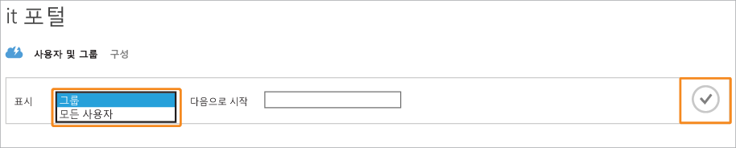
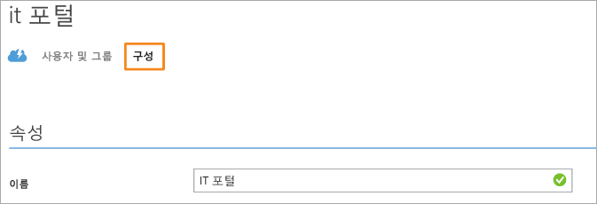

<properties
	pageTitle="Azure AD 응용 프로그램 프록시를 사용하여 앱 게시 | Microsoft Azure"
	description="Azure AD 응용 프로그램 프록시를 사용하여 온-프레미스 응용 프로그램을 클라우드에 게시합니다."
	services="active-directory"
	documentationCenter=""
	authors="kgremban"
	manager="femila"
	editor=""/>

<tags
	ms.service="active-directory"
	ms.workload="identity"
	ms.tgt_pltfrm="na"
	ms.devlang="na"
	ms.topic="get-started-article"
	ms.date="07/19/2016"
	ms.author="kgremban"/>

# Azure AD 응용 프로그램 프록시를 사용하여 응용 프로그램 게시

Azure AD 응용 프로그램 프록시를 통해 온-프레미스 응용 프로그램을 인터넷에 액세스되도록 게시하여 원격 작업자를 지원할 수 있습니다. 이제 [Azure 클래식 포털에서 응용 프로그램 프록시를 사용하도록 설정](active-directory-application-proxy-enable.md)했어야 합니다. 이 문서에서는 로컬 네트워크에 실행 중인 응용 프로그램을 게시하는 단계를 안내하고 네트워크 외부에서 안전한 원격 액세스를 제공합니다. 이 문서를 완료하면 응용 프로그램에 개인 설정된 정보 또는 보안 요구 사항을 구성할 준비가 됩니다.

> [AZURE.NOTE] 응용 프로그램 프록시는 Premium 또는 Basic 버전의 Azure Active Directory로 업그레이드하는 경우에만 사용할 수 있는 기능입니다. 자세한 내용은 [Azure Active Directory 버전](active-directory-editions.md)을 참조하세요.

## 마법사를 사용하여 앱 게시

1. [Azure 클래식 포털](https://manage.windowsazure.com/)에서 관리자로 로그인합니다.
2. Active Directory로 이동하여 응용 프로그램 프록시를 사용하도록 설정한 디렉터리를 선택합니다.

	

3. **응용 프로그램** 탭을 클릭한 다음 화면 맨 위에 있는 **추가** 단추를 클릭합니다.

	

4. **네트워크 외부에서 액세스할 수 있는 응용 프로그램 게시**를 선택합니다.

	

5. 응용 프로그램에 대한 다음과 같은 정보를 제공합니다.

	- **이름**: 사용자가 알기 쉬운 응용 프로그램의 이름입니다. 디렉터리 내에서 고유해야 합니다.
	- **내부 URL**: 응용 프로그램 프록시 커넥터가 개인 네트워크 내부에서 응용 프로그램에 액세스하는 데 사용하는 주소입니다. 나머지 서버는 게시되지 않은 반면 게시할 백 앤드 서버에 특정 경로를 제공할 수 있습니다. 이러한 방식으로 동일한 서버에 다른 사이트를 게시하고 각각에 고유한 이름 및 액세스 규칙을 부여할 수 있습니다.

		> [AZURE.TIP] 경로를 게시하는 경우 응용 프로그램에 필요한 이미지, 스크립트 및 스타일 시트를 모두 포함하는지 확인합니다. 예를 들어, 앱이 https://yourapp/app에 위치하고 https://yourapp/media에 있는 이미지를 사용하는 경우 https://yourapp/을 경로로 게시해야 합니다.

	- **사전 인증 메서드**: 응용 프로그램 프록시가 응용 프로그램에 대한 액세스를 제공하기 전에 사용자를 확인하는 방법입니다. 드롭다운 메뉴에서 옵션 중 하나를 선택합니다.

		- Azure Active Directory: 응용 프로그램 프록시는 Azure AD를 사용하여 로그인하는 사용자를 리디렉션하여 디렉터리와 응용 프로그램에 대한 사용 권한을 인증합니다.
		- 통과: 사용자는 응용 프로그램에 액세스하도록 인증할 필요가 없습니다.

	

6. 마법사를 마치려면 화면 아래쪽에 있는 확인 표시를 클릭합니다. 이제 응용 프로그램이 Azure AD에 정의되었습니다.

## 응용 프로그램에 사용자 및 그룹 할당

사용자가 게시된 응용 프로그램에 액세스하기 위해서는 개별적으로 또는 그룹에 할당되어야 합니다. (자신에게도 액세스 권한을 할당합니다.) 각 사용자가 Azure Basic 이상에 대한 라이선스를 가지고 있어야 합니다. 개별적으로 또는 그룹에 라이선스를 할당할 수 있습니다. 세부 내용은 [응용 프로그램에 사용자 지정](active-directory-applications-guiding-developers-assigning-users.md)을 참조하세요.

사전 인증을 필요로 하는 앱의 경우 이렇게 하면 앱을 사용할 권한이 부여됩니다. 사전 인증을 요구하지 않는 앱의 경우 MyApps과 같이 해당 응용 프로그램 목록에 표시되도록 사용자를 앱에 할당할 수 있습니다.

1. 앱 추가 마법사를 마친 후에 응용 프로그램에 대한 빠른 시작 페이지를 확인합니다. 앱에 대한 액세스 권한이 있는 사용자를 관리하려면 **사용자 및 그룹**을 선택합니다.

	

2. 디렉터리에서 특정 그룹을 검색 하거나 모든 사용자를 표시합니다. 검색 결과를 표시하려면 확인 표시를 클릭합니다.

  	

2. 이 앱에 할당하려는 각 사용자나 그룹을 선택하고 **할당**을 클릭합니다. 이 작업을 확인하라는 메시지가 표시됩니다.

> [AZURE.NOTE] Windows 통합 인증 앱에 대해 온-프레미스 Active Directory에서 동기화되는 사용자와 그룹만 할당할 수 있습니다. Microsoft 계정 및 게스트를 사용하여 로그인하는 사용자는 Azure Active Directory 응용 프로그램 프록시를 사용하여 게시된 앱에 할당할 수 없습니다. 사용자가 게시하는 앱과 동일한 도메인의 일부인 자격 증명을 사용하여 로그인하는지 확인합니다.

## 게시된 응용 프로그램 테스트

응용 프로그램을 게시하면 게시한 URL로 이동하여 테스트할 수 있습니다. 액세스할 수 있는지, 올바르게 렌더링되었는지 및 모든 것이 예상대로 작동하는지 확인합니다. 문제가 발생하거나 오류 메시지가 나타날 경우 [문제 해결 가이드](active-directory-application-proxy-troubleshoot.md)를 사용해 봅니다.

## 응용 프로그램 구성

게시된 앱을 수정하거나 구성 페이지에서 고급 옵션을 설정할 수 있습니다. 이 페이지에서 이름을 변경하거나 로고를 업로드하여 앱을 사용자 지정할 수 있습니다. 또한 사전 인증 방법 또는 Multi-Factor Authentication과 같은 액세스 규칙을 관리할 수 있습니다.

Azure Active Directory 응용 프로그램 프록시를 사용하여 응용 프로그램을 게시하면 Azure AD의 응용 프로그램 목록에 표시되므로 해당 위치에서 관리할 수 있습니다.

응용 프로그램을 게시한 후 응용 프로그램 프록시 서비스를 사용하지 않도록 설정하면 개인 네트워크 외부에서 액세스할 수 없습니다. 응용 프로그램을 삭제하지 않습니다.

응용 프로그램을 확인하고 액세스할 수 있는지 확인하려면 응용 프로그램의 이름을 두 번 클릭합니다. 응용 프로그램 프록시 서비스를 사용할 수 없고 응용 프로그램을 사용할 수 없는 경우 화면 위쪽에 경고 메시지가 나타납니다.

응용 프로그램을 삭제하려면 목록에서 응용 프로그램을 선택한 다음 **삭제**를 클릭합니다.

## 다음 단계

- [고유한 도메인 이름을 사용하여 응용 프로그램 게시](active-directory-application-proxy-custom-domains.md)
- [Single Sign-On 사용](active-directory-application-proxy-sso-using-kcd.md)
- [조건부 액세스 사용](active-directory-application-proxy-conditional-access.md)
- [클레임 인식 응용 프로그램으로 작업](active-directory-application-proxy-claims-aware-apps.md)

최신 뉴스 및 업데이트는 [응용 프로그램 프록시 블로그](http://blogs.technet.com/b/applicationproxyblog/)를 확인하세요.

<!---HONumber=AcomDC_0921_2016-->