<properties
   pageTitle="Azure Active Directory B2B 공동 작업 미리 보기를 사용하는 자세한 연습 | Microsoft Azure"
   description="Azure Active Directory B2B 공동 작업은 비즈니스 파트너가 선택적으로 회사 응용 프로그램에 액세스할 수 있게 함으로써 회사 간 관계를 지원합니다."
   services="active-directory"
   authors="viv-liu"
   manager="cliffdi"
   editor=""
   tags=""/>

<tags
   ms.service="active-directory"
   ms.devlang="NA"
   ms.topic="article"
   ms.tgt_pltfrm="NA"
   ms.workload="identity"
   ms.date="10/27/2015"
   ms.author="viviali"/>

# Azure AD(Azure Active Directory) B2B 공동 작업 미리 보기를 사용하는 자세한 연습
이 연습에서는 Azure AD B2B 공동 작업을 사용하는 방법을 간략하게 설명합니다. Contoso의 IT 관리자로 세 파트너 회사의 직원들과 응용 프로그램을 공유하려고 합니다. 파트너 회사는 Azure AD가 없어도 됩니다.

- 간단한 파트너 조직의 Alice
- 보통 파트너 조직의 Bob은 앱의 집합에 대한 액세스가 필요
- 복잡한 파트너 조직의 Carol은 앱의 집합에 대한 액세스 및 Contoso에서 그룹의 멤버 자격이 필요

파트너 사용자를 초대한 후에 Azure 포털을 통해 앱에 대한 액세스 및 그룹의 멤버 자격을 부여하도록 Azure AD에서 구성할 수 있습니다. Alice를 추가하는 것부터 살펴보겠습니다.

## Alice를 Contoso의 디렉터리에 추가
1. 표시된 대로 헤더가 있는 .csv 파일을 만들며 이는 Alice의 **전자 메일**, **DisplayName**, 및 **InviteContactUsUrl**를 채웁니다. **DisplayName**은 초대에 나타나는 이름이고 또한 Contoso의 Azure AD Directory에 표시되는 이름입니다. **InviteContactUsUrl**는 Alice가 Contoso에 연락할 수 있는 방법입니다. 아래 예제는 Contoso의 LinkedIn 프로필을 지정합니다. 동일한 순서로 .csv 파일의 첫 번째 행에서 레이블을 만들고 표시된 동일한 방식으로 철자를 입력하는 것이 중요합니다. 아래의 CSV 형식 섹션을 참조하세요. 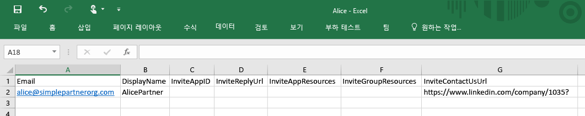

2. Azure 포털에서 Contoso 디렉터리에 사용자를 추가합니다.(Active Directory > Contoso > 사용자 > 사용자 추가) "사용자 형식" 드롭다운에서 "파트너 회사의 사용자"를 선택합니다. .csv 파일을 업로드합니다. .csv 파일을 업로드하기 전에 닫도록 합니다. 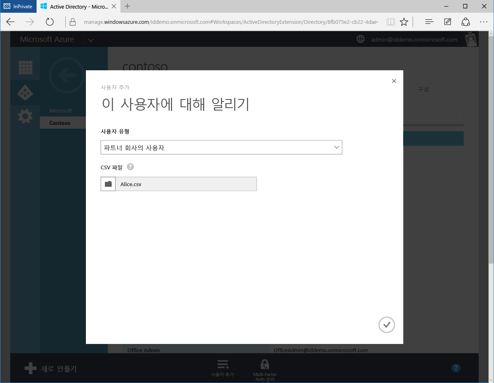

3. 이제 Alice는 Contoso의 Azure AD 디렉터리에서 외부 사용자로 표시됩니다. 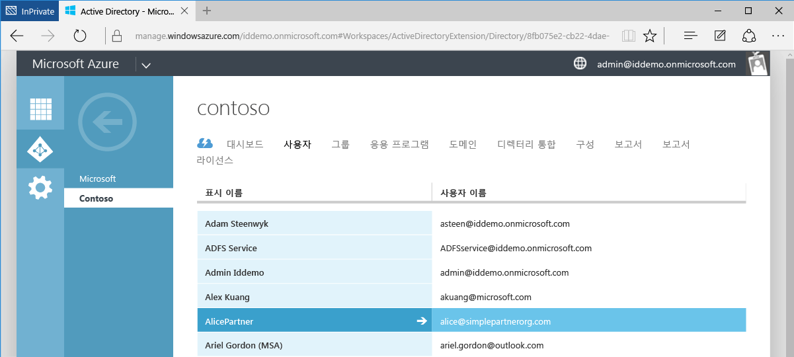

4. Alice의 관점에서 다음 전자 메일을 받게 됩니다. 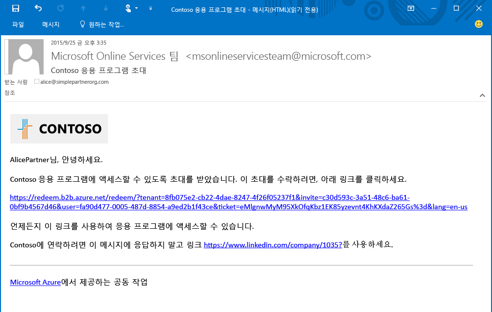

5. Alice가 링크를 클릭하면 초대를 수락하고 작업 자격 증명을 사용하여 로그인하라는 메시지가 표시됩니다. Alice가 Azure AD Directory에 없는 경우 등록하라는 메시지가 표시됩니다. 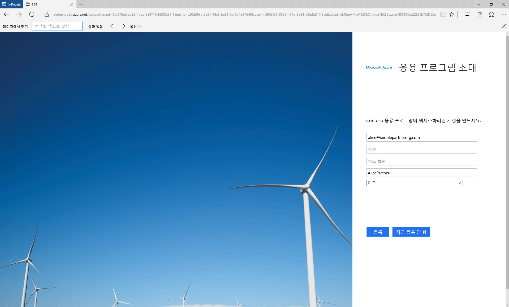

6. Alice가 앱에 대한 액세스를 부여받을 때까지 비어 있는 앱 액세스 패널에 리디렉션됩니다. 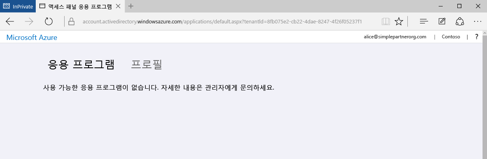

B2B 공동 작업의 가장 간단한 형태입니다. Contoso의 Azure AD Directory에서 사용자인 Alice는 Azure 포털을 통해 응용 프로그램 및 그룹에 대한 액세스를 부여받을 수 있습니다. 이제 Moodle 및 Salesforce 응용 프로그램에 대한 액세스가 필요한 Bob을 추가하겠습니다.

## Bob을 Contoso의 디렉터리에 추가 및 앱에 대한 액세스 부여
1. Moodle 및 Salesforce의 응용 프로그램 ID를 찾으려면 설치된 Azure AD 모듈과 함께 Windows PowerShell를 사용합니다. cmdlet을 사용하여 ID를 검색할 수 있습니다. `Get-MsolServicePrincipal | fl DisplayName, AppPrincipalId` 그러면 Contoso 및 해당 AppPrincialIds에서 사용할 수 있는 모든 응용 프로그램의 목록을 표시합니다. 

2. Bob의 전자 메일, DisplayName, **InviteAppID**, **InviteAppResources**, 및 InviteContactUsUrl를 채우는 .csv 파일을 만듭니다. **InviteAppResources**는 PowerShell에서 찾을 수 있는 Moodle 및 Salesforce의 AppPrincipalIds로 채워지며 이는 공백으로 구분됩니다. 녹색으로 강조 표시되고 위의 PowerShell 스크린샷에 해당하는 파란 상자로 묶인 ID입니다. **InviteAppId**는 Moodle의 동일한 AppPrincipalId로 채워져서 전자 메일 및 로그인 페이지를 브랜딩합니다. 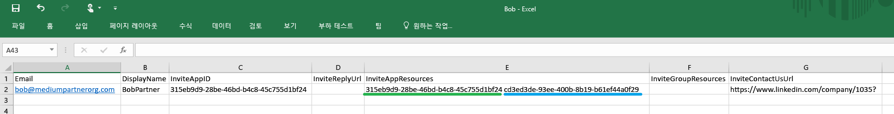

3. Alice에 대해 수행된 대로 Azure 포털을 통해 .csv 파일을 업로드합니다. 이제 Bob은 Contoso의 Azure AD 디렉터리에서 외부 사용자입니다.

4. Bob은 다음과 같은 전자 메일을 받게 됩니다. 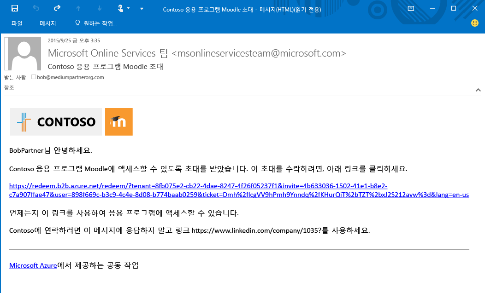

5. Bob이 링크를 클릭하면 초대를 수락하라는 메시지가 표시됩니다. 로그인한 후에 액세스 패널로 이동하고 Moodle 및 Salesforce을 사용할 수 있습니다. 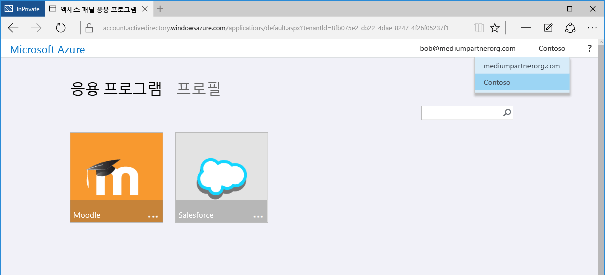

다음으로 응용 프로그램에 대한 액세스는 물론 Contoso에서 디렉터리의 그룹에 멤버 자격이 필요한 Carol을 추가합니다.

## Contoso의 디렉터리에 Carol 추가, 앱에 대한 액세스 부여 및 그룹 멤버 자격 부여

1. 응용 프로그램 ID 및 Contoso 내의 그룹 ID를 찾으려면 설치된 Azure AD 모듈과 함께 Windows PowerShell를 사용합니다.
 - Bob의 경우와 같이 cmdlet `Get-MsolServicePrincipal | fl DisplayName, AppPrincipalId`을 사용하여 AppPrincipalId를 검색합니다.
 - cmdlet `Get-MsolGroup | fl DisplayName, ObjectId`을 사용하여 그룹에 대한 ObjectId를 검색합니다. 그러면 Contoso 및 해당 Objectid에서 모든 그룹의 목록을 표시합니다. 또한 그룹 ID는 Azure 포털에서 그룹의 속성 탭에 있는 개체 ID로 검색할 수 있습니다. 

2. Carol의 전자 메일, DisplayName, InviteAppID, InviteAppResources, **InviteGroupResources** 및 InviteContactUsUrl를 채우는 .csv 파일을 만듭니다. **InviteGroupResources**는 MyGroup1 및 외부 그룹의 Objectid로 채워지며 이는 공백으로 구분됩니다. 

3. Azure 포털을 통해 .csv 파일을 업로드합니다.

4. Azure 포털에서 볼 수 있듯이 Carol은 Contoso의 디렉터리에서 사용자이고 MyGroup1 및 외부 그룹의 멤버이기도 합니다. 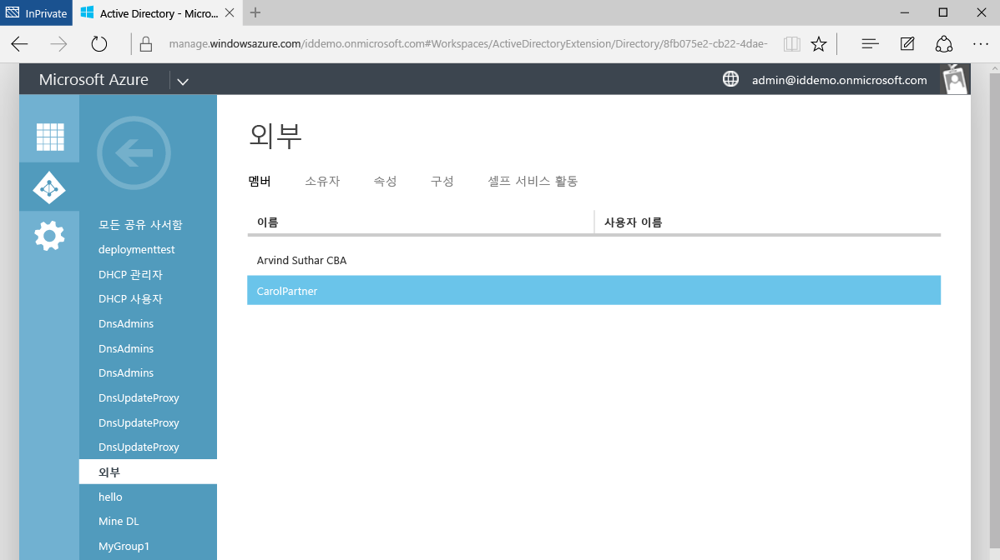

5. Carol은 초대를 수락하는 링크가 포함된 전자 메일을 받게 됩니다. Carol이 로그인한 후에 앱 액세스 패널로 이동하여 Moodle 및 Salesforce에 액세스합니다.

Azure AD B2B 공동 작업에 파트너 기업에서 사용자를 추가하는 작업이 끝났습니다. 이 연습에서는 세개의 별도.csv 파일에 Alice, Bob 및 Carol을 추가하는 방법을 설명했지만 실제로 편의상 단일 .csv 파일에 함께 추가할 수 있습니다. 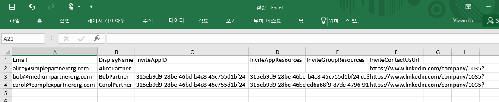

## 관련된 문서
Azure AD B2B 공동 작업에 대한 다른 문서 찾아보기:

- [Azure AD B2B 공동 작업이란?](active-directory-b2b-what-is-azure-ad-b2b.md)
- [작동 방법](active-directory-b2b-how-it-works.md)
- [CSV 파일 형식 참조](active-directory-b2b-references-csv-file-format.md)
- [외부 사용자 토큰 형식](active-directory-b2b-references-external-user-token-format.md)
- [외부 사용자 개체 특성 변경 사항](active-directory-b2b-references-external-user-object-attribute-changes.md)
- [현재 미리 보기 제한 사항](active-directory-b2b-current-preview-limitations.md)

<!---HONumber=Nov15_HO1-->