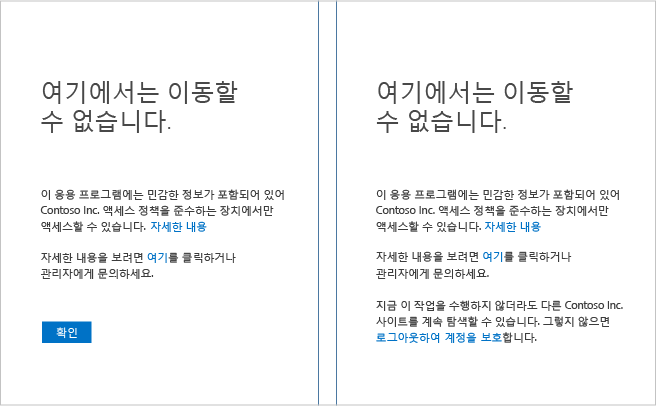
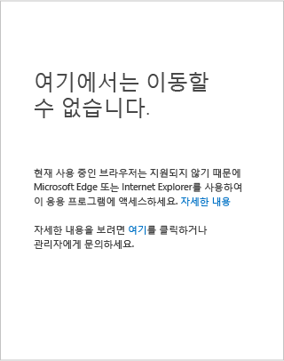

<properties
	pageTitle="문제 해결: 여기에서 가져올 수 없습니다 | Microsoft Azure"
	description="이 항목에서는 응용 프로그램에 대한 액세스 권한을 얻기 위해 수행할 수 있는 사용 가능한 수정 단계를 식별할 수 있습니다."
	services="active-directory"
	keywords="장치 기반 조건부 액세스, 장치 등록, 장치 등록 사용, 장치 등록 및 MDM"
	documentationCenter=""
	authors="markusvi"
	manager="femila"
	editor=""/>

<tags
	ms.service="active-directory"
	ms.workload="identity"
	ms.tgt_pltfrm="na"
	ms.devlang="na"
	ms.topic="get-started-article"
	ms.date="08/23/2016"
	ms.author="markvi"/>

# 문제 해결: 여기에서 가져올 수 없습니다

SharePoint Online과 같은 응용 프로그램에 액세스할 때 액세스 거부 페이지가 표시되었습니다. 이제 어떻게 해야 하나요?

이 가이드에서는 응용 프로그램에 대한 액세스 권한을 얻기 위해 수행할 수 있는 사용 가능한 수정 단계를 식별할 수 있습니다.

장치가 실행되는 장치 플랫폼은 무엇인가요? 이 질문의 답변은 이 항목에서 섹션을 결정합니다.

-	Windows 장치
-	iOS 장치(iPhone 또는 iPad)
-	Android 장치

## Windows 장치에서 액세스

장치가 Windows 10, Windows 8.1, Windows 8.0, Windows 7, Windows Server 2016, Windows Server 2012 R2, Windows Server 2012 또는 Windows Server 2008 R2를 실행하는 경우 응용 프로그램에 액세스하려고 할 때 표시된 페이지를 식별하여 적절한 원인을 선택합니다.

### 장치가 등록되지 않았습니다

장치가 Azure AD(Azure Active Directory)로 등록되지 않고 응용 프로그램이 장치 기반 정책으로 보호되는 경우 다음과 같은 내용이 페이지에 나타날 수 있습니다.

장치가 조직에서 Active Directory로 도메인에 가입된 경우 다음을 시도할 수 있습니다.

1.	작업 계정(Active Directory 계정)을 사용하여 Windows에 로그인되어 있는지 확인합니다.
2.	VPN 또는 DirectAccess를 통해 회사 네트워크에 연결합니다.
3.	일단 연결한 후에 Windows 키 + L 키를 사용하여 Windows 세션을 잠급니다.
4.	작업 계정 자격 증명을 입력하여 Windows 세션의 잠금을 해제합니다.
5.	몇 분 기다렸다가 다시 응용 프로그램에 액세스를 시도하세요.
6.	동일한 페이지가 표시되면 관리자에게 문의하고 **자세한 내용** 링크를 클릭한 후에 세부 정보를 제공합니다.

장치가 도메인에 조인되어 있고 Windows 10을 실행하는 경우 두 가지 옵션이 있습니다.

- Azure AD 조인을 실행합니다.
- Windows에 회사 또는 학교 계정을 추가합니다.

둘 사이의 차이점에 대한 자세한 내용은 [작업 공간에서 Windows 10 장치 사용](active-directory-azureadjoin-windows10-devices.md)을 참조하세요.

Azure AD 조인을 실행하려면 다음을 수행합니다(Windows Phone에서 사용할 수 없음).

**Windows 10 1주년 업데이트**

1.	**설정** 앱을 엽니다.
2.	**계정** > **회사 또는 학교에 액세스**를 클릭합니다.
3.	**Connect**를 클릭합니다.
4.	페이지 맨 아래에서 **Azure AD에 이 장치 조인**을 클릭합니다.
5.	조직에 인증하고 필요하면 Multi-Factor Authentication 증명을 제공하며 완료될 때까지 단계를 따릅니다.
6.	작업 계정을 사용하여 로그아웃하고 로그인합니다.
7.	응용 프로그램에 다시 액세스를 시도합니다.

**Windows 10 2015년 11월 업데이트**

1.	**설정** 앱을 엽니다.
2.	**시스템** > **정보**를 클릭합니다.
3.	**Azure AD 조인**을 클릭합니다.
4.	조직에 인증하고 필요하면 Multi-Factor Authentication 증명을 제공하며 완료될 때까지 단계를 따릅니다.
5.	작업 계정(Azure AD 계정)을 사용하여 로그아웃하고 로그인합니다.
6.	응용 프로그램에 다시 액세스를 시도합니다.

회사 또는 학교 계정을 추가하려면 다음을 수행합니다.

**Windows 10 1주년 업데이트**

1.	**설정** 앱을 엽니다.
2.	**계정** > **회사 또는 학교에 액세스**를 클릭합니다.
3.	**Connect**를 클릭합니다.
4.	조직에 인증하고 필요하면 Multi-Factor Authentication 증명을 제공하며 완료될 때까지 단계를 따릅니다.
5.	응용 프로그램에 다시 액세스를 시도합니다.

**Windows 10 2015년 11월 업데이트**

1.	**설정** 앱을 엽니다.
2.	**계정** > **사용자 계정**을 클릭합니다.
3.	**회사 또는 학교 계정 추가**를 클릭합니다.
4.	조직에 인증하고 필요하면 Multi-Factor Authentication 증명을 제공하며 완료될 때까지 단계를 따릅니다.
5.	응용 프로그램에 다시 액세스를 시도합니다.

장치가 도메인에 조인되지 않고 Windows 8.1을 실행하는 경우 다음을 수행하여 작업 공간 조인을 수행하고 Microsoft Intune에 등록할 수 있습니다.

1.	**PC 설정**을 엽니다.
2.	**네트워크** > **작업 공간**을 클릭합니다.
3.	**조인**을 클릭합니다.
4.	조직에 인증하고 필요하면 Multi-Factor Authentication 증명을 제공하며 완료될 때까지 단계를 따릅니다.
5.	**켜기**를 클릭합니다.
6.	완료될 때까지 기다립니다.
7.	응용 프로그램에 다시 액세스를 시도합니다.

## 지원되지 않는 브라우저

다음 브라우저에서 응용 프로그램에 액세스하는 경우 앞에 표시된 페이지와 유사한 페이지가 표시됩니다.

- Windows 10 또는 Windows Server 2016의 Microsoft Edge 또는 Microsoft Internet Explorer가 아닌 Chrome, Firefox 또는 다른 브라우저.
- Windows 8.1, Windows 7, Windows Server 2012 R2, Windows Server 2012 또는 Windows Server 2008 R2의 Firefox.

유일하게 수정된 부분은 응용 프로그램이 장치 플랫폼에 지원하는 브라우저를 사용하는 것입니다.

## iOS 장치에서 액세스
iPhones 또는 iPads에 대한 지침을 다시 확인합니다.

## Android 장치에서 액세스
Android 휴대폰 또는 태블릿에 대한 지침을 다시 확인합니다.

## 다음 단계

[Azure Active Directory 조건부 액세스](active-directory-conditional-access.md)

<!-----HONumber=AcomDC_0831_2016-->