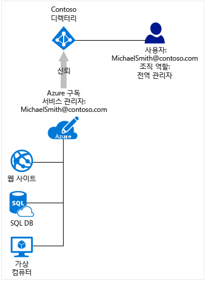

# Azure 구독과 Azure Active Directory의 연관 관계
이 문서에서는 Azure 구독과 Azure Active Directory(Azure AD) 간의 관계와 같은 정보 및 Azure AD 디렉터리에 기존 구독을 추가하는 방법을 다룹니다.

## Azure AD에 대한 Azure 구독의 관계
Azure 구독은 Azure AD와 트러스트 관계가 있습니다. 즉, 사용자, 서비스 및 장치를 인증하는 디렉터리를 신뢰합니다. 여러 구독에서 동일한 디렉터리를 신뢰할 수 있지만 각 구독은 하나의 디렉터리만 신뢰합니다. 

구독이 디렉터리와 갖는 트러스트 관계는 구독이 Azure의 다른 리소스(웹 사이트, 데이터베이스 등)와 갖는 관계와 다릅니다. 구독이 만료되면 구독과 연결된 다른 리소스에 대한 액세스도 중지됩니다. 하지만 Azure AD 디렉터리는 Azure에 남아 있으며 해당 디렉터리와 다른 구독을 연결하고 새 구독을 사용하여 디렉터리를 관리할 수 있습니다.

모든 사용자는 자신을 인증하는 단일 홈 디렉터리를 가지고 있지만 다른 디렉터리의 게스트가 될 수도 있습니다. Azure AD에서 사용자 계정이 멤버 또는 게스트인 디렉터리만 볼 수 있습니다.

## Azure AD 및 클라우드 서비스 구독
Azure AD는 다음을 포함하여 대부분의 Microsoft 클라우드 서비스 뒤에 핵심 디렉터리 및 ID 관리 기능을 제공합니다.

* Azure
* Microsoft Office 365
* Microsoft Dynamics CRM Online
* Microsoft Intune

이러한 Microsoft 클라우드 서비스 중 하나에 등록하면 Azure AD 서비스를 체험할 수 있습니다. Azure AD 디렉터리에 Azure 구독을 더 추가하려는 경우 Microsoft 계정으로 로그인해야 합니다. 회사 또는 학교 계정으로 Azure에 로그인한 경우 회사 또는 학교 계정을 Azure에서 직접 인증할 수 없기 때문에 기존 디렉터리에 Azure 구독을 추가할 수 없습니다. 

## Azure AD 디렉터리에 기존 구독을 추가하려면
구독이 연결된 현재 디렉터리 및 추가하려는 디렉터리에 존재하는 계정으로 로그인해야 합니다. 

1. 소유권을 이전하려는 구독의 계정 관리자인 계정을 사용하여 [Azure 계정 센터](https://account.azure.com/Subscriptions)에 로그인합니다.
2. 구독 소유자로 선택한 사용자가가 대상 디렉터리에 있는지 확인합니다.
3. **구독 이전**을 클릭합니다.
4. 받는 사람을 지정합니다. 받는 사람은 수락 링크가 포함된 전자 메일을 자동으로 받게 됩니다.
5. 받는 사람은 링크를 클릭하고 지불 정보 입력 등의 지침을 따릅니다. 받는 사람이 성공하면 구독이 이전됩니다. 
6. 구독의 기본 디렉터리는 해당 사용자가 있는 디렉터리로 변경됩니다.

자세한 내용은 [Azure 구독 소유권을 다른 계정에 양도](../billing/billing-subscription-transfer.md)를 참조하세요.

## 구독 및 디렉터리를 모두 관리하기 위한 제안
Azure 구독의 관리 역할은 Azure 구독에 연결된 리소스를 관리합니다. 이 섹션에서는 Azure 구독 관리자와 Azure AD 디렉터리 관리자 간의 차이점을 설명합니다. 관리자 역할 및 구독을 관리하기 위해 해당 역할을사용하는 다른 제안은 [Azure Active Directory의 관리자 역할 할당](active-directory-assign-admin-roles.md)에서 다룹니다.

등록할 때 기본적으로 서비스 관리자 역할이 할당됩니다. 다른 사용자가 동일한 구독을 사용하여 로그인하고 서비스에 액세스해야 하는 경우 공동 관리자로 추가할 수 있습니다. 

Azure AD는 디렉터리 및 ID 관련 기능을 관리하는 다른 관리 역할 집합을 가지고 있습니다. 예를 들어 디렉터리의 전역 관리자는 디렉터리에 사용자 및 그룹을 추가하거나 사용자에 대해 다단계 인증을 요구할 수 있습니다. 디렉터리를 만든 사용자는 전역 관리자 역할에 할당되어 다른 사용자에게 관리자 역할을 할당할 수 있습니다. 또한 Azure AD 관리 역할은 Office 365 및 Microsoft Intune과 같은 다른 서비스에서도 사용됩니다. 

Azure 구독 관리자와 Azure AD 디렉터리 관리자는 서로 다른 역할입니다. 
* Azure 구독 관리자는 Azure에서 리소스를 관리하고 Azure Portal에서 Azure AD를 사용할 수 있습니다(Azure Portal 자체가 Azure 리소스이기 때문). 
* 디렉터리 관리자는 Azure AD 디렉터리에서만 속성을 관리할 수 있습니다.

역할을 모두 담당할 수 있지만 그럴 필요는 없습니다. 디렉터리 전역 관리자는 Azure 구독의 서비스 관리자 또는 공동 관리자로 할당될 수 없고 반대도 그렇습니다. 구독 관리자가 아니어도 사용자는 Azure Portal에 로그인할 수 있지만 포털에서 해당 구독의 디렉터리를 관리할 수 없습니다. 그러나 이 사용자는 Azure AD PowerShell 또는 Office 365 관리 센터와 같은 다른 도구를 사용하여 디렉터리를 관리할 수 있습니다.

## 다음 단계
* Azure 구독의 관리자를 변경하는 방법을 자세히 알아보려면 [다른 계정에 Azure 구독의 소유권 이전](../billing/billing-subscription-transfer.md)을 참조하세요.
* Microsoft Azure에서 리소스 액세스를 제어하는 방법에 대해 자세히 알아보려면 [Azure의 리소스 액세스 이해](active-directory-understanding-resource-access.md)
* Azure AD에서 역할을 할당하는 방법에 대한 자세한 내용은 [Azure Active Directory에서 관리자 역할 할당](active-directory-assign-admin-roles-azure-portal.md)

<!--Image references-->
[1]: ./media/active-directory-how-subscriptions-associated-directory/WAAD_PassThruAuth.png
[2]: ./media/active-directory-how-subscriptions-associated-directory/WAAD_OrgAccountSubscription.png
[3]: ./media/active-directory-how-subscriptions-associated-directory/WAAD_SignInDisambiguation.PNG
