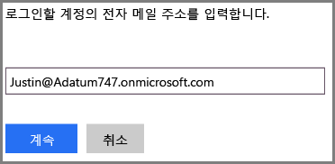
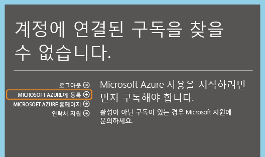
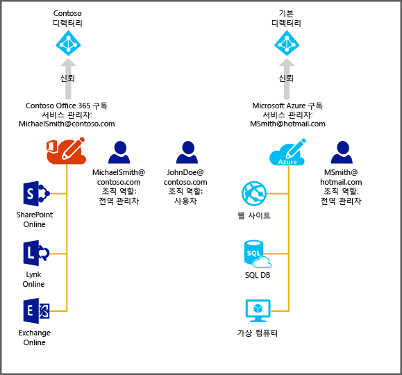

<properties
   pageTitle="Azure에서 Office 365 구독의 디렉터리 관리 | Microsoft Azure"
   description="Azure Active Directory 및 Azure 클래식 포털을 사용하여 Office 365 구독 계정 디렉터리 관리"
   services="active-directory"
   documentationCenter=""
   authors="curtand"
   manager="stevenpo"
   editor=""/>

<tags
   ms.service="active-directory"
   ms.devlang="na"
   ms.topic="get-started-article"
   ms.tgt_pltfrm="na"
   ms.workload="identity"
   ms.date="05/16/2016"
   ms.author="curtand"/>

#Azure에서 Office 365 구독의 디렉터리 관리

이 문서에서는 Azure 클래식 포털 내에서 Office 365 구독에 대해 만들어진 디렉터리를 관리하는 방법을 설명합니다. 이 작업을 완료하는 단계는 Azure에 대한 구독이 이미 있는지 여부는 따라 다릅니다. Azure 클래식 포털에 로그인하려면 Azure 구독의 서비스 관리자 또는 공동 관리자여야 합니다.

Azure 구독이 아직 없는 경우 Office 365 로그인에 사용하는 회사 또는 학교 계정을 사용하여 등록하기만 하면 됩니다.

Azure에 대한 구독을 찾을 수 없으나 **Azure 등록**을 클릭하면 Office 365 계정의 관련 정보가 등록 양식에 미리 채워집니다. 기본적으로 동일한 계정이 서비스 관리자 역할에 할당됩니다.

Azure 구독을 완료한 후 Azure 클래식 포털에 로그인하고 Azure 서비스에 액세스할 수 있습니다. Office 365 사용자를 인증하는 동일한 디렉터리를 관리하기 위해 Active Directory 확장을 클릭합니다.

Azure 구독이 이미 있는 경우 추가 디렉터리를 관리하는 프로세스도 간단히 수행할 수 있습니다. 다음 다이어그램은 프로세스를 설명하는 데 도움이 될 수 있습니다.

이 예에서 Michael Smith는 Contoso.com에 대한 Office 365 구독을 보유하고 있습니다. 그에게는 본인의 Microsoft 계정 msmith@hotmail.com을 사용하여 등록한 Azure 구독이 있습니다. 이 경우 두 개의 디렉터리를 관리하게 됩니다.

| 구독 | Office 365 | Azure |
|  -------------- | ------------- | ------------------------------- |
| 표시 이름 | Contoso | 기본 디렉터리 |
| 도메인 이름 | contoso.com | msmithhotmail.onmicrosoft.com |

그는 다단계 인증 등의 Azure AD 기능을 설정할 수 있도록 Microsoft 계정을 사용하여 Azure에 로그인한 동안 Contoso 디렉터리의 사용자 ID를 관리하려고 합니다.

이 경우 두 디렉터리는 서로 독립적입니다.

##독립적인 두 디렉터리를 관리하려면
Michael Smith는 Azure에 msmith@hotmail.com으로 로그인한 동안 두 디렉터리를 관리하기 위해 다음 단계를 완료해야 합니다.

> [AZURE.NOTE]
이러한 단계는 사용자가 Microsoft 계정으로 로그인한 경우에만 완료할 수 있습니다. 사용자가 회사 또는 학교 계정으로 로그인했으면 홈 디렉터리(즉, 회사 또는 학교 계정이 저장된 디렉터리 및 회사 또는 학교가 소유한 디렉터리)만 회사 또는 학교 계정을 인증할 수 있으므로 **기존 디렉터리 사용** 옵션을 사용할 수 없습니다.

1.	msmith@hotmail.com에서와 같이 Azure 클래식 포털에 로그인합니다.
2.	**새로 만들기** > **앱 서비스** > **Active Directory** > **디렉터리 ** > **사용자 지정 만들기**를 클릭합니다.
3.	기존 디렉터리 사용을 클릭하고 **지금 로그아웃** 확인란을 선택합니다.
4.	Contoso.onmicrosoft.com의 전역 관리자로 Azure 클래식 포털에 로그인합니다(예: msmith@contoso.com)).
5.	**Azure로 Contoso 디렉터리를 사용할까요?**라는 메시지가 나타나면 **계속**을 클릭합니다.
6.	**지금 로그아웃**을 클릭합니다.
7.	msmith@hotmail.com에서와 같이 Azure 클래식 포털에 로그인합니다. Contoso 디렉터리와 기본 디렉터리가 Active Directory 확장에 표시됩니다.

다음 단계가 완료되면 msmith@hotmail.com은 Contoso 디렉터리의 전역 관리자가 됩니다.

##전역 관리자로 리소스를 관리하려면
이제 John Doe는 Azure 클래식 포털에 로그인하고 msmith@hotmail.com의 Azure 구독과 연결된 웹 사이트 및 데이터베이스 리소스를 관리해야 한다고 가정해 봅니다. 이를 위해 Michael Smith는 다음 추가 단계를 완료해야 합니다.

1.	Azure 구독의 서비스 관리자 계정을 사용하여 Azure 클래식 포털에 로그인합니다(이 예에서는 msmith@hotmail.com)).
2.	Contoso 디렉터리로 구독을 전송합니다. 이를 위해 **설정** > **구독**을 클릭하고 구독을 선택한 후 **디렉터리 편집** > **Contoso(Contoso.com)**을 선택합니다. 전송 과정이 진행되면서 구독의 공동 관리자인 모든 회사 또는 학교 계정이 제거됩니다.
3.	John Doe를 구독의 공동 관리자로 추가합니다. 이를 위해 **설정** > **관리자**를 클릭하고 구독을 선택한 후 **추가**를 선택하고 ****JohnDoe@Contoso.com**을 입력합니다.

##다음 단계
구독과 디렉터리 간의 관계에 대한 자세한 내용은 [구독과 디렉터리의 연관 관계](active-directory-how-subscriptions-associated-directory.md)를 참조하세요.

<!---HONumber=AcomDC_0518_2016-->