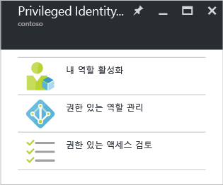

<properties
   pageTitle="Azure AD Privileged Identity Management 시작 | Microsoft Azure"
   description="Azure 포털에서 Azure Active Directory Privileged Identity Management 응용 프로그램을 사용하여 권한 있는 ID를 관리하는 방법을 알아봅니다."
   services="active-directory"
   documentationCenter=""
   authors="kgremban"
   manager="femila"
   editor=""/>

<tags
   ms.service="active-directory"
   ms.devlang="na"
   ms.topic="get-started-article"
   ms.tgt_pltfrm="na"
   ms.workload="identity"
   ms.date="09/16/2016"
   ms.author="kgremban"/>

# Azure AD Privileged Identity Management 시작

Azure Active Directory(AD) Privileged Identity Management를 사용하여 조직 내에서 액세스를 관리, 제어 및 모니터링할 수 있습니다. Azure AD의 리소스 및 Office 365 또는 Microsoft Intune과 같은 다른 Microsoft 온라인 서비스에 대한 액세스를 포함합니다.

이 문서에서는 Azure AD PIM 앱을 Azure 포털 대시보드에 추가하는 방법을 알려줍니다.

## Privileged Identity Management 응용 프로그램 추가

Azure AD Privileged Identity Management를 사용하기 전에 응용 프로그램을 Azure 포털 대시보드에 추가해야 합니다.

1. 해당 디렉터리의 전역 관리자로 [Azure 포털](https://portal.azure.com/)에 로그인합니다.
2. 조직에 둘 이상의 디렉터리가 있는 경우 Azure 포털의 오른쪽 위에서 사용자 이름을 선택합니다. PIM을 사용할 디렉터리를 선택합니다.
3. **더 많은 서비스**를 선택하고 필터 텍스트 상자를 사용하여 **Azure AD Privileged Identity Management**를 검색합니다.
4. **대시보드에 고정** 옵션을 선택하고 **만들기**를 클릭합니다. Privileged Identity Management 응용 프로그램이 열립니다.

디렉터리에서 Azure AD Privileged Identity Management를 처음 사용하는 사용자이면 [보안 마법사](active-directory-privileged-identity-management-security-wizard.md)가 초기 할당 환경을 안내합니다. 이 작업 이후 자동으로 디렉터리의 첫 번째 **보안 관리자** 및 **권한 있는 역할 관리자**가 됩니다. 권한 있는 역할 관리자만 이 응용 프로그램에 액세스하여 다른 관리자의 액세스 권한을 관리할 수 있습니다.

## 태스크로 이동합니다.

Azure AD Privileged Identity Management를 설정하면 응용 프로그램을 열 때마다 탐색 블레이드가 표시됩니다. 이 블레이드를 사용하여 사용자 ID 관리 작업을 수행합니다.

- **내 역할 활성화**를 통해 할당된 역할 목록으로 이동합니다. 사용할 수 있는 모든 역할을 활성화하는 위치입니다.

- **권한 있는 역할 관리**는 권한 있는 역할 관리자가 역할 할당을 관리하고 역할 활성화 설정을 변경하며 액세스 검토를 시작하는 대시보드입니다. 이 대시보드에서의 옵션은 권한 있는 역할 관리자가 아닌 사용자에게 비활성화됩니다.

- **권한 있는 액세스 검토**를 통해 자신 또는 다른 사용자에 대한 액세스 권한을 검토하는지 여부와 상관없이 완료하는 데 필요한 보류 중인 액세스 권한 검토를 수행합니다.

<!--Every topic should have next steps and links to the next logical set of content to keep the customer engaged-->
## 다음 단계

[Azure AD Privileged Identity Management 개요](active-directory-privileged-identity-management-configure.md)에는 조직의 관리 액세스 권한을 관리할 수 있는 방법에 대한 자세한 정보가 포함되어 있습니다.

[AZURE.INCLUDE [active-directory-privileged-identity-management-toc](../../includes/active-directory-privileged-identity-management-toc.md)]

<!--Image references-->

[1]: ./media/active-directory-privileged-identity-management-configure/PIM_EnablePim.png

<!-----HONumber=AcomDC_0921_2016-->