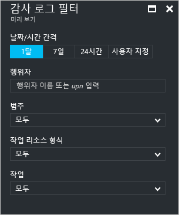
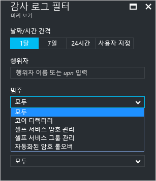
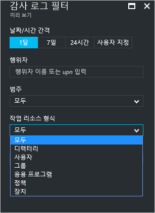
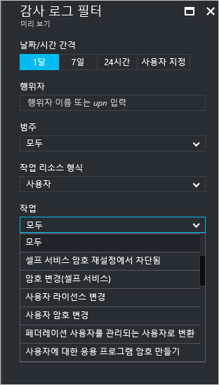
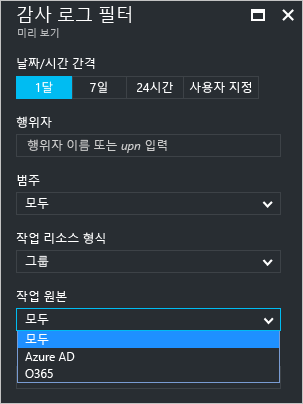

# Azure Active Directory 포털 – 미리 보기의 감사 활동 보고서

Azure Active Directory [미리 보기](active-directory-preview-explainer.md)에서 보고를 통해 사용자 환경의 작동 방법을 결정하는 데 필요한 모든 정보를 얻을 수 있습니다.

Azure Active Directory의 보고 아키텍처는 다음 구성 요소로 구성됩니다.

- **활동** 
    - **로그인 활동** – 관리되는 응용 프로그램 및 사용자 로그인 활동의 사용량에 대한 정보
    - **감사 로그** - 사용자 및 그룹 관리, 관리되는 응용 프로그램 및 디렉터리 활동에 대한 시스템 작업 정보
- **보안** 
    - **위험한 로그인** - 위험한 로그인은 사용자 계정의 정당한 소유자가 아닌 사용자에 의해 수행된 로그인 시도에 대한 지표입니다. 자세한 내용은 위험한 로그인을 참조하세요.
    - **위험 플래그가 지정된 사용자** - 위험한 사용자는 손상되었을 수 있는 사용자 계정에 대한 표시기입니다. 자세한 내용은 위험 플래그가 지정된 사용자를 참조하세요.

이 항목에서는 감사 활동에 대한 개요를 제공합니다.
 
## 감사 로그

Azure Active Directory의 감사 로그는 규정 준수를 위한 시스템 활동의 기록을 제공합니다.

Azure Portal에서 관련된 활동을 감사하기 위한 세 가지 범주가 있습니다.

- 개요   

- 응용 프로그램

- 디렉터리   

감사 보고서 활동의 전체 목록은 [감사 보고서 이벤트 목록](active-directory-reporting-audit-events.md#list-of-audit-report-events)을 참조하세요.

모든 감사된 데이터에 대한 진입점은 **Azure Active Directory**의 **활동** 섹션에서 **감사 로그**입니다.

감사 로그에는 행위자(*누가*), 활동(*무엇*) 및 대상을 표시하는 목록 보기가 있습니다.

목록 보기에서 항목을 클릭하여 자세한 정보를 얻을 수 있습니다.

## 사용자 및 그룹 감사 로그

사용자 및 그룹 기반 감사 보고서를 사용하여 다음과 같은 질문에 대한 답을 얻을 수 있습니다.

- 어떤 종류의 업데이트가 사용자에게 적용되나요?

- 얼마나 많은 사용자가 변경되었나요?

- 얼마나 많은 암호가 변경되었나요?

- 관리자가 디렉터리에서 무엇을 수행했나요?

- 추가된 그룹은 무엇인가요?

- 멤버 자격이 변경된 그룹이 있나요?

- 그룹의 소유자가 변경되었나요?

- 어떤 라이선스가 그룹 또는 사용자에 할당되었나요?

사용자 및 그룹에 관련된 감사 데이터를 검토하려면 **사용자 및 그룹**의 **활동** 섹션에 있는 **감사 로그**에서 필터링된 보기를 찾을 수 있습니다.

## 응용 프로그램 감사 로그
응용 프로그램 기반 감사 보고서를 사용하여 다음과 같은 질문에 대한 답을 얻을 수 있습니다.

* 추가되거나 업데이트된 응용 프로그램은 무엇인가요?
* 삭제된 응용 프로그램은 무엇인가요?
* 응용 프로그램에 대한 서비스 원칙이 변경되었나요?
* 응용 프로그램의 이름이 변경되었나요?
* 누가 응용 프로그램에 동의했나요?

응용 프로그램에 관련된 감사 데이터를 검토하려면 **엔터프라이즈 응용 프로그램**의 **활동** 섹션에 있는 **감사 로그**에서 필터링된 보기를 찾을 수 있습니다.

## 감사 로그 필터링
다음 필드를 사용하여 표시된 데이터의 양을 제한하도록 로그인을 필터링할 수 있습니다.

- 날짜 및 시간

- 행위자의 사용자 계정 이름

- Category

- 활동 리소스 종류

- 작업

**범주** 필터를 사용하면 다음 범주에 따라 감사 보고서의 범위를 좁힐 수 있습니다.

- 핵심 디렉터리

- 셀프 서비스 암호 관리

- 셀프 서비스 그룹 관리

- 자동화된 암호 롤오버 

**활동 리소스 종류** 목록의 콘텐츠는 이 블레이드에 대한 진입점에 연결됩니다.  
진입점이 Azure Active Directory인 경우 이 목록에는 사용 가능한 모든 활동 유형이 포함됩니다.

- 디렉터리

- 사용자

- 그룹 

- 응용 프로그램 

- 정책

- 장치

나열된 활동은 활동 유형으로 범위가 지정됩니다.
예를 들어 **사용자**를 **활동 유형**으로 선택한 경우 **활동** 목록은 그룹 관련 작업만 포함합니다.   

**그룹**을 **활동 리소스 유형**으로 선택한 경우 다음 **활동 원본**에 따라 필터링할 수 있는 추가 필터 옵션을 사용할 수 있습니다.

- Azure AD

- O365

감사 로그의 항목을 필터링하는 다른 방법은 특정 항목을 검색하는 것입니다.

## 다음 단계
[Azure Active Directory Reporting 가이드](active-directory-reporting-guide.md)를 참조하세요.

