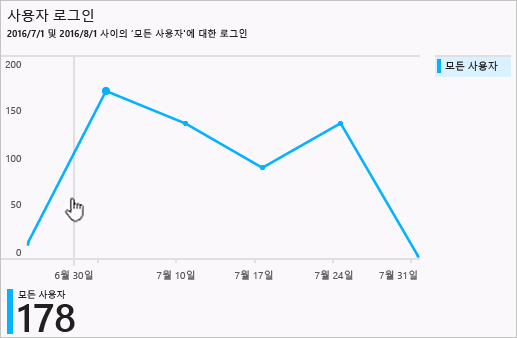
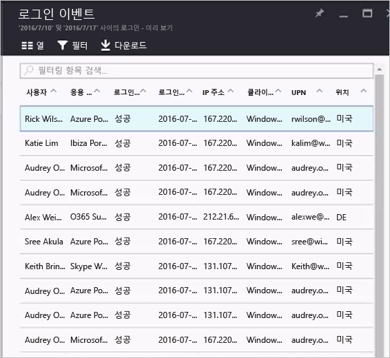

# Azure Active Directory 포털의 로그인 작업 보고서

[Azure Portal](https://portal.azure.com)에서 Azure Active Directory(Azure AD) 보고를 통해 사용자 환경의 작동 방법을 결정하는 데 필요한 모든 정보를 얻을 수 있습니다.

Azure Active Directory의 보고 아키텍처는 다음 구성 요소로 구성됩니다.

- **활동** 
    - **로그인 활동** – 관리되는 응용 프로그램 및 사용자 로그인 활동의 사용량에 대한 정보
    - **감사 로그** - 사용자 및 그룹 관리, 관리되는 응용 프로그램 및 디렉터리 활동에 대한 시스템 작업 정보
- **보안** 
    - **위험한 로그인** - 위험한 로그인은 사용자 계정의 정당한 소유자가 아닌 사용자에 의해 수행된 로그인 시도에 대한 지표입니다. 자세한 내용은 위험한 로그인을 참조하세요.
    - **위험 플래그가 지정된 사용자** - 위험한 사용자는 손상되었을 수 있는 사용자 계정에 대한 표시기입니다. 자세한 내용은 위험 플래그가 지정된 사용자를 참조하세요.

이 항목에서는 로그인 활동에 대한 개요를 제공합니다.

## 필수 조건

### 데이터에 액세스할 수 있는 사용자는 누구인가요?
* 보안 관리, 보안 판독기 또는 보고서 판독기 역할의 사용자
* 전역 관리자
* 모든 사용자(비관리자)가 자신의 로그인에 액세스할 수 있습니다. 

### 로그인 작업에 액세스하는 데 필요한 Azure AD 라이선스는 무엇인가요?
* 모든 로그인 활동 보고서를 보려면 테넌트에 이와 관련된 Azure AD Premium 라이선스가 있어야 합니다.

## 로그인 활동

보고서에서 사용자 로그인에 의해 제공되는 정보를 사용하여 다음과 같은 질문에 대한 대답을 찾습니다.

* 사용자의 로그인 패턴이란?
* 한 주 동안 얼마나 많은 사용자가 로그인했나요?
* 이러한 로그인의 상태란?

모든 로그인 작업 데이터의 첫 번째 진입점은 **Azure Active**의 [작업] 섹션에 있는 **로그인**입니다.

로그인 로그에는 다음 항목을 보여주는 기본 목록 보기가 있습니다.

- 로그인 날짜
- 관련된 사용자
- 사용자가 로그인한 응용 프로그램
- 로그인 상태
- 위험 검색 상태
- MFA(Multi-Factor Authentication) 요구 사항 상태 

도구 모음에서 **열**을 클릭하여 목록 보기를 사용자 지정할 수 있습니다.

그러면 추가 필드를 표시하거나 이미 표시된 필드를 제거할 수 있습니다.

목록 보기에서 항목을 클릭하면 가로 보기로 해당 항목에 대해 사용할 수 있는 세부 정보를 모두 얻을 수 있습니다.

## 로그인 활동 필터링

보고되는 데이터를 자신에게 적합한 수준으로 좁히려면 다음 기본 필드를 사용하여 로그인 데이터를 필터링하면 됩니다.

- 사용자
- 응용 프로그램
- 로그인 상태
- 위험 검색 상태
- Date

**사용자** 필터를 사용하면 관심 있는 사용자의 이름이나 UPN(사용자 계정 이름)을 지정할 수 있습니다. 

**응용 프로그램** 필터를 사용하면 관심 있는 응용 프로그램의 이름을 지정할 수 있습니다.  

**로그인 상태** 필터를 사용하면 다음을 선택할 수 있습니다.

- 모두 
- 성공
- 실패

**위험 검색** 필터를 사용하면 다음을 선택할 수 있습니다.

- 모두
- 예
- 아니오 

**날짜** 필터를 사용하면 반환되는 데이터의 시간 범위를 정의할 수 있습니다.  
가능한 값은 다음과 같습니다.

- 1개월
- 7 일
- 24시간
- 사용자 지정 시간 간격

사용자 지정 시간 범위를 선택하면 시작 시간과 종료 시간을 구성할 수 있습니다.

로그인 보기에 다른 필드를 추가할 경우 이러한 필드가 자동으로 필터 목록에 추가됩니다. 예를 들어 **클라이언트 앱** 필드를 목록에 추가하면 다음 필드를 설정할 수 있는 또 다른 필터 옵션이 제공됩니다.

- 브라우저      
- Exchange ActiveSync(지원됨)               
- Exchange ActiveSync(지원되지 않음)
- 기타 클라이언트               
    - IMAP
    - MAPI
    - 이전 버전의 Office 클라이언트
    - POP
    - SMTP

> [!TIP] 
> 기본 필터 외에도 로그인 보기에 추가하는 모든 추가 필드가 필터 필드가 됩니다.

## 로그인 활동 다운로드

Azure Portal 외부에서 작업하려는 경우 로그인 활동 데이터를 다운로드할 수 있습니다. 다운로드 단추 외에도 Azure Portal은 데이터를 다운로드하는 스크립트를 생성하는 옵션을 제공합니다.  

**다운로드**를 클릭하면 가장 최근의 5K 레코드의 CSV 파일을 만듭니다. 더 많은 유연성이 필요한 경우 스크립트 솔루션을 사용할 수 있습니다. **스크립트**를 클릭하면 설정한 모든 필터가 포함된 PowerShell 스크립트를 만듭니다. **관리자 모드**에서 이 스크립트를 다운로드하고 실행하여 CSV 파일을 생성합니다. 기술 구현 외에도 다운로드할 수 있는 레코드의 수는 [Azure Active Directory 보고서 보존 정책](active-directory-reporting-retention.md)에 의해 제한됩니다.  

## 로그인 활동 바로 가기

Azure Active Directory 외에도 Azure Portal에서는 로그인 활동 데이터에 대한 다음 두 개의 추가 진입점을 제공합니다.

- ID 보안 보호 개요
- 사용자
- 그룹
- Enterprise 응용 프로그램

### 사용자 로그인 활동

보고서에서 사용자 로그인에 의해 제공되는 정보를 사용하여 다음과 같은 질문에 대한 대답을 찾습니다.

- 사용자의 로그인 패턴이란?
- 한 주 동안 얼마나 많은 사용자가 로그인했나요?
- 이러한 로그인의 상태란?

이 데이터에 대한 진입점은 **ID 보안 보호** 개요 페이지의 사용자 로그인 그래프입니다. 사용자 로그인 그래프에서는 지정된 기간 내에 모든 사용자에 대한 로그인의 주간 집계를 보여 줍니다. 시간에 대한 기본값은 30일입니다.

로그인 그래프에서 한 날짜를 클릭하면 해당 날짜의 로그인 활동에 대한 개요가 표시됩니다.

로그인 활동 목록의 각 행에는 다음 내용이 표시됩니다.

* 누가 로그인했나요?
* 어떤 응용 프로그램이 로그인할 대상이었나요?
* 로그인의 상태는 어떻습니까?
* 로그인의 MFA 상태는 어떻습니까?

항목을 클릭하면 로그인 작업에 대한 세부 정보가 표시됩니다.

- 사용자 ID
- 사용자
- 사용자 이름
- 응용 프로그램 UI
- 응용 프로그램
- 클라이언트
- 위치
- IP 주소
- Date
- 필요한 MFA
- 로그인 상태

 
**사용자** 페이지에서 **활동** 섹션의 **로그인**을 클릭하면 모든 사용자 로그인에 대한 전체 개요가 표시됩니다.

## 관리되는 응용 프로그램의 사용량

로그인 데이터의 응용 프로그램 중심 보기를 사용하여 다음과 같은 질문에 대답할 수 있습니다.

* 누가 내 응용 프로그램을 사용하나요?
* 조직에서 상위 3개의 응용 프로그램은 무엇인가요?
* 최근에 응용 프로그램을 롤아웃했습니다. 어떻게 작동하고 있나요?

이 데이터에 대한 진입점은 **엔터프라이즈 응용 프로그램** 페이지의 **개요** 섹션에 있는 *지난 30일 이내의 보고서에서 조직의 상위 3개 응용 프로그램*입니다.

지정된 기간 동안 상위 3가지 응용 프로그램에 대한 로그인의 주간 사용량 그래프 집계입니다. 시간에 대한 기본값은 30일입니다.

원하면 특정 응용 프로그램에 포커스를 설정할 수 있습니다.

앱 사용량 그래프에서 날짜를 클릭하면 로그인 활동의 자세한 목록이 표시됩니다.

**로그인** 옵션을 선택하면 응용 프로그램에 대한 모든 로그인 이벤트의 전체적인 개요를 보여 줍니다.

## 다음 단계

로그인 활동 오류 코드에 대해 자세히 알아보려면 [Azure Active Directory 포털의 로그인 활동 보고서 오류 코드](active-directory-reporting-activity-sign-ins-errors.md)를 참조하세요.

