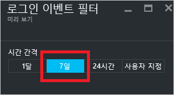
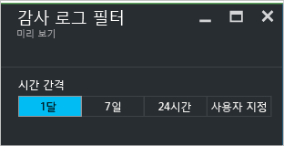

<properties
   pageTitle="Azure Active Directory Reporting - 미리 보기 | Microsoft Azure"
   description="Azure Active Directory Reporting 미리 보기에 사용할 수 있는 다양한 보고서를 나열합니다."
   services="active-directory"
   documentationCenter=""
   authors="markusvi"
   manager="femila"
   editor=""/>

<tags
   ms.service="active-directory"
   ms.devlang="na"
   ms.topic="get-started-article"
   ms.tgt_pltfrm="na"
   ms.workload="identity"
   ms.date="09/25/2016"
   ms.author="markvi"/>

# Azure Active Directory Reporting - 미리 보기

*이 설명서는 [Azure Active Directory Reporting 가이드](active-directory-reporting-guide.md)의 일부입니다.*

Azure Active Directory 미리 보기에서 리포팅으로 사용자 환경의 작동 방법을 결정하는 데 필요한 모든 정보를 얻을 수 있습니다. [무엇이 미리 보기 상태인가요?](active-directory-preview-explainer.md)

보고의 두 가지 주요 영역이 있습니다.

- **로그인 활동** – 관리되는 응용 프로그램 및 사용자 로그인 활동의 사용량에 대한 정보

- **감사 로그** - 사용자 및 그룹 관리, 관리되는 응용 프로그램 및 디렉터리 활동에 대한 시스템 활동 정보

원하는 데이터의 범위에 따라 [Azure Portal](https://portal.azure.com)의 서비스 목록에서 **사용자 및 그룹** 또는 **엔터프라이즈 응용 프로그램**을 클릭하여 이러한 보고서에 액세스할 수 있습니다.

## 로그인 활동

### 사용자 로그인 활동

보고서에서 사용자 로그인에 의해 제공되는 정보를 사용하여 다음과 같은 질문에 대한 대답을 찾습니다.

- 사용자의 로그인 패턴이란?
- 한 주 동안 얼마나 많은 사용자가 로그인했나요?
- 이러한 로그인의 상태란?

이 데이터에 대한 진입점은 **사용자 및 그룹**의 **개요** 섹션에서 사용자 로그인 그래프입니다.

 

사용자 로그인 그래프에서는 지정된 기간 내에 모든 사용자에 대한 로그인의 주간 집계를 보여 줍니다. 시간에 대한 기본값은 30일입니다.

로그인 그래프에서 날짜를 클릭하면 로그인 활동의 자세한 목록이 표시됩니다.

로그인 활동 목록에서 각 행은 다음과 같이 선택된 로그인에 대한 자세한 내용을 보여 줍니다.

- 누가 로그인했나요?

- 관련된 UPN는 무엇이었나요?

- 어떤 응용 프로그램이 로그인할 대상이었나요?

- 로그인의 IP 주소는 무엇인가요?

- 로그인의 상태는 어떠했나요?

### 관리되는 응용 프로그램의 사용량

로그인 데이터의 응용 프로그램 중심 보기를 사용하여 다음과 같은 질문에 대답할 수 있습니다.

- 누가 내 응용 프로그램을 사용하나요?

- 조직에서 상위 3개의 응용 프로그램은 무엇인가요?

- 최근에 응용 프로그램을 롤아웃했습니다. 어떻게 작동하고 있나요?

이 데이터에 대한 진입점은 **엔터프라이즈 응용 프로그램**의 **개요** 섹션에 있는 지난 30일 간의 보고서에서 조직에 포함된 상위 3개의 응용 프로그램입니다.

 

지정된 기간 동안 상위 3가지 응용 프로그램에 대한 로그인의 주간 사용량 그래프 집계입니다. 시간에 대한 기본값은 30일입니다.

원하면 특정 응용 프로그램에 포커스를 설정할 수 있습니다.

앱 사용량 그래프에서 날짜를 클릭하면 로그인 활동의 자세한 목록이 표시됩니다.

**로그인** 옵션을 선택하면 응용 프로그램에 대한 모든 로그인 이벤트의 전체적인 개요를 보여 줍니다.

열 선택기를 사용하여 표시하려는 데이터 필드를 선택할 수 있습니다.

### 로그인 필터링

시간 간격별 로그인을 필터링하여 표시된 데이터의 양을 제한할 수 있습니다.

활동에서 로그인의 항목을 필터링하는 다른 방법은 특정 항목을 검색하는 것입니다. 검색 메서드를 사용하면 특정 **사용자**, **그룹** 또는 **응용 프로그램**에 대한 로그인의 범위를 지정할 수 있습니다.

## 감사 로그

Azure Active Directory의 감사 로그는 규정 준수를 위한 시스템 활동의 기록을 제공합니다.

Azure Portal에서 관련된 활동을 감사하기 위한 세 가지 범주가 있습니다.

- 사용자 및 그룹

- 응용 프로그램

- 디렉터리

감사 보고서 활동의 전체 목록은 [감사 보고서 이벤트 목록](active-directory-reporting-audit-events.md#list-of-audit-report-events)을 참조하세요.

모든 감사된 데이터에 대한 진입점은 **Azure Active Directory**의 **활동** 섹션에서 **감사 로그**입니다.

감사 로그에는 행위자(누가), 활동(무엇) 및 대상을 표시하는 목록 보기가 있습니다.

목록 보기에서 항목을 클릭하여 자세한 정보를 얻을 수 있습니다.

### 사용자 및 그룹 감사 로그

사용자 및 그룹 기반 감사 보고서를 사용하여 다음과 같은 질문에 대한 답을 얻을 수 있습니다.

- 어떤 종류의 업데이트가 사용자에게 적용되나요?

- 얼마나 많은 사용자가 변경되었나요?

- 얼마나 많은 암호가 변경되었나요?

- 관리자가 디렉터리에서 무엇을 수행했나요?

- 추가된 그룹은 무엇인가요?

- 멤버 자격이 변경된 그룹이 있나요?

- 그룹의 소유자가 변경되었나요?

- 어떤 라이선스가 그룹 또는 사용자에 할당되었나요?

사용자 및 그룹에 관련된 감사 데이터를 검토하려면 **사용자 및 그룹**의 **활동** 섹션에 있는 **감사 로그**에서 필터링된 보기를 찾을 수 있습니다.

### 응용 프로그램 감사 로그

응용 프로그램 기반 감사 보고서를 사용하여 다음과 같은 질문에 대한 답을 얻을 수 있습니다.

- 추가되거나 업데이트된 응용 프로그램은 무엇인가요?

- 삭제된 응용 프로그램은 무엇인가요?

- 응용 프로그램에 대한 서비스 원칙이 변경되었나요?

- 응용 프로그램의 이름이 변경되었나요?

- 누가 응용 프로그램에 동의했나요?

응용 프로그램에 관련된 감사 데이터를 검토하려면 **엔터프라이즈 응용 프로그램**의 **활동** 섹션에 있는 **감사 로그**에서 필터링된 보기를 찾을 수 있습니다.

### 감사 로그 필터링

시간 간격별 감사 보고서를 필터링하여 표시된 데이터의 양을 제한할 수 있습니다.

감사 로그의 항목을 필터링하는 다른 방법은 특정 항목을 검색하는 것입니다.

## 다음 단계

[Azure Active Directory Reporting 가이드](active-directory-reporting-guide.md)를 참조하세요.

<!---HONumber=AcomDC_0928_2016-->