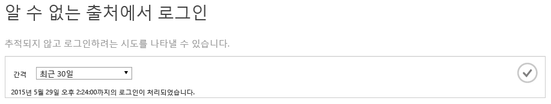
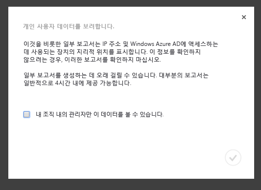
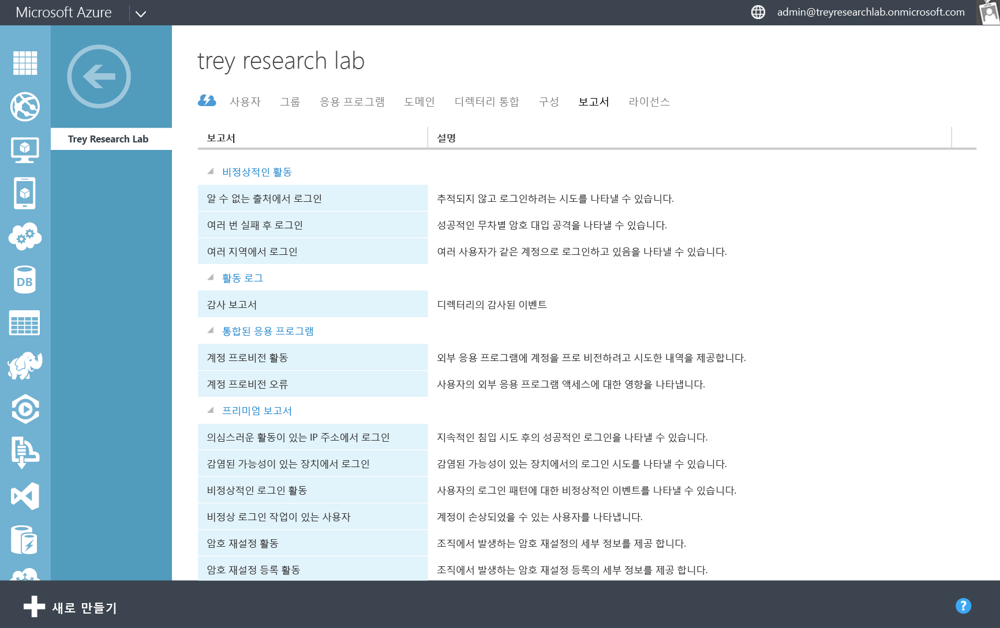
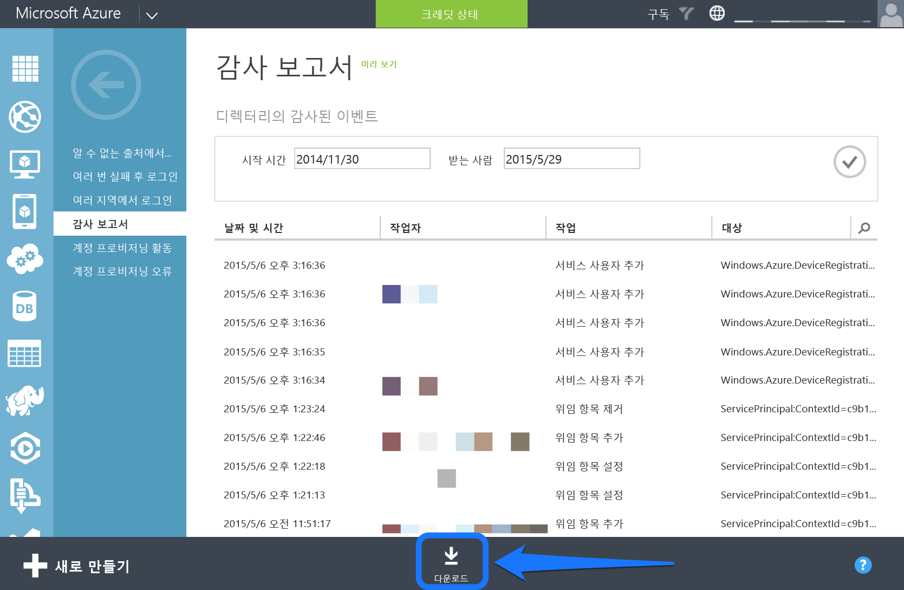
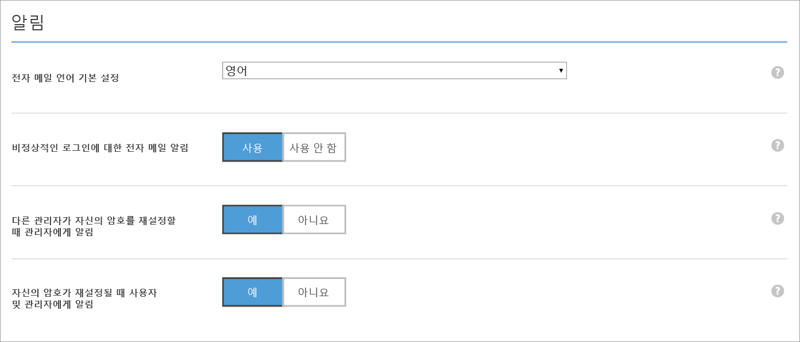
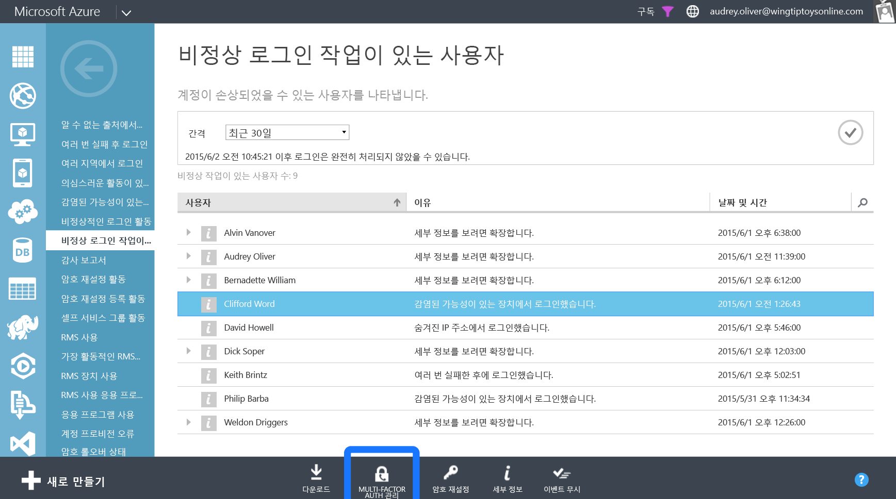

<properties
   pageTitle="Azure Active Directory Reporting: 시작 | Microsoft Azure"
   description="Azure Active Directory Reporting에 사용할 수 있는 다양한 보고서를 나열합니다."
   services="active-directory"
   documentationCenter=""
   authors="dhanyahk"
   manager="femila"
   editor=""/>

<tags
   ms.service="active-directory"
   ms.devlang="na"
   ms.topic="get-started-article"
   ms.tgt_pltfrm="na"
   ms.workload="identity"
   ms.date="03/07/2016"
   ms.author="dhanyahk"/>

# Azure Active Directory Reporting 시작하기

## 정의

Azure AD(Azure Active Directory)에는 디렉터리에 대한 보안, 활동 및 감사 보고서가 포함되어 있습니다. 포함된 보고서 목록은 다음과 같습니다.

### 보안 보고서

- 알 수 없는 원본에서 로그인
- 여러 번의 실패 후 로그인
- 여러 지역에서의 로그인
- 의심스러운 작업이 있는 IP 주소에서 로그인
- 비정상적인 로그인 작업
- 감염 가능성이 있는 장치에서 로그인
- 비정상적인 로그인 활동을 포함하는 사용자

### 작업 보고서

- 응용 프로그램 사용: 요약
- 응용 프로그램 사용: 세부
- 응용 프로그램 대시보드
- 계정 프로비전 오류
- 개별 사용자 장치
- 개별 사용자 활동
- 그룹 활동 보고서
- 암호 재설정 등록 활동 보고서
- 암호 재설정 활동

### 감사 보고서

- 디렉터리 감사 보고서

> [AZURE.TIP] Azure AD Reporting에 대한 설명서에 대해서는 [액세스 및 사용 보고서 보기](active-directory-view-access-usage-reports.md)를 확인하세요.

## 작동 방법

### 보고 파이프라인

보고 파이프라인은 세 가지 주요 단계로 구성됩니다. 사용자가 로그인하거나 인증이 이루어질 때마다 다음 상황이 발생합니다.

- 먼저, 사용자가 인증되면(성공 또는 실패) 결과가 Azure Active Directory 서비스 데이터베이스에 저장됩니다.
- 정기적으로 최근의 모든 로그인이 처리됩니다. 이때 보안 및 비정상적인 활동 알고리즘은 최근의 모든 로그인에서 의심스러운 활동을 검색합니다.
- 처리 후에 보고서가 Azure 클래식 포털에 기록되고, 캐시되며, 제공됩니다.

### 보고서 생성 시간

Azure AD 플랫폼에서 처리한 수많은 인증 및 로그인으로 인해 최근에 처리된 로그인은 평균적으로 한 시간 전입니다. 드문 경우이지만 가장 최근 로그인을 처리하는 데 최대 8시간이 걸릴 수 있습니다.

각 보고서의 위쪽에 있는 도움말 텍스트를 검사하여 가장 최근에 처리된 로그인을 찾을 수 있습니다.

> [AZURE.TIP] Azure AD Reporting에 대한 설명서에 대해서는 [액세스 및 사용 보고서 보기](active-directory-view-access-usage-reports.md)를 확인하세요.

## 시작

### Azure 클래식 포털에 로그인하기

먼저, [Azure 클래식 포털](https://manage.windowsazure.com)에 전역 또는 준수 관리자로 로그인해야 합니다. Azure 구독 서비스 관리자 또는 공동 관리자이어야 하거나, "Azure AD에 액세스" Azure 구독을 사용해야 합니다.

### 보고서 탐색

보고서를 보려면 디렉터리 맨 위에 있는 보고서 탭으로 이동합니다.

처음 보고서를 보는 경우 대화 상자에 동의해야 보고서를 볼 수 있습니다. 이는 조직의 관리자가 이 데이터를 보기에 적합한지 확인하기 위한 것입니다. 이 데이터는 일부 국가에서는 개인 정보로 간주될 수 있습니다.

### 각 보고서 탐색

각 보고서로 이동하여 수집된 데이터와 처리된 로그인을 확인합니다. [여기서 모든 보고서 목록](active-directory-reporting-guide.md)을 찾을 수 있습니다.

### 보고서를 CSV로 다운로드

각 보고서를 CSV(쉼표로 구분 된 값) 파일로 다운로드할 수 있습니다. Excel, PowerBI 또는 타사 분석 프로그램에서 이러한 파일을 사용하여 데이터를 분석할 수 있습니다.

모든 보고서를 CSV로 다운로드하려면 보고서로 이동하고 맨 아래에 있는 "다운로드"를 클릭합니다.

> [AZURE.TIP] Azure AD Reporting에 대한 설명서에 대해서는 [액세스 및 사용 보고서 보기](active-directory-view-access-usage-reports.md)를 확인하세요.

## 다음 단계

### 비정상적인 로그인 활동에 대한 경고 사용자 지정

디렉터리의 "구성" 탭으로 이동합니다.

"알림" 섹션으로 스크롤합니다.

“Email Notifications of Anomalous sign ins(비정상적인 로그인에 대해 전자 메일 알림)” 섹션을 사용하거나 사용하지 않도록 설정합니다.

### Azure AD Reporting API와 통합

[Reporting API 시작](active-directory-reporting-api-getting-started.md)을 참조하세요.

### 사용자에 대해 Multi-Factor Authentication 적용

보고서에서 사용자를 선택합니다.

화면 맨 아래에 있는 "Enable MFA(MFA 사용)" 단추를 클릭합니다.

> [AZURE.TIP] Azure AD Reporting에 대한 설명서에 대해서는 [액세스 및 사용 보고서 보기](active-directory-view-access-usage-reports.md)를 확인하세요.

## 자세한 정보

### 감사 이벤트

[Azure Active Directory Reporting 감사 이벤트](active-directory-reporting-audit-events.md)에서 디렉터리에서 감사된 이벤트에 대해 알아봅니다.

### API 통합

[Reporting API 시작](active-directory-reporting-api-getting-started.md) 및 [API 참조 설명서](https://msdn.microsoft.com/library/azure/mt126081.aspx)를 참조하세요.

### 문의하기

피드백을 제공하거나, 도움이 필요하거나, 질문이 있는 경우 [aadreportinghelp@microsoft.com](mailto:aadreportinghelp@microsoft.com)으로 전자 메일을 보내세요.

> [AZURE.TIP] Azure AD Reporting에 대한 설명서에 대해서는 [액세스 및 사용 보고서 보기](active-directory-view-access-usage-reports.md)를 확인하세요.

<!---HONumber=AcomDC_0928_2016-->