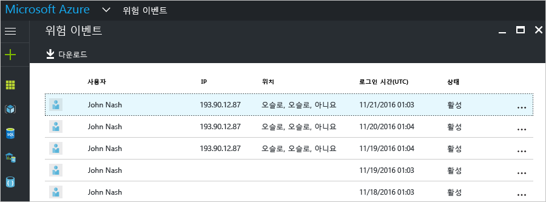
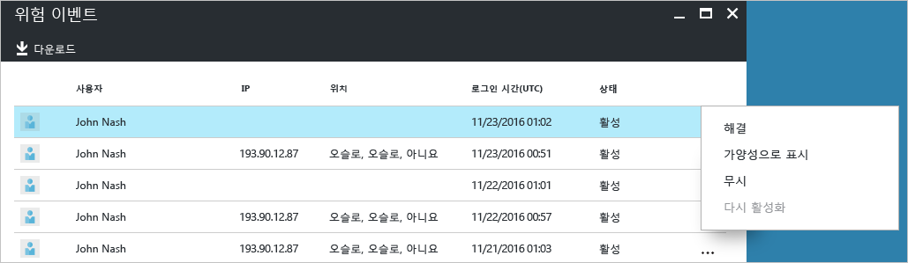
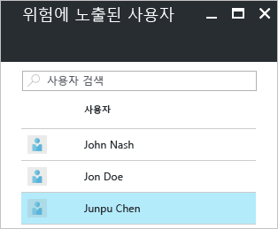
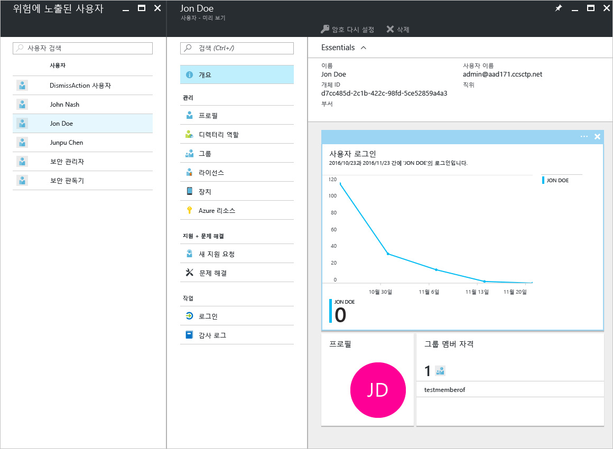

# Azure Active Directory 무료 및 기본 버전의 보안 보고 - 미리 보기

Azure Active Directory [미리 보기](active-directory-preview-explainer.md)의 보안 보고를 사용하여 사용자 환경에서 손상된 사용자 계정의 확률에 대한 정보를 얻을 수 있습니다. 

Azure Active Directory는 사용자 계정에 관련된 의심스러운 작업을 감지합니다. 작업이 감지된 경우 *위험 이벤트*라는 레코드가 만들어집니다. 자세한 내용은 [Azure Active Directory 위험 이벤트](active-directory-identity-protection-risk-events.md)를 참조하세요. 

감지된 위험 이벤트를 계산하는 데 사용합니다.

- **위험한 로그인** - 위험한 로그인은 사용자 계정의 정당한 소유자가 아닌 사용자에 의해 수행된 로그인 시도에 대한 지표입니다. 자세한 내용은 [위험한 로그인](active-directory-identityprotection.md#risky-sign-ins)을 참조하세요. 

- **위험 플래그가 지정된 사용자** - 위험한 사용자는 손상되었을 수 있는 사용자 계정에 대한 표시기입니다. 자세한 내용은 [위험 플래그가 지정된 사용자](active-directory-identityprotection.md#users-flagged-for-risk)를 참조하세요.  

## 위험한 로그인 보고서

Azure Active Directory 무료 및 기본 버전은 사용자에 대해 보고하도록 감지된 위험한 로그인 목록을 제공합니다. 위험 이벤트 보고서는 다음을 제공합니다.

- **사용자** - 로그인 작업 중에 사용한 사용자의 이름
- **IP** - Azure Active Directory에 연결하는 데 사용한 장치의 IP 주소
- **위치** - Azure Active Directory에 연결하는 데 사용한 위치
- **로그인 시간** - 로그인을 수행한 시간
- **상태** - 로그인의 상태

이 보고서는 보고서 데이터를 다운로드하는 옵션을 제공합니다.

위험한 로그인의 조사에 따르면 다음 작업의 형식으로 Azure Active Directory에 대한 피드백을 제공할 수 있습니다.

- 해결
- 가양성으로 표시
- 무시
- 다시 활성화

자세한 내용은 [수동으로 위험 이벤트 닫기](active-directory-identityprotection.md#closing-risk-events-manually)를 참조하세요.

## 위험에 노출된 사용자 보고서

Azure Active Directory 무료 버전은 손상되었을 수 있는 사용자 계정 목록을 제공합니다. 

목록에서 사용자를 클릭하면 관련된 사용자 데이터 블레이드가 열립니다.
사용자의 위험에 노출되어 있는 경우 사용자의 로그인 기록을 검토하고 필요한 경우 암호를 다시 설정합니다.

## 다음 단계

- Azure Active Directory Reporting에 대한 자세한 내용은 [Azure Active Directory Reporting 가이드](active-directory-reporting-guide.md)를 참조하세요.
- Azure Active Directory ID 보호에 대한 자세한 내용은 [Azure Active Directory ID 보호](active-directory-identityprotection.md)를 참조하세요.

<!--HONumber=Jan17_HO3-->

