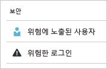
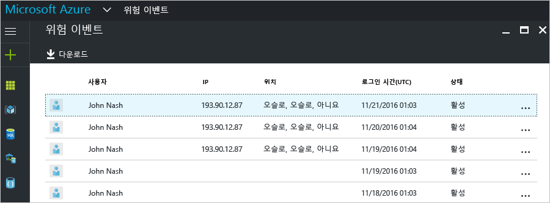
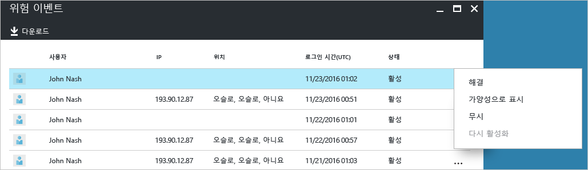
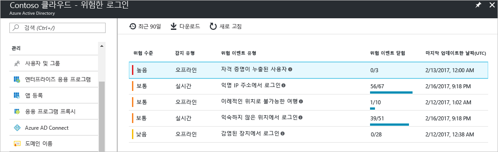
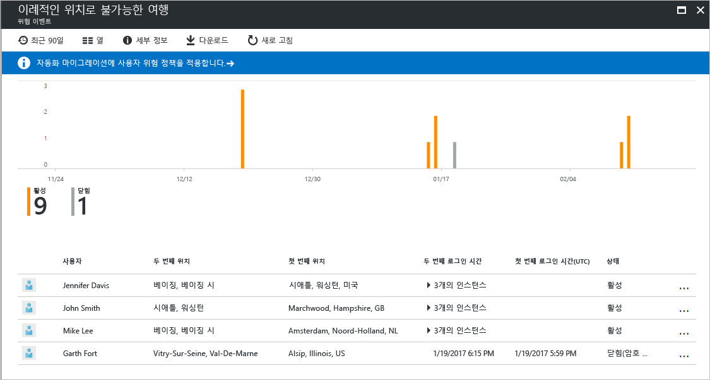
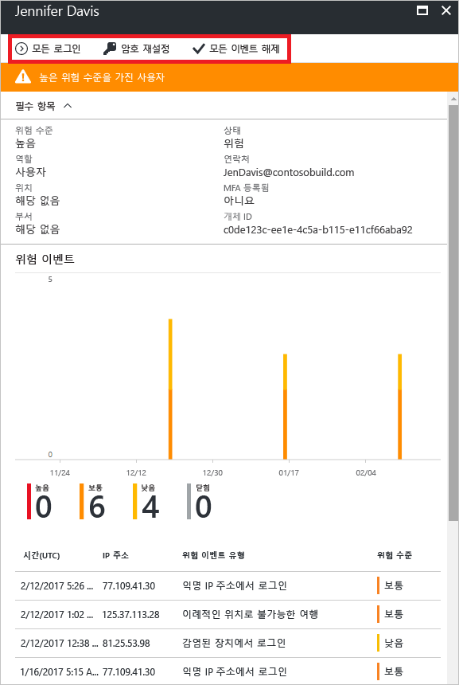

# Azure Active Directory 포털의 위험한 로그인 보고서

Azure Active Directory(Azure AD)에서 보안 보고를 통해 사용자 환경에서 손상된 사용자 계정의 확률에 대한 정보를 얻을 수 있습니다. 

Azure AD는 사용자 계정에 관련된 의심스러운 작업을 감지합니다. 작업이 감지된 경우 *위험 이벤트*라는 레코드가 만들어집니다. 자세한 내용은 [Azure Active Directory 위험 이벤트](active-directory-identity-protection-risk-events.md)를 참조하세요. 

감지된 위험 이벤트를 계산하는 데 사용합니다.

- **위험한 로그인** - 위험한 로그인은 사용자 계정의 정당한 소유자가 아닌 사용자에 의해 수행된 로그인 시도에 대한 지표입니다. 자세한 내용은 [위험한 로그인](active-directory-identityprotection.md#risky-sign-ins)을 참조하세요. 

- **위험 플래그가 지정된 사용자** - 위험한 사용자는 손상되었을 수 있는 사용자 계정에 대한 표시기입니다. 자세한 내용은 [위험 플래그가 지정된 사용자](active-directory-identityprotection.md#users-flagged-for-risk)를 참조하세요.  

[Azure Portal](https://portal.azure.com)의 **보안** 섹션에서 **Azure Active Directory** 블레이드에 대한 보안 보고서를 찾을 수 있습니다. 

## 보안 보고서에 액세스하는 데 필요한 Azure AD 라이선스는 무엇인가요?  

모든 Azure Active Directory 버전에서 위험한 로그인 보고서를 제공합니다.  
그러나 보고서의 세분성 수준은 다음과 같이 버전에 따라 다릅니다. 

- **Azure Active Directory Free 및 Basic 버전**에는 이미 위험 로그인 목록이 있습니다. 

- **Azure Active Directory Premium 1** 버전은 각 보고서에서 검색된 기본 위험 이벤트 중 일부를 검사할 수 있게 함으로써 이 모델을 확장합니다. 

- **Azure Active Directory Premium 2** 버전은 모든 기본 위험 이벤트에 대한 가장 자세한 정보를 제공하며, 구성된 위험 수준에 자동으로 응답하는 보안 정책을 구성할 수도 있습니다.

## Azure Active Directory 무료 및 기본 버전

Azure Active Directory 무료 및 기본 버전은 사용자에 대해 감지된 위험한 로그인 목록을 제공합니다. 이 보고서는 다음을 표시합니다.

- **사용자** - 로그인 작업 중에 사용한 사용자의 이름
- **IP** - Azure Active Directory에 연결하는 데 사용한 장치의 IP 주소
- **위치** - Azure Active Directory에 연결하는 데 사용한 위치
- **로그인 시간** - 로그인을 수행한 시간
- **상태** - 로그인의 상태

위험한 로그인의 조사에 따르면 다음 작업의 형식으로 Azure Active Directory에 대한 피드백을 제공할 수 있습니다.

- 해결
- 가양성으로 표시
- 무시
- 다시 활성화

자세한 내용은 [수동으로 위험 이벤트 닫기](active-directory-identityprotection.md#closing-risk-events-manually)를 참조하세요.

이 보고서는 다음과 같은 옵션을 제공합니다.

- 리소스 검색
- 보고서 데이터 다운로드

## Azure Active Directory Premium Edition

Azure Active Directory Premium Edition의 위험한 로그인 보고서에 제공되는 내용:

- 감지된 [위험 이벤트 유형](active-directory-identity-protection-risk-events.md)에 대해 집계된 정보

- 보고서를 다운로드할 수 있는 옵션

위험 이벤트를 선택하면 위험 이벤트에 대한 자세한 보고서 보기가 제공되고 다음과 같은 작업이 가능합니다.

- [사용자 위험 수정 정책](active-directory-identityprotection.md#user-risk-security-policy)을 구성할 수 있는 옵션  

- 위험 이벤트에 대한 감지 타임라인 검토  

- 이 이벤트가 감지된 사용자 목록 검토

- [위험 이벤트를 수동으로 닫거나](active-directory-identityprotection.md#closing-risk-events-manually) 수동으로 닫은 위험 이벤트를 다시 활성화 

사용자를 선택하면 사용자에 대한 자세한 보고서 보기가 제공되고 다음과 같은 작업이 가능합니다.

- 모든 로그인 보기 열기

- 사용자 암호 재설정

- 모든 이벤트 해제

- 사용자에 대해 보고된 위험 이벤트 조사. 

위험 이벤트를 조사하려면 목록에서 위험 이벤트를 선택합니다.  
그러면 위험 이벤트에 대한 **세부 정보** 블레이드가 열립니다. **세부 정보** 블레이드에 [위험 이벤트를 수동으로 닫거나](active-directory-identityprotection.md#closing-risk-events-manually) 수동으로 닫은 위험 이벤트를 다시 활성화할 수 있는 옵션이 있습니다. 

## 다음 단계

- Azure Active Directory ID 보호에 대한 자세한 내용은 [Azure Active Directory ID 보호](active-directory-identityprotection.md)를 참조하세요.

