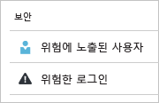
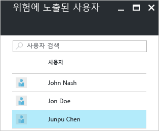
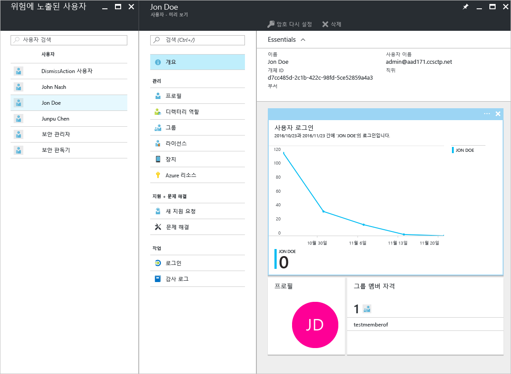
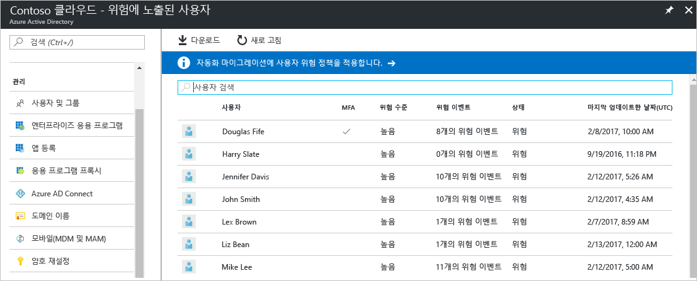
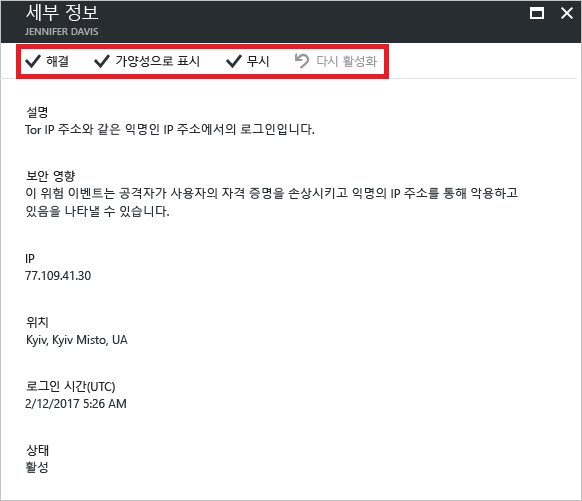

# Azure Active Directory 포털 – 미리 보기의 위험에 노출된 사용자 보안 보고서

Azure Active Directory [미리 보기](active-directory-preview-explainer.md)의 보안 보고를 사용하여 사용자 환경에서 손상된 사용자 계정의 확률에 대한 정보를 얻을 수 있습니다. 

Azure Active Directory는 사용자 계정에 관련된 의심스러운 작업을 감지합니다. 작업이 감지된 경우 *위험 이벤트*라는 레코드가 만들어집니다. 자세한 내용은 [Azure Active Directory 위험 이벤트](active-directory-identity-protection-risk-events.md)를 참조하세요. 

감지된 위험 이벤트를 계산하는 데 사용합니다.

- **위험한 로그인** - 위험한 로그인은 사용자 계정의 정당한 소유자가 아닌 사용자에 의해 수행된 로그인 시도에 대한 지표입니다. 자세한 내용은 [위험한 로그인](active-directory-identityprotection.md#risky-sign-ins)을 참조하세요. 

- **위험 플래그가 지정된 사용자** - 위험한 사용자는 손상되었을 수 있는 사용자 계정에 대한 표시기입니다. 자세한 내용은 [위험 플래그가 지정된 사용자](active-directory-identityprotection.md#users-flagged-for-risk)를 참조하세요.  

Azure Portal의 **보안** 섹션에서 **Azure Active Directory** 블레이드에 대한 보안 보고서를 찾을 수 있습니다.  

## Azure Active Directory 무료 및 기본 버전

Azure Active Directory 무료 및 기본 버전의 위험에 노출된 사용자 보고서에는 손상되었을 수 있는 사용자 계정 목록이 제공됩니다. 

사용자를 선택하면 관련된 사용자 데이터 블레이드가 열립니다.
위험에 노출된 사용자에 대해 사용자의 로그인 기록을 검토하고 필요한 경우 암호를 다시 설정할 수 있습니다.

## Azure Active Directory Premium Edition

Azure Active Directory Premium Edition의 위험에 노출된 사용자 보고서에 제공되는 내용:

- 손상되었을 수 있는 [사용자 계정 목록](active-directory-identityprotection.md#users-flagged-for-risk) 

- 감지된 [위험 이벤트 유형](active-directory-identity-protection-risk-events.md)에 대해 집계된 정보

- 보고서를 다운로드할 수 있는 옵션

- [사용자 위험 수정 정책](active-directory-identityprotection.md#user-risk-security-policy)을 구성할 수 있는 옵션  

사용자를 선택하면 사용자에 대한 자세한 보고서 보기가 제공되고 다음과 같은 작업이 가능합니다.

- 모든 로그인 보기 열기

- 사용자 암호 재설정

- 모든 이벤트 해제

- 사용자에 대해 보고된 위험 이벤트 조사. 

위험 이벤트를 조사하려면 목록에서 위험 이벤트를 선택합니다.  
그러면 위험 이벤트에 대한 **세부 정보** 블레이드가 열립니다. **세부 정보** 블레이드에 [위험 이벤트를 수동으로 닫거나](active-directory-identityprotection.md#closing-risk-events-manually) 수동으로 닫은 위험 이벤트를 다시 활성화할 수 있는 옵션이 있습니다. 

## 다음 단계

- Azure Active Directory ID 보호에 대한 자세한 내용은 [Azure Active Directory ID 보호](active-directory-identityprotection.md)를 참조하세요.

