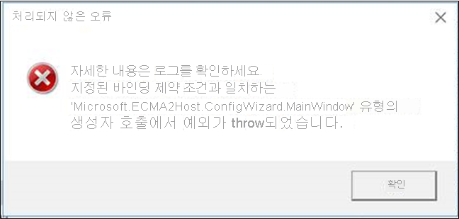
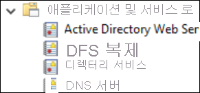
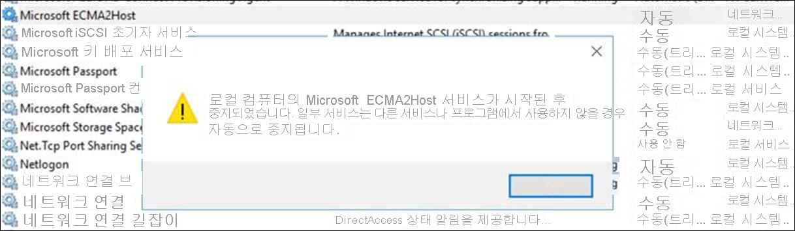

# <a name="troubleshoot-ecma-connector-host-issues"></a>ECMA 커넥터 호스트 문제 해결

>[!IMPORTANT]
> 온-프레미스 프로비저닝 미리 보기는 현재 초대 전용 미리 보기로 제공됩니다. 기능에 대한 액세스를 요청하려면 [액세스 요청 양식](https://aka.ms/onpremprovisioningpublicpreviewaccess)을 사용합니다. 일반 공급을 준비하면서 향후 몇 개월 동안 더 많은 고객과 커넥터에 미리 보기를 공개할 예정입니다.

## <a name="troubleshoot-test-connection-issues"></a>테스트 연결 문제 해결
ECMA 호스트와 프로비저닝 에이전트를 구성한 후에는 Azure AD(Azure Active Directory) 프로비저닝 서비스에서 프로비저닝 에이전트, ECMA 호스트, 애플리케이션으로의 연결을 테스트해야 합니다. 이 엔드투엔드 테스트를 수행하려면 Azure Portal의 애플리케이션에서 **연결 테스트** 를 선택합니다. 연결 테스트에 실패한 경우 다음 문제 해결 단계를 시도합니다.

 1. 에이전트와 ECMA 호스트가 실행되고 있는지 확인합니다.
     1. 에이전트가 설치된 서버에서 **시작** > **실행** > **Services.msc** 로 이동하여 **서비스** 를 엽니다.
     1. **서비스** 에서 **Microsoft Azure AD Connect Agent Updater**, **Microsoft Azure AD Connect 프로비저닝 에이전트**, **Microsoft ECMA2Host** 서비스가 있는지와 서비스 상태가 ‘실행 중’인지 확인합니다.
    
        

 1. **문제 해결** > **스크립트** > **TestECMA2HostConnection** 을 선택하여 ECMA 호스트가 설치된 폴더로 이동합니다. 스크립트를 실행합니다. 이 스크립트는 ECMA 커넥터 호스트가 작동하고 요청에 응답하고 있는지 확인하기 위해 SCIM GET 또는 POST 요청을 보냅니다. 이 스크립트는 ECMA 커넥터 호스트 서비스 자체와 동일한 컴퓨터에서 실행해야 합니다.
 1. Azure Portal에서 애플리케이션으로 이동한 다음, **관리자 연결**, 에이전트 드롭다운 목록을 차례로 선택하여 에이전트가 활성 상태인지 확인합니다.
 1. 제공한 비밀 토큰이 온-프레미스 비밀 토큰과 동일한지 확인합니다. 온-프레미스로 이동하여 비밀 토큰을 다시 제공한 다음, Azure Portal에 복사합니다.
 1. Azure Portal에서 애플리케이션에 하나 이상의 에이전트를 할당했는지 확인합니다.
 1. 에이전트를 할당한 후 등록이 완료되도록 10~20분 정도 기다려야 합니다. 연결 테스트는 등록이 완료될 때까지 작동하지 않습니다.
 1. 유효한 인증서를 사용하고 있는지 확인합니다. ECMA 호스트의 **설정** 탭으로 이동하여 새 인증서를 생성합니다.
 1. VM의 작업 표시줄로 이동한 다음, Microsoft Azure AD Connect 프로비저닝 에이전트를 검색하여 프로비저닝 에이전트를 다시 시작합니다. **중지** 를 마우스 오른쪽 단추로 클릭하고 **시작** 을 선택합니다.
 1. Azure Portal에서 테넌트 URL을 제공하는 경우 URL이 다음 패턴을 따르는지 확인합니다. `localhost`를 해당 호스트 이름으로 바꿀 수 있지만 필수는 아닙니다. `connectorName`을 ECMA 호스트에서 지정한 커넥터 이름으로 바꿉니다.
 
    ```
    https://localhost:8585/ecma2host_connectorName/scim
    ```

## <a name="unable-to-configure-the-ecma-host-view-logs-in-event-viewer-or-start-the-ecma-host-service"></a>ECMA 호스트를 구성하거나, 이벤트 뷰어에서 로그를 보거나, ECMA 호스트 서비스를 시작할 수 없음

다음 문제를 해결하려면 관리자 권한으로 ECMA 호스트를 실행합니다.

* ECMA 호스트 마법사를 열 때 오류가 표시됩니다.

   

* ECMA 호스트 마법사를 구성할 수 있지만 ECMA 호스트 로그를 볼 수 없습니다. 이 경우 관리자 권한으로 호스트를 열고 엔드투엔드 커넥터를 설정해야 합니다. 기존 커넥터를 내보낸 후 다시 가져오면 이 단계를 간소화할 수 있습니다. 

   

* ECMA 호스트 마법사를 구성할 수 있지만 ECMA 호스트 서비스를 시작할 수 없습니다.

   


## <a name="turn-on-verbose-logging"></a>자세한 정보 로깅 설정 

기본적으로 ECMA 커넥터 호스트의 `switchValue`는 `Error`로 설정되어 있습니다. 이 설정은 오류인 이벤트만 로그됨을 의미합니다. ECMA 호스트 서비스 또는 마법사에서 자세한 정보 로깅을 사용하도록 설정하려면 표시된 것처럼 두 위치에서 모두 `switchValue`를 `Verbose`로 설정합니다.

자세한 서비스 로깅의 파일 위치는 C:\Program Files\Microsoft ECMA2Host\Service\Microsoft.ECMA2Host.Service.exe.config입니다.
  ```
  <?xml version="1.0" encoding="utf-8"?> 
  <configuration> 
      <startup>  
          <supportedRuntime version="v4.0" sku=".NETFramework,Version=v4.6" /> 
      </startup> 
      <appSettings> 
        <add key="Debug" value="true" /> 
      </appSettings> 
      <system.diagnostics> 
        <sources> 
      <source name="ConnectorsLog" switchValue="Verbose"> 
            <listeners> 
              <add initializeData="ConnectorsLog" type="System.Diagnostics.EventLogTraceListener, System, Version=2.0.0.0, Culture=neutral, PublicKeyToken=b77a5c561934e089" name="ConnectorsLog" traceOutputOptions="LogicalOperationStack, DateTime, Timestamp, Callstack"> 
                <filter type=""/> 
              </add> 
            </listeners> 
          </source> 
          <!-- Choose one of the following switchTrace:  Off, Error, Warning, Information, Verbose --> 
          <source name="ECMA2Host" switchValue="Verbose"> 
            <listeners>  
              <add initializeData="ECMA2Host" type="System.Diagnos
  ```

자세한 마법사 로깅의 파일 위치는 C:\Program Files\Microsoft ECMA2Host\Wizard\Microsoft.ECMA2Host.ConfigWizard.exe.config입니다.
  ```
        <source name="ConnectorsLog" switchValue="Verbose"> 
          <listeners> 
            <add initializeData="ConnectorsLog" type="System.Diagnostics.EventLogTraceListener, System, Version=2.0.0.0, Culture=neutral, PublicKeyToken=b77a5c561934e089" name="ConnectorsLog" traceOutputOptions="LogicalOperationStack, DateTime, Timestamp, Callstack"> 
              <filter type=""/> 
            </add> 
          </listeners> 
        </source> 
        <!-- Choose one of the following switchTrace:  Off, Error, Warning, Information, Verbose --> 
        <source name="ECMA2Host" switchValue="Verbose"> 
          <listeners> 
            <add initializeData="ECMA2Host" type="System.Diagnostics.EventLogTraceListener, System, Version=4.0.0.0, Culture=neutral, PublicKeyToken=b77a5c561934e089" name="ECMA2HostListener" traceOutputOptions="LogicalOperationStack, DateTime, Timestamp, Callstack" /> 
  ```

## <a name="target-attribute-is-missing"></a>대상 특성이 누락됨 
프로비저닝 서비스는 대상 애플리케이션에서 특성을 자동으로 검색합니다. Azure Portal의 대상 특성 목록에 대상 특성이 없는 경우 다음 문제 해결 단계를 수행합니다.

 1. ECMA 호스트 구성의 **특성 선택** 페이지를 검토하여 해당 특성이 Azure Portal에 노출되도록 선택되었는지 확인합니다.
 1. ECMA 호스트 서비스가 켜져 있는지 확인합니다. 
 1. ECMA 호스트 로그를 검토하여 /schemas 요청이 수행되었는지 확인하고 응답의 특성을 검토합니다. 이 정보는 문제 해결을 지원하는 데 중요합니다.

## <a name="collect-logs-from-event-viewer-as-a-zip-file"></a>이벤트 뷰어의 로그를 zip 파일로 수집

**문제 해결** > **스크립트** 를 선택하여 ECMA 호스트가 설치된 폴더로 이동합니다. 관리자 권한으로 `CollectTroubleshootingInfo` 스크립트를 실행합니다. 이 스크립트를 사용하여 로그를 zip 파일에 캡처한 다음, 내보낼 수 있습니다.

## <a name="review-events-in-event-viewer"></a>이벤트 뷰어에서 이벤트 검토

ECMA 커넥터 호스트 스키마 매핑이 구성되면 들어오는 연결을 수신 대기하도록 서비스를 시작합니다. 그런 다음, 들어오는 요청을 모니터링합니다.

  1. **시작** 메뉴를 선택하고 **이벤트 뷰어** 를 입력한 다음, **이벤트 뷰어** 를 선택합니다. 
  1. **이벤트 뷰어** 에서 **애플리케이션 및 서비스** 로그를 펼친 다음, **Microsoft ECMA2Host 로그** 를 선택합니다. 
  1. 커넥터 호스트에서 변경 내용을 수신하면 이벤트가 애플리케이션 로그에 기록됩니다. 

## <a name="understand-incoming-scim-requests"></a>들어오는 SCIM 요청 이해

프로비저닝 에이전트 및 커넥터 호스트에 대해 Azure AD가 수행하는 요청은 SCIM 프로토콜을 사용합니다. 호스트에서 앱으로 수행된 요청은 앱이 지원하는 프로토콜을 사용합니다. 호스트에서 에이전트와 Azure AD로 수행된 요청은 SCIM을 사용합니다. [자습서: Azure Active Directory에서 SCIM 엔드포인트에 대한 프로비저닝 개발 및 계획](use-scim-to-provision-users-and-groups.md)에서 SCIM 구현에 대해 자세히 알아볼 수 있습니다.

각 프로비저닝 주기가 시작될 때, 주문형 프로비저닝을 수행하기 전에, 연결 테스트를 수행할 때 Azure AD 프로비저닝 서비스는 일반적으로 [더미 사용자](use-scim-to-provision-users-and-groups.md#request-3)에 대해 사용자 가져오기 호출을 수행하여 대상 엔드포인트가 사용 가능하며 SCIM 규격 응답을 반환하는지 확인합니다. 


## <a name="how-do-i-troubleshoot-the-provisioning-agent"></a>프로비저닝 에이전트 문제를 해결하려면 어떻게 하나요?
다음과 같은 오류 시나리오가 발생할 수 있습니다.

### <a name="agent-failed-to-start"></a>에이전트를 시작하지 못함

다음과 같은 오류 메시지가 표시될 수 있습니다.

“‘Microsoft Azure AD Connect 프로비저닝 에이전트’ 서비스를 시작하지 못했습니다. 시스템 서비스를 시작할 수 있는 권한이 있는지 확인하세요.” 

이 문제는 일반적으로 설치 관리자(NT SERVICE\AADConnectProvisioningAgent)에서 만든 로컬 NT 서비스 로그인 계정에 권한이 적용되지 않도록 하는 그룹 정책으로 인해 발생합니다. 이러한 사용 권한은 서비스를 시작하는 데 필요합니다.

이 문제를 해결하려면

1. 관리자 계정으로 서버에 로그인합니다.
1. **서비스** 를 탐색하거나 **시작** > **실행** > **Services.msc** 로 이동하여 서비스를 엽니다.
1. **서비스** 에서 **Microsoft Azure AD Connect Provisioning Agent** 를 두 번 클릭합니다.
1. **로그온** 탭에서 **이 계정** 을 도메인 관리자로 변경한 다음 서비스를 다시 시작합니다. 

이 테스트는 에이전트가 포트 443을 통해 Azure와 통신할 수 있는지 확인합니다. 브라우저를 열고 에이전트가 설치된 서버에서 이전 URL로 이동합니다.

### <a name="agent-times-out-or-certificate-is-invalid"></a>에이전트 시간이 초과하거나 인증서가 잘못됨

에이전트를 등록하려고 시도할 때 다음과 같은 오류 메시지가 나타날 수 있습니다.


이 문제는 일반적으로 에이전트가 하이브리드 ID 서비스에 연결할 수 없기 때문에 발생하며 HTTP 프록시를 구성해야 합니다. 이 문제를 해결하려면 아웃바운드 프록시를 구성합니다. 

프로비저닝 에이전트는 아웃바운드 프록시 사용을 지원합니다. 에이전트 구성 파일(*C:\Program Files\Microsoft Azure AD Connect Provisioning Agent\AADConnectProvisioningAgent.exe.config*)을 편집하여 구성할 수 있습니다. 해당 파일의 끝 부분에서 닫는 `</configuration>` 태그 바로 앞에 다음 행을 추가합니다.
`[proxy-server]` 및 `[proxy-port]` 변수를 프록시 서버 이름 및 포트 값으로 바꿉니다.

```xml
    <system.net>
        <defaultProxy enabled="true" useDefaultCredentials="true">
            <proxy
                usesystemdefault="true"
                proxyaddress="http://[proxy-server]:[proxy-port]"
                bypassonlocal="true"
            />
        </defaultProxy>
    </system.net>
```
### <a name="agent-registration-fails-with-security-error"></a>보안 오류로 인해 에이전트를 등록하지 못함

클라우드 프로비저닝 에이전트를 설치할 때 오류 메시지가 나타날 수 있습니다.

이 문제는 일반적으로 에이전트가 로컬 PowerShell 실행 정책으로 인해 PowerShell 등록 스크립트를 실행할 수 없기 때문에 발생합니다.

이 문제를 해결하려면 서버에서 PowerShell 실행 정책을 변경합니다. 머신 및 사용자 정책이 *Undefined* 또는 *RemoteSigned* 로 설정되어 있어야 합니다. *Unrestricted* 으로 설정된 경우 이 오류가 표시됩니다. 자세한 내용은 [PowerShell 실행 정책](/powershell/module/microsoft.powershell.core/about/about_execution_policies?view=powershell-6)을 참조하세요. 

### <a name="log-files"></a>로그 파일

기본적으로 에이전트는 최소한의 오류 메시지 및 스택 추적 정보를 내보냅니다. 추적 로그는 C:\ProgramData\Microsoft\Azure AD Connect Provisioning Agent\Trace 폴더에서 확인할 수 있습니다.

에이전트 관련 문제 해결을 위해 자세한 정보를 수집하려면 다음을 수행합니다.

1. [Azure AD Connect 클라우드 동기화를 위한 AADCloudSyncTools PowerShell 모듈](../../active-directory/cloud-sync/reference-powershell.md#install-the-aadcloudsynctools-powershell-module)에 설명된 대로 AADCloudSyncTools PowerShell 모듈을 설치합니다.
1. `Export-AADCloudSyncToolsLogs` PowerShell cmdlet을 사용하여 정보를 캡처합니다. 다음 스위치를 사용하여 데이터 수집을 세부적으로 튜닝합니다. 사용:

      - **SkipVerboseTrace**(기본값 = false): 자세한 정보 로그를 캡처하지 않고 현재 로그만 내보내려는 경우
      - **TracingDurationMins**(기본값 = 3분): 다른 캡처 기간을 지정하려는 경우
      - **OutputPath**(기본값 = 사용자 문서): 다른 출력 경로를 지정하려는 경우

---------------------

Azure AD를 사용하면 클라우드에서 프로비저닝 서비스를 모니터링하고 온-프레미스에서 로그를 수집할 수 있습니다. 프로비저닝 서비스는 동기화 프로세스의 일부로 평가된 각 사용자에 대해 로그를 내보냅니다. 이러한 로그는 [Azure Portal UI, API 및 Log Analytics](../reports-monitoring/concept-provisioning-logs.md)를 통해 사용할 수 있습니다. ECMA 호스트는 온-프레미스 로그도 생성합니다. 수신된 각 프로비저닝 요청과 Azure AD로 전송된 응답을 보여 줍니다.

### <a name="agent-installation-fails"></a>에이전트 설치 실패
* `System.ComponentModel.Win32Exception: The specified service already exists` 오류는 이전 ECMA 호스트가 제거되지 않았음을 나타냅니다. 호스트 애플리케이션을 제거합니다. 프로그램 파일로 이동한 다음, ECMA 호스트 폴더를 제거합니다. 백업을 위해 구성 파일을 저장하는 것이 좋습니다. 
* 다음 오류는 필수 조건이 충족되지 않았음을 나타냅니다. .NET 4.7.1이 설치되어 있는지 확인합니다.

  ```
    Method Name : <>c__DisplayClass0_1 : 
    RegisterNotLoadedAssemblies Error during load assembly: System.Management.Automation.resources.dll
    --------- Outer Exception Data ---------
    Message: Could not load file or assembly 'file:///C:\Program Files\Microsoft ECMA2Host\Service\ECMA\System.Management.Automation.resources.dll' or one of its dependencies. The system cannot find the file specified.

  ```


## <a name="next-steps"></a>다음 단계

- [Azure AD ECMA 커넥터 호스트 설치](on-premises-ecma-install.md)
- [Azure AD ECMA 커넥터 호스트 구성](on-premises-ecma-configure.md)
- [일반 SQL 커넥터](on-premises-sql-connector-configure.md)
- [자습서: ECMA 커넥터 호스트 일반 SQL 커넥터](tutorial-ecma-sql-connector.md)