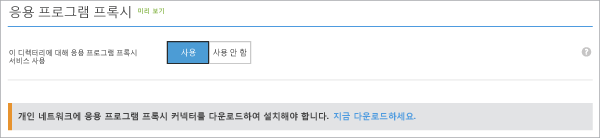

# 클래식 포털에서 응용 프로그램 프록시를 사용하도록 설정하고 커넥터 다운로드
이 문서에서는 Azure AD에서 클라우드 디렉터리에 Microsoft Azure AD 응용 프로그램 프록시를 사용하도록 설정하는 단계를 안내합니다.

도움을 받을 수 있는 응용 프로그램 프록시에 익숙하지 않은 경우 [온-프레미스 응용 프로그램에 안전한 원격 액세스를 제공하는 방법](active-directory-application-proxy-get-started.md)에 대해 자세히 알아봅니다.

## 응용 프로그램 프록시 필수 구성 요소
응용 프로그램 프록시 서비스를 사용하도록 설정하고 사용하려면 다음이 필요합니다.

* 사용자가 전역 관리자인 [Microsoft Azure AD 기본 또는 프리미엄 구독](active-directory-editions.md) 및 Azure AD 디렉터리입니다.
* 응용 프로그램 프록시 커넥터를 설치할 수 있는 Windows Server 2012 R2 또는 2016을 실행하는 서버입니다. 이 서버는 클라우드의 응용 프로그램 프록시 서비스에 요청을 보내고 게시 중인 응용 프로그램에 대한 HTTP 및 HTTPS 연결이 필요합니다.
  * 게시된 응용 프로그램에 대한 Single Sign-On의 경우 이 컴퓨터는 게시하는 응용 프로그램과 동일한 AD 도메인에 가입되어야 합니다. 자세한 내용은 [응용 프로그램 프록시를 사용하는 Single Sign-On](active-directory-application-proxy-sso-using-kcd.md)을 참조하세요.
* 조직에서 프록시 서버를 사용하여 인터넷에 연결하려면 구성하는 방법에 대한 세부 내용은 [기존 온-프레미스 프록시 서버로 작업](application-proxy-working-with-proxy-servers.md)을 읽어보세요.

## 포트 열기

Azure AD 응용 프로그램 프록시를 위한 환경을 준비하려면 먼저 Azure 데이터 센터와 통신할 수 있어야 합니다. 방화벽이 경로에 있는 경우 커넥터가 응용 프로그램 프록시에 HTTPS(TCP) 요청을 할 수 있도록 방화벽이 열려 있는지 확인합니다.

1. **아웃바운드** 트래픽에 대한 다음 포트를 엽니다.

   | 포트 번호 | 사용 방법 |
   | --- | --- |
   | 80 | SSL 인증서의 유효성을 검사하는 동안 CRL(인증서 해지 목록) 다운로드 |
   | 443 | 응용 프로그램 프록시 서비스와의 모든 아웃바운드 통신 |

   방화벽이 원래 사용자에 따라 트래픽에 적용되는 경우 네트워크 서비스로 실행되는 Windows 서비스에서 오는 트래픽에 대해 이러한 포트를 엽니다.

   > [!IMPORTANT]
   > 표에는 커넥터 버전 1.5.132.0 이상에 대한 포트 요구 사항이 반영되어 있습니다. 이전 커넥터 버전이 아직도 있는 경우 5671, 8080, 9090, 9091, 9350, 9352 및 10100-10120 포트를 사용하도록 설정해야 합니다.
   >
   >커넥터를 최신 버전으로 업데이트하는 방법에 대한 자세한 내용은 [Azure AD 응용 프로그램 프록시 커넥터 이해](application-proxy-understand-connectors.md#automatic-updates)를 참조하세요.

2. 방화벽이나 프록시에서 DNS 허용 목록을 허용하면 msappproxy.net 및 servicebus.windows.net에 대한 연결을 허용 목록에 추가할 수 있습니다. 그렇지 않으면 매주 업데이트되는 [Azure 데이터 센터 IP 범위](https://www.microsoft.com/download/details.aspx?id=41653)에 액세스하도록 허용해야 합니다.

3. [Azure AD 응용 프로그램 프록시 커넥터 포트 테스트 도구](https://aadap-portcheck.connectorporttest.msappproxy.net/)를 사용하여 커넥터가 응용 프로그램 프록시 서비스에 연결할 수 있는지 확인합니다. 최소한 미국 중부 하위 지역 및 사용자에게 가까운 지역에는 모두 녹색 확인 표시가 있는지 확인합니다. 그 외의 항목에도 녹색 확인 표시가 있으면 복원력이 더 뛰어난 것입니다.

## Azure AD에서 응용 프로그램 프록시를 사용하도록 설정
1. [Azure 클래식 포털](https://manage.windowsazure.com/)에서 관리자로 로그인합니다.
2. Active Directory로 이동하여 응용 프로그램 프록시를 사용하도록 설정할 디렉터리를 선택합니다.

    
3. 디렉터리 페이지에서 **구성**을 선택하고 **응용 프로그램 프록시**까지 아래로 스크롤합니다.
4. **이 디렉터리에 응용 프로그램 프록시 서비스 사용**을 **사용**하도록 설정/해제합니다.

    
5. **지금 다운로드**를 선택합니다. **Azure AD 응용 프로그램 프록시 커넥터 다운로드**가 열립니다. 사용 조건을 읽어보고 동의한 다음 **다운로드** 를 클릭하여 커넥터의 Windows Installer 파일(.exe)을 저장합니다.

## 커넥터 설치 및 등록
1. 필수 구성 요소에 따라 준비한 서버에서 **AADApplicationProxyConnectorInstaller.exe** 를 실행합니다.
2. 마법사의 지침에 따라 설치합니다.
3. 설치하는 동안 Azure AD 테넌트의 응용 프로그램 프록시를 사용하여 커넥터를 등록하라는 메시지가 표시됩니다.

   * Azure AD 전역 관리자 자격 증명을 제공합니다. 전역 관리자 테넌트는 Microsoft Azure 자격 증명과 다를 수 있습니다.
   * 커넥터를 등록하는 관리자가 응용 프로그램 프록시 서비스를 사용할 수 있는 동일한 디렉터리에 있는지 확인합니다. 예를 들어, 테넌트 도메인이 contoso.com이면 관리자는 admin@contoso.com 또는 해당 도메인에 있는 다른 별칭이어야 합니다.
   * 서버에서 **IE 보안 강화 구성**이 **켜기**로 설정되어 있으면 등록 화면이 차단될 수 있습니다. 액세스를 허용하려면 오류 메시지의 지침에 따릅니다. Internet Explorer 보안 강화가 해제되어 있는지 확인하세요.
   * 커넥터 등록에 실패한 경우 [응용 프로그램 프록시 문제 해결](active-directory-application-proxy-troubleshoot.md)을 참조하세요.  
4. 설치가 완료되면 두 개의 새 서비스가 서버에 추가됩니다.

   * **Microsoft AAD 응용 프로그램 프록시 커넥터** 에서 연결 사용

     * **Microsoft AAD 응용 프로그램 프록시 커넥터 업데이터**는 자동화된 업데이트 서비스입니다. 이 서비스는 주기적으로 새 버전의 커넥터가 있는지 확인하고 필요에 따라 커넥터를 업데이트합니다.

     
5. 설치 창에서 **마침** 을 클릭합니다.

커넥터에 대 한 정보는 [Azure AD 응용 프로그램 프록시 커넥터 이해](application-proxy-understand-connectors.md)를 참조하세요.

고가용성을 위해 커넥터를 두 개 이상 배포해야 합니다. 추가 커넥터를 배포하려면 2단계와 3단계를 반복합니다. 각 커넥터는 별도로 등록되어야 합니다.

커넥터를 제거하려면 커넥터 서비스와 업데이트 프로그램 서비스를 모두 제거합니다. 서비스를 완전히 제거하려면 컴퓨터를 다시 시작합니다.

## 다음 단계
이제 [응용 프로그램 프록시를 사용하여 응용 프로그램을 게시](active-directory-application-proxy-publish.md)할 준비가 되었습니다.

별도 네트워크 또는 다른 위치에 응용 프로그램이 있는 경우 다른 커넥터 그룹을 사용하여 커넥터를 논리 단위로 구성할 수 있습니다. [응용 프로그램 프록시 커넥터 작업](active-directory-application-proxy-connectors.md)에 대해 자세히 알아봅니다.

