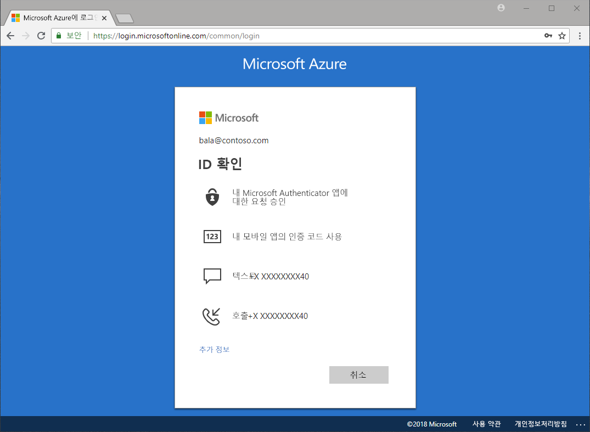

# 어떤 인증 방법을 사용할 수 있을까요?

암호가 도난되고 ID가 유출되었다는 뉴스를 종종 접하게 됩니다. 암호 외에도 두 번째 요소를 요구하면 조직의 보안이 즉시 향상됩니다. Microsoft Azure AD(Azure Active Directory)에는 관리자가 추가 인증 방법을 통해 조직과 사용자를 보호할 수 있는 Azure MFA(Azure Multi-Factor Authentication) 및 Azure AD SSPR(셀프 서비스 암호 재설정) 같은 기능이 포함되어 있습니다.

사용자가 중요한 응용 프로그램에 액세스하고, 암호를 재설정하거나 Windows Hello를 사용하도록 설정해야 하는 경우 사용자의 신분을 확인하기 위해 추가 확인을 요구할 수 있습니다.

추가 확인은 다음과 같은 인증 방법의 형태로 진행될 수 있습니다.

* 이메일 또는 문자 메시지에 제공되는 코드
* 전화 통화
* 전화기의 알림 또는 코드
* 보안 질문에 대한 답변

Azure MFA 및 Azure AD 셀프 서비스 암호 재설정을 사용하면 관리자는 Azure AD 및 Azure Portal을 사용하여 구성, 정책, 모니터링 및 보고를 제어할 수 있습니다.

## 셀프 서비스 암호 재설정

셀프 서비스 암호 재설정은 사용자에게 필요할 때 필요한 장소에서 관리자 개입 없이 자신의 암호를 재설정하는 기능을 제공합니다.

> [!VIDEO https://www.youtube.com/embed/hc97Yx5PJiM]

셀프 서비스 암호 재설정에는 다음이 포함됩니다.

* **암호 변경:** 암호를 알고 있지만 새 암호로 변경하려 합니다.
* **암호 재설정:** 로그인할 수 없으며 승인된 인증 방법 중 하나 이상을 사용하여 암호를 재설정하려 합니다.
* **계정 잠금 해제:** 계정이 잠겨서 로그인할 수 없으며 승인된 인증 방법 중 하나 이상을 사용하여 잠금을 해제하려 합니다.

## Multi-Factor Authentication

Azure Multi-factor Authentication(MFA)은 Microsoft의 2단계 인증 솔루션입니다. 관리자가 승인한 인증 방법을 사용하는 Azure MFA는 간단한 로그인 프로세스에 대한 요구를 충족하는 동시에 데이터와 응용 프로그램에 대한 액세스를 보호합니다.

## 다음 단계

다음 단계는 좀 더 깊이 들어가서 셀프 서비스 암호 재설정 및 Azure Multi-Factor Authentication을 구성하는 것입니다.

셀프 서비스 암호 재설정을 시작하려면 [SSPR 빠른 시작 사용 문서](quickstart-sspr.md)를 참조하세요.

셀프 서비스 암호 재설정에 대한 자세한 내용은 [작동 방식: Azure AD 셀프 서비스 암호 재설정](concept-sspr-howitworks.md) 문서를 참조하세요.

[작동 방식: Azure Multi-Factor Authentication](concept-mfa-howitworks.md) 문서에서 Azure Multi-Factor Authentication에 대해 자세히 알아보세요.