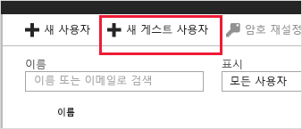
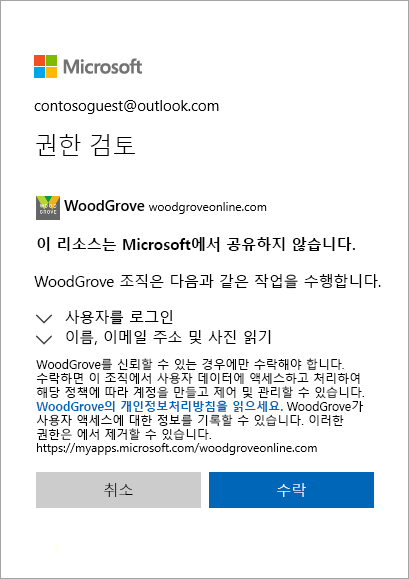

# 빠른 시작: Azure Portal에서 디렉터리에 게스트 사용자 추가

조직과 공동 작업하는 모든 사용자를 디렉터리에 게스트 사용자로 추가하여 초대할 수 있습니다. 그런 다음, 사용 링크가 포함된 초대 메일을 보내거나 공유할 앱의 직접 링크를 보낼 수 있습니다. 게스트 사용자는 자신의 회사, 학교 또는 소셜 ID로 로그인할 수 있습니다.

이 빠른 시작에서는 Azure AD에 새 게스트 사용자를 추가하고, 초대를 보내고, 게스트 사용자의 초대 사용 프로세스가 어떻게 표시되는지 확인합니다.

Azure 구독이 아직 없는 경우 시작하기 전에 [무료 계정](https://azure.microsoft.com/free/?WT.mc_id=A261C142F) 을 만듭니다.

## 필수 조건

이 자습서의 시나리오를 완료하려면 다음이 필요합니다.

 - 전역 관리자 역할 또는 제한된 관리자 디렉터리 역할과 같이 테넌트 디렉터리에서 사용자를 만들 수 있는 역할.
 - 테넌트 디렉터리에 추가할 수 있고 테스트 초대 메일을 수신하는 데 사용할 수 있는 유효한 메일 계정.

## Azure AD에서 새 게스트 사용자 추가

1. Azure AD 관리자 권한으로 [Azure Portal](https://portal.azure.com/)에 로그인합니다.
2. 왼쪽 창에서 **Azure Active Directory**를 선택합니다.
3.  **관리**에서 **사용자**를 선택합니다.

    

4.  **새 게스트 사용자**를 선택합니다.

    

5.  **사용자 이름**에서 외부 사용자의 이메일 주소를 입력합니다. **초대하는 개인 메시지를 포함**에서 환영 메시지를 입력합니다. 

    

6. **초대**를 선택하여 게스트 사용자에게 자동으로 초청을 발송합니다. 메시지 **사용자를 초대함**이 포함된 알림이 오른쪽 위에 표시됩니다. 
7.  초대를 발송한 후 사용자 계정이 디렉터리에 게스트로 자동 추가됩니다.

## 게스트 사용자에게 앱 할당
테스트 테넌트에 Salesforce 앱을 추가하고 테스트 게스트 사용자를 앱에 할당합니다.
1.  Azure AD 관리자로 Azure Portal에 로그인합니다.
2.  왼쪽 창에서 **엔터프라이즈 애플리케이션**을 선택합니다.
3.  **새 애플리케이션**을 선택합니다.
4. **갤러리에서 추가** 아래에서 **Salesforce**를 검색한 후 선택합니다.

    
5. **추가**를 선택합니다.
6. **관리** 아래에서 **Single Sign-On**을 선택하고, **Single Sign-on 모드** 아래에서 **암호 기반 Sign-on**을 선택하고, **저장**을 클릭합니다.
7. **관리** 아래에서 **사용자 및 그룹** > **사용자 추가** > **사용자 및 그룹**을 선택합니다.
8. 검색 상자를 사용하여 테스트 사용자를 검색하고(필요한 경우) 목록에서 테스트 사용자를 선택합니다. 그런 다음 **선택**을 클릭합니다.
9. **할당**을 선택합니다. 

## 초대 수락
이제 게스트 사용자로 로그인하여 초대를 확인합니다.
1.  테스트 게스트 사용자의 메일 계정에 로그인합니다.
2.  받은 편지함에서 “초대되었습니다” 메일을 찾습니다.

    

3.  메일 본문에서 **시작**을 선택합니다. 브라우저에서 **권한 검토** 페이지가 열립니다. 

    

4. **수락**을 선택합니다. 게스트 사용자가 액세스할 수 있는 애플리케이션을 나열하는 액세스 패널이 열립니다.

## 리소스 정리
더 이상 필요하지 않은 경우 테스트 게스트 사용자 및 테스트 앱을 삭제합니다.
1.  Azure AD 관리자로 Azure Portal에 로그인합니다.
2.  왼쪽 창에서 **Azure Active Directory**를 선택합니다.
3.  **관리**에서 **엔터프라이즈 응용 프로그램**을 선택합니다.
4.  애플리케이션 **Salesforce**를 열고 **삭제**를 선택합니다.
5.  왼쪽 창에서 **Azure Active Directory**를 선택합니다.
6.  **관리**에서 **사용자**를 선택합니다.
7.  테스트 사용자를 선택한 후 **사용자 삭제**를 선택합니다.

## 다음 단계
이 자습서에서는 Azure Portal에서 게스트 사용자를 만들고 앱 공유를 위한 초대를 보냈습니다. 그런 다음, 게스트 사용자의 관점에서 사용 프로세스를 살펴보고 앱이 게스트 사용자의 액세스 패널에 표시되는지 확인했습니다. 협업을 위해 게스트 사용자를 추가하는 방법을 자세히 알아보려면 [Azure Portal에서 Azure Active Directory B2B 협업 사용자 추가](add-users-administrator.md)를 참조하세요.
