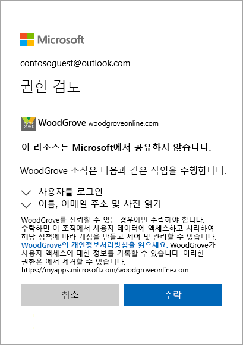

# Azure Active Directory B2B의 게스트 사용자 액세스란?

Azure AD(Azure Active Directory) B2B(business-to-business) 공동 작업을 사용하여 회사의 애플리케이션과 서비스를 다른 조직의 게스트 사용자와 안전하게 공유하면서 자체 회사 데이터에 대한 제어를 유지할 수 있습니다. Azure AD 또는 IT 부서가 없는 경우에도 크든 작든, 외부 파트너와 안전하게 작업하세요. 간단한 초대 및 사용 프로세스를 통해 파트너는 자체 자격 증명을 사용하여 회사 리소스에 액세스할 수 있습니다. 개발자는 Azure AD B2B API를 사용하여 초대 프로세스를 사용자 지정하거나 셀프 서비스 등록 포털과 같은 애플리케이션을 작성할 수 있습니다.

자체 ID를 사용하여 회사의 앱 및 서비스에 로그인하도록 초대하여 게스트 사용자와 안전하게 공동 작업하는 방법을 알아보는 비디오를 시청하세요.

다음 비디오는 유용한 개요를 제공합니다.

>[!VIDEO https://www.youtube.com/embed/AhwrweCBdsc]

## ID를 사용하여 파트너와 공동 작업
Azure AD B2B에서는 파트너가 자체 ID 관리 솔루션을 사용하므로 조직에 대한 외부 관리 오버헤드가 없습니다. 
- 파트너는 자체 ID 및 자격 증명을 사용하고, Azure AD는 필요하지 않습니다. 
- 외부 계정 또는 암호를 관리할 필요가 없습니다. 
- 계정을 동기화하거나 계정 수명 주기를 관리할 필요가 없습니다.  

## 간단한 초대 및 사용 프로세스를 사용하여 게스트 사용자 초대
게스트 사용자는 자신의 회사, 학교 또는 소셜 ID로 앱 및 서비스에 로그인합니다. 게스트 사용자에게 Microsoft 계정이나 Azure AD 계정이 없는 경우 해당 사용자가 초대를 사용하면 해당 사용자의 계정이 만들어집니다. 
- 선택한 메일 ID를 사용하여 게스트 사용자를 초대합니다.
- 앱의 직접 링크를 보내거나 게스트 사용자 소유의 액세스 패널에 초대를 보냅니다. 
- 게스트 사용자는 로그인하기 위해 몇 가지 간단한 사용 단계를 따릅니다.

## 정책을 사용하여 안전하게 앱 및 서비스 공유
권한 부여 정책을 사용하여 회사 콘텐츠를 보호할 수 있습니다. 다단계 인증 등의 조건부 액세스 정책을 적용할 수 있습니다.
- 테넌트 수준에서 적용
- 애플리케이션 수준에서 적용
- 회사 앱과 데이터를 보호하기 위해 특정 게스트 사용자에 적용

## Azure AD 포털에서 간편하게 게스트 사용자 추가

관리자는 게스트 사용자를 Azure Portal의 조직에 손쉽게 추가할 수 있습니다.
- 새 사용자를 추가하는 방법과 비슷하게 Azure AD에서 새 게스트 사용자를 만듭니다.
- 게스트 사용자는 자신의 액세스 패널에 로그인하는 데 사용할 수 있는 사용자 지정 가능한 초대를 즉시 받습니다.
- 디렉터리에 있는 게스트 사용자를 앱 또는 그룹에 할당할 수 있습니다.  

## 애플리케이션 및 그룹 소유자가 자신의 게스트 사용자를 관리할 수 있음

Microsoft 애플리케이션인지 여부에 관계없이 공유하려는 애플리케이션에 게스트 사용자를 직접 추가할 수 있도록 게스트 사용자 관리를 애플리케이션 소유자에게 위임할 수 있습니다. 
 - 관리자가 셀프 서비스 앱 및 그룹 관리를 설정합니다.
 - 관리자가 아닌 사용자는 자신의 [액세스 패널](https://myapps.microsoft.com)을 사용하여 애플리케이션 또는 그룹에 게스트 사용자를 추가합니다.

## API 및 샘플 코드를 사용하여 등록할 애플리케이션을 쉽게 빌드할 수 있음

조직의 요구에 맞게 사용자 지정된 방식으로 외부 파트너를 등록하세요.
- [B2B 공동 작업 초대 API](https://developer.microsoft.com/graph/docs/api-reference/v1.0/resources/invitation)를 사용하여 셀프 서비스 등록 포털 생성을 포함하여 등록 환경을 사용자 지정할 수 있습니다. 
- [GitHub](https://github.com/Azure/active-directory-dotnet-graphapi-b2bportal-web)의 셀프 서비스 포털에 Microsoft가 제공하는 샘플 코드를 사용합니다.

## 다음 단계

- [Azure AD B2B 공동 작업 라이선스 지침](licensing-guidance.md)
- [포털에서 B2B 공동 작업 게스트 사용자 추가](add-users-administrator.md)
- [초대 사용 프로세스 이해](redemption-experience.md)
- 또한 피드백, 논의 사항 및 제안이 있는 경우 언제나처럼 [Microsoft Tech Community](https://techcommunity.microsoft.com/t5/Azure-Active-Directory-B2B/bd-p/AzureAD_B2b)(Microsoft 기술 커뮤니티)를 통해 제품 팀에 연결할 수 있습니다.
