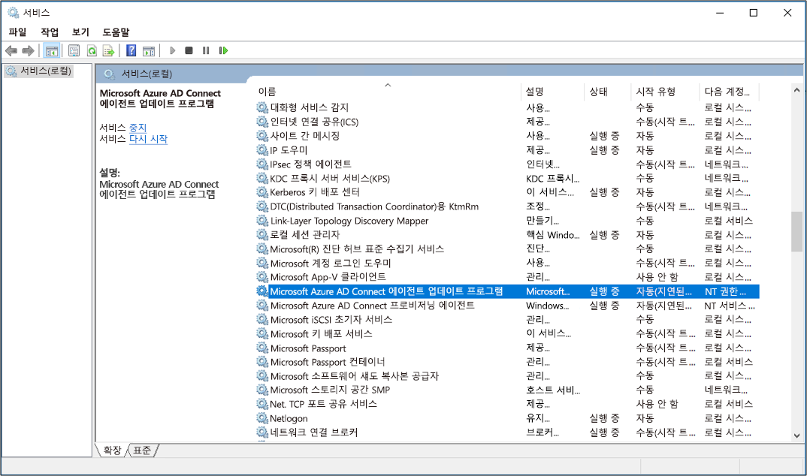

# <a name="cloud-provisioning-troubleshooting"></a>클라우드 프로 비전 문제 해결

클라우드 프로 비전은 다양 한 작업을 수행 하 고 다양 한 종속성을 포함 합니다. 이러한 광범위 한 범위를 통해 다양 한 문제를 해결할 수 있습니다. 이 문서는 이러한 문제를 해결 하는 데 도움이 됩니다. 여기서는 중점적으로 살펴볼 수 있는 일반적인 영역, 추가 정보를 수집 하는 방법 및 문제를 추적 하는 데 사용할 수 있는 다양 한 기술을 소개 합니다.


## <a name="common-troubleshooting-areas"></a>일반적인 문제 해결 영역

|이름|설명|
|-----|-----|
|[에이전트 문제](#agent-problems)|에이전트가 올바르게 설치 되었으며 Azure Active Directory (Azure AD)와 통신 하는지 확인 합니다.|
|[개체 동기화 문제](#object-synchronization-problems)|프로 비전 로그를 사용 하 여 개체 동기화 문제를 해결 합니다.|
|[격리 된 문제 프로 비전](#provisioning-quarantined-problems)|프로 비전 격리 문제 및 해결 방법 이해|


## <a name="agent-problems"></a>에이전트 문제
에이전트를 사용 하 여 확인 하려는 첫 번째 작업은 다음과 같습니다.

-  설치 되어 있나요?
-  에이전트가 로컬로 실행 되 고 있습니까?
-  에이전트가 포털에 있나요?
-  에이전트가 정상으로 표시 되어 있나요?

이러한 항목은 Azure Portal 및 에이전트를 실행 하는 로컬 서버에서 확인할 수 있습니다.

### <a name="azure-portal-agent-verification"></a>Azure Portal에서 에이전트 확인

에이전트가 Azure에 표시 되 고 정상 상태 인지 확인 하려면 다음 단계를 수행 합니다.

1. Azure Portal에 로그인합니다.
1. 왼쪽에서 **Azure Active Directory** > **Azure AD Connect**를 선택합니다. 가운데에서 **프로비저닝 관리(미리 보기)** 를 선택합니다.
1. **Azure AD 프로비저닝(미리 보기)** 화면에서 **모든 에이전트 검토**를 선택합니다.

   </br>
 
1. **온-프레미스 프로 비전 에이전트** 화면에 설치한 에이전트가 표시 됩니다. 해당 에이전트가 있고 *정상*으로 표시 되어 있는지 확인 합니다.

   </br>

### <a name="verify-the-port"></a>포트 확인

Azure가 포트 443에서 수신 대기 하 고 에이전트와 통신할 수 있는지 확인 하려면 다음 도구를 사용 합니다.

https://aadap-portcheck.connectorporttest.msappproxy.net/ 

이 테스트는 에이전트가 포트 443을 통해 Azure와 통신할 수 있는지 확인 합니다. 브라우저를 열고 에이전트가 설치 된 서버에서 이전 URL로 이동 합니다.


### <a name="on-the-local-server"></a>로컬 서버에서 에이전트 확인

에이전트가 실행되는지 확인하려면 다음 단계를 수행합니다.

1. 에이전트가 설치 된 서버에서 서비스를 탐색 하거나 **시작**실행으로 이동 하 여 **서비스** 를 엽니다  >  **Run**  >  **Services.msc**.
1. **서비스** 아래에서 **Microsoft Azure AD Connect 에이전트 업데이트 프로그램** 및 **Microsoft Azure AD Connect Provisioning Agent**가 있고 상태가 *실행 중*인지 확인합니다.

   

### <a name="common-agent-installation-problems"></a>일반적인 에이전트 설치 문제

다음 섹션에서는 몇 가지 일반적인 에이전트 설치 문제와 일반적인 해결 방법에 대해 설명 합니다.

#### <a name="agent-failed-to-start"></a>에이전트를 시작 하지 못했습니다.

다음과 같은 오류 메시지가 표시 될 수 있습니다.

**' Microsoft Azure AD 연결 프로 비전 에이전트 ' 서비스를 시작 하지 못했습니다. 시스템 서비스를 시작할 수 있는 충분 한 권한이 있는지 확인 하십시오.** 

이 문제는 일반적으로 설치 관리자 (NT SERVICE\AADConnectProvisioningAgent)에서 만든 로컬 NT 서비스 로그온 계정에 사용 권한을 적용 하지 못하도록 하는 그룹 정책에 의해 발생 합니다. 이러한 사용 권한은 서비스를 시작하는 데 필요합니다.

이 문제를 해결 하려면 다음 단계를 수행 합니다.

1. 관리자 계정으로 서버에 로그인합니다.
1. **서비스**를 탐색하거나 **시작** > **실행** > **Services.msc**로 이동하여 서비스를 엽니다.
1. **서비스**에서 **Microsoft Azure AD 연결 프로 비전 에이전트**를 두 번 클릭 합니다.
1. **로그온** 탭에서 **이 계정을** 도메인 관리자로 변경 합니다. 그런 다음 서비스를 다시 시작 합니다. 

   

#### <a name="agent-times-out-or-certificate-is-invalid"></a>에이전트 시간 제한 또는 인증서가 잘못 되었습니다.

에이전트를 등록 하려고 하면 다음과 같은 오류 메시지가 나타날 수 있습니다.


이 문제는 일반적으로 에이전트가 하이브리드 ID 서비스에 연결할 수 없기 때문에 발생하며 HTTP 프록시를 구성해야 합니다. 이 문제를 해결하려면 아웃바운드 프록시를 구성합니다. 

프로 비전 에이전트는 아웃 바운드 프록시 사용을 지원 합니다. 에이전트 구성 파일 *C:\Program Files\Microsoft Azure AD Connect 프로 비전 Agent\AADConnectProvisioningAgent.exe.config*을 편집 하 여 구성할 수 있습니다. 닫는 태그 바로 앞에 있는 파일의 끝 부분에 다음 줄을 추가 합니다 `</configuration>` .
및 변수를 `[proxy-server]` `[proxy-port]` 프록시 서버 이름 및 포트 값으로 바꿉니다.

```xml
    <system.net>
        <defaultProxy enabled="true" useDefaultCredentials="true">
            <proxy
                usesystemdefault="true"
                proxyaddress="http://[proxy-server]:[proxy-port]"
                bypassonlocal="true"
            />
        </defaultProxy>
    </system.net>
```

#### <a name="agent-registration-fails-with-security-error"></a>보안 오류로 인해 에이전트를 등록 하지 못했습니다.

클라우드 프로 비전 에이전트를 설치할 때 오류 메시지가 나타날 수 있습니다.

이 문제는 일반적으로 에이전트가 로컬 PowerShell 실행 정책으로 인해 PowerShell 등록 스크립트를 실행할 수 없기 때문에 발생 합니다.

이 문제를 해결 하려면 서버에서 PowerShell 실행 정책을 변경 합니다. 컴퓨터 및 사용자 정책이 *정의 되지 않음* 또는 *RemoteSigned*로 설정 되어 있어야 합니다. *무제한*으로 설정 된 경우이 오류가 표시 됩니다. 자세한 내용은 [PowerShell 실행 정책](https://docs.microsoft.com/powershell/module/microsoft.powershell.core/about/about_execution_policies?view=powershell-6)을 참조 하세요. 

### <a name="log-files"></a>로그 파일

기본적으로 에이전트는 최소한의 오류 메시지 및 스택 추적 정보를 내보냅니다. 이러한 추적 로그는 *C:\PROGRAMDATA\MICROSOFT\AZURE AD Connect 프로 비전 Agent\Trace*폴더에서 찾을 수 있습니다.

에이전트 관련 문제를 해결 하기 위한 추가 정보를 수집 하려면 다음 단계를 수행 합니다.

1. **프로 비전 에이전트를 연결 Microsoft Azure AD**서비스를 중지 합니다.
1. *C:\Program Files\Microsoft Azure AD Connect 프로 비전 Agent\AADConnectProvisioningAgent.exe.config*원본 구성 파일의 복사본을 만듭니다.
1. 기존 섹션을 `<system.diagnostics>` 다음으로 바꿉니다. 그러면 모든 추적 메시지가 *ProvAgentTrace*파일로 이동 합니다.

   ```xml
     <system.diagnostics>
         <sources>
         <source name="AAD Connect Provisioning Agent">
             <listeners>
             <add name="console"/>
             <add name="etw"/>
             <add name="textWriterListener"/>
             </listeners>
         </source>
         </sources>
         <sharedListeners>
         <add name="console" type="System.Diagnostics.ConsoleTraceListener" initializeData="false"/>
         <add name="etw" type="System.Diagnostics.EventLogTraceListener" initializeData="Azure AD Connect Provisioning Agent">
             <filter type="System.Diagnostics.EventTypeFilter" initializeData="All"/>
         </add>
         <add name="textWriterListener" type="System.Diagnostics.TextWriterTraceListener" initializeData="C:/ProgramData/Microsoft/Azure AD Connect Provisioning Agent/Trace/ProvAgentTrace.log"/>
         </sharedListeners>
     </system.diagnostics>
    
   ```
1. **프로 비전 에이전트를 연결 Microsoft Azure AD**서비스를 시작 합니다.
1. 다음 명령을 사용 하 여 파일을 마무리 하 고 문제를 디버그 합니다. 
    ```
    Get-Content “C:/ProgramData/Microsoft/Azure AD Connect Provisioning Agent/Trace/ProvAgentTrace.log” -Wait
    ```
## <a name="object-synchronization-problems"></a>개체 동기화 문제

다음 섹션에는 개체 동기화 문제 해결에 대 한 정보가 포함 되어 있습니다.

### <a name="provisioning-logs"></a>프로비저닝 로그

Azure Portal에서 프로 비전 로그를 사용 하 여 개체 동기화 문제를 추적 하 고 해결할 수 있습니다. 로그를 보려면 **로그**를 선택 합니다.


프로 비전 로그는 온-프레미스 Active Directory 환경과 Azure 간에 동기화 되는 개체의 상태에 대 한 다양 한 정보를 제공 합니다.


페이지 맨 위에 있는 드롭다운 상자를 사용 하 여 날짜와 같은 특정 문제에 대 한 보기를 0으로 필터링 할 수 있습니다. 개별 이벤트를 두 번 클릭 하면 추가 정보가 표시 됩니다.


이 정보는 자세한 단계와 동기화 문제가 발생 한 위치를 제공 합니다. 이러한 방식으로 문제의 정확한 지점을 정확 하 게 파악할 수 있습니다.


## <a name="provisioning-quarantined-problems"></a>격리 된 문제 프로 비전

클라우드 프로 비전은 구성 상태를 모니터링 하 고 비정상 개체를 격리 된 상태로 둡니다. 오류 (예: 잘못 된 관리자 자격 증명)로 인해 대상 시스템에 대해 수행 된 대부분의 호출이 일관 되 게 실패 하는 경우 프로 비전 작업은 격리 상태로 표시 됩니다.


상태를 선택 하 여 격리에 대 한 추가 정보를 볼 수 있습니다. 오류 코드 및 메시지를 가져올 수도 있습니다.


### <a name="resolve-a-quarantine"></a>격리 해결

- Azure Portal를 사용 하 여 프로 비전 작업을 다시 시작 합니다. 에이전트 구성 페이지에서 **프로 비전 다시 시작**을 선택 합니다.

  

- Microsoft Graph를 사용 하 여 [프로 비전 작업을 다시 시작](https://docs.microsoft.com/graph/api/synchronization-synchronizationjob-restart?view=graph-rest-beta&tabs=http)합니다. 다시 시작 하는 작업을 완전히 제어할 수 있습니다. 선택을 취소 하도록 선택할 수 있습니다.
  - Escrows-격리 상태를 계산 하는 에스크로 카운터를 다시 시작 합니다.
  - 격리-격리에서 응용 프로그램을 제거 합니다.
  - 마크로. 
  
  다음 요청을 사용합니다.
 
  `POST /servicePrincipals/{id}/synchronization/jobs/{jobId}/restart`

## <a name="next-steps"></a>다음 단계 

- [프로비저닝이란?](what-is-provisioning.md)
- [Azure AD Connect 클라우드 프로비저닝이란?](what-is-cloud-provisioning.md)


