# 기존 동기화된 AD 포리스트에 파일럿 클라우드 프로비저닝 

이 자습서에서는 Azure AD(Azure Active Directory) Connect 동기화를 사용하여 이미 동기화된 테스트 Active Directory 포리스트에 대한 클라우드 프로비저닝을 파일럿 테스트하는 과정을 안내합니다.

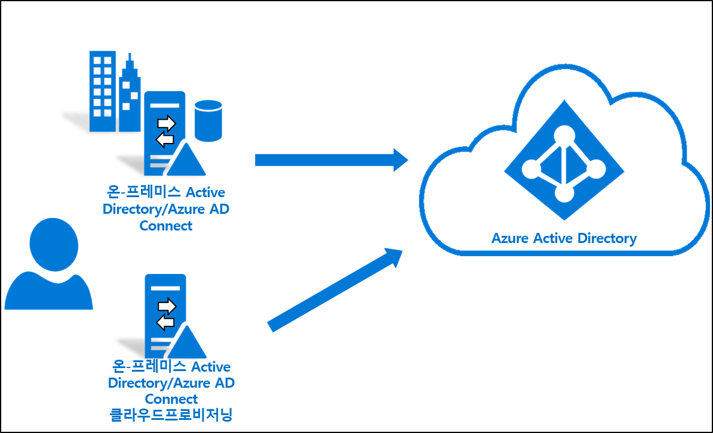

## 고려 사항
이 자습서를 수행하기 전에 고려해야 하는 사항은 다음과 같습니다.
1. 클라우드 프로비저닝의 기본 사항에 대해 잘 알고 있어야 합니다. 
2. Azure AD Connect 동기화 버전 1.4.32.0 이상을 실행하고 문서에 설명한 대로 동기화 규칙을 구성했는지 확인합니다. 파일럿 테스트를 수행하는 경우 Azure AD Connect 동기화 범위에 속한 테스트 OU 또는 그룹을 제거합니다. 범위를 벗어난 개체를 이동하면 해당 개체가 Azure AD에서 삭제됩니다. 사용자 개체의 경우 Azure AD의 개체가 일시 삭제되며 복원할 수 있습니다. 그룹 개체의 경우 Azure AD의 개체가 영구 삭제되며 복원할 수 없습니다. 파일럿 테스트 시나리오의 경우 삭제를 방지하는 새 링크 유형이 Azure AD Connect 동기화에 도입되었습니다. 
3. 파일럿 테스트 범위에 속한 개체에 ms-ds-consistencyGUID가 채워져 클라우드 프로비저닝이 개체와 일치하는지 확인합니다. 

   > [!NOTE]
   > Azure AD Connect 동기화는 기본적으로 그룹 개체에 대한 *ms-ds-consistencyGUID*를 채우지 않습니다. [이 블로그 게시물](https://blogs.technet.microsoft.com/markrenoden/2017/10/13/choosing-a-sourceanchor-for-groups-in-multi-forest-sync-with-aad-connect/)에서 설명한 단계에 따라 그룹 개체에 대한 *ms-ds-consistencyGUID*를 채우세요.

4. 이는 고급 시나리오입니다. 이 자습서에서 설명하는 단계를 정확히 수행해야 합니다.

## 사전 요구 사항
다음은 이 자습서를 완료하는 데 필요한 필수 구성 요소입니다.
- Azure AD Connect 동기화 버전 1.4.32.0 이상인 테스트 환경
- 동기화 범위에 속하고 파일럿 테스트에 사용할 수 있는 OU 또는 그룹. 작은 개체 세트로 시작하는 것이 좋습니다.
- Windows Server 2012 R2 이상을 실행하고 프로비저닝 에이전트를 호스팅하는 서버.  이 서버는 Azure AD Connect 서버와 동일한 서버일 수 없습니다.
- AAD Connect 동기화에 대한 원본 앵커는 *objectGuid* 또는 *ms-ds-consistencyGUID*여야 합니다.

## Azure AD Connect 업데이트

[Azure AD Connect](https://www.microsoft.com/download/details.aspx?id=47594) 1.4.32.0 이상이 있어야 합니다. Azure AD Connect 동기화를 업데이트하려면 [Azure AD Connect: 최신 버전으로 업그레이드](../hybrid/how-to-upgrade-previous-version.md)의 단계를 수행합니다.  

## 스케줄러 중지
Azure AD Connect 동기화는 스케줄러를 사용하여 온-프레미스 디렉터리에서 발생하는 변경 내용을 동기화합니다. 사용자 지정 규칙을 수정하고 추가하려면 스케줄러를 사용하지 않도록 설정하여 이 작업을 수행하는 동안 동기화가 실행되지 않도록 해야 합니다.  다음 단계를 사용합니다.

1.  Azure AD Connect 동기화를 실행하는 서버에서 PowerShell을 관리자 권한으로 엽니다.
2.  `Stop-ADSyncSyncCycle`을 실행합니다.  Enter 키를 누릅니다.
3.  `Set-ADSyncScheduler -SyncCycleEnabled $false`을 실행합니다.

>[!NOTE] 
>AAD Connect 동기화에 대한 사용자 지정 스케줄러를 실행하는 경우 스케줄러를 사용하지 않도록 설정하세요. 

## 사용자 지정 사용자 인바운드 규칙 만들기

 1. 아래와 같이 데스크톱의 애플리케이션 메뉴에서 동기화 편집기를 시작합니다. 
 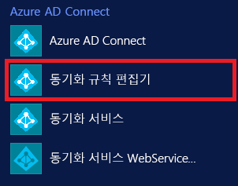 
 
 2. [방향] 드롭다운 목록에서 **인바운드**를 선택하고, **새 규칙 추가**를 클릭합니다.
  
 
 3. **설명** 페이지에서 다음을 입력하고, **다음**을 클릭합니다.

    **이름:** 의미 있는 이름을 규칙에 지정합니다. 
    **설명:** 의미 있는 설명을 추가합니다. 
    **연결된 시스템:** 작성하는 사용자 지정 동기화 규칙의 대상이 되는 AD 커넥터를 선택합니다. 
    **연결된 시스템 개체 형식:** 사용자 
    **메타버스 개체 형식:** Person 
    **링크 유형:** Join 
    **우선 순위:** 시스템에서 고유한 값을 제공합니다. 
    **태그:** 이 항목은 비워 둡니다. 
    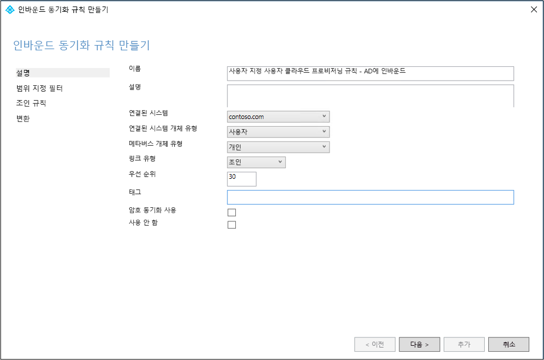 
 
 4. **범위 지정 필터** 페이지에서 파일럿 테스트 기반으로 사용할 OU 또는 보안 그룹을 입력합니다.  OU를 필터링하려면 고유 이름의 OU 부분을 추가합니다. 이 규칙은 해당 OU에 속한 모든 사용자에게 적용됩니다.  따라서 DN이 "OU=CPUsers,DC=contoso,DC=com"으로 끝나면 이 필터를 추가합니다.  그런 후 **Next** 를 클릭합니다. 

    |규칙|attribute|연산자|값|
    |-----|----|----|-----|
    |범위 지정 OU|DN|ENDSWITH|OU의 고유 이름입니다.|
    |범위 지정 그룹||ISMEMBEROF|보안 그룹의 고유 이름입니다.|

    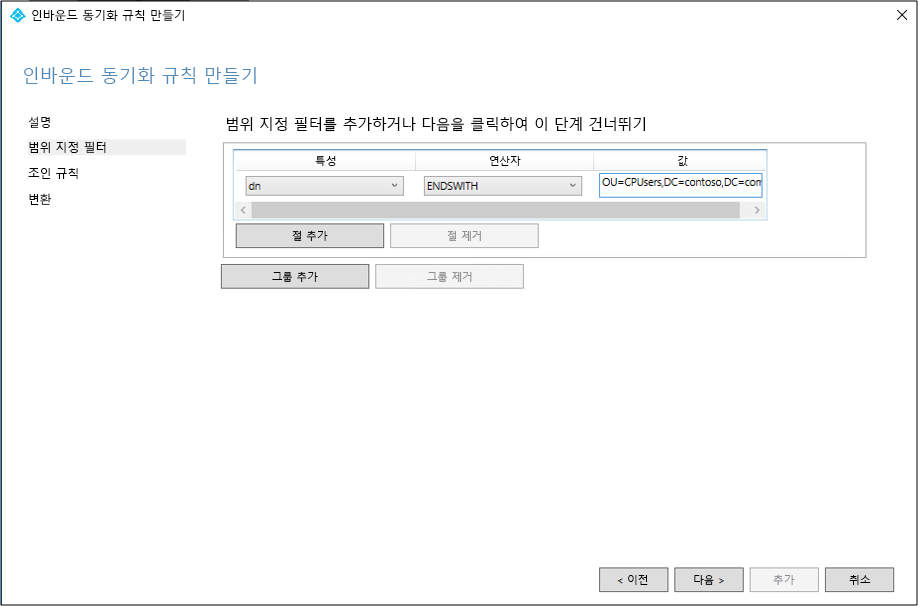 
 
 5. **조인** 규칙 페이지에서 **다음**을 클릭합니다.
 6. **변환** 페이지에서 cloudNoFlow 특성을 True로 지정한 상수 변환을 추가합니다. **추가**를 클릭합니다.
 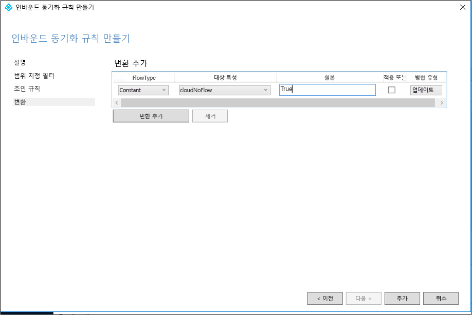 

모든 개체 형식(사용자, 그룹 및 연락처)에 대해서도 동일한 단계를 수행해야 합니다. 구성된 AD 커넥터 및 AD 포리스트별로 단계를 반복합니다. 

## 사용자 지정 사용자 아웃바운드 규칙 만들기

 1. [방향] 드롭다운 목록에서 **아웃바운드**를 선택하고, **새 규칙 추가**를 클릭합니다.
 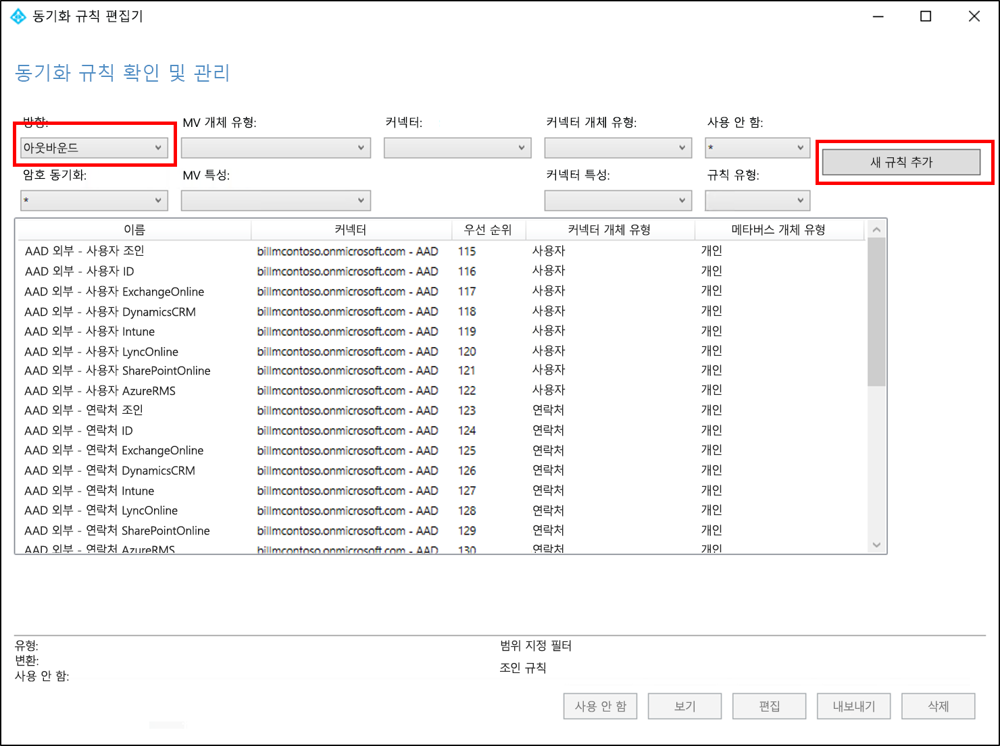 
 
 2. **설명** 페이지에서 다음을 입력하고, **다음**을 클릭합니다.

    **이름:** 의미 있는 이름을 규칙에 지정합니다. 
    **설명:** 의미 있는 설명을 추가합니다.  
    **연결된 시스템:** 작성하는 사용자 지정 동기화 규칙의 대상이 되는 AAD 커넥터를 선택합니다. 
    **연결된 시스템 개체 형식:** 사용자 
    **메타버스 개체 형식:** Person 
    **링크 유형:** JoinNoFlow 
    **우선 순위:** 시스템에서 고유한 값을 제공합니다. 
    **태그:** 이 항목은 비워 둡니다. 
    
    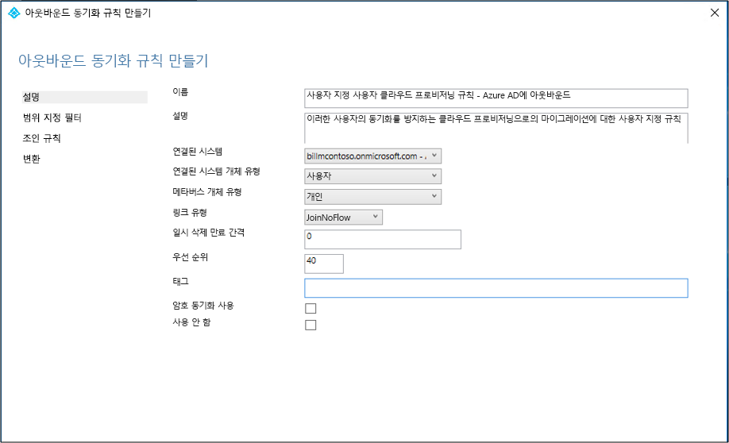 
 
 3. **범위 지정 필터** 페이지에서 **cloudNoFlow**, 같음, **True**를 차례로 선택합니다. 그런 후 **Next** 를 클릭합니다.
 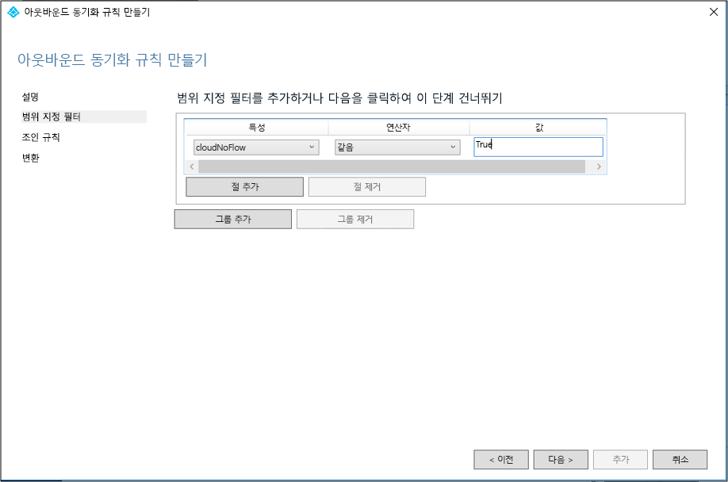 
 
 4. **조인** 규칙 페이지에서 **다음**을 클릭합니다.
 5. **변환** 페이지에서 **추가**를 클릭합니다.

모든 개체 형식(사용자, 그룹 및 연락처)에 대해서도 동일한 단계를 수행해야 합니다.

## Azure AD Connect 프로비저닝 에이전트 설치
1. 사용할 서버에 엔터프라이즈 관리자 권한으로 로그인합니다.  [기본 AD 및 Azure 환경](tutorial-basic-ad-azure.md) 자습서를 사용하는 경우 CP1이 됩니다.
2. [여기](https://go.microsoft.com/fwlink/?linkid=2109037)서 Azure AD Connect 클라우드 프로비저닝 에이전트를 다운로드합니다.
3. Azure AD Connect 클라우드 프로비저닝을 실행합니다(AADConnectProvisioningAgent.Installer).
3. 시작 화면에서 사용 조건을 **수락**하고 **설치**를 클릭합니다. 
 

4. 이 작업이 완료되면 구성 마법사가 시작됩니다.  Azure AD 글로벌 관리자 계정으로 로그인합니다.
5. **Active Directory 연결** 화면에서 **디렉터리 추가**를 클릭한 다음, Active Directory 관리자 계정으로 로그인합니다.  이 작업을 수행하면 온-프레미스 디렉터리가 추가됩니다.  **다음**을 클릭합니다. 
 

6. **구성 완료** 화면에서 **확인**을 클릭합니다.  이 작업을 수행하면 에이전트가 등록되고 다시 시작됩니다. 
 

7. 이 작업이 완료되면 **확인했습니다** 알림이 표시됩니다.  **끝내기**를 클릭할 수 있습니다. 
 
8. 초기 시작 화면이 계속 표시되는 경우 **닫기**를 클릭합니다.

## 에이전트 설치 확인
에이전트 확인은 Azure Portal 및 에이전트를 실행하는 로컬 서버에서 수행됩니다.

### Azure Portal에서 에이전트 확인
Azure에서 에이전트가 표시되는지 확인하려면 다음 단계를 수행합니다.

1. Azure Portal에 로그인합니다.
2. 왼쪽에서 **Azure Active Directory**를 선택하고, **Azure AD Connect**를 클릭하고, 가운데에서 **프로비저닝 관리(미리 보기)** 를 선택합니다. 
 

3.  **Azure AD 프로비저닝(미리 보기)** 화면에서 **모든 에이전트 검토**를 클릭합니다.
 
 
4. **온-프레미스 프로비저닝 에이전트 화면**에서 설치한 에이전트가 표시됩니다.  해당 에이전트가 있고 **사용 안 함**으로 표시되어 있는지 확인합니다.  에이전트는 기본적으로 를 사용되지 않도록 설정됩니다. 

### 로컬 서버에서 에이전트 확인
에이전트가 실행되는지 확인하려면 다음 단계를 수행합니다.

1.  관리자 계정으로 서버에 로그온합니다.
2.  **서비스**를 탐색하거나 Services.msc를 시작하고 실행하여 엽니다.
3.  **서비스** 아래에서 **Microsoft Azure AD Connect 에이전트 업데이트 프로그램** 및 **Microsoft Azure AD Connect 프로비저닝 에이전트**가 있고 상태가 **실행 중**인지 확인합니다.

## Azure AD Connect 클라우드 프로비저닝 구성
다음 단계를 사용하여 프로비저닝을 구성합니다.

 1. Azure AD 포털에 로그인합니다.
 2. **Azure Active Directory**를 클릭합니다.
 3. **Azure AD Connect**를 클릭합니다.
 4. **프로비저닝 관리(미리 보기)** 
 를 선택합니다. 
 5.  **새 구성**
 을 클릭합니다. 
 6.  구성 화면에서 **알림 이메일**을 입력하고, 선택기를 **사용**으로 이동하고, **저장**을 클릭합니다.
  
 7. **구성** 아래에서 **모든 사용자**를 선택하여 구성 규칙의 범위를 변경합니다.
 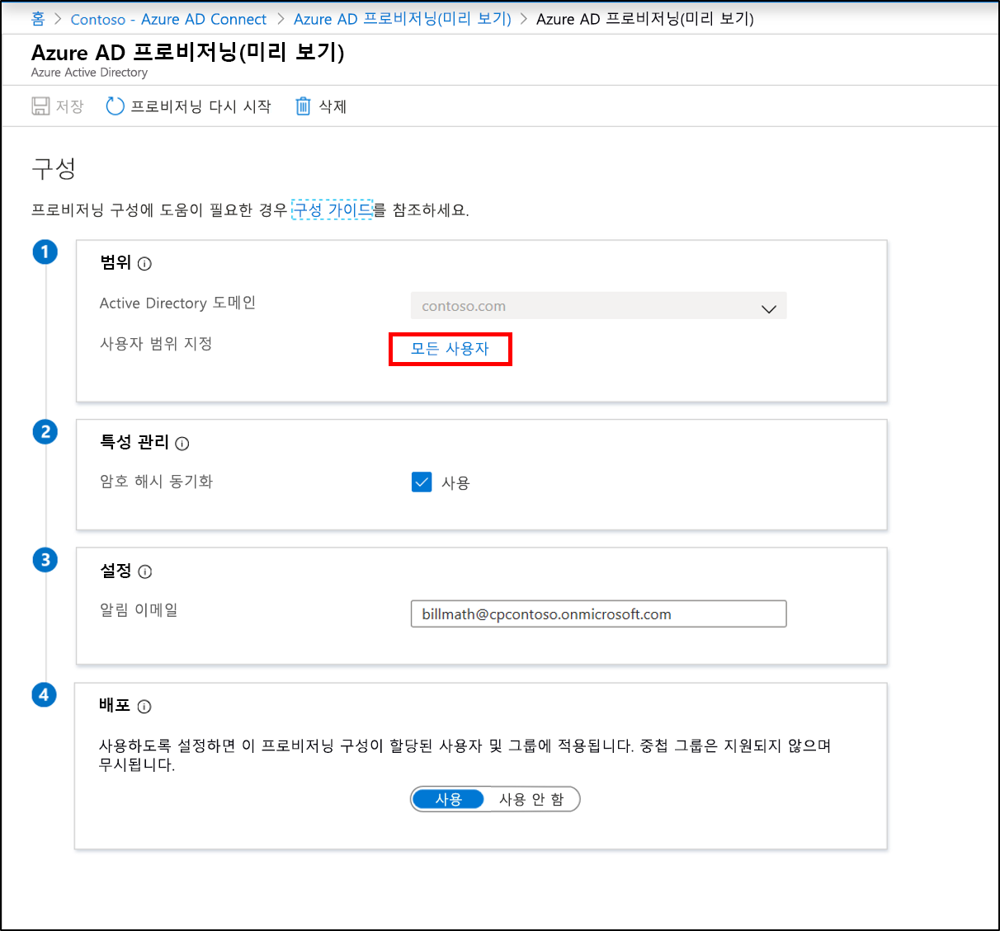 
 8. 오른쪽에서 방금 만든 특정 OU("OU=CPUsers, DC=contoso,DC=com")를 포함하도록 범위를 변경합니다.
 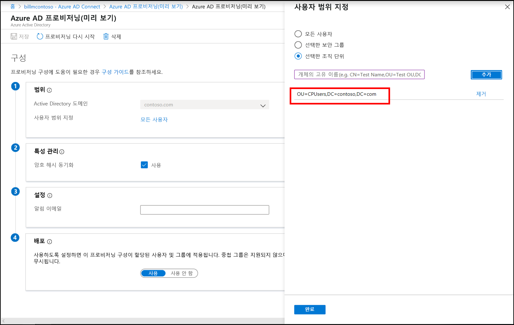 
 9.  **완료**, **저장**을 차례로 클릭합니다.
 10. 이제 범위가 하나의 조직 구성 단위로 설정됩니다. 
 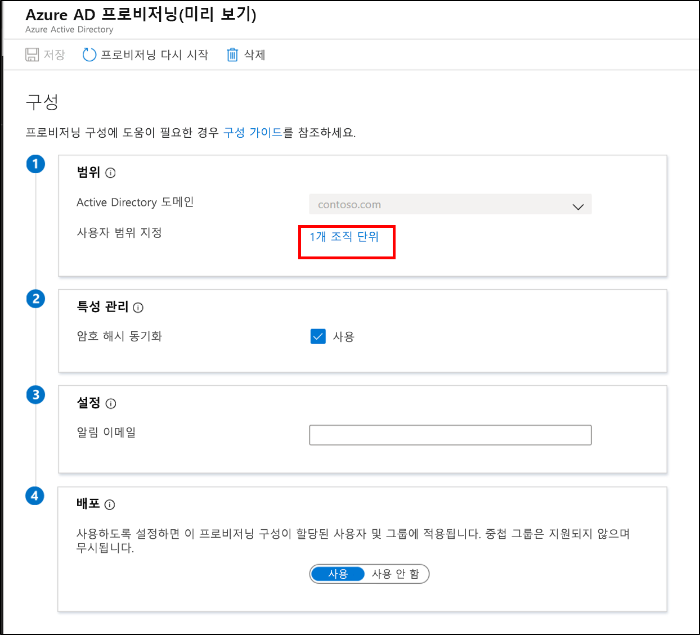 
 

## 사용자가 클라우드 프로비저닝을 통해 프로비저닝되었는지 확인
이제 온-프레미스 디렉터리에 있는 사용자가 동기화되었고 Azure AD 테넌트에 있는지 확인합니다.  이 작업을 완료하는 데 몇 시간이 걸릴 수 있습니다.  사용자가 클라우드 프로비저닝을 통해 프로비저닝되는지 확인하려면 다음 단계를 수행합니다.

1. [Azure Portal](https://portal.azure.com)로 이동하여 Azure 구독이 있는 계정으로 로그인합니다.
2. 왼쪽에서 **Azure Active Directory**를 선택합니다.
3. **Azure AD Connect**를 클릭합니다.
4. **프로비저닝 관리(미리 보기)** 를 클릭합니다.
5. **로그** 단추를 클릭합니다.
6. 사용자 이름을 검색하여 사용자가 클라우드 프로비저닝을 통해 프로비저닝되었는지 확인합니다.

또한 사용자와 그룹이 Azure AD에 있는지도 확인할 수 있습니다.

## 스케줄러 시작
Azure AD Connect 동기화는 스케줄러를 사용하여 온-프레미스 디렉터리에서 발생하는 변경 내용을 동기화합니다. 이제 규칙을 수정했으므로 스케줄러를 다시 시작할 수 있습니다.  다음 단계를 사용합니다.

1.  Azure AD Connect 동기화를 실행하는 서버에서 PowerShell을 관리자 권한으로 엽니다.
2.  `Set-ADSyncScheduler -SyncCycleEnabled $true`을 실행합니다.
3.  `Start-ADSyncSyncCycle`을 실행합니다.  Enter 키를 누릅니다.  

>[!NOTE] 
>AAD Connect 동기화에 대한 사용자 지정 스케줄러를 실행하는 경우 스케줄러를 사용하도록 설정하세요. 

## 문제가 발생한 경우
파일럿 테스트가 예상대로 작동하지 않는 경우 아래 단계에 따라 Azure AD Connect 동기화 설정으로 돌아갈 수 있습니다.
1.  Azure Portal에서 프로비저닝 구성을 사용하지 않도록 설정합니다. 
2.  동기화 규칙 편집기 도구를 사용하여 클라우드 프로비저닝에 대해 만들어진 모든 사용자 지정 동기화 규칙을 사용하지 않도록 설정합니다. 사용하지 않도록 설정하면 모든 커넥터에서 전체 동기화가 수행됩니다.

## 파일럿 테스트 OU를 제외하도록 Azure AD Connect 동기화 구성
파일럿 OU의 사용자가 클라우드 프로비저닝을 통해 성공적으로 관리되는지 확인한 후에는 위에서 만든 파일럿 테스트 OU를 제외하도록 Azure AD Connect를 다시 구성할 수 있습니다.  클라우드 프로비저닝 에이전트는 앞으로 이러한 사용자에 대한 동기화를 처리합니다.  다음 단계를 사용하여 Azure AD Connect의 범위를 지정합니다.

 1. Azure AD Connect를 실행하는 서버에서 Azure AD Connect 아이콘을 두 번 클릭합니다.
 2. **구성**을 클릭합니다.
 3. **동기화 옵션 사용자 지정**을 선택하고, [다음]을 클릭합니다.
 4. Azure AD에 로그인하고, **다음**을 클릭합니다.
 5. **디렉터리 연결** 화면에서 **다음**을 클릭합니다.
 6. **도메인 및 OU 필터링** 화면에서 **선택한 도메인 및 OU 동기화**를 선택합니다.
 7. 도메인을 펼치고, **CPUsers** OU를 **선택 취소**합니다.  **다음**을 클릭합니다.
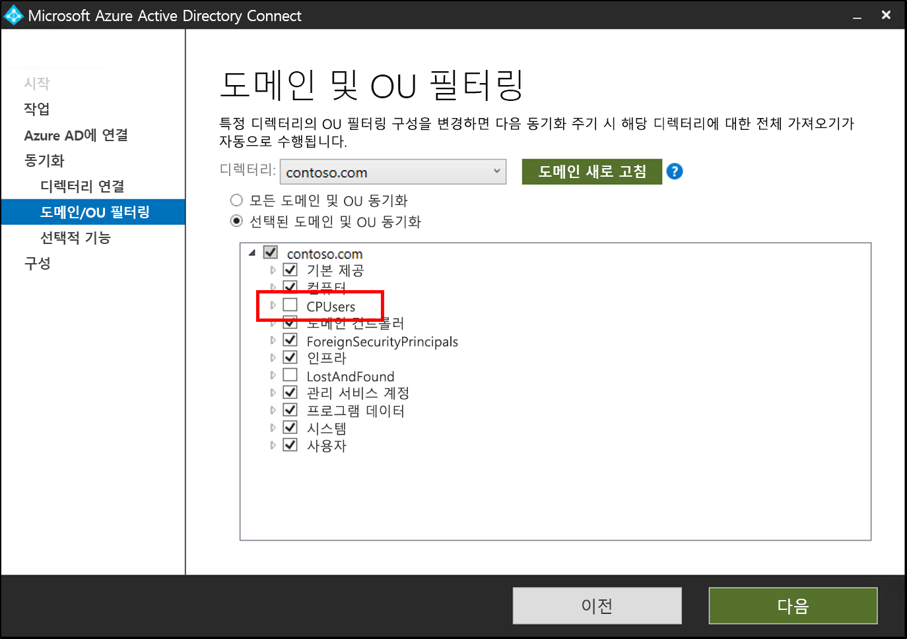 
 9. **선택적 기능** 화면에서 **다음**을 클릭합니다.
 10. **구성 준비 완료** 화면에서 **구성**을 클릭합니다.
 11. 완료되면 **끝내기**를 클릭합니다. 

## 다음 단계 

- [프로비저닝이란?](what-is-provisioning.md)
- [Azure AD Connect 클라우드 프로비저닝이란?](what-is-cloud-provisioning.md)

