# 자습서: 단일 포리스트를 단일 Azure AD 테 넌 트와 통합

이 자습서에서는 Azure Active Directory (Azure AD) Connect cloud 프로 비전을 사용 하 여 하이브리드 id 환경을 만드는 과정을 안내 합니다.

테스트를 위해이 자습서에서 만든 환경을 사용 하거나 클라우드 프로 비전에 보다 친숙 하 게 사용할 수 있습니다.

## 필수 조건
### Azure Active Directory 관리 센터에서

1. Azure AD 테넌트에서 클라우드 전용 전역 관리자 계정을 만듭니다. 이러한 방식으로 온-프레미스 서비스가 실패하거나 사용할 수 없게 될 때 테넌트의 구성을 관리할 수 있습니다. [클라우드 전용 전역 관리자 계정 추가](../active-directory-users-create-azure-portal.md)에 대해 자세히 알아봅니다. 테넌트에 잠기지 않도록 이 단계를 완료하는 것이 중요합니다.
2. Azure AD 테넌트에 [사용자 지정 도메인 이름](../active-directory-domains-add-azure-portal.md)을 하나 이상 추가합니다. 사용자는 이러한 도메인 이름 중 하나로 로그인할 수 있습니다.

### 온-프레미스 환경에서

1. 최소 4gb RAM 및 .NET 4.7.1 + runtime을 사용 하 여 Windows Server 2012 R2 이상을 실행 하는 도메인에 가입 된 호스트 서버 식별 

2. 서버와 Azure AD 사이에 방화벽이 있는 경우 다음 항목을 구성합니다.
   - 에이전트에서 다음 포트를 통해 Azure AD에 대한 *아웃바운드* 요청을 수행할 수 있는지 확인합니다.

     | 포트 번호 | 사용 방법 |
     | --- | --- |
     | **80** | SSL 인증서의 유효성을 검사하는 동안 CRL(인증서 해지 목록) 다운로드 |
     | **443** | 서비스와의 모든 아웃바운드 통신 처리 |
     | **8080**(선택 사항) | 443 포트를 사용할 수 없는 경우 에이전트는 8080 포트를 통해 10분마다 해당 상태를 보고합니다. 이 상태는 Azure AD 포털에 표시됩니다. |
     
     방화벽이 원래 사용자에 따라 규칙에 적용되는 경우 네트워크 서비스로 실행하는 Windows 서비스의 트래픽에 대해 이러한 포트를 엽니다.
   - 방화벽이 나 프록시를 사용 하 여 안전한 접미사를 지정 하는 경우 msappproxy.net **\*및 servicebus.windows.net** **\*** 에 연결 t를 추가 합니다. 그렇지 않으면 매주 업데이트되는 [Azure 데이터 센터 IP 범위](https://www.microsoft.com/download/details.aspx?id=41653)에 액세스하도록 허용합니다.
   - 에이전트는 초기 등록을 위해 **login.windows.net** 및 **login.microsoftonline.com**에 액세스해야 합니다. 이러한 URL에 대한 방화벽도 엽니다.
   - 인증서 유효성 검사를 위해 **mscrl.microsoft.com:80**, **crl.microsoft.com:80**, **ocsp.msocsp.com:80** 및 **www\.microsoft.com:80** URL을 차단 해제합니다. 이러한 URL은 다른 Microsoft 제품과의 인증서 유효성 검사에 사용되므로 이러한 URL을 이미 차단 해제했을 수 있습니다.

## Azure AD Connect 프로비저닝 에이전트 설치
1. 도메인 조인 서버에 로그인합니다.  [기본 AD 및 Azure 환경](tutorial-basic-ad-azure.md) 자습서를 사용하는 경우 DC1이 됩니다.
2. 클라우드 전용 글로벌 관리자 자격 증명을 사용하여 Azure Portal에 로그인합니다.
3. 왼쪽에서 **Azure Active Directory**를 선택 하 고 **Azure AD Connect**를 클릭 한 다음 가운데에서 **프로 비전 관리 (미리 보기)** 를 선택 합니다.

   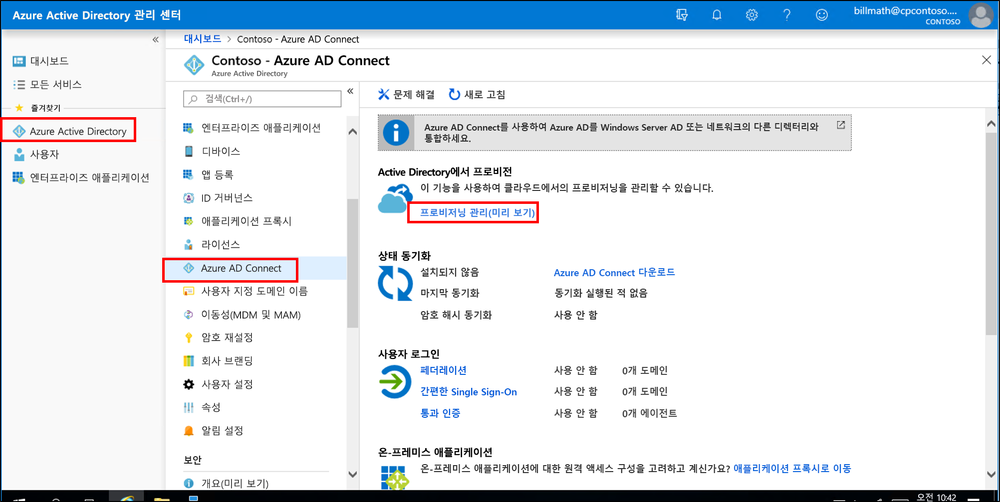

4. **에이전트 다운로드**를 클릭 합니다.
5. Azure AD Connect 프로 비전 에이전트를 실행 합니다.
6. 시작 화면에서 사용 조건을 **수락**하고 **설치**를 클릭합니다.

   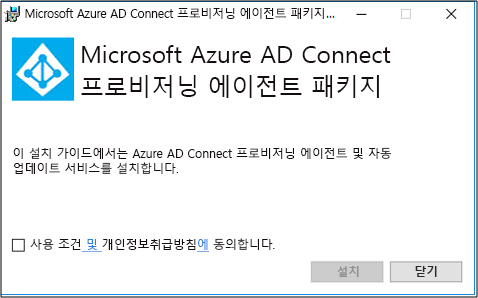

7. 이 작업이 완료되면 구성 마법사가 시작됩니다.  Azure AD 글로벌 관리자 계정으로 로그인합니다.  IE 보안 강화를 사용하도록 설정한 경우 로그인이 차단됩니다.  이 경우 설치를 닫고, 서버 관리자에서 IE 보안 강화를 사용하지 않도록 설정하고, **AAD Connect 프로비저닝 에이전트 마법사**를 클릭하여 설치를 다시 시작합니다.
8. **Active Directory 연결** 화면에서 **디렉터리 추가**를 클릭한 다음, Active Directory 도메인 관리자 계정으로 로그인합니다.  참고: 도메인 관리자 계정에는 암호 변경 요구 사항이 없어야 합니다. 암호가 만료되거나 변경되는 경우 새 자격 증명을 사용하여 에이전트를 다시 구성해야 합니다. 이 작업을 수행하면 온-프레미스 디렉터리가 추가됩니다.  **다음**을 클릭합니다.

   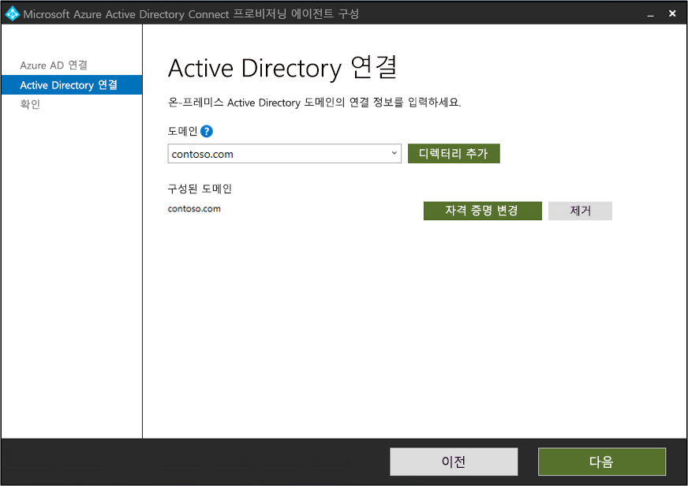

9. **구성 완료** 화면에서 **확인**을 클릭합니다.  이 작업을 수행하면 에이전트가 등록되고 다시 시작됩니다.

   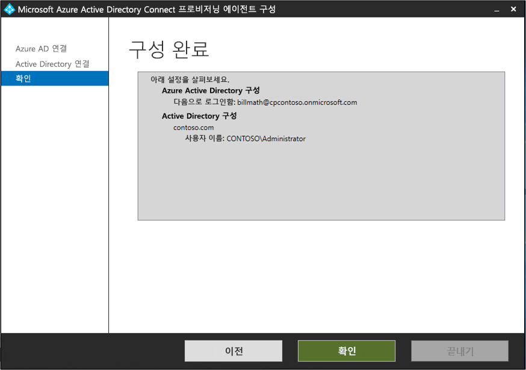

10. 이 작업이 완료 되 면 **에이전트 구성이 성공적으로 확인 되었다는** 알림이 표시 됩니다.  **끝내기**를 클릭할 수 있습니다. 
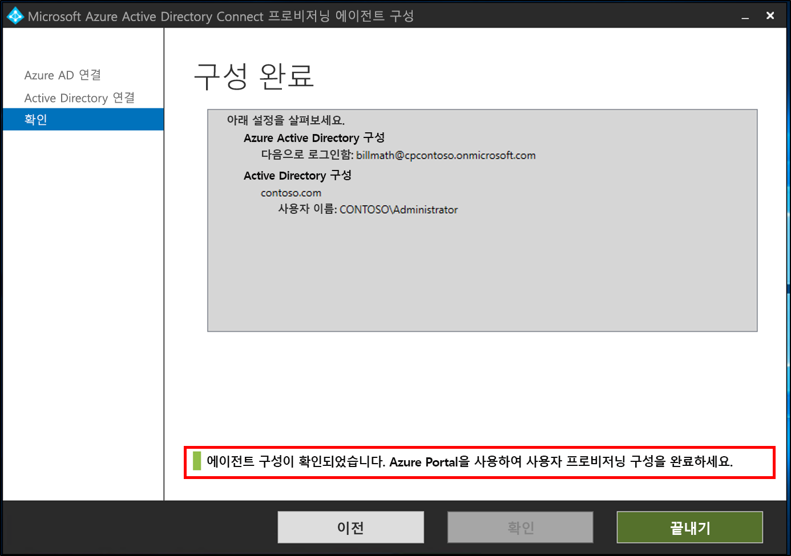 
11. 초기 시작 화면이 계속 표시되는 경우 **닫기**를 클릭합니다.

## 에이전트 설치 확인
에이전트 확인은 Azure Portal 및 에이전트를 실행하는 로컬 서버에서 수행됩니다.

### Azure Portal에서 에이전트 확인
Azure에서 에이전트가 표시되는지 확인하려면 다음 단계를 수행합니다.

1. Azure Portal에 로그인합니다.
2. 왼쪽에서 **Azure Active Directory**를 선택하고, **Azure AD Connect**를 클릭하고, 가운데에서 **프로비저닝 관리(미리 보기)** 를 선택합니다. 
 

3.  **Azure AD 프로비저닝(미리 보기)** 화면에서 **모든 에이전트 검토**를 클릭합니다.
 
 
4. **온-프레미스 프로비저닝 에이전트 화면**에서 설치한 에이전트가 표시됩니다.  해당 에이전트가 있고 **활성**으로 표시되어 있는지 확인합니다.
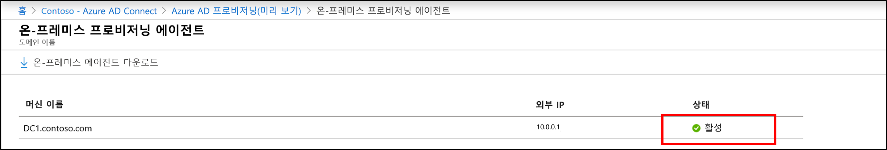 

### 로컬 서버에서 에이전트 확인
에이전트가 실행되는지 확인하려면 다음 단계를 수행합니다.

1.  관리자 계정으로 서버에 로그온합니다.
2.  **서비스**를 탐색하거나 Services.msc를 시작하고 실행하여 엽니다.
3.  **서비스** 아래에서 **Microsoft Azure AD Connect 에이전트 업데이트 프로그램** 및 **Microsoft Azure AD Connect 프로비저닝 에이전트**가 있고 상태가 **실행 중**인지 확인합니다.

## Azure AD Connect 클라우드 프로비저닝 구성
 다음 단계를 사용하여 프로비저닝을 구성합니다.

1.  Azure AD 포털에 로그인합니다.
2.  **Azure Active Directory**를 클릭합니다.
3.  **Azure AD Connect**를 클릭합니다.
4.  **프로비저닝 관리(미리 보기)** 
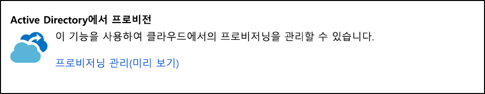를 선택합니다.
5.  **새 구성**
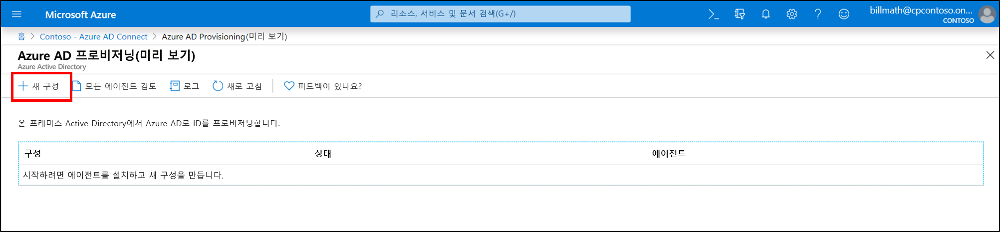을 클릭합니다.
7.  구성 화면에서 **알림 이메일**을 입력하고, 선택기를 **사용**으로 이동하고, **저장**을 클릭합니다.
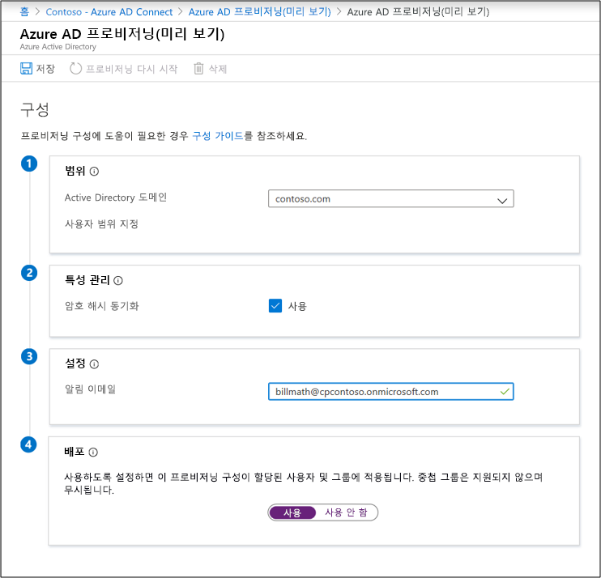
1.  이제 구성 상태는 **정상**입니다.
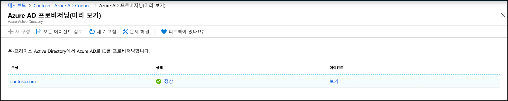

## 사용자가 생성되고 동기화가 수행되는지 확인
이제 온-프레미스 디렉터리에 있는 사용자가 동기화되었고 Azure AD 테넌트에 있는지 확인합니다.  이 작업을 완료하는 데 몇 시간이 걸릴 수 있습니다.  사용자가 동기화되었는지 확인하려면 다음을 수행합니다.

1. [Azure Portal](https://portal.azure.com)로 이동하여 Azure 구독이 있는 계정으로 로그인합니다.
2. 왼쪽에서 **Azure Active Directory**를 선택합니다.
3. **관리**에서 **사용자**를 선택합니다.
4. 새 사용자가 테넌트에 표시되는지 확인 
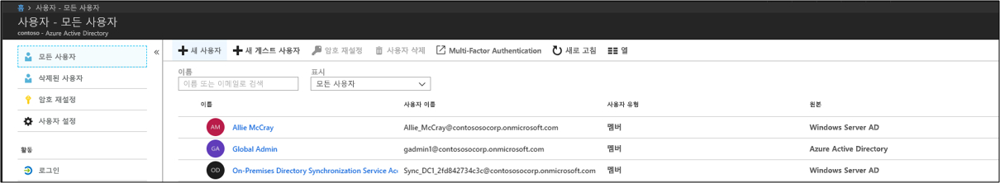 

## 사용자 중 한 명으로 로그인 테스트

1. [https://myapps.microsoft.com](https://myapps.microsoft.com)으로 이동합니다.
2. 새 테넌트에 생성된 사용자 계정으로 로그인합니다.  user@domain.onmicrosoft.com 형식을 사용하여 로그인해야 합니다. 사용자가 온-프레미스 로그인에 사용하는 것과 동일한 암호를 사용합니다. 
   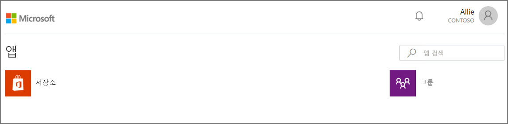 

Azure에 제공되는 기능을 테스트하고 익히는 데 사용할 수 있는 하이브리드 ID 환경이 성공적으로 설정되었습니다.

## 다음 단계 

- [프로비저닝이란?](what-is-provisioning.md)
- [Azure AD Connect 클라우드 프로비저닝이란?](what-is-cloud-provisioning.md)
