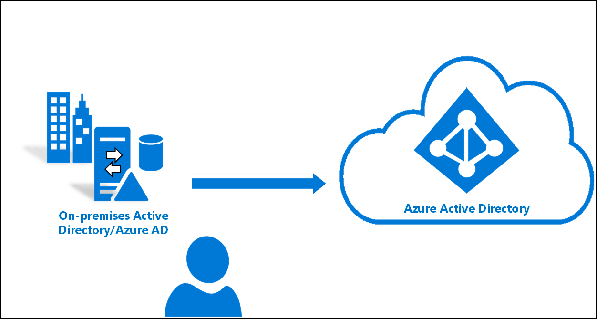

# Azure AD Connect 클라우드 동기화란?
Azure AD Connect 클라우드 동기화는 사용자, 그룹 및 연락처를 Azure AD에 동기화하기 위한 하이브리드 ID 목표를 충족하고 달성하도록 설계된 Microsoft의 새로운 제품입니다.  Azure AD Connect 애플리케이션 대신 Azure AD 클라우드 프로비저닝 에이전트를 사용하여 이 작업을 수행합니다.  그러나 Azure AD Connect 동기화와 함께 사용할 수 있으며 다음과 같은 이점을 제공합니다.
    
- 다중 포리스트 연결 끊김 Active Directory 포리스트 환경에서 Azure AD 테넌트와 동기화를 지원합니다. 일반적인 시나리오에는 획득한 회사의 AD 포리스트가 부모 회사의 AD 포리스트와 이전에 여러 AD 포리스트가 있는 회사에서 격리되는 합병 & 획득이 포함됩니다.
- 경량 프로비저닝 에이전트로 간소화된 설치: 에이전트는 클라우드에서 관리되는 모든 동기화 구성과 함께 AD에서 Azure AD로의 브리지 역할을 합니다. 
- 여러 프로비저닝 에이전트를 사용하여 고가용성 배포를 간소화할 수 있습니다. 특히 AD에서 Azure AD로의 암호 해시 동기화를 사용하는 조직에 특히 중요합니다.
- 최대 50,000명의 구성원이 있는 대기업을 지원합니다. 대규모 그룹을 동기화할 때는 OU 범위 지정 필터만 사용하는 것이 좋습니다.

## Azure AD Connect 클라우드 동기화는 Azure AD Connect 동기화와 어떻게 다른가요?
Azure AD Connect 클라우드 동기화를 사용하면 AD에서 Azure AD로의 프로비저닝이 Microsoft Online Services에서 오케스트레이션됩니다. 조직에서는 Azure AD와 AD 간의 브리지 역할을 하는 경량 에이전트로 온-프레미스 및 IaaS 호스팅 환경에만 배포하면 됩니다. 프로비저닝 구성은 Azure AD에 저장되고 서비스의 일부로 관리됩니다.

## Azure AD Connect 클라우드 동기화 비디오
다음 짧은 비디오는 Azure AD Connect 클라우드 동기화에 대한 훌륭한 개요를 제공합니다.

> [!VIDEO https://youtube.com/embed/mOT3ID02_YQ]

## Azure AD Connect와 클라우드 동기화 간의 비교

다음 표에서는 Azure AD Connect와 Azure AD Connect 클라우드 동기화를 비교합니다.

| 기능 | Azure Active Directory Connect 동기화| Azure Active Directory Connect 클라우드 동기화 |
|:--- |:---:|:---:|
|단일 온-프레미스 AD 포리스트에 연결|● |● |
| 여러 온-프레미스 AD 포리스트에 연결 |● |● |
| 다중 연결 끊김 온-프레미스 AD 포리스트에 연결 | |● |
| 경량 에이전트 설치 모델 | |● |
| 고가용성을 위한 여러 활성 에이전트 | |● |
| LDAP 디렉터리에 연결|●| | 
| 사용자 개체에 대한 지원 |● |● |
| 그룹 개체에 대한 지원 |● |● |
| 연락처 개체에 대한 지원 |● |● |
| 디바이스 개체에 대한 지원 |● | |
| 특성 흐름에 대한 기본 사용자 지정 허용 |● |● |
| Exchange Online 특성 동기화 |● |● |
| 확장 특성 1-15 동기화 |● |● |
| 고객 정의 AD 특성(디렉터리 확장) 동기화 |● | |
| 암호 해시 동기화에 대한 지원 |●|●|
| 통과 인증에 대한 지원 |●||
| 페더레이션에 대한 지원 |●|●|
| 원활한 Single Sign-On|● |●|
| 도메인 컨트롤러에서 설치 지원 |● |● |
| Windows Server 2012 및 Windows Server 2012 R2 지원 |● |● |
| 도메인/OU/그룹에 대한 필터링 |● |● |
| 개체의 특성 값에 대한 필터링 |● | |
| 최소 특성 집합이 동기화되도록 허용(MinSync) |● |● |
| AD에서 Azure AD로의 흐름에서 특성 제거 허용 |● |● |
| 특성 흐름에 대한 고급 사용자 지정 허용 |● | |
| 쓰기 저장에 대한 지원(암호, 디바이스, 그룹) |● | |
| Azure AD Domain Services 지원|● | |
| [Exchange 하이브리드 쓰기 저장](../hybrid/reference-connect-sync-attributes-synchronized.md#exchange-hybrid-writeback) |● | |
| AD 도메인당 최대 150,000개의 개체 지원 |● |● |
| 대규모 그룹 지원 - 최대 50,000명의 구성원이 있는 그룹 |● |● |
| 도메인 간 참조|● | |
| 주문형 프로비저닝| |● |

## 다음 단계 

- [프로비저닝이란?](what-is-provisioning.md)
- [클라우드 동기화 설치](how-to-install.md)
