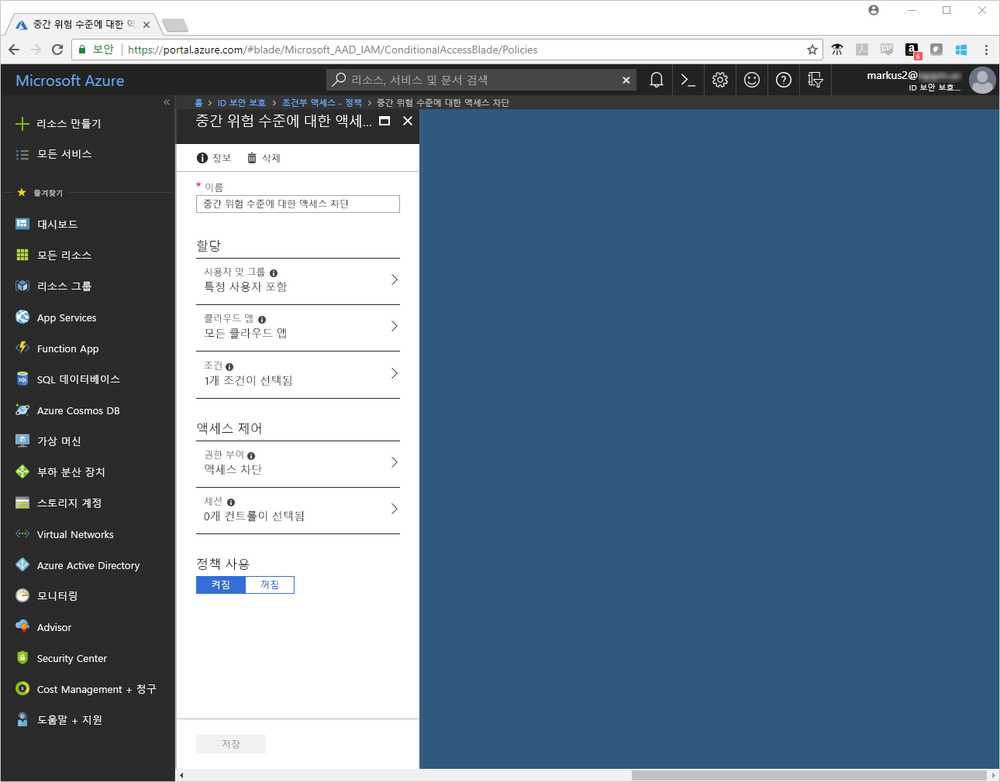
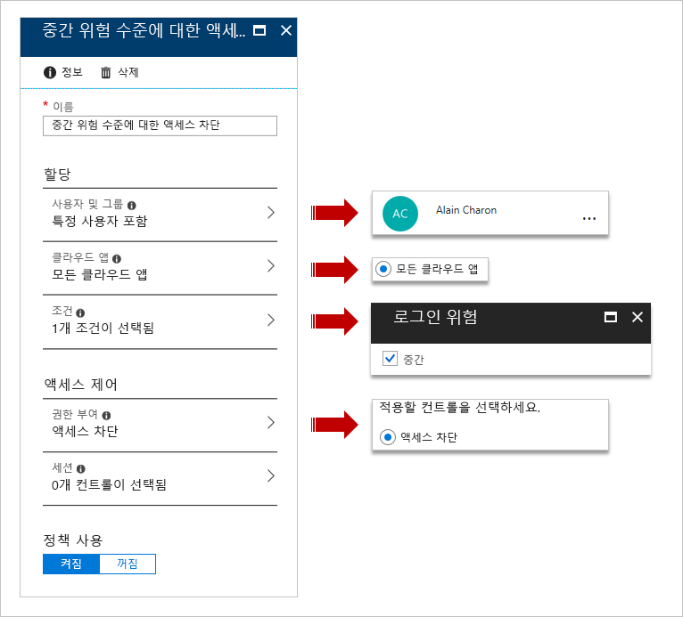
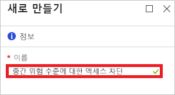
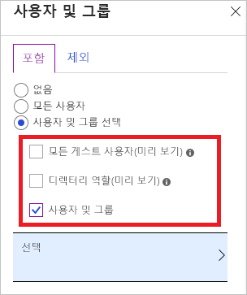
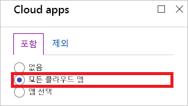
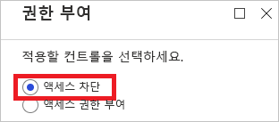
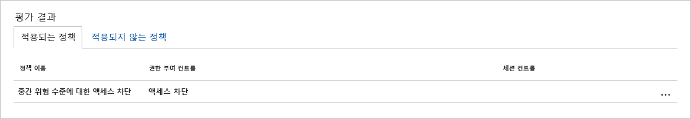
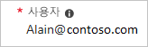

# 빠른 시작: Azure Active Directory 조건부 액세스에서 세션 위험이 감지되면 액세스 차단  

환경을 보호하려는 경우 의심스러운 사용자의 로그인을 차단할 수 있습니다. [Azure AD(Azure Active Directory) Identity Protection](../active-directory-identityprotection.md)은 각 로그인을 분석하고 사용자 계정의 합법적인 소유자가 수행하지 않은 로그인 시도 가능성을 계산합니다. 가능성(낮음, 중간, 높음)은 [로그인 위험 수준](conditions.md#sign-in-risk)이라는 계산된 값의 양식으로 나타납니다. 로그인 위험 조건을 설정하여 특정 로그인 위험 수준에 응답하도록 조건부 액세스 정책을 구성할 수 있습니다. 

이 빠른 시작에서는 구성된 로그인 위험 수준을 감지한 경우 로그인을 차단하는 [조건부 액세스 정책](../active-directory-conditional-access-azure-portal.md)을 구성하는 방법을 보여줍니다. 

Azure 구독이 아직 없는 경우 시작하기 전에 [체험 계정](https://azure.microsoft.com/free/?WT.mc_id=A261C142F)을 만듭니다.

## 필수 조건 

이 자습서의 시나리오를 완료하려면 다음이 필요합니다.

- **Azure AD Premium P2 버전에 대한 액세스** - 조건부 액세스가 Azure AD Premium P1 기능이지만 이 빠른 시작 시나리오에 Identity Protection이 필요하기 때문에 P2 버전이 필요합니다. 

- **Identity Protection** - 이 빠른 시작의 시나리오에서는 Identity Protection을 사용하도록 설정해야 합니다. Identity Protection을 사용하도록 설정하는 방법을 모르면 [Azure Active Directory Identity Protection 활성화](../identity-protection/enable.md)를 참조하세요.

- **Tor 브라우저** - [Tor 브라우저](https://www.torproject.org/projects/torbrowser.html.en)는 온라인 개인 정보를 유지할 수 있도록 설계되었습니다. Identity Protection은 Tor 브라우저에서의 로그인을 보통 위험 수준인 **익명 IP 주소에서의 로그인**으로 감지합니다. 자세한 내용은 [Azure Active Directory 위험 이벤트](../reports-monitoring/concept-risk-events.md)를 참조하세요.  

- **Alain Charon이라고 하는 테스트 계정** - 테스트 계정을 만드는 방법을 모르는 경우 [클라우드 기반 사용자 추가](../fundamentals/add-users-azure-active-directory.md#add-a-new-user)를 참조하세요.

## 로그인 테스트 

이 단계의 목표는 테스트 계정이 Tor 브라우저를 사용하여 테넌트에 액세스할 수 있도록 하는 것입니다.

**로그인을 테스트하려면:**

1. [Azure Portal](https://portal.azure.com)에 **Alain Charon**으로 로그인합니다.

2. 로그아웃합니다. 

## 조건부 액세스 정책 만들기 

이 빠른 시작에서 시나리오는 Tor 브라우저에서의 로그인을 사용하여 감지된 **익명 IP 주소에서 로그인** 위험 이벤트를 생성합니다. 이 위험 이벤트의 위험 수준은 보통입니다. 이 위험 이벤트에 응답하려면 로그인 위험 조건을 보통으로 설정합니다. 프로덕션 환경에서는 로그인 위험 조건을 높음 또는 보통 이상으로 설정해야 합니다.     

이 섹션에서는 필요한 조건부 액세스 정책을 만드는 방법을 보여줍니다. 정책에서 다음을 설정합니다.

|설정 |값|
|---     | --- |
| 개요 | Alain Charon  |
| 클라우드 앱 | 모든 클라우드 앱 |
| 로그인 위험 | 중간 |
| 허용 | 액세스 차단 |
 

 

**조건부 액세스 정책을 구성하려면:**

1. [Azure Portal](https://portal.azure.com)에 전역 관리자, 보안 관리자 또는 조건부 액세스 관리자 권한으로 로그인합니다.

2. Azure Portal의 왼쪽 탐색 모음에서 **Azure Active Directory**를 클릭합니다. 

    

3. **Azure Active Directory** 페이지의 **보안** 섹션에서 **조건부 액세스**를 클릭합니다.

    
 
4. **조건부 액세스** 페이지에서 위쪽의 도구 모음에서 **추가**를 클릭합니다.

    

5. **새로 만들기** 페이지의 **이름** 텍스트 상자에 **중간 위험 수준에 대한 액세스 차단**을 입력합니다.

    

6. **할당** 섹션에서 **사용자 및 그룹**을 클릭합니다.

    

7. **사용자 및 그룹** 페이지에서:

    

    a. **사용자 및 그룹 선택**을 클릭한 다음, **사용자 및 그룹**을 선택합니다.

    b. **선택**을 클릭합니다.

    다. **선택** 페이지에서 **Alain Charon**을 선택한 다음, **선택**을 클릭합니다.

    d. **사용자 및 그룹** 페이지에서 **완료**를 클릭합니다.

8. **클라우드 앱**을 클릭합니다.

    

9. **클라우드 앱** 페이지에서:

    

    a. **모든 클라우드 앱**을 클릭합니다.

    b. **Done**을 클릭합니다.

10. **조건**을 클릭합니다. 

    

11. **조건** 페이지에서:

    

    a. **로그인 위험**을 클릭합니다.
 
    b. **구성**으로 **예**를 클릭합니다.

    다. 로그인 위험 수준으로 **보통**을 선택합니다.

    d. **선택**을 클릭합니다.

    e. **조건** 페이지에서 **완료**를 클릭합니다.

10. **액세스 제어** 섹션에서 **허용**을 클릭합니다.

    

11. **권한 부여** 페이지에서:

    

    a. **액세스 차단**을 선택합니다.

    b. **선택**을 클릭합니다.

12. **정책 사용** 섹션에서 **켬**을 클릭합니다.

    

13. **만들기**를 클릭합니다.

## 시뮬레이션된 로그인 평가

조건부 액세스 정책을 구성했으니, 예상대로 작동하는지 확인해야 합니다. 첫 번째 단계로, 조건부 액세스 **what if 정책 도구**를 사용하여 테스트 사용자 로그인을 시뮬레이션합니다. 이 시뮬레이션은 이 로그인이 정책에 미치는 영향을 평가하고, 시뮬레이션 보고서를 생성합니다.  

이 시나리오에서 **what if 정책 도구**를 실행하는 경우 **중간 위험 수준에 대한 액세스 차단**이 **적용될 정책** 아래에 표시됩니다. 

**조건부 액세스 정책을 평가하려면:**

1. [조건부 액세스 - 정책](https://portal.azure.com/#blade/Microsoft_AAD_IAM/ConditionalAccessBlade/Policies) 페이지의 위쪽 메뉴에서 **What If**를 클릭합니다.  
 
    

2. **사용자**를 클릭하고, **사용자** 페이지에서 **Alan Charon**을 선택한 다음, **선택**을 클릭합니다.

    

3. **로그인 위험**으로 **중간**을 선택합니다.

    

3. **What If**를 클릭합니다.

## 조건부 액세스 정책 테스트

이전 섹션에서는 시뮬레이션된 로그인을 평가하는 방법을 배웠습니다. 시뮬레이션 외에도, 조건부 액세스 정책이 예상대로 작동하는지 테스트해야 합니다. 

정책을 테스트하려면 Tor 브라우저를 사용하여 [Azure Portal](https://portal.azure.com)에 **Alan Charon**으로 로그인을 시도합니다. 조건부 액세스 정책에 따라 로그인 시도가 차단됩니다.

## 리소스 정리

테스트 사용자, Tor 브라우저 및 조건부 액세스 정책이 더 이상 필요 없으면 삭제합니다.

- Azure AD 사용자를 삭제하는 방법을 모르겠으면 [Azure AD에서 사용자 삭제](../fundamentals/add-users-azure-active-directory.md#delete-a-user)를 참조하세요.

- 정책을 삭제하려면 정책을 선택하고, 빠른 실행 도구 모음에서 **삭제**를 클릭합니다.

    

- Tor 브라우저를 제거할 지침은 [제거](https://tb-manual.torproject.org/uninstalling/)를 참조하세요.

## 다음 단계

> [!div class="nextstepaction"]
> [허용할 사용 약관 필요](require-tou.md)
> [특정 앱에 대한 MFA 필요](app-based-mfa.md)

